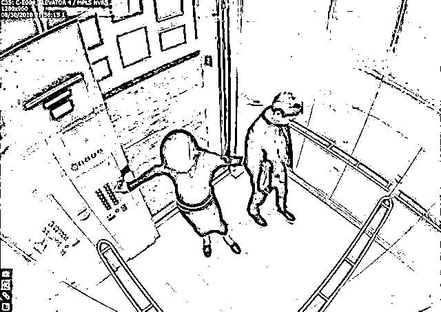
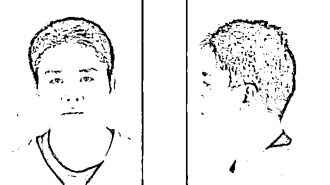

# 京东刘强东“涉嫌性侵”案听证会被取消

> 原文：[`mp.weixin.qq.com/s?__biz=MzIyMDYwMTk0Mw==&mid=2247534565&idx=4&sn=e0ea92c55e4e437da0429178a022fc0b&chksm=97cb8cdda0bc05cbcaf292946e2ffb5e0e34a84afdb9237e357f9418a8b53dc13fd391c7875d&scene=27#wechat_redirect`](http://mp.weixin.qq.com/s?__biz=MzIyMDYwMTk0Mw==&mid=2247534565&idx=4&sn=e0ea92c55e4e437da0429178a022fc0b&chksm=97cb8cdda0bc05cbcaf292946e2ffb5e0e34a84afdb9237e357f9418a8b53dc13fd391c7875d&scene=27#wechat_redirect)

此前一日有消息称，北京时间 4 月 26 日上午，刘强东案在美国举行公开听证会。

不过今日早间，据“Jingyao 诉刘强东案长期关注小组”发布消息：4 月 25 日明尼苏达当地时间周一下午，**原定举行的听证会被取消**。

根据刘静尧（JINGYAO）律师的消息：本次庭审取消的原因是刘强东律师今日向法院提出请求，不要让今日的听证会公开进行，在被法官拒绝请求后，刘强东律师撤回了动议。 

据悉，听证会主要围绕着刘强东提出的一个动议：其律师向法庭申请，禁止刘静尧律师在下个月对刘强东的书面证词质询中提出部分问题。据悉，刘静尧本人可能会出庭。

IT 之家了解到，根据法院公开文件，刘强东律师原本的动议请求是，请求法官禁止刘静尧律师提出以下问题：刘强东与体制的关系、个人财务状况以及**刘强东过往知情同意的性关系**。

因为本次庭审公开进行，刘强东律师最终决定撤回动议。

这就意味着，接下来刘静尧律师对刘强东本人的书面证词质询中，**刘强东将对上述问题做出回答**。

“Jingyao 诉刘强东案长期关注小组”称，法院未来几天将会发布相关的裁决（order）。

据环球网此前报道，2018 年 8 月 30 日，刘强东在明尼苏达大学卡尔森管理学院参加项目学习时，与一批朋友、同事到一家日本餐馆吃饭，其中包括 21 岁的刘静尧，几个小时后，也就是 8 月 31 日凌晨，这位女学生的一位同学及朋友报警表示**刘静尧遭强奸**。

2018 年 12 月 21 日，明尼苏达州亨内平郡检察官弗里曼 (Mike Freeman) 宣布，经过当地警局彻底调查，认定中国商人刘强东**涉嫌性侵**的案件，存在着严重的证据问题，检察官办公室决定**不以性侵罪起诉刘强东**。

在性侵刑事罪不成立后，该女学生于 2019 年 4 月向刘强东及京东提出民事诉讼，并**索赔 5 万美元**。

京东和刘强东方面已经分别对此作出回应，“我们目前对此无法发表评论，但我们将坚决地对这个不实的指控进行辩护”。

2019 年当地时间 7 月 24 日，美国明尼苏达州明尼亚波利斯警察局公布了一份长达 149 页的档案，涉及京东首席执行官刘强东性侵案的“所有证据”。

这份调查报告显示，刘强东在访问中表示女方主动邀请他到公寓，还帮他洗澡，两人发生性行为后均熟睡了好几个小时；而警方抵达后，女学生曾告诉他“**这是一个可怕的误会**”。

2020 年 4 月 6 日，刘强东正式出庭应诉并递交答辩状，4 月 27 日，法官发布判决拒绝京东撇清雇主替代性责任。

据悉，本案正在处于原被告方证据收集阶段，接下来将是由 Jingyao 的律师对刘强东进行书面证词质询（Deposition）。

**此前报道：**

**[性侵案真相？还是先关心下你的微信号是否正被用于站街吧](http://mp.weixin.qq.com/s?__biz=MzIyMDYwMTk0Mw==&mid=2247493266&idx=1&sn=3af792176215ace360acd623b074e6f2&chksm=97cb2daaa0bca4bcd8d0491aedf71586cf96592082188a53150bb510c5ca0a35c6c6df524911&scene=21#wechat_redirect)**

来源：IT 之家

← 向右滑动与灰产圈互动交流 →

