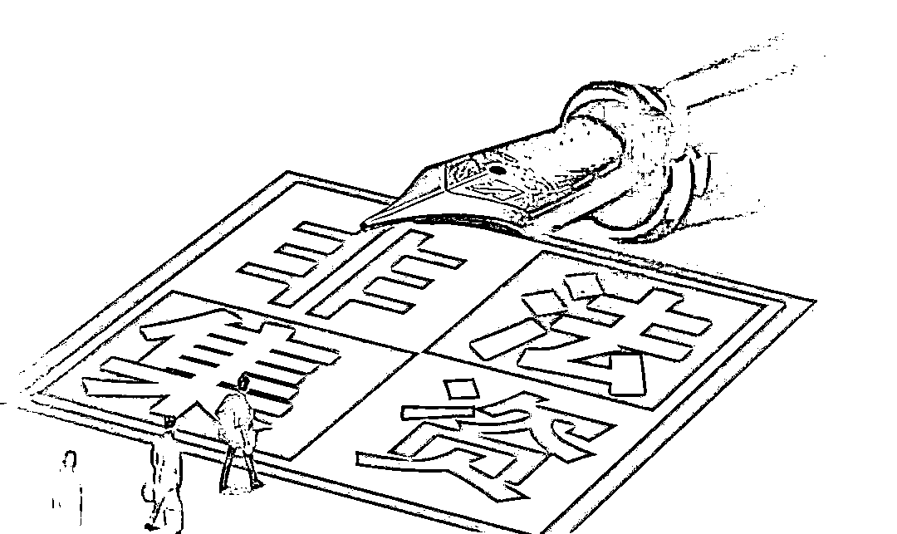
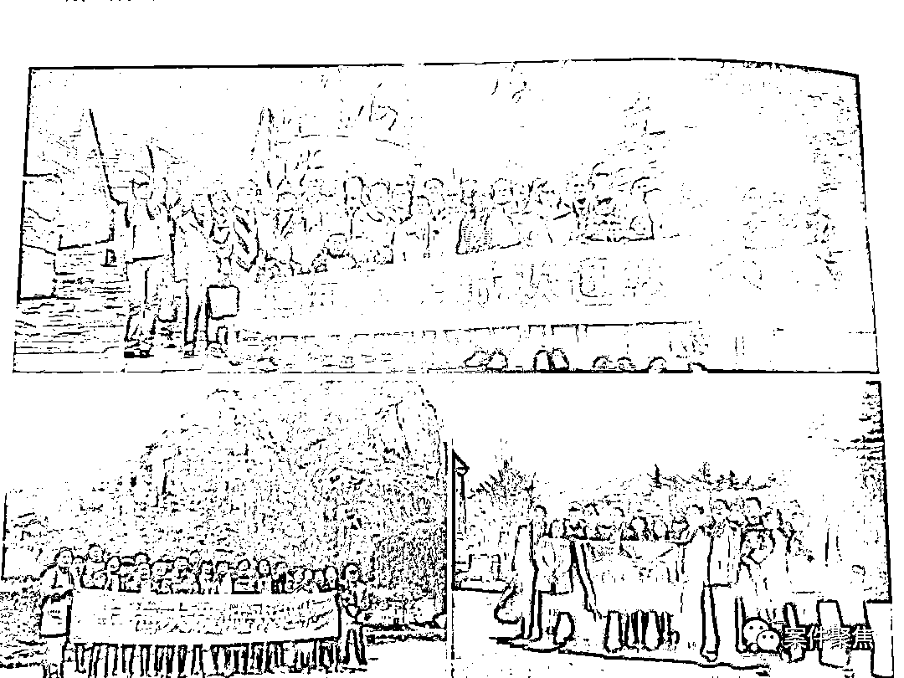
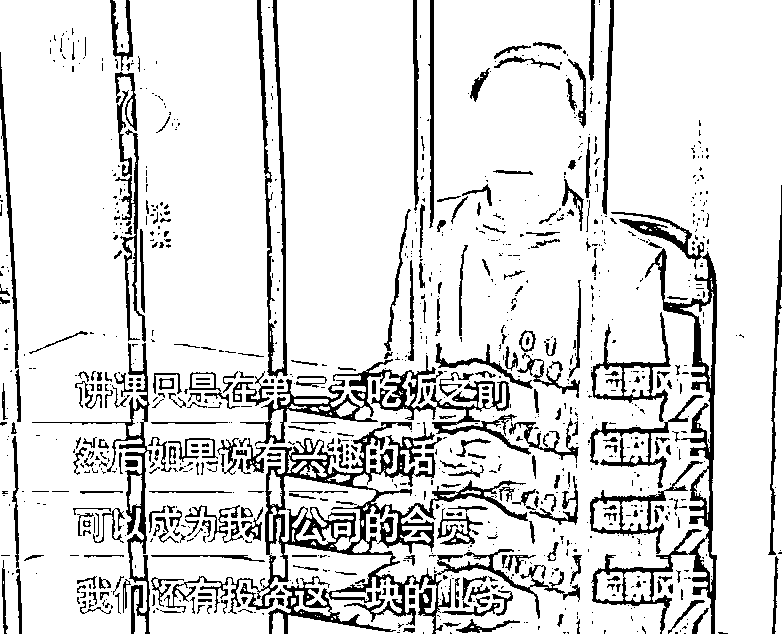
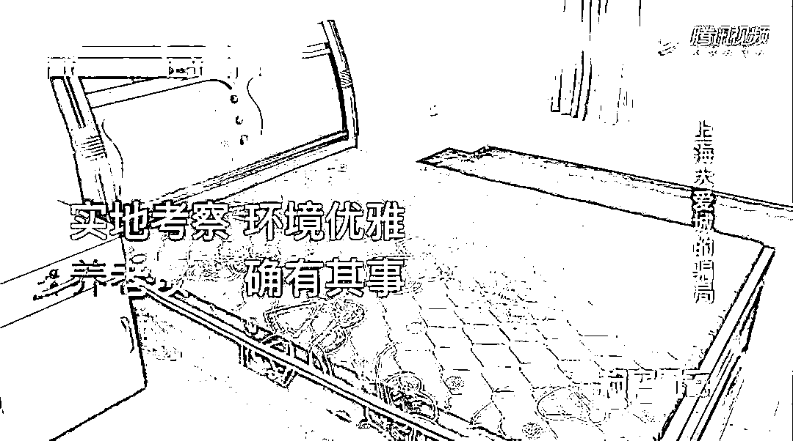
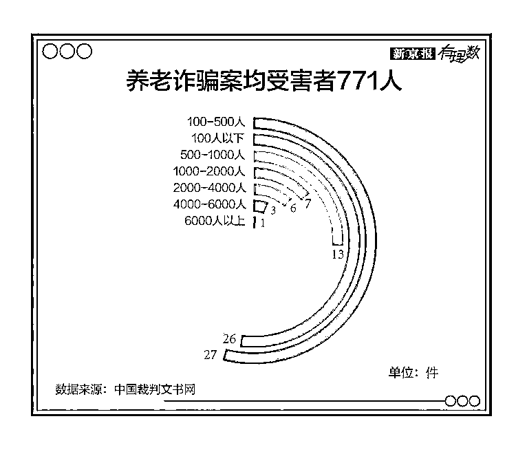
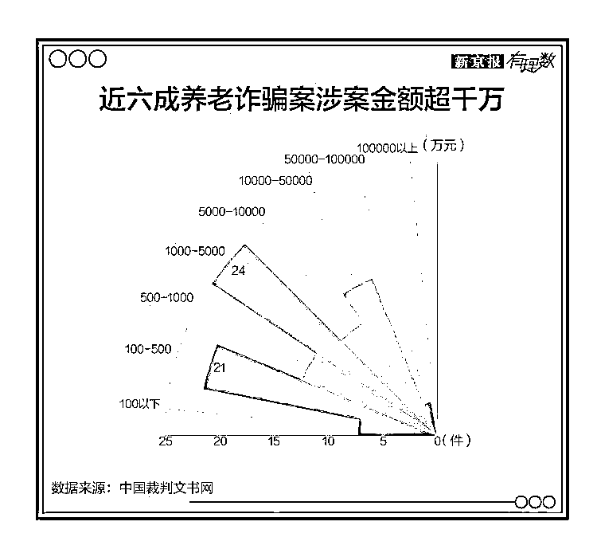
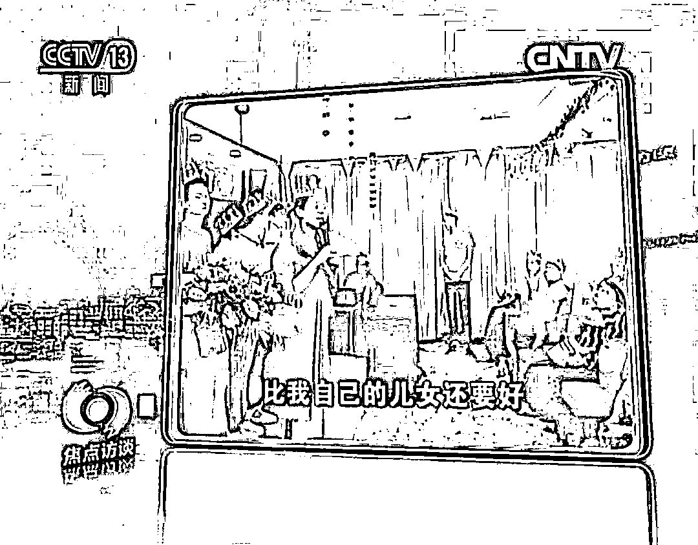
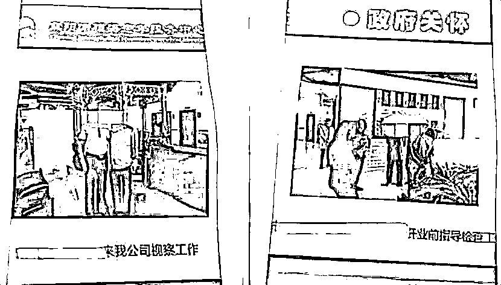
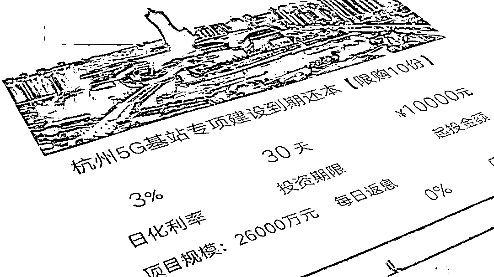

# 老年朋友注意啦！你们已成为非法集资诈骗的主要对象

> 原文：[`mp.weixin.qq.com/s?__biz=MzIyMDYwMTk0Mw==&mid=2247534565&idx=6&sn=2a445a7d0ffc441b4acb01f89b875d56&chksm=97cb8cdda0bc05cbef29d7e16cfde3690c3533db9512c2a3f01d5f93efd0b5d6540506a1afa9&scene=27#wechat_redirect`](http://mp.weixin.qq.com/s?__biz=MzIyMDYwMTk0Mw==&mid=2247534565&idx=6&sn=2a445a7d0ffc441b4acb01f89b875d56&chksm=97cb8cdda0bc05cbef29d7e16cfde3690c3533db9512c2a3f01d5f93efd0b5d6540506a1afa9&scene=27#wechat_redirect)

据不完全统计

**2018 年到 2020 年**

**养老产业相关的非法集资案件**

**多达 6614 起**

难以想象，多少家庭因此支离破碎，**多少****老人的晚年生活因此坠入深渊**。

**0****1**

随着老年人手上闲钱的增加，老年人已逐渐成为非法集资诈骗的主要对象......今年 3 月，上海一中院发布了“大爱城”集资诈骗案最新公告。这起曾经轰动的大案涉及**5.2 亿金额、2000 余名受害人**。

如果回顾“大爱城”案，会发现它并不复杂。**首先，他们会在老人聚集的地方广发传单，进行宣传**。

**然后再用低价旅游吸引老人参加旅行团。**

上海周边三天两夜游只需**368**元，不仅如此，旅行团内还有近 10 人的内部员工专门服侍老人。

**等时机成熟，骗子们就会向老人们宣传“候鸟式养老”理念，并诱惑他们进行投资。**

一张床位费 10 万元，不仅可以入住，每年还有 10%的利息；

投资 20 万以上，年利息还可以提升到 15%；

投资 40 万就能免费养老，子女还可以继承本金。

在关怀+洗脑下，绝大多数老人会瞒着家人，将几十年的积蓄全都进行投资。

**0****2**

**动辄破千人，资金千万起**，这就是以老人为主体的非法集资诈骗的现状。而这类骗局正不断向小城市甚至更偏僻的农村蔓延。

下面将介绍骗子惯用的**钓鱼套路和捞金模式**，希望大家看到后一定要给家里的老人科普。

**0****1****“小恩小惠”**

为了将老年人在最短的时间内聚集起来，骗子最常用的方法就是**送鸡蛋、面粉、油等低价小礼品**。老人们一生勤俭节约，一听到有免费的福利，总是容易占小便宜，一传十、十传百，很快就能聚集起来。 

很多老人开始是不相信骗子的宣传的，但因为拿了小礼品，也不会公开反驳骗子。

**0****2****“打感情牌”**

很多老人常年独居，给了骗子上门行骗的机会。

老人一个电话，骗子直接上门，陪老人聊天、买东西、甚至给老人举行生日会......在这样的温情攻势下，很多老人**会对骗子毫无防备**。

在与老人的相处中，骗子很快就能了解到老人的性格特点、财产状况、子女工作、家庭关系等等。这些信息都关系到骗子如何开展“行诈计划”，计划包括与老人的聊天话题、老人作出不同情况的回应后，又该如何应答等等……

**0****3****“门面包装”**

骗子们另一个行骗的手段就是包装自己，做好门面：如成立公司、租用豪华写字楼、准备挂满墙面的荣誉证书、招募热情的工作人员。

简直比正规公司还正规！ 

为了增加可信度，骗子还会拿出各种“背书”，从电视台到政府领导，从大学教授到资深专家，当地相关部门公章和红头文件也往往是伪造的。

年轻人都分不出真假，更别说鉴别能力更差的老人了。

**0****4****“收割韭菜” **

**“高回报、无风险”**永远是骗子们最有力的“武器”。90%、40%的年回报率在非法集资骗局中屡见不鲜。

像下图中的项目，**年回报率更是高达 1095%**！相当于你年初投 1 万元，年末就能获得近 11 万元的回报，如果是真的，这让人如何不心动？

理财知识匮乏的年轻人，尚且不能分辨投资陷阱，更何况老年人。

目前银行储蓄利息和正规理财产品中，**年回报率都不会高于 4—6%**，高于这个比率，产品的风险就**不是普通人可以承受的了**。（骗局里 1095%的回报率简直离谱。）

此时，一旦踏进骗子的局，老人们就成了待割的韭菜。

**0****5****“拉人头”**

为了扩大集资的规模，骗子们通常会在前期给**参与的老人一些“甜头”**，比如投资的分红等……这样老人才更相信投资的真实性，并向身边的亲朋好友宣传。

若是老人成功拉到亲友加入，骗子们还会以“返利”、“分红”等形式给予高额奖励。

这样入坑的老人越来越多，集资的金额越滚越大，更多的家庭因此支离破碎。

**0****3**

网上有句话：孩子的钱最好赚，而老人的钱最好骗。

面对快速更迭的社会，**老人因认知的不足以及知识的老化不能与时俱进，所以面对骗子精心设计的骗局根本无法保护自己。**

身为子女，又如何忍心去责怪他们？我们真正该做的是在平时多多关心老人，多分享一些新鲜的咨询给他们......

面对隐藏在暗处的骗子，我们能做的就是持续地向老人科普、宣传非法集资的危害，并多花点时间陪陪他们，让骗子们无机可乘。

来源：宜昌地方金融、平安当阳 ，巴蜀反诈

← 向右滑动与灰产圈互动交流 →

