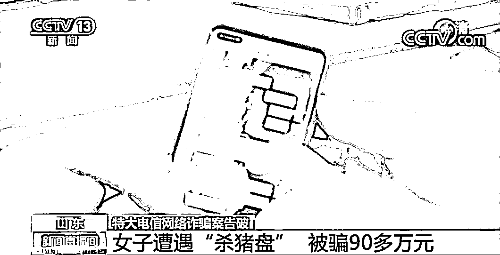
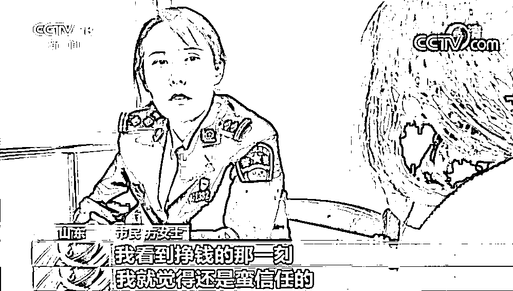
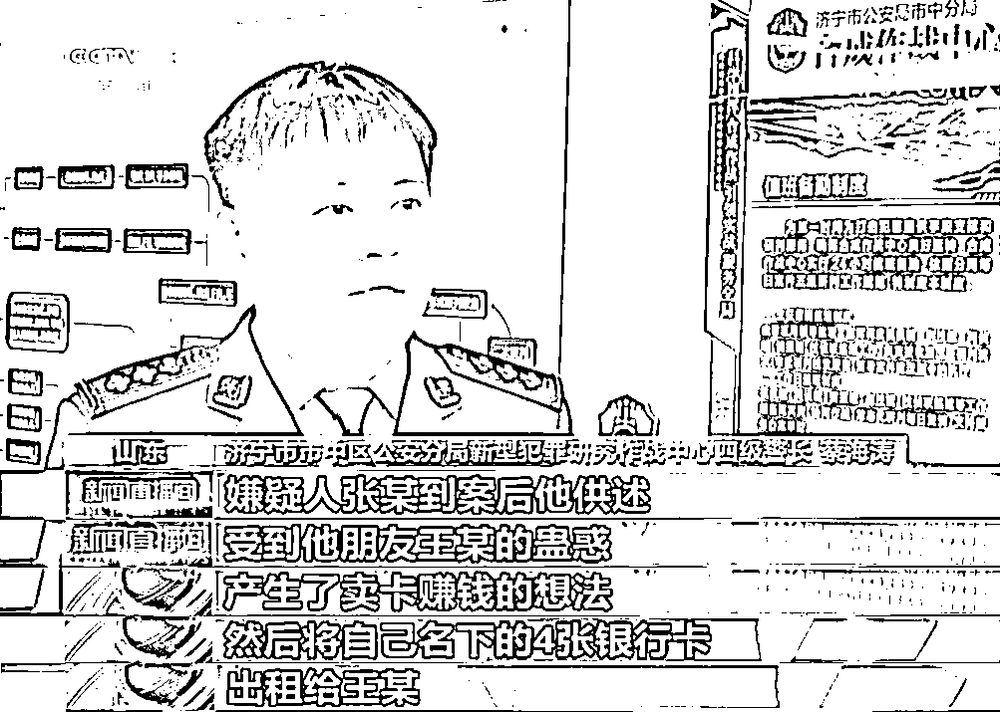
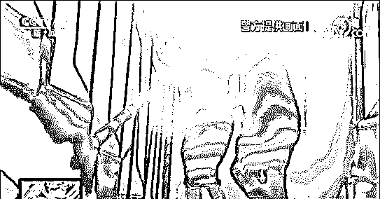
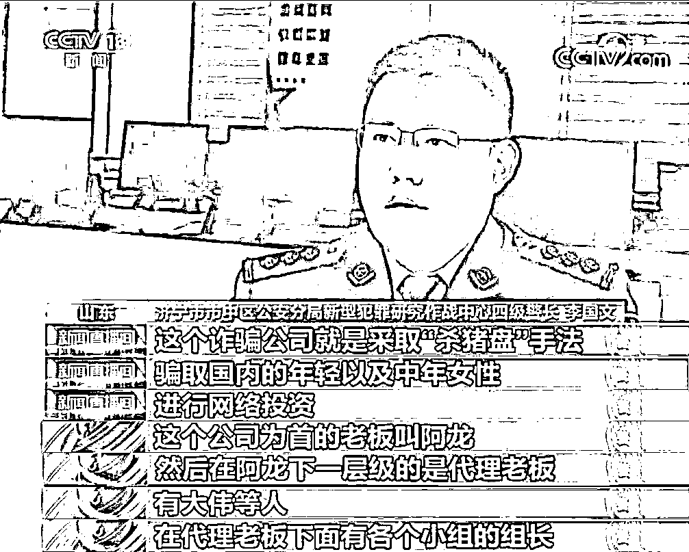
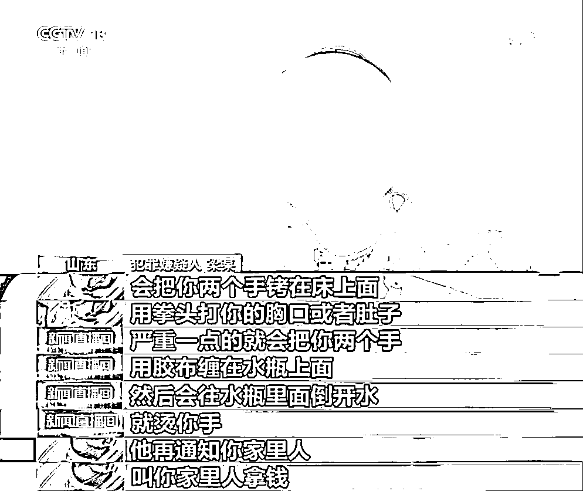

# “杀猪盘”牵出跨境诈骗团伙！山东济宁警方破获特大电信网络诈骗案

> 原文：[`mp.weixin.qq.com/s?__biz=MzIyMDYwMTk0Mw==&mid=2247534565&idx=7&sn=f32dd31b858c38516a07abbe5e991872&chksm=97cb8cdda0bc05cbd0e85513b37dc6d045c26f8889f9b22195ac4aecbbecbb52a9a0d58240ed&scene=27#wechat_redirect`](http://mp.weixin.qq.com/s?__biz=MzIyMDYwMTk0Mw==&mid=2247534565&idx=7&sn=f32dd31b858c38516a07abbe5e991872&chksm=97cb8cdda0bc05cbd0e85513b37dc6d045c26f8889f9b22195ac4aecbbecbb52a9a0d58240ed&scene=27#wechat_redirect)

近日，山东济宁警方破获一起特大的电信网络诈骗案，抓获犯罪嫌疑人 50 名，破获各地此类案件 156 起，涉案金额 2000 多万元。一个长期盘踞在西南边境境外，以“杀猪盘”为手段骗人钱财的犯罪团伙被彻底摧毁。2022 年 4 月 24 日，中央电视台新闻频道《新闻直播间》栏目对此案进行报道。

[`mp.weixin.qq.com/mp/readtemplate?t=pages/video_player_tmpl&action=mpvideo&auto=0&vid=wxv_2369951052445122562`](https://mp.weixin.qq.com/mp/readtemplate?t=pages/video_player_tmpl&action=mpvideo&auto=0&vid=wxv_2369951052445122562)

**“包赚不赔”**

****女子深陷“杀猪盘”****被骗 90 多万元****

****2021 年 8 月，方女士向济宁市公安局市中分局报案，称自己被一名叫“李云峰”的男子以投资为名，骗走现金 91 万多元。方女士最初是在网上与对方认识的，**对方称在重庆做房地产生意，可以帮方女士挣钱。**而方女士刚刚离婚不久，心情十分郁闷，相处下来，李云峰的关爱慢慢赢得了她的好感。****

********

****就在这时李云峰让方女士下载一款 APP，称在上面投资包赚不赔，在他的指导下，方女士往平台里投了 2 万块钱。几秒钟方女士便挣了 200 多块钱，尝到甜头的方女士很高兴，随即继续投资“挣钱”。****

********

****为了让方女士相信自己，**男子每天用甜言蜜语与她聊天，**逐渐方女士往平台里越投越多，5 天内先后将 91 万多元钱分 21 笔全部投进了平台，期间仅收到平台三四千元的返还资金。****

****当方女士仍沉浸在甜蜜的发财梦里时，情况突变。方女士想要提现，男子却说需要再投一部分钱才能全部提现，于是便向自己的哥哥提出借钱，哥哥一眼识破了这是骗局，随即方女士便报了警。****

******梳理资金流******

********循线追踪洗钱嫌疑人落网********

********济宁市中警方接到报案后，认为**犯罪嫌疑人利用情感和所谓的投资获利诱惑异性骗取钱财，**是一种典型的杀猪盘类的电信网络诈骗犯罪案件，于是成立专案组开展案件的侦破工作。********

 ******[`mp.weixin.qq.com/mp/readtemplate?t=pages/video_player_tmpl&action=mpvideo&auto=0&vid=wxv_2369952023376166913`](https://mp.weixin.qq.com/mp/readtemplate?t=pages/video_player_tmpl&action=mpvideo&auto=0&vid=wxv_2369952023376166913)****** 

******专案组民警从资金流入手，对方女士被骗的 21 笔资金流向进行了梳理，**锁定了山东聊城的张某，**专案组决定先以张某为突破口，将张某抓获。******

************

******据张某供述，经朋友王某介绍，他认识了为境外犯罪团伙转账洗钱的李某新，将自己的银行卡提供给李某新使用，可以获取转账金额 1.5%的佣金。随即在当地警方的协助下，专案组民警先后将李某新及同伙王某等 6 人抓获。******

******与此同时警方把视线转向重庆，对诈骗方女士的男子相关信息进行分析研判，锁定了位于重庆的吕某。******

************

******吕某被抓获后交代，为获利他以每个 50 元的价格将自己的三个微信号卖给了彭某，其中一个就是涉案微信号。******

********关注境外回流人员动向********

**********全面打掉诈骗团伙**********

********根据线索，专案组民警将犯罪嫌疑人彭某抓获。审查中他供述了大量收购微信、QQ 等社交聊天软件账号的犯罪事实，并交代所收购的账号都卖给了上线——曾经在境外犯罪团伙从事电信诈骗活动的李某。********

 ********[`mp.weixin.qq.com/mp/readtemplate?t=pages/video_player_tmpl&action=mpvideo&auto=0&vid=wxv_2369954066371313665`](https://mp.weixin.qq.com/mp/readtemplate?t=pages/video_player_tmpl&action=mpvideo&auto=0&vid=wxv_2369954066371313665)******** 

********彭某交代李某刚回国不久，人就在重庆，经过摸排专案组民警在其住所将李某抓获。李某供述他所在的诈骗公司有 50 多人，都是近年来偷渡到境外的。********

****************

********阿龙姓胡，四川成都人。在确定该团伙的基本框架后，专案组经过深入研判，确定了部分成员的真实身份，**并获悉已经有一批团伙成员慑于国内警方的压力，从云南边境入境投案自首。**********

********随后专案组密切关注境外回流人员的动向，发现胡某团伙大部分成员都陆续回流入境，于是专案组决定开展全面收网。********

****************

********联合专案组捆绑作战，一举抓获电诈网络犯罪嫌疑人 50 余人，其中包含 41 名回流人员，带破全国案件 156 起，彻底摧毁了这一长期盘踞在西南境外的电信网络诈骗犯罪团伙。********

**********高薪拉拢人员偷渡到境外**********

**********组建诈骗团伙**********

********收网行动中，该犯罪团伙头目胡某以及诈骗方女士的梁某也被警方抓获，审讯中他们对自己违法犯罪事实做了供述。胡某原来在成都开过装修公司，有了积蓄后就到柬埔寨与人合伙开办水厂，不久受疫情影响，投资失败，又跟着他人前往东南亚从事电信诈骗活动。********

 ********[`mp.weixin.qq.com/mp/readtemplate?t=pages/video_player_tmpl&action=mpvideo&auto=0&vid=wxv_2369955829723824128`](https://mp.weixin.qq.com/mp/readtemplate?t=pages/video_player_tmpl&action=mpvideo&auto=0&vid=wxv_2369955829723824128)******** 

********一段时间后，胡某掌握了组织诈骗所需的软硬件条件，就通过国内的亲朋好友介绍，以高薪拉拢诱惑无业人员偷渡到境外，以开设公司的名义组建了诈骗团伙。********

********梁某是胡某团伙的操盘手，负责在网上与被害人聊天，引诱其进行所谓的投资，骗取钱财。而方女士被骗的 91 万多现金，他就获提成 17 万元。********

**********而团伙成员如有逃跑的，被抓回来就要挨打，还会逼迫其通知家里拿钱赎人。**********

****************

********目前 50 名犯罪嫌疑人均被依法采取刑事强制措施，该案仍在进一步侦办中。********

**********警方提示**********

********网络交友需谨慎，在涉及金钱往来时一定要提高警惕，并与身边亲朋好友多沟通、多询问，防止落入“圈套”。********

********对于引导在网上玩彩票、投资、理财之类，先给尝甜头再引导继续投入的必是骗子无疑。“天上不会掉馅饼”所谓“低成本、高回报”，往往都是骗人的幌子，一定不要贪图利益，赚钱还是要脚踏实地。********

********千万不要因不法利益诱惑向他人出租、出售、出借自己的银行卡、电话卡、对公账号及微信、支付宝等第三方支付账号，以免个人信息沦为网络犯罪的“工具”。********

********来源：济宁公安  央视新闻   山东公安，利箭在行动********

****************

********← 向右滑动与灰产圈互动交流 →********

****************