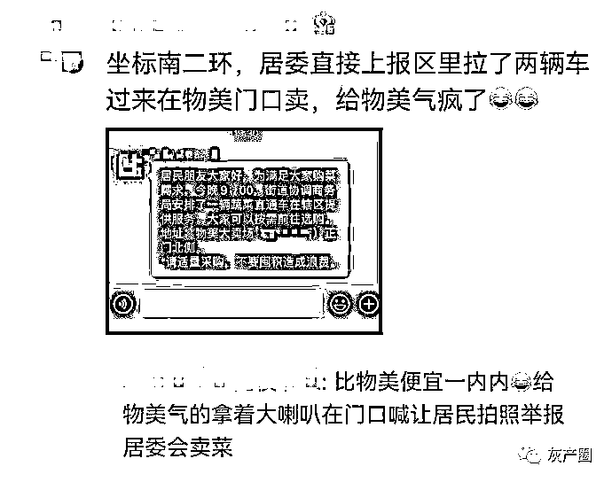
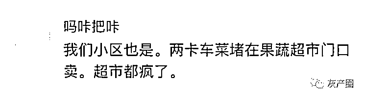
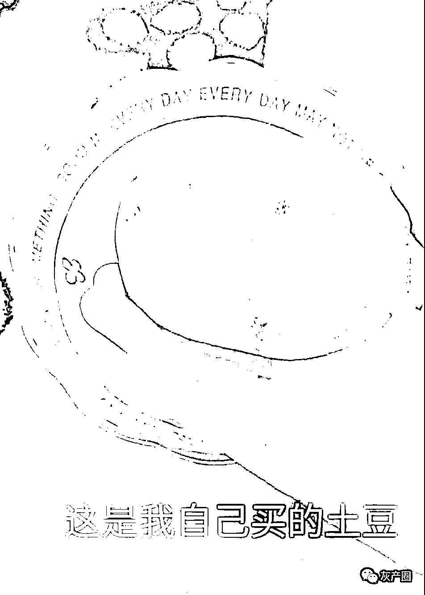
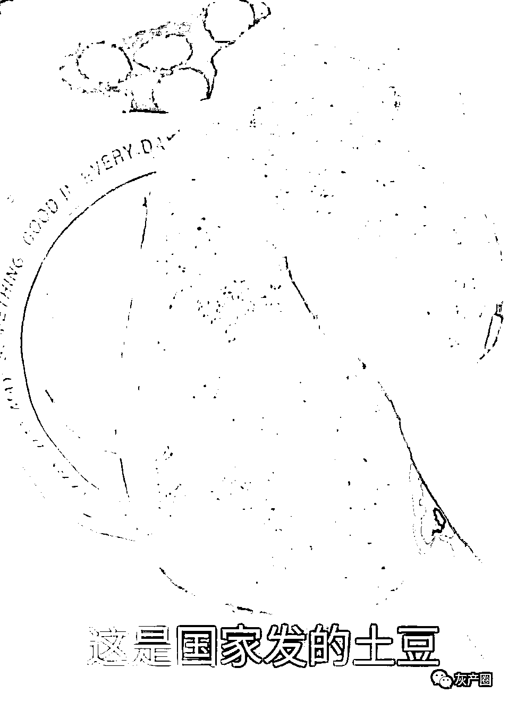
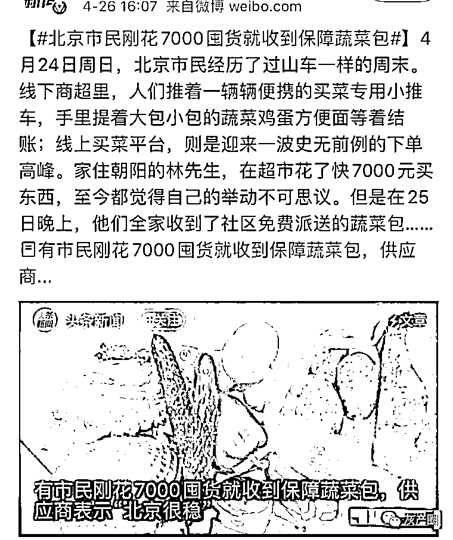
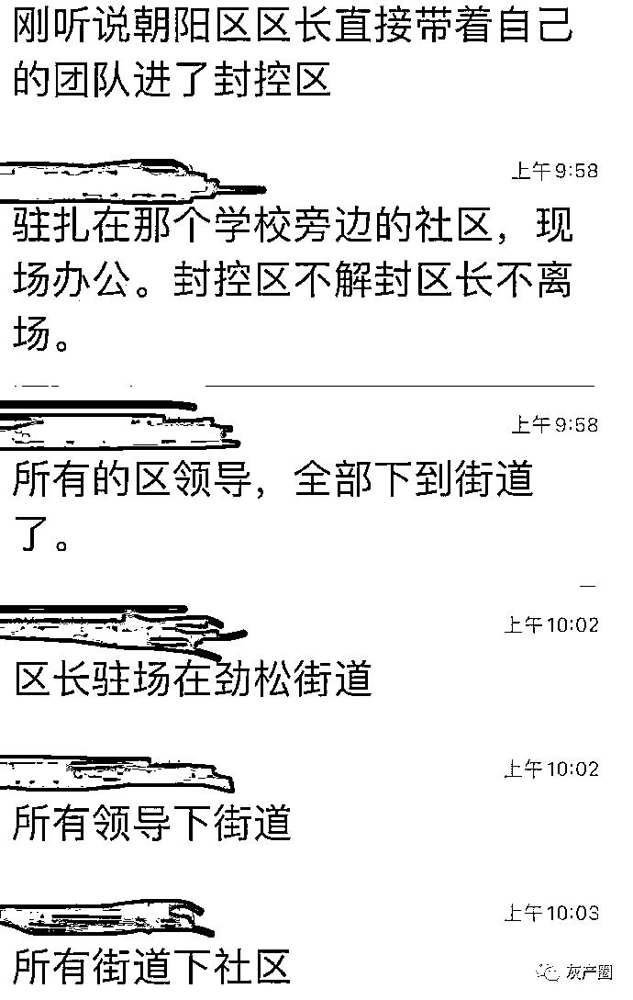
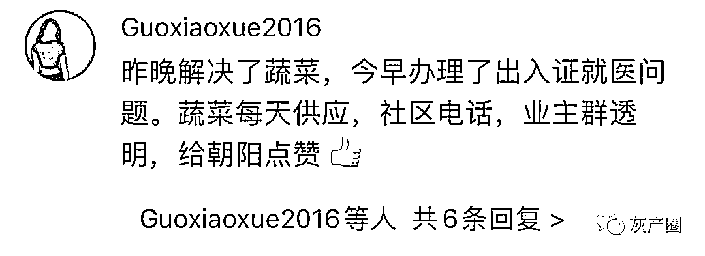
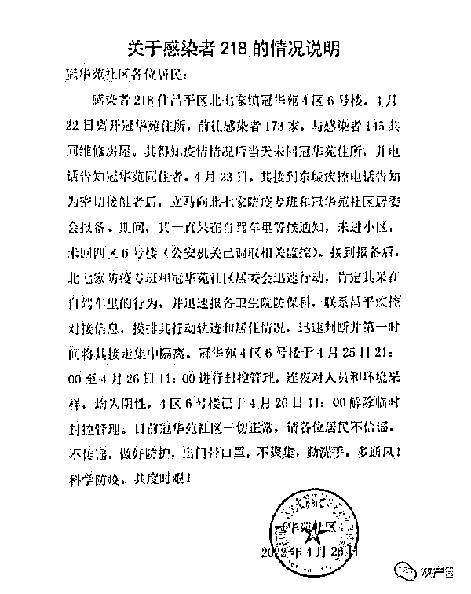

# 北京处理疫情简直是教科书级别了！所有区领导，全部下到街道！

> 原文：[`mp.weixin.qq.com/s?__biz=MzIyMDYwMTk0Mw==&mid=2247534657&idx=1&sn=946c6bdf7c1b3052961942a73e002296&chksm=97cb8379a0bc0a6f7c923d5122acb2dfae690b522663924cf57f103aa347ffb547ad6bb6f152&scene=27#wechat_redirect`](http://mp.weixin.qq.com/s?__biz=MzIyMDYwMTk0Mw==&mid=2247534657&idx=1&sn=946c6bdf7c1b3052961942a73e002296&chksm=97cb8379a0bc0a6f7c923d5122acb2dfae690b522663924cf57f103aa347ffb547ad6bb6f152&scene=27#wechat_redirect)

如果看到了上海人民受的苦，患上了囤物资 PTSD(创伤后应激障碍)，那么多看看北京的做法，有利于病情的康复！ 

现在在北京，囤菜都内卷了！

不仅敞开买，一旦被隔离，送菜的马上就来了，而且质量很好！

北京人民对比了自己买的土豆 VS 收到的土豆

评论：估计是山东保供的，山东土豆长这样属于刚到及格线 

北京和上海很有可能出现一个极其尴尬的场面 

上海人民愁怎么买菜到家

北京人民愁怎么把家里多余的菜卖了

不仅在物资保障上，就连基层安排上，也能看出北京的决心 

更牛的是，群众的配合！

北京疫情 感染者 218，感染者 218 警惕性、自觉性、社会责任感，都可以说是天花板了。
一个小区至少上千户居民因此免于居家隔离。

* * *

幸福的夏墨:没有对比就没有 shanghai！

十二贱:北京的觉悟不是一般的，今天出门和回家遇到的大爷大妈第一句就是，核酸做了吗

爱吃香菜怎么了 _:本来想去囤菜的，主要气氛到位了，但是感觉不是为了疫情囤菜，是都准备准备直接过小长假了，菜市场管理人员拿大喇叭喊，不用囤菜，足够你们买的！菜市场和大家同在！

来源：微博那些事儿

← 向右滑动与灰产圈互动交流 →

# 原文：[`mp.weixin.qq.com/s?__biz=MzIyMDYwMTk0Mw==&mid=2247534657&idx=2&sn=6b85a9e0ed3fbe6b952e99bd215b749d&chksm=97cb8379a0bc0a6fa076b36778e4bbbc6ddf5a14ceade59318cfb6c6180b5078d9aacbf7216c&scene=27#wechat_redirect`](http://mp.weixin.qq.com/s?__biz=MzIyMDYwMTk0Mw==&mid=2247534657&idx=2&sn=6b85a9e0ed3fbe6b952e99bd215b749d&chksm=97cb8379a0bc0a6fa076b36778e4bbbc6ddf5a14ceade59318cfb6c6180b5078d9aacbf7216c&scene=27#wechat_redirect)