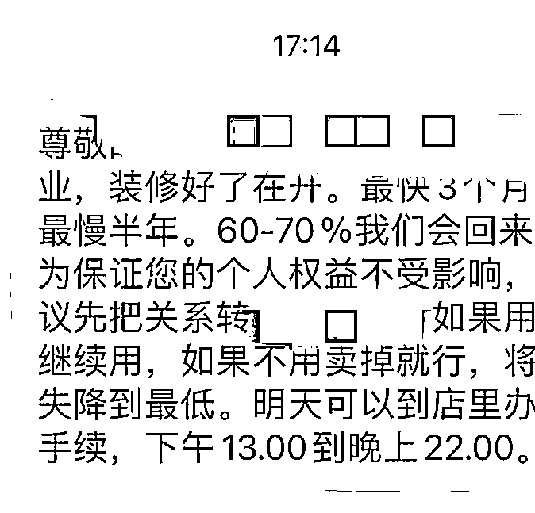

# 有人用“刘耕宏”诈骗了！！！

> 原文：[`mp.weixin.qq.com/s?__biz=MzIyMDYwMTk0Mw==&mid=2247534657&idx=3&sn=b86b51c13b2488d30d9fc8b726e35c48&chksm=97cb8379a0bc0a6f07b0d60a929c9de4de484fb2dc6cfe82d00792c52b4cdd9514ed22630d5a&scene=27#wechat_redirect`](http://mp.weixin.qq.com/s?__biz=MzIyMDYwMTk0Mw==&mid=2247534657&idx=3&sn=b86b51c13b2488d30d9fc8b726e35c48&chksm=97cb8379a0bc0a6f07b0d60a929c9de4de484fb2dc6cfe82d00792c52b4cdd9514ed22630d5a&scene=27#wechat_redirect)

“我，李佳琦的美眉，从今以后，就是刘畊宏的女孩。”

最近，由“掏空钱包”的李佳琦和“掏空身体”的刘畊宏组成的“谋财害命”奇怪组合火遍全网，男孩女孩一边挥汗如雨，一边大喊“我的快乐都是他们给的”。

由于“热情过度”，导致部分运动爱好者在高强度运动中不小心受伤进医院了。 

看着新闻心疼又操心的守哥忍不住多嘴两句：**俗话说身心安全，咱要小心的可不只是身体，还有钱袋子的安全呐。**

不知你是否发现，在这股全民健身的热潮中，还掺杂着些许图谋不轨、试图浑水摸鱼的心思：**一些不法分子利用消费者对健身的热情牟取暴利，从设下圈套到卷款跑路，环环相扣步步紧逼。**

**跑路之计蓄谋已久** 

**二次诈骗溜之大吉**

福州的王先生最近郁闷无比。

前阵子，他在家附近的健身馆办了一张年卡。就在他动力满满准备启动“完美健身计划”时，坏消息劈头盖脸而来：嘿，自个儿跑步机还没体验过一次呢，健身房倒是先“跑”了——“健身房跑路”！

**整个“健身房跑路”过程不能说是费尽心思，只能说是蓄谋已久。**

据王先生回忆，该健身房一开始便未能如期开业。

负责人信誓旦旦称开业延期，然而到了日期大门却依然紧闭。会员们等负责人彻底消失再也联系不上，才后知后觉反应过来：“应该是跑路了”。

之后王先生偶然通过报道才得知，这家门店竟然在会员毫不知情的情况下，直接转让给另一家健身公司。

**之后发生的****事情，让王先生再一次怔住：竟还有这种无耻操作？**

“没想到居然又一次跑路了！” 就在王先生决定去瞅瞅转让后的新店时，朋友告诉他“健身房又又又关门了”。

令人匪夷所思的是，就在这家店关门跑路的前几天，健身房的教练居然还在厚颜无耻地拉新人宣传，肆无忌惮大喊特邀“五人拼团价，买一年送一年”等特价福利。

明明前一天还活跃在群内的教练账号，第二天就显示“已注销”，这一“人间蒸发”的操作简直让王先生大开眼界、啼笑皆非。

**如今，高价会员费打了水漂，会员合同也变成一张废纸。**

王先生表示，维权群里的一些会员已经准备去起诉了。然而**由于取证难，健身房也已经跑路**，最终能否成功维权，王先生心里也空落落的，着实没有底。

意料之中，这并非个例。

同样的借故延期闭店、同样地转移到另一家名下，北京某健身房的 2000 多名会员也和王先生一样遭遇了“跑路套路”，被骗金额甚至超过千万。

**这次，跑路健身房所谓冠冕堂皇的借口则是：健身房要装修闭店。**

按照合同，这种情况下会员可以要求退卡，但健身房负责人不但强硬拒绝退卡，甚至单方面告知将会把会员身份转移至另一家健身房名下。

**显而易见，这又是一个掩盖真相的幌子。**

有消费者实地考察过接盘的那家健身房，无论是场地规模、器材设备，还是教练资格等基本条件来看，都简陋得不值一提。根本无法承担起 2000 多名会员的体验保障。

背后隐藏的真相是——健身房明知该大楼近期就要被卖掉，却不告知消费者真相，“反其道而行之”开始疯狂“搞活动”圈钱，最后赶在售卖前夕以“装修闭店”的名义拿钱跑路。

于这群会员而言，这场“深谋远虑”的骗局最后能给到他们的，便是“健身房跑路”、会员费打水漂等不可避免的“惨痛收尾”，**因为这伙人从一开始，就为骗钱而来。**

**利用消费者的健身需求心理，一肚子坏水设计层层圈套，不把消费者的钱当钱，可以说是毫无信誉的无耻之尤者。**

**虚假广告五花八门**

**诈骗套路如出一辙** 

通过案例，大家不难发现骗子们的套路可谓如出一辙，这里守哥也为大家整理总结一下。

**第 1 步：****通过虚假广告开展宣传，锁定诈骗目标。**

守哥发现，网上竟然有售卖“健身房安全跑路教学课程”类似的网课——“教你 7 到 15 天安全闭店，有效回笼最后一波资金，金蝉脱壳”。

从前期筹备到揽客圈钱，甚至最后的虚假“接盘者”，网课售卖者都能“贴心地一站式服务”。 

**在此老奸巨猾的套路设计下，单纯的消费者简直逃无可逃。**

按照这个“教学课程”，健身房表面毫无异常——租赁场地、招聘员工、营业执照，该有的似乎都有。即便去实地考察，随意摆放的装修物料和施工人员也完全看不出端倪。

**异常都藏在你看不见的暗处。**

实际上，场地只交付了定金，员工全是骗来的，营业执照倒是真的，但联系人身份证却是假的。

苦心积虑筹谋一切，只为伪装出“正常筹备”的假象以此展开宣传，目的就是糊弄消费者。

此外，为了营造马上开业的热闹气氛，不法分子甚至会雇佣一些工人在场地里装模作样地摆弄。“毕竟做戏还得有点响动不是”，一位曾经参与过健身房骗局的人这样说。

**第 2 步：****以“消费返利”或“优惠活动”等方式诱惑办卡消费，进行圈钱。**

筹备齐全后，惺惺作态的跑路健身房就开始铺天盖地进行广告宣传。

“办理会员年卡，坚持 100 天返现 60%，坚持 200 天返现 100%。”

“一天五块钱，疾病远离我。”

“爱生命、爱生活，从健康开始！”

“不健康，哪来的本钱去拼搏！”

**史无前例的特惠福利、感天动地的肺腑心声、天花乱坠的打折宣传……句句直接戳破想变得更健康、更自信的需求防线，根本不怕你不上钩。**

**第 3 步：****准备收尾，卷款跑路。**

等第一波圈钱结束，不法分子继续“影帝上场”。假借施工或内部改造等理由延期开业，引诱继续办卡。

“反正都捞得差不多了，这时再来个低价套餐，把那些有意报名但还在犹豫的收割了就准备跑。”**捞上最后一笔，便火速关门、转让、失联......**

连安抚消费者的“妙招”他们都想好了——在门口张贴告示告知消费者，因公司破产无法经营，需前往某律所登记；规定消费者固定登记日期，等所有用户都登记完至少要好几个月；公司假装在积极处理相关事宜，老板没有跑路。

**久而久之，这一拖延战术让部分消费者干脆放弃索赔，若遇到一两个坚持要维权的，那就花点小钱把这几个人安抚好就行。**

**冲动消费切不可取** 

**提高意识及时止损** 

据《上海市体育健身行业投诉分析报告（2021 年度）》显示，2021 年度上海市体育健身行业预付类消费投诉总量仍处于高位。

投诉内容集中在“正常经营不能退卡或能退卡但手续费高”和“经营者关店不能兑付或退卡”。

**可想而知，真实的受骗数据远非于此。**

健身房诈骗套路如此，诈骗分子佯装一遍，还可以换汤不换药地将套路用在理发店、游泳馆等等适用办卡的场所。

一个曾参与健身房诈骗的相关人员说：“人都爱贪小便宜，一个月三四千块钱对于这些人来说完全消费得起，大部分人报健身房都是冲动消费，不然常规的健身房根本赚不到什么钱。”

消费者如何避免被套路？

一句话总结——**就是避免“冲动消费”，在预付式消费时要保持冷静，尽量少额、短期购买，避免资金损失。**

想要报名健身房，一定要确认健身房资质。此外，守哥觉得，锻炼真的不一定要在健身房里。

**更重要的，是管住嘴，迈开腿，只要你想，只要坚持，相信每个人都可以成为这个夏天最美的“畊宏男孩女孩”!**

来源：守护者计划

← 向右滑动与灰产圈互动交流 →

