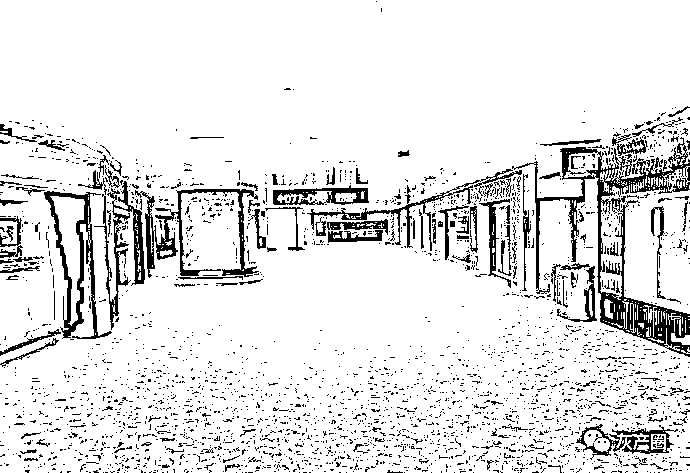
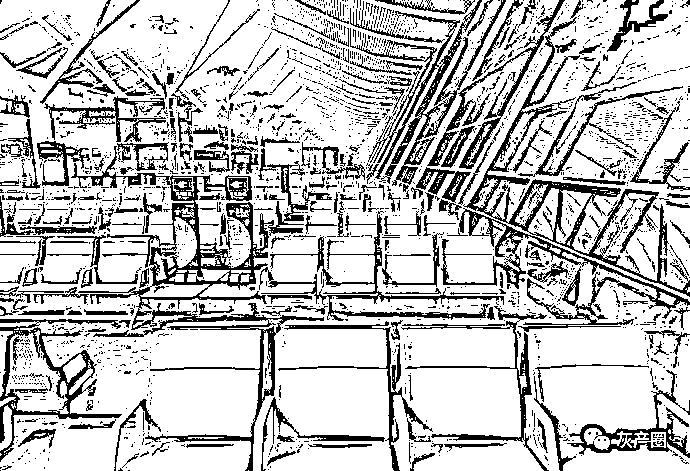
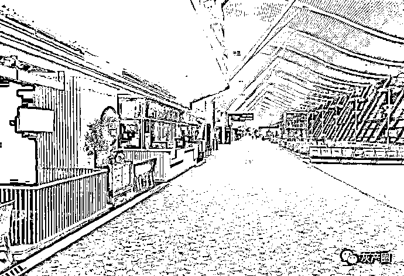
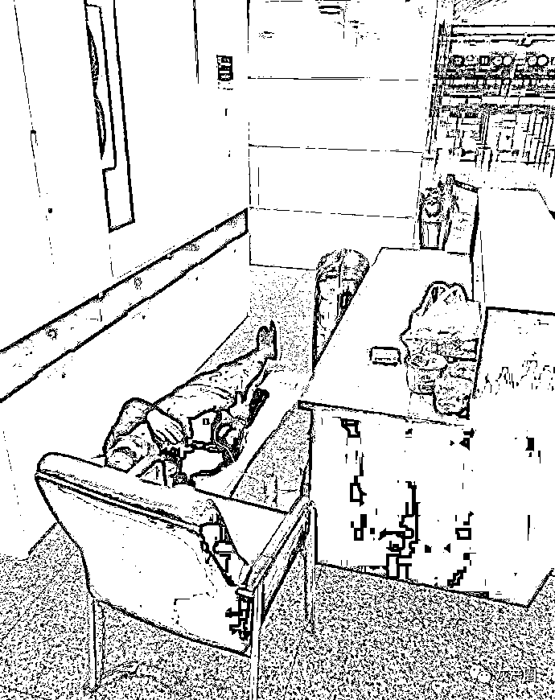
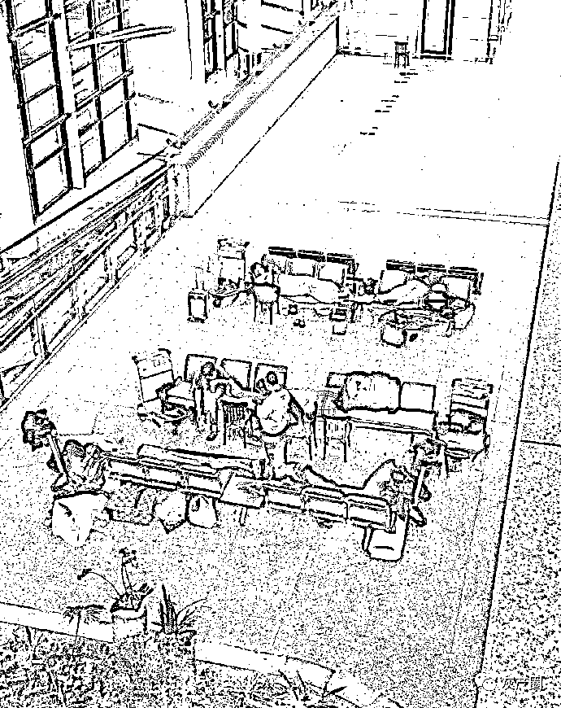
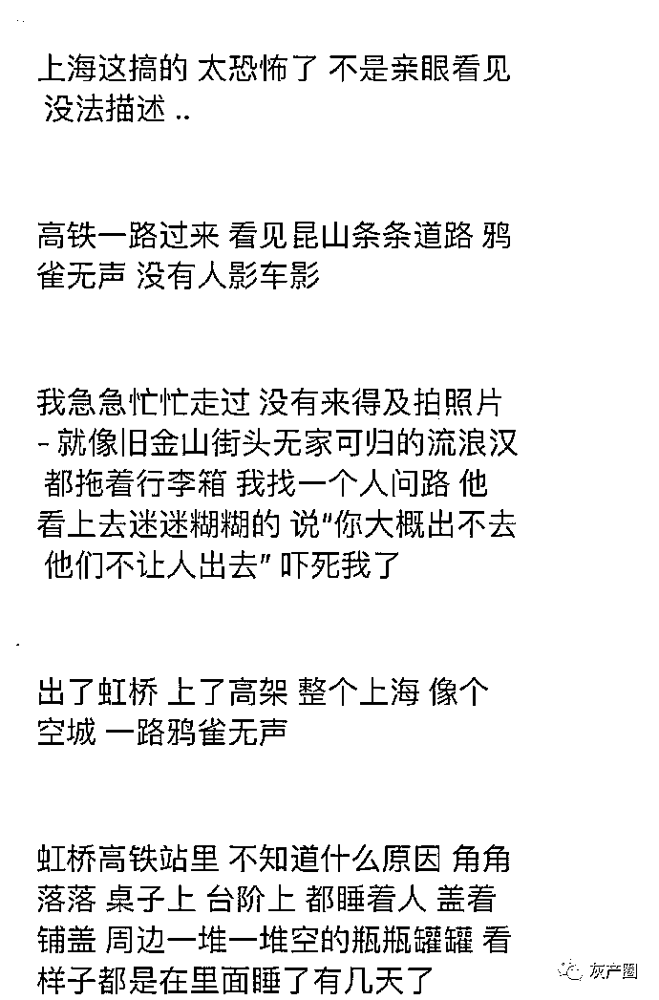
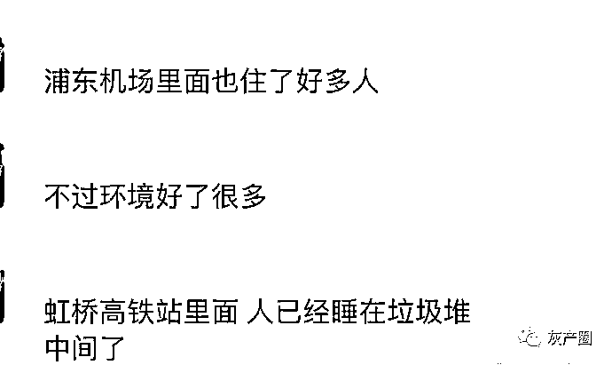
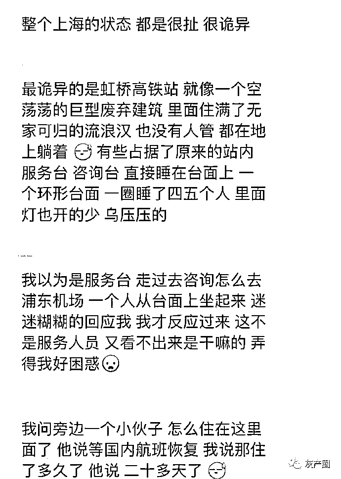

# 疫情下的上海浦东机场，像座鬼城，有些人已经在机场住了三十多天了

> 原文：[`mp.weixin.qq.com/s?__biz=MzIyMDYwMTk0Mw==&mid=2247534657&idx=4&sn=cf1fb54302f80bedb193b99581e9a507&chksm=97cb8379a0bc0a6ff3748894195482a6b4a74a4ead3ae0c354d5f4416bba54da627a3b974b80&scene=27#wechat_redirect`](http://mp.weixin.qq.com/s?__biz=MzIyMDYwMTk0Mw==&mid=2247534657&idx=4&sn=cf1fb54302f80bedb193b99581e9a507&chksm=97cb8379a0bc0a6ff3748894195482a6b4a74a4ead3ae0c354d5f4416bba54da627a3b974b80&scene=27#wechat_redirect)

**@开花富贵老娘发飙：** 同学今天从浦东机场回美国手记。
说整个浦东机场今天三个航班。
机场里像座鬼城。
有些人已经在机场住了三十多天了。
虹桥高铁站里人已经睡到了垃圾堆里。

来源：微博那些事儿

← 向右滑动与灰产圈互动交流 →

