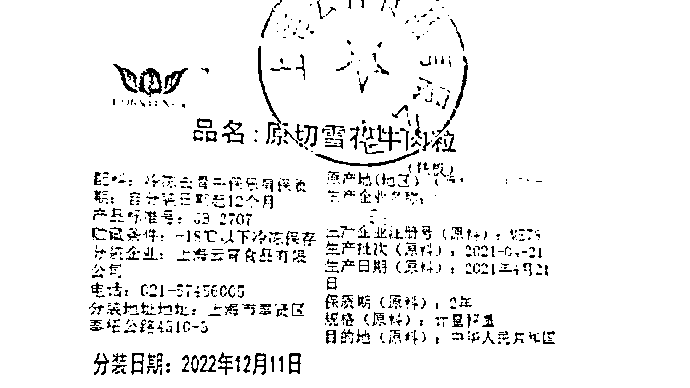
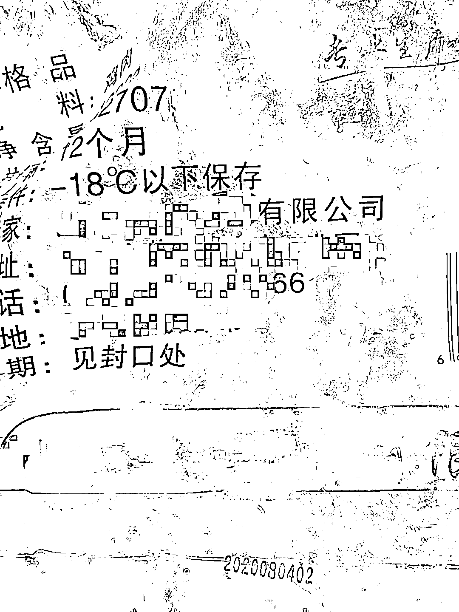

# 团购到“未来”牛肉？冻鸡翅过期 8 个月？发放的大米有强烈异味？查！

> 原文：[`mp.weixin.qq.com/s?__biz=MzIyMDYwMTk0Mw==&mid=2247534657&idx=5&sn=95c2b56777b4f24b9ddeace2b293115d&chksm=97cb8379a0bc0a6ffa171e596364cd990cc38d1b71aa0a26a1d3d5f9ecce98ac5bcac6ec395a&scene=27#wechat_redirect`](http://mp.weixin.qq.com/s?__biz=MzIyMDYwMTk0Mw==&mid=2247534657&idx=5&sn=95c2b56777b4f24b9ddeace2b293115d&chksm=97cb8379a0bc0a6ffa171e596364cd990cc38d1b71aa0a26a1d3d5f9ecce98ac5bcac6ec395a&scene=27#wechat_redirect)

# **上海市民团购到“未来”牛肉，****市监部门拟对当事企业行政处罚**

4 月 21 日，上海市市场监管部门接市民投诉，反映其团购到“未来”牛肉，分装日期标注为 2022 年 12 月 11 日。奉贤区市场监管局第一时间开展核查。

经查，该批牛肉系上海云宵食品有限公司生产销售。市场监管执法人员调取了当事企业加工的该批次牛肉的原料信息为：生产日期（原料）为 2021 年 9 月 23 日，保质期为 2 年，以及核验相关进口冷链检验检疫合格证明、核酸检测证明、消毒证明和追溯证明。

2022 年 4 月 11 日，当事人将该批采购的原料牛肉进行切割分装后，标示分装日期为 2022 年 12 月 11 日，生产日期（原料）为 2021 年 4 月 21 日。当事人供述，由于标签喷码的电脑系统技术故障以及员工疏忽未进行出厂核验，造成标示的原料信息与分装信息和实际不符。在市场监管部门接到举报前，当事人于 4 月 13 日已通过自查发现上述产品分装日期的问题，立即停止了销售，对库存产品标签进行改正。

当事人作为食品生产经营企业，在疫情防控的关键时期，未能严格落实食品安全管理制度，检验放行环节执行不到位，造成部分涉案食品流入市场，引发不良的社会影响。奉贤区市场监管局根据《食品安全法》和《食用农产品市场销售质量安全监督管理办法》的相关规定，对当事人进行立案调查，从快从严查办该案。已于 4 月 24 日向该企业送达了《行政处罚听证告知书》，拟对于其标注虚假生产日期的违法行为依法作出行政处罚。

# **团购的 60 份冷冻鸡翅过期，****上海浦东新区市监局立案调查**

 近日，市场监管部门接到小区居民反映，团购的套餐内有超过保质期的冷冻包装鸡翅。接报后，上海浦东新区市场监管局第一时间展开调查。

经查，该团购商品系由上海泽如国际贸易有限公司销售。该公司向某小区销售的团购套餐共计 230 份，套餐内包含猪筒骨、鸡翅膀、带皮腿肉、卷心菜、土豆、洋葱。其中， 60 份冷冻包装鸡翅超过保质期。

图为过期冷冻鸡翅，已经过期 8 个月。

当事人销售过期食品的行为，涉嫌违反《食用农产品市场销售质量安全监督管理办法》第二十五条，浦东新区市场监管局拟按《食品安全法》第一百二十四条第一款之相关规定，“违法生产经营的食品、食品添加剂货值金额不足一万元的，并处五万元以上十万元以下罚款；货值金额一万元以上的，并处货值金额十倍以上二十倍以下罚款；情节严重的，吊销许可证。”，给予行政处罚。同时，对涉案产品的上游供应商的违法经营行为已通报相关属地市场监管部门查处。

在对涉嫌违法行为进行处理的同时，浦东新区市场监管局联系居委会和居民了解具体诉求并组织调解，上海泽如国际贸易有限公司目前已完成退赔。

# **发放的大米有强烈异味？****宝山顾村镇：暂缓食用，已采样送检**

4 月 27 日，上海市宝山区顾村镇人民政府就发放“问题大米”一事进行了通报。

顾村镇官方微信公众号“幸福顾村”发布的通报称：4 月 26 日下午，有市民反映顾村镇发放的第三轮第二批次免费大礼包物资中“苏星四季”品牌大米（2.5kg/袋）有强烈异味，并有生产商反映该商品涉嫌假冒其公司产品。

接报后，顾村镇第一时间通知相关市民暂缓食用，并要求市场监管和公安部门介入调查、供应商协助调查。经查，该批大米供货商系苏粮集团代工企业，但其目前无法提供该批次大米的苏粮集团授权，苏粮集团提出该供应商涉嫌侵犯其商标专用权。另外，针对市民反映该批“苏星四季”品牌大米存在明显异味的问题，宝山区市场监管局已对该批大米进行采样送检。

顾村镇表示，下一步，宝山区有关部门将进一步深入调查，并根据调查结果，对相关企业和责任人依法严肃处置。同时，顾村镇也将进一步加强对采购供应物资质量的检验把关，防止类似事件再次发生。

26 日下午，涉事大米包装上的江苏省苏粮米业有限责任公司一名销售负责人向澎湃新闻记者表示，关于网上流传的大米有异味等情况，该公司已接到非常多相关投诉，该公司随即展开核查工作。

该负责人称，此前公司确实向上海市宝山区供应过一批大米，但网上流传的这些大米的生产日期和批次，并非苏粮米业生产，公司也未授权过其他单位销售。在了解了相关情况后，该公司已经向上海相关部门和江苏相关质检部门正式发文要求调查，“目前公安也已经介入，我们一定会根据调查结果会追究责任方的法律责任。”

**侵吞防疫保障物资，****上海宝山一公寓负责人张喜生接受监察调查**

据上海市宝山区纪委监委消息：上海新江内燃机厂公寓负责人张喜生侵吞政府防疫保障物资，目前正接受上海市宝山区监察委员会监察调查。

此前通报：[“云南捐赠宝山物资被转卖”？警方通报](http://mp.weixin.qq.com/s?__biz=MzIyMDYwMTk0Mw==&mid=2247534498&idx=1&sn=9b4d45e8274a0d18b5c9605dd9a9d125&chksm=97cb8c9aa0bc058c9024211a530adcfa56a8971a9e429f78945e598912f5b7c79a4957a364e5&scene=21#wechat_redirect)

来源：澎湃新闻

← 向右滑动与灰产圈互动交流 →

