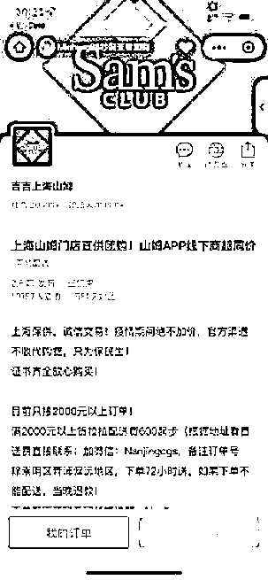

# 多名“团长”称转账后对方失联，警方已介入

> 原文：[`mp.weixin.qq.com/s?__biz=MzIyMDYwMTk0Mw==&mid=2247534657&idx=6&sn=992308444a5a64accd529d6f31310d42&chksm=97cb8379a0bc0a6f31bbaab01277eef6e6c3dd21da0a02a3b24b5aa332e9b01e37926fd860db&scene=27#wechat_redirect`](http://mp.weixin.qq.com/s?__biz=MzIyMDYwMTk0Mw==&mid=2247534657&idx=6&sn=992308444a5a64accd529d6f31310d42&chksm=97cb8379a0bc0a6f31bbaab01277eef6e6c3dd21da0a02a3b24b5aa332e9b01e37926fd860db&scene=27#wechat_redirect)

近日，上海市民杨女士向澎湃新闻反映，作为小区一百多户居民的“团长”，其 4 月 21 日向一名自称系“山姆代购”的男子团购物资，转账 4 万余元，但对方收钱后失联至今，自己疑似被骗。据她介绍，和她有类似遭遇的“团长”为数不少，其中一人涉及资金达 14 万元。目前，杨女士等人已经报案。据澎湃新闻了解，此事警方已经介入调查。

自称“山姆代购”男子的团购小程序

4 月 25 日，山姆会员商店相关工作人员回应澎湃新闻称，山姆方面目前和上海市内众多负责团购的“团长”保持直接联系，由“团长”提出申请，山姆审核通过后直接提供货品，“不存在个人代购情况。”山姆方面称，发现有不法分子利用疫情期间广大市民求购物资的迫切心理，以各种形式冒用山姆名义，组织团购，骗取代购经费，据悉公安机关已经介入并展开调查。

**“团长”转账后“代购”失联，疑似受骗**

据杨女士介绍，4 月 21 日，其在微信上看到一款名为“快团团”的小程序，主界面上写有“上海山姆门店直供团购，诚信交易，绝不加价”等内容。杨女士是上海某小区的“团长”，彼时正为物资发愁，便通过小程序加上了负责人微信。对方微信名为“吉吉”，自称“山姆代购”，只收取商品价格和配送费，不额外加价。随后，杨女士被“吉吉”拉入微信群，并下单 4.1 万元订购了一批物资。

杨女士称，在微信群中，曾有和她同为小区“团长”的人士向“吉吉”索要相关资质证明，“吉吉”均称，“有证明，可以私聊查看，不方便群发。”杨女士提供的私聊截图显示，杨女士询问“吉吉”何时能送货到门，得到了“72 小时内”的答复，而对于“看看资质证明”的要求，“吉吉”则称“发货会给的”。

杨女士当时尚未意识到有何不妥，直到 4 月 21 日群聊被群管理员陈燕（化名）解散。次日凌晨，陈燕找到杨女士，告诫她别再找“吉吉”下单了，此人“可能是骗子”。“她告诉我，她帮助‘吉吉’在 4 月 20 日建立了团购小程序，原本是想让更多的人能够买到商品，但随着向‘吉吉’转账的人越来越多，货物迟迟没有发出，以及团购群内的‘团长’要求退款、‘吉吉’却失联，她有些不安。”杨女士回忆。

4 月 25 日，澎湃新闻联系到了陈燕。她告诉记者，“快团团”小程序的链接确由她制作，但她和“吉吉”是通过第三人认识的，自己“也是受害者”。陈燕称，其从事互联网工作，懂些技术，因而上海出现疫情后，自己组建了“互助群”，一直颇为活跃。4 月 11 日，一名男子通过其所在的“互助群”联系到她。

“该男子自称‘黄锋’，在上海某国企任职。”陈燕说，接下来的数日内，“黄锋”多次发来他在上海疫情期间帮助老人解决物资难题的图片，并向陈燕伸出援手，解决物资难题，逐步获得了她的信任。不久，“黄锋”开始在互助群里向群友介绍“吉吉”，称后者是“山姆代购”“人很靠谱”。随后“黄锋”将“吉吉”介绍给陈燕认识，并请她帮忙制作“快团团”小程序。

“我原本是想让更多的人能够买到商品，便帮了这个忙，后面还好心帮他（吉吉）拉了团购群、运营平台。”陈燕称，团购小程序是在 4 月 20 日做好的，之后陆续有“团长”参与团购。但 4 月 21 日开始，她无法联系上“黄锋”和“吉吉”，而“团长”们订购的物资也迟迟无法发货。陈燕担心被骗，解散了团购群，并将“快团团”后台中的 375611.60 元退还。不过，仍有部分“团长”的钱转到了“吉吉”提供的银行账户中。

杨女士称，“吉吉”曾告诉团购群里的“团长”，“因被同行举报，快团团平台无法使用，订单需通过私聊转账完成。”杨女士提供的转账记录显示，4 月 21 日当天，她向“吉吉”提供的银行账户（开户名为“邹聪华”）转账 4.1 万元。而据其他“团长”称，“吉吉”还曾提供了另外两个银行账户，开户名分别为“黄锋”“吉顺兰”。

**警方介入处理，山姆否认存在“个人代购”**

包括杨女士在内的众多“团长”，至今无法联系上“吉吉”，怀疑被骗。而据陈燕称，“黄锋”也处于失联状态。此前，她曾通过“黄锋”所留电话号码查询支付宝，发现账户名确为“黄锋”，也根据“黄锋”提供的任职单位信息，通过公开渠道确认了该单位负责人姓名是“黄锋”。但现在想来，两个“黄锋”是否为同一人，陈燕无法确定。这些天，她一直处于“失落”之中，认为自己出于好心帮助别人，却可能“被人利用”。

4 月 22 日上午，杨女士“团购转账后对方失联”为由，向警方报案。“我们小区的团购金额在 4 万元左右，涉及一百多户居民，钱是我垫付的。”杨女士称，有邻居得知其可能被诈骗后，表示愿意共同承担损失，感谢她在疫情期间为大家的付出。据杨女士了解，疑似被骗的“团长”为数不少，其中一名“团长”涉及金额高达 14 万元。“和我一样，大家都选择了报警。”杨女士称，目前警方已经多次联系她了解情况。4 月 25 日，澎湃新闻联系相关派出所采访，一名工作人员称正在处理。

山姆会员商店相关工作人员 4 月 25 日告诉澎湃新闻，山姆方面目前和上海市内众多负责团购的“团长”保持直接联系，由“团长”提出申请，山姆审核通过后直接提供货品，“不存在个人代购情况。”不久，该工作人员向澎湃新闻发来一则给消费者的“声明”，其中提及，“近日发现有不法分子利用疫情期间广大市民求购物资的迫切心理，以各种形式冒用山姆名义，组织团购，骗取代购经费，据悉公安机关已经介入并展开调查。”

“我们强烈谴责这种违法行为，这极大程度地损害了消费者的利益，扰乱了大家在疫情下本就不易的生活，同时也对山姆品牌造成了极大的伤害。我们也再次提醒大家，如有团购需求，请通过正规渠道申请，对可疑信息提高警惕。”上述声明称。

来源：澎湃新闻

← 向右滑动与灰产圈互动交流 →

