# 央视起底天价考研“保过班”！10 万高价，号称给答案！有人被拖欠退费超一年…

> 原文：[`mp.weixin.qq.com/s?__biz=MzIyMDYwMTk0Mw==&mid=2247534657&idx=7&sn=b27154c0e4dc6f7c19749b62299c8a31&chksm=97cb8379a0bc0a6f243c1d606176c5d90c3ac2952fc97643e27e8953225bb2b666d42c9f14dd&scene=27#wechat_redirect`](http://mp.weixin.qq.com/s?__biz=MzIyMDYwMTk0Mw==&mid=2247534657&idx=7&sn=b27154c0e4dc6f7c19749b62299c8a31&chksm=97cb8379a0bc0a6f243c1d606176c5d90c3ac2952fc97643e27e8953225bb2b666d42c9f14dd&scene=27#wechat_redirect)

随着 2022 年考研分数线的公布，不少教培机构瞄准正在备战复试的考生们，推出了名目繁多的各类辅导班，有的机构甚至开设了万元复试“保过班”，宣称有“优良师资”“内部资源”，可以保证通过复试，这样的“保过班”靠谱吗？

**花几万元“保过”考研复试？考研培训乱象丛生**

[`mp.weixin.qq.com/mp/readtemplate?t=pages/video_player_tmpl&action=mpvideo&auto=0&vid=wxv_2372021789976920064`](https://mp.weixin.qq.com/mp/readtemplate?t=pages/video_player_tmpl&action=mpvideo&auto=0&vid=wxv_2372021789976920064)

△央视财经《经济信息联播》栏目 4 月 25 日视频

记者在网上输入考研辅导班，搜索结果多达几十家教育机构。进入这些机构的官网记者看到形形色色的考研辅导班，有考研全年集训班、周末走读班，还有金凤凰特训班、VIP 特训班等，价格普遍在上万元，**其中最贵的“保过班”，价格高达近 10 万元**。 

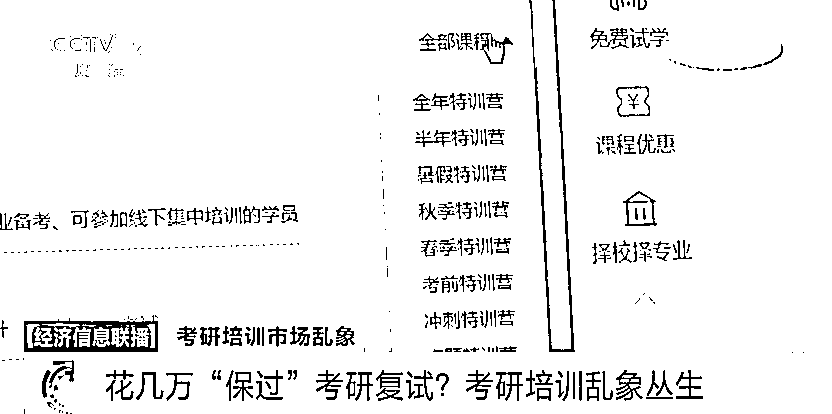

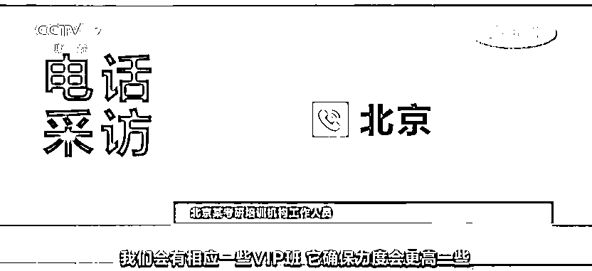

**北京某考研培训机构工作人员：**我们会有相应一些 VIP 班，它确保力度更高一些。 

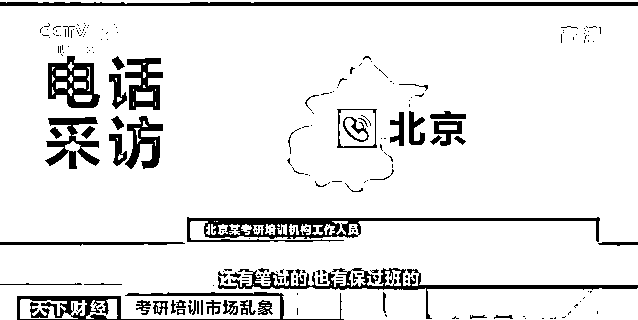

**北京某考研培训机构工作人员：**我们有保过班，包括提前面试；还有笔试，也有保过班。

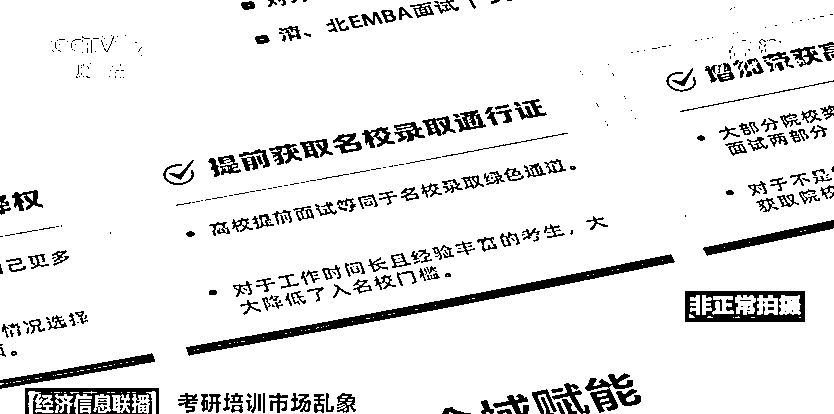

记者来到北京一家考研辅导机构，机构负责人告诉记者，他们的“保过班”分两种类型，一个是初级保过的常规班，另外一个是高级保过的通关班，价格分别为 15800 元和 25800 元。 

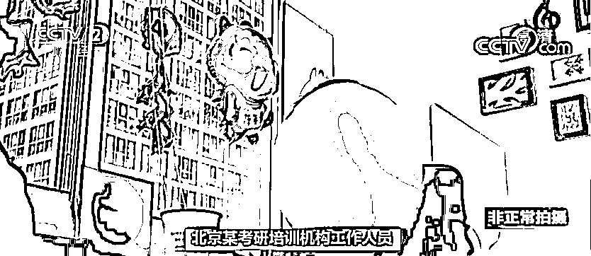

**北京某考研培训机构工作人员：**常规班是保证材料给你通过，通关班是保证面试通过。 

而在北京的另外一家考研辅导机构，记者了解到，**这家机构面试保过班的价格从 1 万元到 10 万元不等，不同价位保过的学校不一样**。普通大学价格低一些，而双一流、985 大学就贵多了。

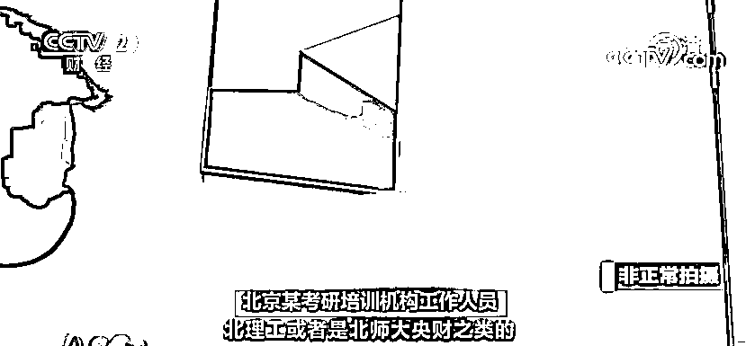

**北京某考研培训机构工作人员：**北理工或者是北师大、央财之类的，我们给你辅导确保你能通过一所学校的面试。如果一所都没有通过，也不再继续辅导，面试可以全额退费，面试是给你保过的意思。 

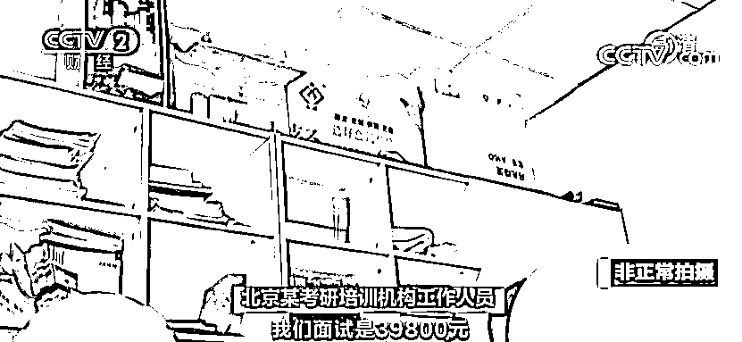

**北京某考研培训机构工作人员：**我们面试是 39800 元，假如面试不过全额退费。 

**培训机构声称有“高校资源”**

**高校回应：没有授权和合作**

“考研复试保过”“不通过就退费”，记者调查走访了多家培训机构，几乎清一色都是这样的说法。培训机构为什么会有这样的自信？他们的底气从何而来呢？这所谓的底气真的靠谱吗？

[`mp.weixin.qq.com/mp/readtemplate?t=pages/video_player_tmpl&action=mpvideo&auto=0&vid=wxv_2372021198361952257`](https://mp.weixin.qq.com/mp/readtemplate?t=pages/video_player_tmpl&action=mpvideo&auto=0&vid=wxv_2372021198361952257)

△央视财经《经济信息联播》栏目 4 月 25 日视频

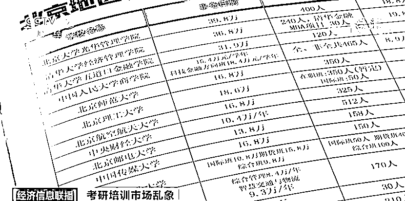

在北京的这家培训机构，工作人员告诉记者，他们的保过班已经开办很多年了，全国几十所高校的面试通过率都超过了 90%。 

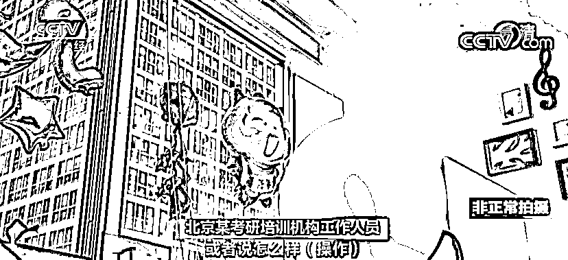

**北京某考研培训机构工作人员：**你也不要在意我用什么办法保过，或者说怎么样操作，我们是可以做到的。我们有高校关系也有实力，每个机构都是这样的。 

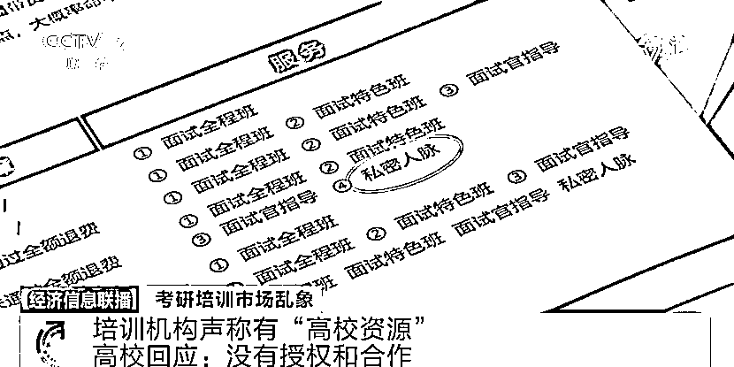

在另外一家培训机构，负责人表示，他们“保过班”的面试通过率因学校而有所区别。他们有自己的关系和资源，在有些高校，他们的面试通过率基本能达到百分之百。 

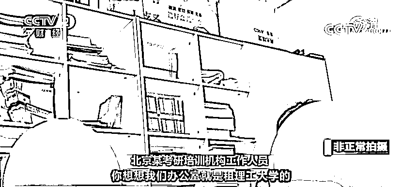

**北京某考研培训机构工作人员：**我们办公室就是租理工大学的，总部就在北理工的旁边，就是理工大学的房子。我们租着房子，不“吃着”理工大学，就没有优势了，有些事没法跟你说那么透。 

**还有一些培训机构为了招揽业务，直接亮出底牌**。 

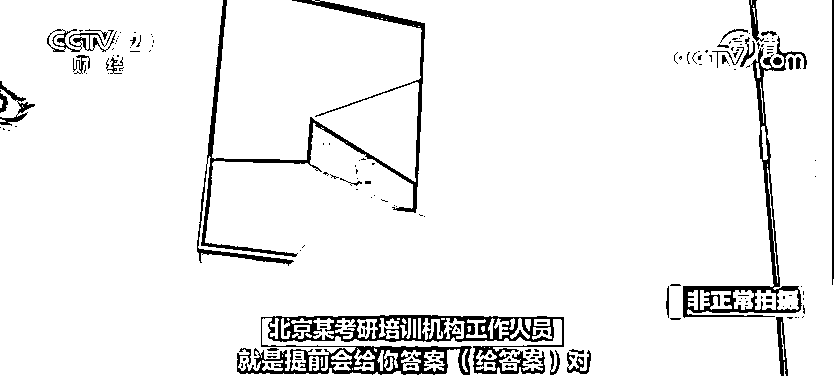

**北京某考研培训机构工作人员：**湖南农业大学农业硕士专业课我们是 90%以上的通过率。提前会给你答案，给你一些范围提前背，基本上都能考到，去年已经考上很多了。 

这些培训机构所谓的资源和承诺，是否属实呢？随后，记者前往这几家机构所提到的高校进行了验证和核实。 

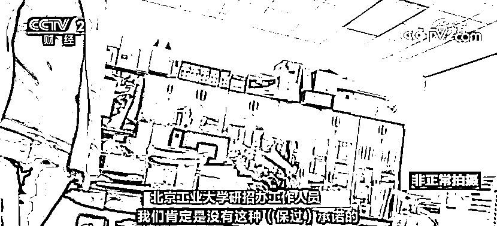

**北京工业大学研招办工作人员：**我们没有过和培训机构的这种合作，肯定是没有这种保过承诺的，可能是培训机构的一种宣传手段。 

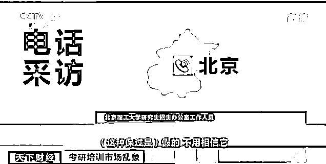

**北京理工大学研究生招生办公室工作人员：**这种保过是假的，不用相信它，学校从来没有授权过所谓的三方机构。

**湖南农业大学研究生招生办公室工作人员：**我们没有跟任何教育机构有合作，这个也是不能搞的。

**考生遭遇退费难 谨防招牌背后是陷阱**

[`mp.weixin.qq.com/mp/readtemplate?t=pages/video_player_tmpl&action=mpvideo&auto=0&vid=wxv_2372020381428973569`](https://mp.weixin.qq.com/mp/readtemplate?t=pages/video_player_tmpl&action=mpvideo&auto=0&vid=wxv_2372020381428973569)

△央视财经《经济信息联播》栏目 4 月 25 日视频

除了保过的承诺和所谓高校的资源，**培训机构还有一个推销的噱头就是“不通过就退费”****，这也让不少考生打消了顾虑**。那么，考研复试不通过，真的可以顺利退费吗？

小赵是山西的一名在校大学生，去年底她购买了一家教培机构的考研“保过班”课程，在合同中这家机构承诺除了教授公共课，还会聘请指定学校的专业课老师进行辅导。

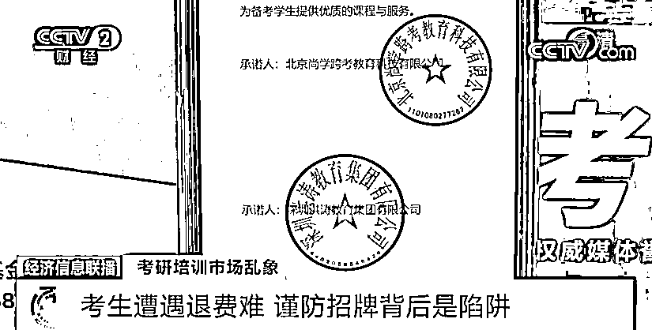

然而公共课上了几次之后便一直停止，专业课更是没有按照合同内容安排授课老师。

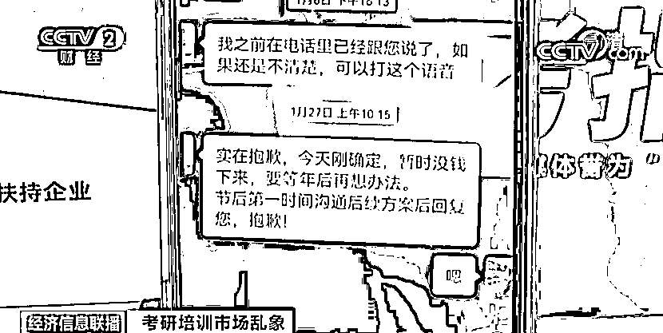

因此小赵从去年开始走上了艰难的退费之路。

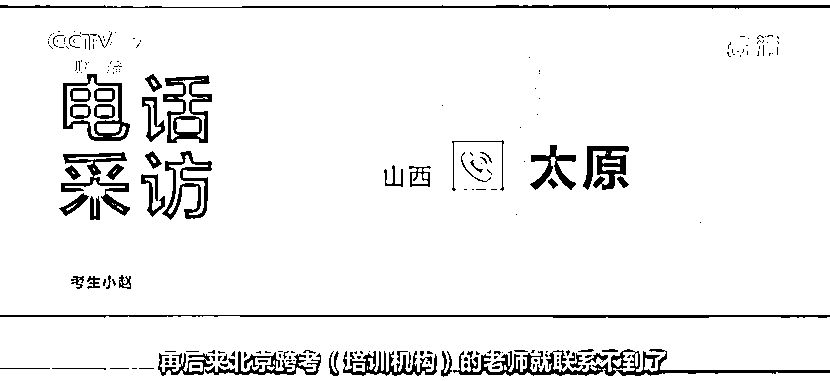**考生小赵：**再后来北京跨考教育的老师就联系不到了，发消息不回，打电话也不接，我们也给警察打电话，给教育监管机构打过电话。 

在黑猫投诉平台记者看到，**有关考研保过班无法退费的投诉有几百条****，其中不乏集体投诉**，这家名为跨考教育的机构仅在长春一地就有 100 多名考生投诉。

记者与这个投诉群联系后发现，群里所有的考生都是没有拿到退费的，**退费拖延最长的已经有一年多**。

为此，记者来到这家总部注册地址位于北京海淀区的跨考教育机构。

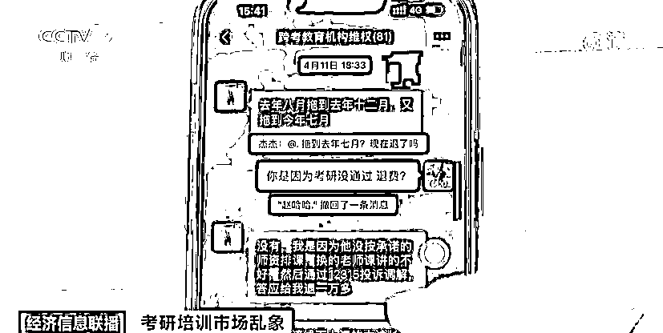

记者看到，这家机构办公面积不足 100 平米，现场工作人员只有寥寥几人，机构负责人告诉记者，**长春考生群体退费的事情他们很清楚，但公司目前遇到了现金流紧张的困难**。

**北京跨考教育相关负责人：**我们核算下来，疫情这两年期间一直在亏损，但别人看不出来是亏损的，每年好几百个学生，平均下来客单价都在三万元左右，收入不少钱，但是花销也比较大，所以资金流稍稍有点问题。

根据黑猫投诉平台的线索，记者又来到北京另一家名为海天教育的教培机构。负责人对于考生退费诉求作出的答复是，**这一退费事件属于外地加盟机构所为，他们作为总部没有义务处理**。

**北京海天教育相关负责人：**他是加盟的，给我们交支付加盟费，这是我所知道的，我们最多能做的事就是取消他们加盟资格，造成损失了你们直接起诉他。 

来源：央视财经（ID：cctvyscj）

← 向右滑动与灰产圈互动交流 →

