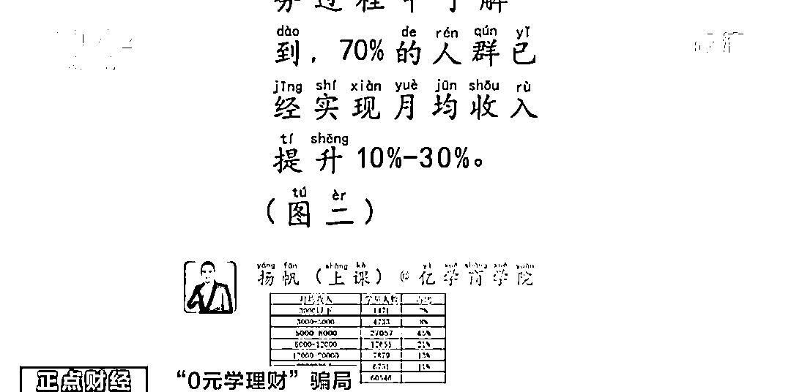
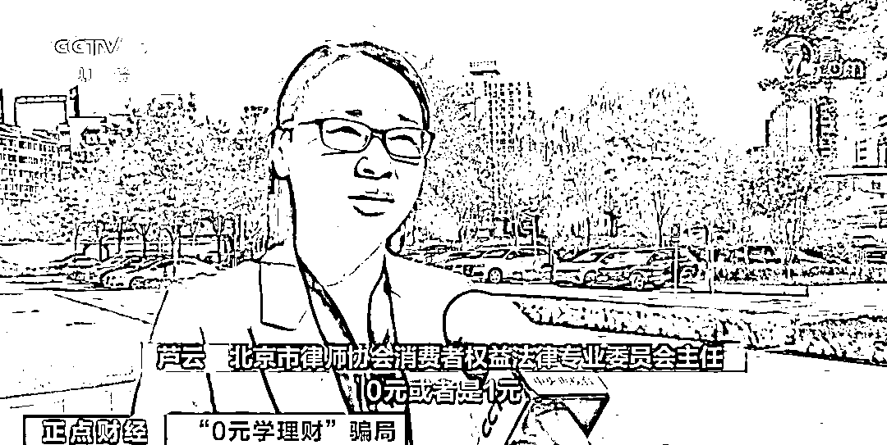

# 0 元学理财，却亏了近万元！央视曝光“骗钱”套路→

> 原文：[`mp.weixin.qq.com/s?__biz=MzIyMDYwMTk0Mw==&mid=2247534657&idx=8&sn=93771ba8db9035eb2b65cd3fb54651e2&chksm=97cb8379a0bc0a6f1f9fc9567b1b5d6d9b1fd64e8533e12f8c697fb2f37e80059959e1678cc9&scene=27#wechat_redirect`](http://mp.weixin.qq.com/s?__biz=MzIyMDYwMTk0Mw==&mid=2247534657&idx=8&sn=93771ba8db9035eb2b65cd3fb54651e2&chksm=97cb8379a0bc0a6f1f9fc9567b1b5d6d9b1fd64e8533e12f8c697fb2f37e80059959e1678cc9&scene=27#wechat_redirect)

“0 元学理财”“短期实现财富自由”，如今这样颇具诱惑力的广告语充斥网络，吸引着没有投资经验和专业知识的投资者。这些理财课靠谱吗？

**报“0 元理财课”却亏了近万元**

**消费者遭遇退款维权难**

今年 30 岁的张女士最近遇到了一件烦心事。前不久，她报名上了一个“0 元理财试听课”，**随后就有在线客服不断向她推销价值 7899 元 12 节课的进阶课程，声称学完后“收益巨大，稳赚不赔”。**

在客服人员的反复推销和劝说之下，张女士最终购买了课程。但在上课时发现，并没有客服所说的一对一授课，而老师也只是照搬了一些书本上的知识。**不仅如此，在老师的推荐下购买的理财产品，还亏了不少钱。**

张女士告诉记者，原本客服承诺，如果对课程不满意，可以随时退款，可当张女士多次与平台客服沟通退款无果之后，竟被对方拉黑。记者调查发现，和张女士有着同样遭遇的消费者不在少数。

**黑猫投诉平台上与财商课程相关的投诉量超过 5000 个**，消费者投诉问题基本集中在：商家通过 0 元试听诱导、承诺实现财务自由等方式不断洗脑，诱导用户缴费甚至诱导贷款；实际课程质量差、价值低；涉嫌虚假宣传；用户申请退款维权难等方面。

**专家：“稳赚不赔”不可能**

**警惕低价理财课的虚假宣传**

对于线上的理财课程，消费者究竟应该如何选择？是不是可以在短期通过线上理财课掌握所谓的“财富密码”？

律师提示，消费者选择培训机构学习的时候，首先应该核实该机构的资质和备案信息，对于广告宣传应理性对待。

**北京市律师协会消费者权益法律专业委员会主任 芦云**：0 元或者是 1 元，实际上只是个噱头，然后拉很多的消费者或者投资人入坑。实际上就是为了去骗取消费者的信赖，从而去购买它高额的课程，这个营销过程中本身就可能涉嫌到虚假宣传或者是虚假广告。 

业内人士告诉记者，理财、金融知识的学习，是一个循序渐进的过程，短时间内速成以及所谓的“稳赚不赔”更是不可能的。

来源：央视财经（ID：cctvyscj）

← 向右滑动与灰产圈互动交流 →

