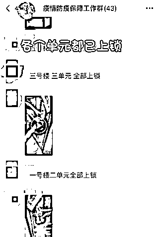
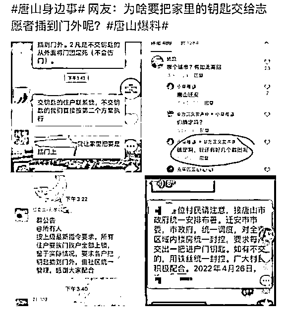
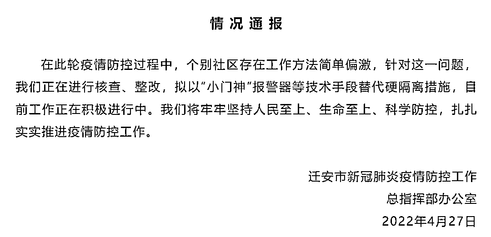

# 河北迁安深夜回应"锁门隔离"

> 原文：[`mp.weixin.qq.com/s?__biz=MzIyMDYwMTk0Mw==&mid=2247534718&idx=1&sn=b1d9bff1f66d7fe9df9e0cacd2355808&chksm=97cb8346a0bc0a505fba77bd5e2934a71e3fdc444b279b35ccf18e791536950c0c203421f8d8&scene=27#wechat_redirect`](http://mp.weixin.qq.com/s?__biz=MzIyMDYwMTk0Mw==&mid=2247534718&idx=1&sn=b1d9bff1f66d7fe9df9e0cacd2355808&chksm=97cb8346a0bc0a505fba77bd5e2934a71e3fdc444b279b35ccf18e791536950c0c203421f8d8&scene=27#wechat_redirect)

<mpvideosnap class="js_uneditable custom_select_card channels_iframe videosnap_video_iframe" data-pluginname="videosnap" data-id="export/UzFfAgtgekIEAQAAAAAAb70L6jdt1gAAAAstQy6ubaLX4KHWvLEZgBPE8qNMeyobAP6DzNPgMIuixHoNyc0KsgATtd5ZSwAy" data-url="https://findermp.video.qq.com/251/20304/stodownload?encfilekey=rjD5jyTuFrIpZ2ibE8T7YmwgiahniaXswqzTkiboVkviaCfT4PwzdiaDnZeWhdLkPpEZCmqKOwCltD2tEy34db739EsbbpB5Cia2UwzKKVqiaPicdWxN7jodWzib8QYQ&amp;adaptivelytrans=0&amp;bizid=1023&amp;dotrans=0&amp;hy=SH&amp;idx=1&amp;m=&amp;scene=0&amp;token=AxricY7RBHdUSxlePSrXOqE6tbiarEfO2Eh05a3bF0tAKr6IBK6Jrv5zibib7pxpT5OZR9u1iaWucLkg" data-headimgurl="http://wx.qlogo.cn/finderhead/ibq4aVwOt6HNqrr8OD3sCviaytF3B8TqCwHicxsuIanAJo/0" data-username="v2_060000231003b20faec8c6e48a1acbd3ce04ef33b077a1e41d0d3794ed88ea537878dbe65910@finder" data-nickname="灰产圈+" data-desc="河北迁安疫情防控期间，为了防止居民私自外出，影响抗疫大局，要求居民将钥匙上交，由志愿者在外面把门锁上，不同意的可以免费帮忙打孔上锁

疫情一刀切、地方层层加码何时了，就想问下领导家里是不是也是这样操作 #疫情#河北疫情@灰产圈+ " data-nonceid="526963359954336363" data-type="video" data-width="1080" data-height="1920"></mpvideosnap>

近日，有网友发文称“河北迁安疫情防控期间，为了防止居民私自外出，要求居民将钥匙上交，由志愿者在外面把门锁上，不同意的可以免费帮忙打孔上锁，安装铁丝上锁。”

据微信公号“迁安融媒”4 月 27 日消息，河北迁安就个别社区防疫工作方法简单、偏激发布情况通报，表示正在核查、整改，以下为全文：

在此轮疫情防控过程中，个别社区存在工作方法简单偏激，针对这一问题，我们正在进行核查、整改，拟以“小门神”报警器等技术手段替代硬隔离措施，目前工作正在积极进行中。我们将牢牢坚持人民至上、生命至上、科学防控，扎扎实实推进疫情防控工作。

迁安市新冠肺炎疫情防控工作

总指挥部办公室

2022 年 4 月 27 日

来源：中国新闻社综合迁安融媒、网友评论

<mpvideosnap class="js_uneditable custom_select_card channels_iframe videosnap_video_iframe" data-pluginname="videosnap" data-id="export/UzFfAgtgekIEAQAAAAAAlh0T1Yl1ygAAAAstQy6ubaLX4KHWvLEZgBPE9KNofng_A_6DzNPgMIvF24Y1xPLrnMzXmZvj_5pV" data-url="https://findermp.video.qq.com/251/20304/stodownload?encfilekey=S7s6ianIic0ia4PicKJSfB8EjyjpQibPUAXolbTvmqARicjCMiacUcJ44eAhxUo9h0oWWP5f8gA1UcqzJOBpLvcnxvrCKj0fibIYzSAyVY44shTViaSLrh1W0EON2GA&amp;adaptivelytrans=0&amp;bizid=1023&amp;dotrans=0&amp;hy=SH&amp;idx=1&amp;m=&amp;scene=0&amp;token=x5Y29zUxcibC18vc7HiaolYYHp4jwofZaxN7icSclokNW3Al4nIswiauKNcJqbYP9ZPxalHzP474icNc" data-headimgurl="http://wx.qlogo.cn/finderhead/ibq4aVwOt6HNqrr8OD3sCviaytF3B8TqCwHicxsuIanAJo/0" data-username="v2_060000231003b20faec8c6e48a1acbd3ce04ef33b077a1e41d0d3794ed88ea537878dbe65910@finder" data-nickname="灰产圈+" data-desc="工作人员将贴有“上海云南一家亲，徐汇红河心连心”的标签撕下，然后装进旁边的卡车。

经笔者核实，4 月 21 日弥勒电视台报道：云南爱心企业定向捐赠给上海徐汇 1810 件，共计 14.8 吨蔬菜，全部是分拣好的无需再分拣。该捐赠物资贴的标签，与视频中被撕下的标签内容一致。

该捐赠物资是 4 月 21 日中午出发，于 4 月 23 日抵达徐汇区，由徐汇区枫林街道管理办接收（见评论区）。# " data-nonceid="11643205050097433084" data-type="video" data-width="1080" data-height="1920"></mpvideosnap>

← 向右滑动与灰产圈互动交流 →

