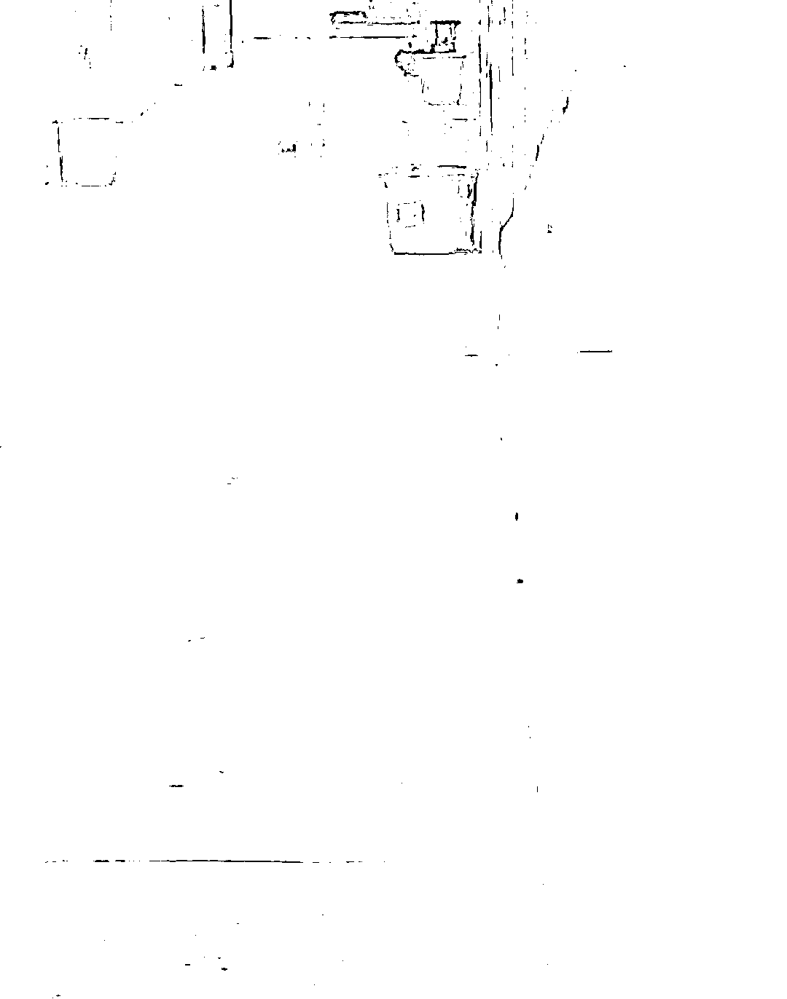

# 同济的学生们就偷着乐吧！

> 原文：[`mp.weixin.qq.com/s?__biz=MzIyMDYwMTk0Mw==&mid=2247534718&idx=4&sn=2d597c6cd13721f8318f0d598ce9807f&chksm=97cb8346a0bc0a50718f1afcc277c95e314b3e764a650980f6b05775f771bf153ddb82cc4eff&scene=27#wechat_redirect`](http://mp.weixin.qq.com/s?__biz=MzIyMDYwMTk0Mw==&mid=2247534718&idx=4&sn=2d597c6cd13721f8318f0d598ce9807f&chksm=97cb8346a0bc0a50718f1afcc277c95e314b3e764a650980f6b05775f771bf153ddb82cc4eff&scene=27#wechat_redirect)

写在前面： 

**开始之前，先说一下昨天河北迁安的硬核隔离的后续。**

事件始末并不复杂，昨日河北迁安的“硬核防疫”刷新了底线。在一则紧急封锁入户门通知上，可以看到，应上级要求，现需居民积极配合交出一把家门钥匙，插在入户门门外进行反锁的通知。

也就是说，家这个避风的最后港湾，门也要别人来管理，开不开主任说了不算。

在网易财经上，可以看到，对于不配合的居民将交由公安机关依法处理。 

现场的视频截图如下：

对此，有作家发声说，此举已涉及触犯刑法，侵犯百姓居住权。

而在消防法上有一条规定我们都知道，任何单位不得占用、堵塞、封闭疏散通道、安全出口、消防车通道。人员密集场所的门窗不得设置影响逃生和灭火救援的障碍物。锁住户门，锁单元门，已经违反了此条规定。

目前这件事因为舆论的压力，当地也发出通报解释，“个别社区存在工作方法简单偏激，将核查整改”

怎么说，社区的通知上，可是应上级要求，这个上级又是谁？不能热搜了，就甩给社区，有那么牛逼的居委会吗？

这个事情的脉络就是这样，至于点评，就引用罗翔《法治的细节》里的一句话吧：“生活远比戏剧更荒诞与沉重。”

这段话在疫情之后频频被验证，昨天张强医生在视频里也说，几十年前那么多地怎么会挨饿，以前不信，现在他明白了。

正文： 

关于同济的后续，很多同济大学的学生在私信里和我说，没用，又吃到带毛的了，并发来图片。 

看完图片，发现没有猪咪咪，也没有寄生虫了，虽然毛看着不雅，但忍一忍还可以吃的

今天暂时就不说了！

因为有的地区的学校，实在更是惨不忍睹，相比他们，引用赵先生那句“你们就偷着乐吧”送给你们。

从一组聊天说起，一个博主收到学生的求助，说，我们学校现在不能上厕所，发了个桶，让在宿舍里吃喝拉撒，每天发药不发水！

通过这个线索，在网上搜了一下，求救的学生非常多；

爆料最多的是食物质量问题，菜是苦的，饭是嗖的，很多学生闹肚子。 

有学生在群里问老师什么时候可以打水，问老师中午没有饭吃吗？老师的回复是，没有水的相互借一下，做核酸的时候有饭，结果没有!

药倒是发了很多，有中药汤就不用喝水了！

原本以为是马桶，结果是一个装水的塑料桶。学生质问，请问我们和动物有什么区别？ 

排成一条线，这场景真的有点肖申克内味了； 

菜收费不合理，女生也吃不饱，志愿者防护服好几天不得换，该吃晚饭的时候才能吃到午饭； 

什么样的菜呢，

饭拿起来都折不断，真不知道是质量过于好，还是真的就是坏；

有学生直接在群里问，菜价不合理；

也有学生吐槽说，保证活着不死就行，寝室里六个人已经三个人吃完拉肚子了。

不让去厕所，却能排队去拿饭，那发马桶的意义何在？

问题的关键是，做的不好，还不允许别人说，开始威逼恐吓学生们；

删视频倒是很快，马上彻查！ 

不是彻查饭菜，马桶的问题，而是发视频的！

写到这里，我想说的是，遇到问题，及时的纠正，学校才不至于放学生寒心，问题才不至于癌化。 

在上一篇同济的文章中，一位同学留言说，我们也只是想追求健康生存的权利，无意为母校抹黑。

这样的学生都是无比热爱学校，有责任心的好孩子，切记善待。

学校是教书育人的地方，疫情期间肯定会有诸多困难，这一点相信多数的学生都能理解，但发现了问题，一定不能积压，爱是相互的，在要求学生服从的同时，校方也该尽到起码的责任。

窥一斑而知全豹，学校问题暴露了，社会问题矛盾出来了，由此可以看到，这个地区某些人的能力，以及那一句 RM 之上，肯定都用在瓜哇国去了。

德不配位，必有灾殃。

任何一个地方，国度，星球，乃至整个宇宙，有人的地方都会存在问题，但遇到问题，尤其是面对良性的声音之时，要正视，而不是第一时间想着封锁，打压，如此，无论是学校还是社会，只会越来越坏。

因为将发现问题的声音当做违反了法律法规，那么留下的只能是虚假的阿谀奉承。

以上。

来源：我会永远在你身后

<mpvideosnap class="js_uneditable custom_select_card channels_iframe videosnap_video_iframe" data-pluginname="videosnap" data-id="export/UzFfAgtgekIEAQAAAAAAEtcyho607gAAAAstQy6ubaLX4KHWvLEZgBPEz6NAVBJGRPyDzNPgMIteqHqcDGKjWSnNG-gszwYo" data-url="https://findermp.video.qq.com/251/20304/stodownload?encfilekey=rjD5jyTuFrIpZ2ibE8T7YmwgiahniaXswqzwuOwzxIEoC34nvnx2GG1fKqCWlicJetNqOib9kZlwQYqWRSiaL6EfxHXceNJDPoECbJm0LmbGrGG9XQULLYG3un2w&amp;adaptivelytrans=0&amp;bizid=1023&amp;dotrans=0&amp;hy=SH&amp;idx=1&amp;m=&amp;scene=0&amp;token=x5Y29zUxcibC18vc7HiaolYfdPiawwZgDBsxj1IkQfZnNOvl7qjicqVGx9AIEHwXjicz56AJIxuSyv1A" data-headimgurl="http://wx.qlogo.cn/finderhead/ibq4aVwOt6HNqrr8OD3sCviaytF3B8TqCwHicxsuIanAJo/0" data-username="v2_060000231003b20faec8c6e48a1acbd3ce04ef33b077a1e41d0d3794ed88ea537878dbe65910@finder" data-nickname="灰产圈+" data-desc="这个谣怎么辟？都固定好证据了！大上海真是颠覆了我的想像哦！#上海疫情#上海物资#上海抗疫@灰产圈+ " data-nonceid="6712564044833745916" data-type="video" data-width="1080" data-height="1920"></mpvideosnap>

← 向右滑动与灰产圈互动交流 →

