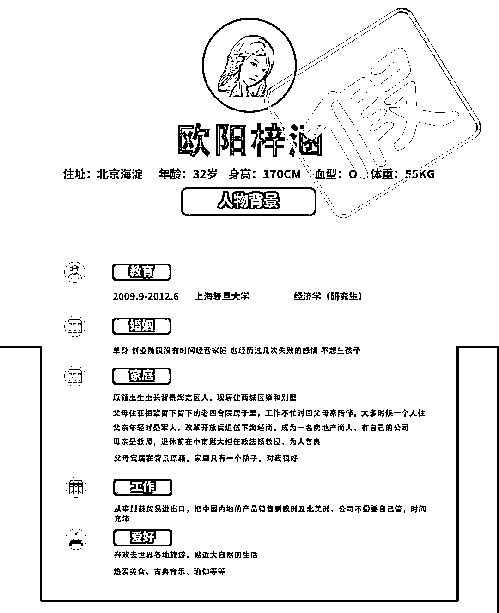
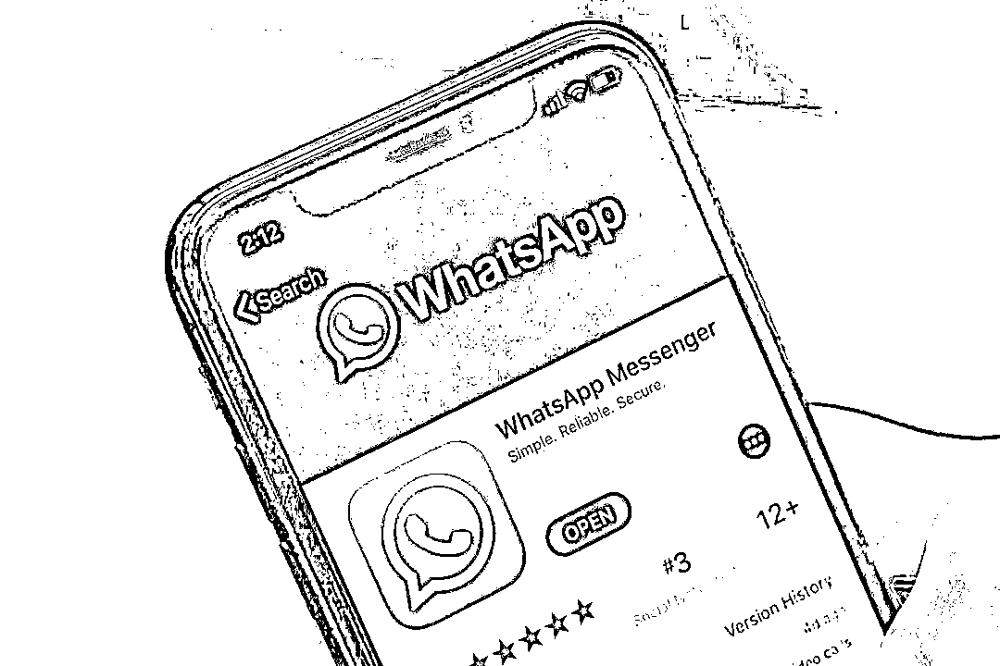
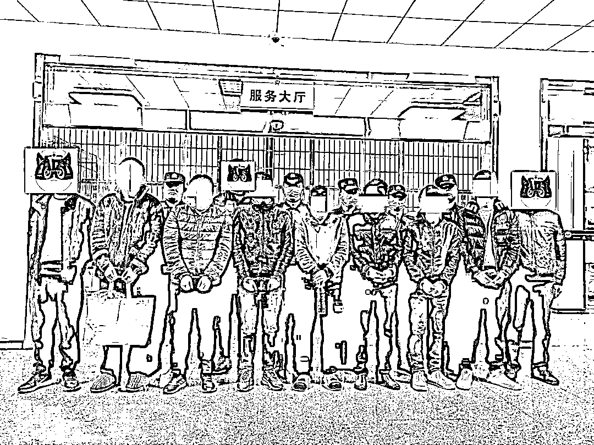

# 什么是“杀洋盘”，你见过吗？

> 原文：[`mp.weixin.qq.com/s?__biz=MzIyMDYwMTk0Mw==&mid=2247534718&idx=5&sn=5858606171d73ad4af6bbe122ddd3eee&chksm=97cb8346a0bc0a5031c6e8dc07b4ec622043e1e174dc5d3dfe64f8982bf12b36728474db4331&scene=27#wechat_redirect`](http://mp.weixin.qq.com/s?__biz=MzIyMDYwMTk0Mw==&mid=2247534718&idx=5&sn=5858606171d73ad4af6bbe122ddd3eee&chksm=97cb8346a0bc0a5031c6e8dc07b4ec622043e1e174dc5d3dfe64f8982bf12b36728474db4331&scene=27#wechat_redirect)

杀猪盘

早已人尽皆知

可是 **杀洋盘**

你听说过吗？

随着反诈知识不断普及

许多群众有了“电诈抗体”

看到国民不好骗

一诈骗团伙

居然剑走偏锋

**打起了洋人的主意**

......

[`mp.weixin.qq.com/mp/readtemplate?t=pages/video_player_tmpl&action=mpvideo&auto=0&vid=wxv_2233760265005858824`](https://mp.weixin.qq.com/mp/readtemplate?t=pages/video_player_tmpl&action=mpvideo&auto=0&vid=wxv_2233760265005858824)

这个诈骗图团伙成员仅有初高中学历，有人甚至只上过小学，却通过打造“白富美”人设，利用聊天软件与外国人网恋交友。赢得被害人情感信任后，他们引导对方进行投资，然后“手起刀落”诈骗钱财。

2021 年 12 月 3 日，孝感市公安局孝昌分局多警联动，**成功打掉一个专门针对外国人的“杀猪盘”诈骗公司**，现场抓获犯罪嫌疑人**15 名**，扣押作案电脑、手机共**40 余台**。

2021 年 11 月，孝昌县公安局在协助重庆警方研判一起案件时，发现犯罪嫌疑人李某、周某经常在孝昌城区活动。他们长期出入某酒店，却未办理入住手续，作息时间日夜颠倒。经过实地走访摸排，民警发现，该酒店某楼层出租给了某公司。这家公司白天休息，夜间工作，情况十分可疑。

民警立即展开研判分析，基本确定该公司为一处电信诈骗窝点。2021 年 12 月 3 日，孝昌公安刑侦大队、情指勤舆一体化合成作战室、反恐大队联合实施抓捕行动。

现场搜查时，民警发现，**该团伙聊天软件的聊天内容涉及多种外语。**

**犯罪嫌疑人语言不通，学历不高，是如何骗取外国人的芳心呢？**

据犯罪嫌疑人李某升、李某梦交代，为了赚钱，没有正当职业的两人决定从事诈骗。他们认为，骗外国人受害者不方便报案，没有什么风险，于是将作案对象瞄准为国外的男性，随后从网上找来聊天话术、人设背景等资料，招募“业务员”进行培训。

这些“业务员”的学历不高，大多是初高中学历，有人甚至仅读过小学。他们凭借翻译、“翻墙”软件，冒充事先设定的**“白富美”欧阳梓涵**（33 岁，从事服装贸易出口，常住北京，有房有车，家庭优越）与国外男性通过 WhatsApp 聊天软件进行感情交流，取得对方情感信任后便引导对方下载虚假的 MT5 投资平台并投资。

涉诈团伙中，李某升负责公司的日常管理，李某梦负责业务和技术。业务员则平台方与业务员按比例提成。

截至被警方查获时，该团伙已引流诈骗对象**200 余人**，遍布**20 多个**欧美国家，已成功诈骗**4 人**，涉案金额**300 多万美元**。

该案系孝昌县公安局历史上侦办的**第一起针对外国人的诈骗案件**（俗称**“杀洋盘”**）。语言不通、文化差异、地理时差等多种问题摆在面前，采集证据工作变得极为困难，若证据不足，检察院很可能无法批捕。 

**“电诈分子能做到的事，我们一定也能！”**孝昌县公安局刑侦大队克服重重困难，利用犯罪嫌疑人作案的电脑、手机等工具，成功在办公室还原了电诈窝点的网络环境。

由于国内和国外存在时差，侦查员只有晚上才能联系被害人。办案民警让犯罪嫌疑人现场“指导”，登录嫌疑人先前和被害人联系的的 whatsapp 账号，借助翻译工具和被害人沟通，告诉受害人被骗的事实。

一开始，被害人对侦查员不信任、不理睬。侦查员坚持耐心解释，并请来孝昌县一中的英语老师协助语音电话沟通。经过二十多天的耐心交流，警方终于打消受害人的顾虑。他们按照警方提供的模版提交了报案材料。经反复修改核对无误后，被害人打印报案材料，签名后将扫描件传给了孝昌警方。

经过近一个月的努力，孝昌公安成功获取了远在万里之外的四名被害人的陈述，使得 11 名犯罪嫌疑人被成功批捕。

目前，案件正在进一步侦办中。

来源：湖北省反诈中心,天下有诈

<mpvideosnap class="js_uneditable custom_select_card channels_iframe videosnap_video_iframe" data-pluginname="videosnap" data-id="export/UzFfAgtgekIEAQAAAAAAQWkaj5HtYQAAAAstQy6ubaLX4KHWvLEZgBPEnaMMPlk3Yan8zNPgMIvzwzs9lpKoqTAYO6cN2KTl" data-url="https://findermp.video.qq.com/251/20304/stodownload?encfilekey=S7s6ianIic0ia4PicKJSfB8EjyjpQibPUAXolOWGo3mGw4Wia0Qxsib0ywY2BwKXjLT17F3ybcic6BPVcslp19eP0p3R4yOSn1KgDLGIcEXurjibLfh4DIJOdtCDK7Q&amp;adaptivelytrans=0&amp;bizid=1023&amp;dotrans=0&amp;hy=SH&amp;idx=1&amp;m=&amp;scene=0&amp;token=x5Y29zUxcibC18vc7HiaolYbvqct7B0xTPRfUOibM0t007pbuUZMlrcUgSVOPy2IlWKpsdNa4KfRLk" data-headimgurl="http://wx.qlogo.cn/finderhead/ibq4aVwOt6HNqrr8OD3sCviaytF3B8TqCwHicxsuIanAJo/0" data-username="v2_060000231003b20faec8c6e48a1acbd3ce04ef33b077a1e41d0d3794ed88ea537878dbe65910@finder" data-nickname="灰产圈+" data-desc="妹子 up 主被骗了 20 万后，骗子还在逍遥法外。谁能制裁这个骗子？@灰产圈

" data-nonceid="10881080598583121116" data-type="video" data-width="1280" data-height="720"></mpvideosnap>

← 向右滑动与灰产圈互动交流 →

