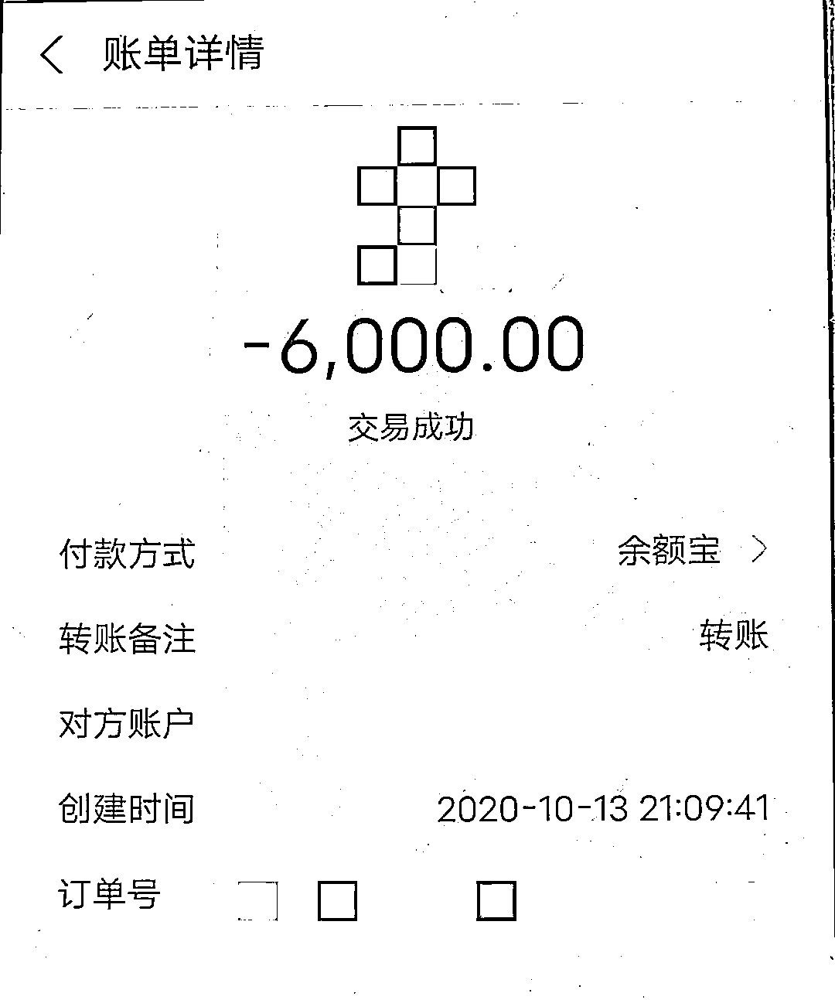
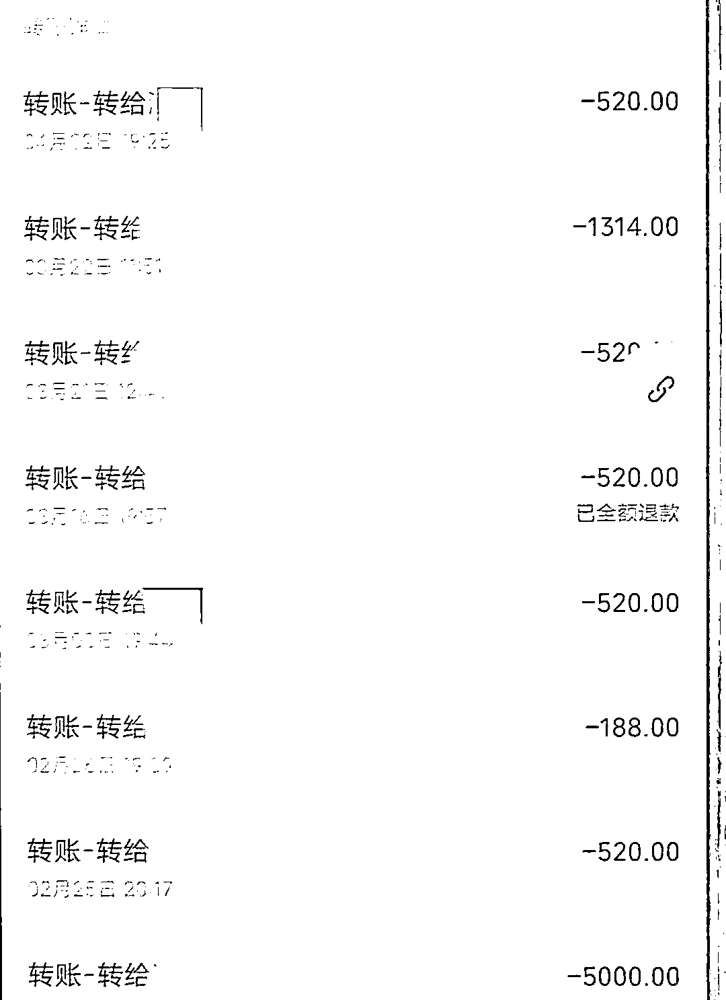
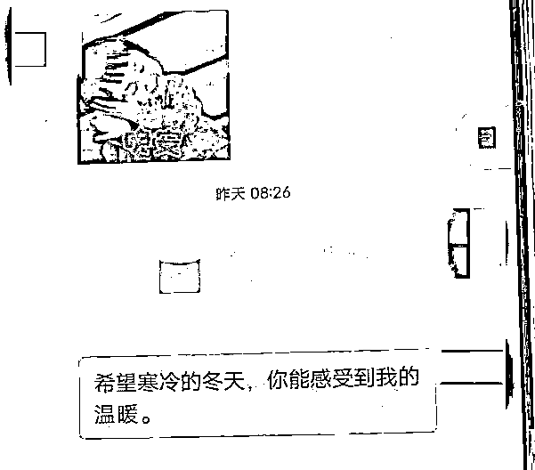
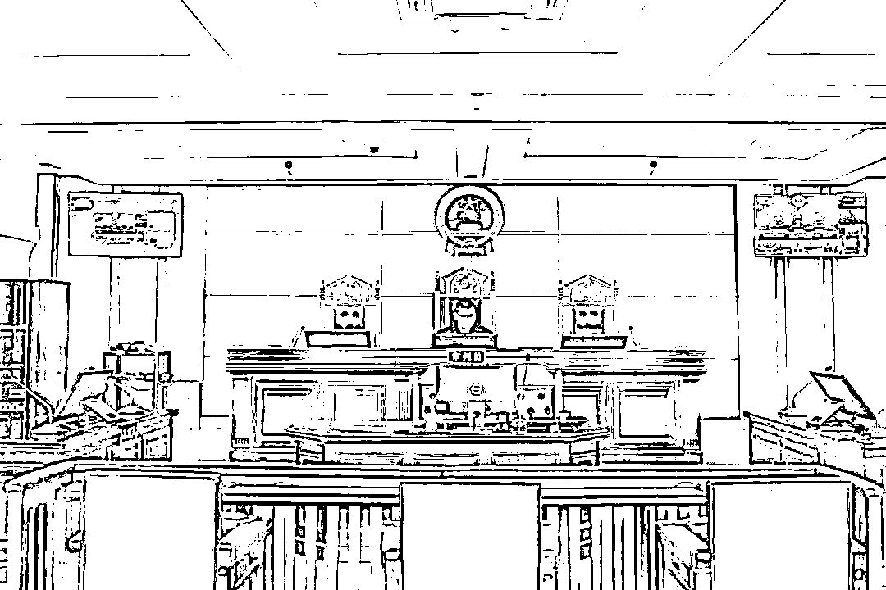

# 和相亲对象分手后，小伙又收到了红娘的表白…

> 原文：[`mp.weixin.qq.com/s?__biz=MzIyMDYwMTk0Mw==&mid=2247534718&idx=7&sn=a0b3302781b056cae68c434a6a4b7535&chksm=97cb8346a0bc0a507631c2902713739eb8c5d908fc8017c93be4fb7fbd8575c1754c2ee8e9a1&scene=27#wechat_redirect`](http://mp.weixin.qq.com/s?__biz=MzIyMDYwMTk0Mw==&mid=2247534718&idx=7&sn=a0b3302781b056cae68c434a6a4b7535&chksm=97cb8346a0bc0a507631c2902713739eb8c5d908fc8017c93be4fb7fbd8575c1754c2ee8e9a1&scene=27#wechat_redirect)

29 岁的小姜来嘉兴海宁工作好多年

眼看工作蒸蒸日上

却一直没有遇到心仪的女孩

机缘巧合之下

小姜认识了自称做婚介的谷某

并托她为自己

介绍合适的对象

不久，谷某就为小姜介绍了一位名叫“李媛”的女孩，看着照片里漂亮的姑娘，小姜瞬间动了心，于是马上向谷某讨要李媛的联系方式。

但谷某表示，**要先收取小姜 6000 元的婚介服务费。**为了得到李媛的联系方式，小姜毫不犹豫地向谷某转了钱。

收到钱后，谷某就把李媛的微信推送给了小姜，此后，两人便通过微信聊了起来。为了能早日和李媛确立恋爱关系，**小姜多次向李媛转账 520 元、1314 元以表达爱意。**

两人的感情迅速升温，不久便通过微信确立了恋爱关系。在之后的相处中，李媛时不时以要礼物、买化妆品等理由向小姜讨要金钱，而坠入爱河的小姜为了讨女朋友的欢心，每次都会满足李媛的要求，并时不时主动发红包给女友惊喜。

交往一段时间后，小姜开始不满足于微信聊天，就向李媛提出了见面，但李媛一直以各种借口推脱拒绝，这让小姜觉得，李媛根本不是真心与自己交往，一气之下，小姜拉黑了李媛的微信。

这时，“红娘”谷某主动找上了小姜，但她并不是为了了解小姜与李媛的发展情况，而是向小姜表达了自己对他的好感，希望能和他处对象。刚“失恋”的小姜拒绝了谷某。

没过几天，谷某又告诉小姜自己的生日到了，希望小姜能给她发红包，再次遭到拒绝后，谷某拉黑了小姜。

此时，小姜回想起谷某与李媛的聊天语气和讨要红包的方式，发现两人极其相似，怀疑自己遭到了欺骗，于是向派出所报了案。

经调查，**谷某和“李媛”竟是同一人。**原来，“李媛”是谷某为了骗取小姜钱财而杜撰出来的人物，照片也是谷某盗用了之前工作过的婚介所内相亲人员的照片。

谷某利用自己注册的微信小号假扮“李媛”与小姜交往并建立恋爱关系，过程中编造了购买礼物等各种理由骗取小姜钱款 2 万余元。案发后，谷某退赔了小姜损失 3 万元，并取得了谅解。

最终 

**谷某被海宁法院**

**以诈骗罪判处**

**有期徒刑 9 个月**

**缓刑 1 年 6 个月**

**并处罚金人民币 1 万 5 千元**

来源 ： 潇湘晨报，海宁法院，潇湘晨报

<mpvideosnap class="js_uneditable custom_select_card channels_iframe videosnap_video_iframe" data-pluginname="videosnap" data-id="export/UzFfAgtgekIEAQAAAAAArdcCcf6pYwAAAAstQy6ubaLX4KHWvLEZgBPE4aN8PkE3YKn8zNPgMIuPFUYsUBnFUTSzPPXE9uVn" data-url="https://findermp.video.qq.com/251/20304/stodownload?encfilekey=S7s6ianIic0ia4PicKJSfB8EjyjpQibPUAXol1qzWCY02elmJYM7Pp7icpoJRibZfO1LSNecDgcWnqDQTLz79PFcgaQSCEt3j3wmf46ELkgzjG9y1qlgzZsBoico7Q&amp;adaptivelytrans=0&amp;bizid=1023&amp;dotrans=0&amp;hy=SH&amp;idx=1&amp;m=&amp;scene=0&amp;token=x5Y29zUxcibC18vc7HiaolYT5ia9PhYRFXwAViaPmW4MVuw1RVv3I0Puj65dMGQibgkueQib3b6TcRt84" data-headimgurl="http://wx.qlogo.cn/finderhead/ibq4aVwOt6HNqrr8OD3sCviaytF3B8TqCwHicxsuIanAJo/0" data-username="v2_060000231003b20faec8c6e48a1acbd3ce04ef33b077a1e41d0d3794ed88ea537878dbe65910@finder" data-nickname="灰产圈+" data-desc="网络赌博“杀猪盘”,有人输掉 500 万,到最后人财两空!@灰产圈

" data-nonceid="15405366271152267755" data-type="video" data-width="1280" data-height="720"></mpvideosnap>

← 向右滑动与灰产圈互动交流 →

