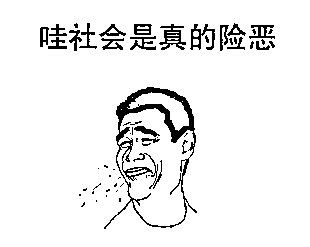

# 虚拟货币诈骗新手段：通过交易手续费就能骗空你的资产？

> 原文：[`mp.weixin.qq.com/s?__biz=MzIyMDYwMTk0Mw==&mid=2247534718&idx=8&sn=ec6809d3ca22fa634248e427474c7f73&chksm=97cb8346a0bc0a50e21120a3d1f4873a312d83b0bfd99a3c6d53f43a48989fefb13c004b87e5&scene=27#wechat_redirect`](http://mp.weixin.qq.com/s?__biz=MzIyMDYwMTk0Mw==&mid=2247534718&idx=8&sn=ec6809d3ca22fa634248e427474c7f73&chksm=97cb8346a0bc0a50e21120a3d1f4873a312d83b0bfd99a3c6d53f43a48989fefb13c004b87e5&scene=27#wechat_redirect)

***“终于要财富自由了”***

***“这才几个眨眼功夫怎么就又被割了呢？***”

应该很多币圈人都会有这样的经历

虚拟货币的致富效应

让人很难忽视他的吸引力

但绝大多数投资者都被“割韭菜”了

或者都曾被“割过韭菜”

有人会说：我已经够警惕了

为什么还会被骗？

因为

有些骗局可能不是因为你够警惕 

就能发现的和逃离的 

**比如在项目代码中预设的“陷阱”**

如果不是经验老到的专业技术人员 

可能永远无法在事前就察觉到风险

今天的分享

我们换个角度

以一个修改手续费诈骗新手段为例

看看**骗子是怎么从代码设计初期**

就准备好了收割用户的陷阱

**01**     

虚拟货币交易时收取一定的手续费是很正常的现象，但是如果一个项目在你交易了 100 个代币时就被收取了 99 个代币的“手续费”，可就是明目张胆的诈骗了！ 

而这又是如何实现的呢？**骗子在项目设计初期**，**就在项目代码中设置了隐藏的可修改的交易手续费**。你被告知或者看到的交易费用和实际被收取的交易费用可能完全是两码事。

这里，我们通过一个此类诈骗项目，来看看这类骗子项目方都是怎么在代码中预埋“炸弹”的。

通过检查项目的合约代码，发现：有一个 _transfer 函数，这是一个根据智能合约标准的标准函数，但是这个函数会从你的“ totalSUPERHEROE ”中收取一些“费用” ，**即在项目交易中会从拥有的代币数量中扣除一些费用。**

**然后，在合约中设置了允许项目方对费用修改的代码**，这个“费用”变量是通过“ _setTaxFee ”函数设置的；

同时，在合约中还隐藏了一个“aprove”函数，以冒充合法的函数“approve”。

他们一开始将手续费为“8”，即交易 100 个代币，需付出 8 个代币的手续费；

但是，后面就通过上面我们说的预埋的可修改交易费的设置，将交易手续费偷偷的修改成“99”。 

这样，如果你购买 100 个代币，就只能收到 1 个代币；而如果你出售 100 个代币，购买方也只能收到 1 个代币。

这类骗局可能还比较少见，但确实真实存在了，而且隐蔽性非常强，极容易导致投资者中招。

**修改交易手续费，并不是骗子唯一可以在项目代码中做的手脚，还有以下这些“骚操作”，同样让人防不胜防。** 

**02**     

这种骗局手法，也是骗子在项目设计初期的代码中就设置好的。

**骗子在项目开发初期就在代码中，设置了允许项目方铸币增发的功能**。项目方可能在币价上涨到一定程度后（可能会通过拉盘等手段拉升币价），**通过隐藏的铸币功能，突然大量增发代币，然后迅速抛售代币跑路**，大量代币抛售必然导致币价下跌，那些在高位入场的投资者只能充当接盘侠被割韭菜。

这类陷阱是骗子惯会采用的一种诈骗手段，**而且这个后门还极容易被黑客利用**，如果黑客利用漏洞增发抛售跑路，最终损失的还是只有用户。

**03**     

看着币价一路上涨，你以为这一次终于可以实现财富自由了。

当你准备落袋为安，出售代币时，才发现：咦，怎么没办法出售呢？多次尝试后，一个念头猛然冒出来：难道这次又要被割了？

非常正确！你一入场，就意味着被收割了！因为项目方早在项目设计初期，**就在代码中进行了普通用户不可出售代币的设置**，只有项目方拥有出售代币资格。

这类项目迷惑性非常大，一些圈内大佬也同样可能中招。 

图片来源于推特，已获得作者授权 

**写这篇文章的初衷，是想要告诉大家，骗子总会应用各种新手段、新方式来实施诈骗。**在虚拟货币里，骗局无处不在，就像这些一开始就埋藏在代码中的“地雷”一样，用户很难发现，最后就只有被骗。

**我们想要赚自己认知外的钱就需要承担更大的风险，**希望大家树立正确的投资观，都能守好自己的钱袋子，不再被骗！

参考资料：《Scammers are creating new fraudulent Crypto Tokens and misconfiguring smart contract’s to steal funds》

来源：七星实验室

<mpvideosnap class="js_uneditable custom_select_card channels_iframe videosnap_video_iframe" data-pluginname="videosnap" data-id="export/UzFfAgtgekIEAQAAAAAAUOYp0g7hgwAAAAstQy6ubaLX4KHWvLEZgBPE4aNQRRZ7Yan8zNPgMIvraeJ35kfX2pBlMjCZqrym" data-url="https://findermp.video.qq.com/251/20304/stodownload?encfilekey=rjD5jyTuFrIpZ2ibE8T7YmwgiahniaXswqzurmbN2J3phlxfYfebBa66pMzCu3E3KicpsIfk8WutGtVtAuxqvB39ZZfPPS2fzUDCty5lZA2dqmnz7iahlzg2a9A&amp;adaptivelytrans=0&amp;bizid=1023&amp;dotrans=0&amp;hy=SH&amp;idx=1&amp;m=&amp;scene=0&amp;token=AxricY7RBHdUSxlePSrXOqMvafo9drZWpu64h0zj1zadibhM6D6y7EhKZfT97vTia3nCFpMa21I1y8" data-headimgurl="http://wx.qlogo.cn/finderhead/ibq4aVwOt6HNqrr8OD3sCviaytF3B8TqCwHicxsuIanAJo/0" data-username="v2_060000231003b20faec8c6e48a1acbd3ce04ef33b077a1e41d0d3794ed88ea537878dbe65910@finder" data-nickname="灰产圈+" data-desc="赌博究竟有多可怕？崩坏的金钱观，是怎样致赌徒于死地的？@灰产圈

" data-nonceid="5201896141886472719" data-type="video" data-width="1280" data-height="720"></mpvideosnap>

← 向右滑动与灰产圈互动交流 →

