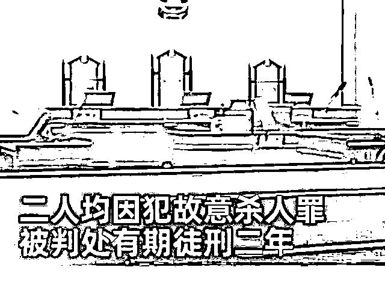

# 女子出轨后多次给饮酒丈夫下头孢：大郎，该吃药了

> 原文：[`mp.weixin.qq.com/s?__biz=MzIyMDYwMTk0Mw==&mid=2247534787&idx=2&sn=91d8fdb1d45efcdfde8ab3f296f8ea4b&chksm=97cb83fba0bc0aed3dbffe41d0ab13548ece52895a1d1637061f51bba2259468a40ce5bf7471&scene=27#wechat_redirect`](http://mp.weixin.qq.com/s?__biz=MzIyMDYwMTk0Mw==&mid=2247534787&idx=2&sn=91d8fdb1d45efcdfde8ab3f296f8ea4b&chksm=97cb83fba0bc0aed3dbffe41d0ab13548ece52895a1d1637061f51bba2259468a40ce5bf7471&scene=27#wechat_redirect)

图源丨电视剧《水浒传》 

去山里抓只鸟，可能都比这判的多。

近日，河南省正阳县人民法院公布了一刑事判决书：

河南一女子黄某某为达到与情人闵某某共同生活的目的，竟与情人预谋杀害丈夫。

小学文化的黄某某和初中文化的闵某某商量，**在黄某某丈夫喝酒时，偷偷给他吃头孢，这样就可以把黄某某丈夫弄死，还让人查不出来，**两人好长期共同生活。

我第一反应就是《水浒传》里潘金莲的那句台词：**大郎，起来喝药了。**

**情节几乎一样，不就是潘金莲与西门庆密谋毒害武大郎。** 

只是现实中没了武松，但法律是武松。

**万幸的是， 头孢配酒，黄某某的丈夫并没有说走就走。**

而是被家人及时送医抢救，丈夫没被毒死。

紧接着，两人的企图杀害他的事情也暴露。

还真有人能想出这种方法来杀人？

黄某某和闵某某真对得起两个人的学历！

搞笑的是，我起初以为这对渣男渣女是真爱，结果警察一审，互相甩锅对方是主犯：

闵某某辩解下药是黄某某提出的，药是黄某某购买，黄某某辩解药是闵某某让其购买并威胁其去下药。

法官可不认可这一套，经查证，双方聊天记录显示，二人在共同犯罪中均积极实施，没有谁强迫谁，也没有谁指使谁，两人均系主犯。 

法院审理后，鉴于两人认罪认罚，具有坦白情节，且没有造成严重后果，属于犯罪未遂，最终分别判了两人 2 年有期徒刑。

<mpvideosnap class="js_uneditable custom_select_card channels_iframe videosnap_video_iframe" data-pluginname="videosnap" data-id="export/UzFfAgtgekIEAQAAAAAAihYHavPTewAAAAstQy6ubaLX4KHWvLEZgBPE-qNceQ0JJPmDzNPgMIvUzU82wXu51FV-rcC-OeVU" data-url="https://findermp.video.qq.com/251/20304/stodownload?encfilekey=rjD5jyTuFrIpZ2ibE8T7YmwgiahniaXswqzcXWZh4MWfmPraPaiam3yG0YcqWDCvB7GEHOjY8cd5jvYxbiaqSiahKg6XBEpAAeKsGE9FdRPiaicM81SYfn2RRMPMpA&amp;adaptivelytrans=0&amp;bizid=1023&amp;dotrans=0&amp;hy=SH&amp;idx=1&amp;m=&amp;scene=0&amp;token=AxricY7RBHdV1ketQdCIDhribibZRojkw4F8FvnXuj0jmjGTfJeODdPgKaDz9bkuOzFX64B95cQ7Kg" data-headimgurl="http://wx.qlogo.cn/finderhead/ibq4aVwOt6HNqrr8OD3sCviaytF3B8TqCwHicxsuIanAJo/0" data-username="v2_060000231003b20faec8c6e48a1acbd3ce04ef33b077a1e41d0d3794ed88ea537878dbe65910@finder" data-nickname="灰产圈+" data-desc="【#51 岁女子与情人预谋杀丈夫# 多次给饮酒丈夫下头孢】据@星视频 报道：近日，河南正阳县法院公布了一起案件的一审刑事判决书，判决书显示：被告人闵某某与被告人黄某某系情人关系，两人为达到共同生活目的，预谋杀掉黄某某的丈夫闵某。期间闵某某、黄某某多次购买头孢药物，并由黄某某在其丈夫闵某饮酒时，将头孢药物放到闵某所吃的饭中，欲致闵某死亡。法院认为：被告人闵某某、黄某某为达到一起生活的目的共谋杀人，其行为均已构成故意杀人罪，二人均因犯故意杀人罪，被判处有期徒刑二年。@灰产圈+ " data-nonceid="15426485084631124455" data-type="video" data-width="3840" data-height="2160"></mpvideosnap>

果然，西门庆和潘金莲最终都没有好下场。 

**这个案子我最不能理解的是：侥幸逃过一劫的大郎给潘金莲写谅解书。**

**对不起，我想杀你，但是没杀死你，你能不能原谅我。**

万一要是这次没救过来呢？你到阎王爷那去谅解她？

轻判犯罪嫌疑人，被害人出具谅解书。

无论从道德上还是法律上来看，判两年都是槽点满满。

若毒杀成功，这个丈夫真的就是白死了。

他喝酒，吃头孢，都是他的自主行为，反正死人又不会说话。

在现实生活当中，这样的新闻还是很多，搜索栏里一找就是一堆，看起来就让人头皮发麻。

十年修得同船渡，百年修得共枕眠。

都说婚姻是爱情的坟墓，是夫妻的炼狱场。

没有人能够保证夫妻双方能够一直保持高涨的热爱，但是可以保持良好的沟通。

**有突然的喜欢，但没有突然的放弃。**

**可以分开，但请不要背叛 。**

**可以不爱，但请不要伤害。**

来源：昌南大队长

← 向右滑动与灰产圈互动交流 →

