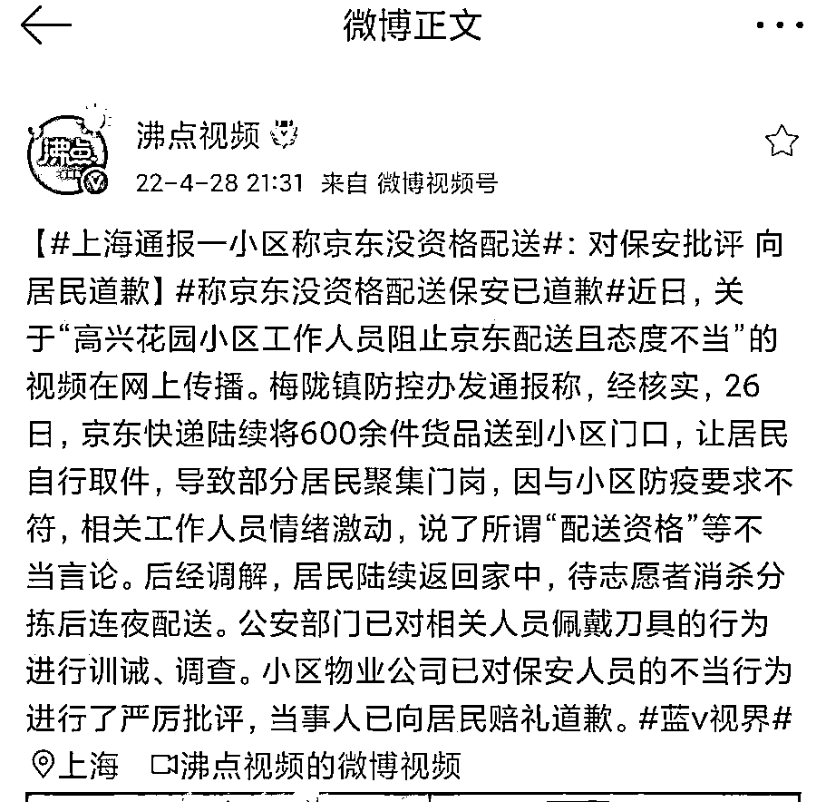

# 上海一小区不让京东快递在门口卸货，小区物业狐假虎威，还有人带了刀

> 原文：[`mp.weixin.qq.com/s?__biz=MzIyMDYwMTk0Mw==&mid=2247534787&idx=3&sn=a9d0fc9f301c55356cf6ee247c6e8e32&chksm=97cb83fba0bc0aed05f6919b19eb7d9749fabaa3fb9eca0d991f706d1f35b9bff072cade1347&scene=27#wechat_redirect`](http://mp.weixin.qq.com/s?__biz=MzIyMDYwMTk0Mw==&mid=2247534787&idx=3&sn=a9d0fc9f301c55356cf6ee247c6e8e32&chksm=97cb83fba0bc0aed05f6919b19eb7d9749fabaa3fb9eca0d991f706d1f35b9bff072cade1347&scene=27#wechat_redirect)

4 月 27 日，微博上一则名为上海一小区称京东没资格送货的视频引发关注。视频中，京东快递小哥将货送到某小区门口，有居民前去领取，但遭到疑似小区物业和保安人员的严厉制止。 相比之下该小区的团购能正常卸货 居民怀疑其中有利益矛盾。

上海赌咒发誓“打通最后一公里”，一个多月了，现在才打通九百米……
解决了货源，解决不了物流；
解决了物流，解决不了分发；
解决了分发，解决不了社区保安……
还差这一百米！

[`v.qq.com/iframe/preview.html?width=500&height=375&auto=0&vid=n3334cpnz22`](https://v.qq.com/iframe/preview.html?width=500&height=375&auto=0&vid=n3334cpnz22)

有位保安大爷一语道破最近的防疫乱象 

27 日晚，小区所属的闵行区梅陇镇反馈说，经了解，4 月 26 日京东陆续送达 600 余份快递至梅陇镇高兴花园小区门口，快递小哥打电话让居民自行到门口取件，导致部分居民违反“足不出户”要求，聚集到门岗。

　　梅陇镇方面表示，视频中反映的实际情况是，小区志愿者及保安对取件或聚集的人群紧急劝返，双方情绪较为激动。4 月 26 日晚，经居委会与京东相关点位负责人沟通，为京东招募到 3 名配送人员，注册好了京东旗下达达配送，可提供小区内配送服务。

对网传居委替代京东招募人员的情况。经与京东方面核实，4 月 15 日，京东已通过市人社局官方平台启动招募工作，有 3 位居住在该小区的人员参与报名。经京东资格审核，已于 4 月 27 日上岗并在该小区开展配送工作。居委未参与相关招募工作。

4 月 27 日该小区已经完成了京东全部订单的配送。

* * *

新熵:希望上海这波疫情赶紧结束～ 

小小的大秘密:看人是女孩子，摆出了暴力威胁的架势

徴胤:防控权力下放到基层以后，一定要做好配套的讲解和告知义务，警惕权利滥用的行为。某些人只行使权利，却对“协议”闭口不谈，没有“义务”解释，这是不对的。

来源：微博那些事儿

<mpvideosnap class="js_uneditable custom_select_card channels_iframe videosnap_video_iframe" data-pluginname="videosnap" data-id="export/UzFfAgtgekIEAQAAAAAAc2Qm_dWu4wAAAAstQy6ubaLX4KHWvLEZgBPEz6MEEW9pU_iDzNPgMIui4sJaWenRSK0R0IL0Nf5Q" data-url="https://findermp.video.qq.com/251/20304/stodownload?encfilekey=rjD5jyTuFrIpZ2ibE8T7YmwgiahniaXswqzyk6hjtn3y1YRv28kJEHp8CiaZD3ctjggSaVPbfKN0QibBAl42NBHY2b67qVPcjLcjvXOrxqbYiaabrRcukiabx31dg&amp;adaptivelytrans=0&amp;bizid=1023&amp;dotrans=0&amp;hy=SH&amp;idx=1&amp;m=&amp;scene=0&amp;token=x5Y29zUxcibCShyvoxSC6N1BouXgp013WwfgPNAjN5NWx8TQibcagTpCEhOlnic6uua2ialyW3lIEA0" data-headimgurl="http://wx.qlogo.cn/finderhead/ibq4aVwOt6HNqrr8OD3sCviaytF3B8TqCwHicxsuIanAJo/0" data-username="v2_060000231003b20faec8c6e48a1acbd3ce04ef33b077a1e41d0d3794ed88ea537878dbe65910@finder" data-nickname="灰产圈+" data-desc="【上海：物资卖着卖着就抢了？】上海网友曝料：“上海嘉定马陆包装城抢菜视频，定价 55 蔬菜包，前面还排队买，后面直接开抢" data-nonceid="2897369712597241329" data-type="video" data-width="2160" data-height="3804"></mpvideosnap>

← 向右滑动与灰产圈互动交流 →

