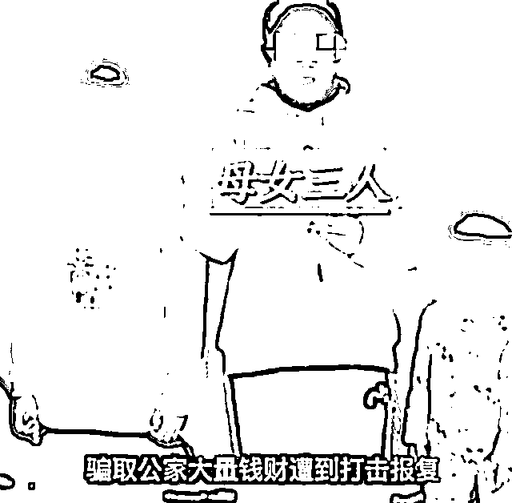

# 河北一女子举报丈夫勾结国企高管骗国家资金

> 原文：[`mp.weixin.qq.com/s?__biz=MzIyMDYwMTk0Mw==&mid=2247534787&idx=4&sn=8b3d418242bed5f412b4dd4a6277fb15&chksm=97cb83fba0bc0aed72c9670a381516bafda11093d66dac06b1fbdc7de6cfaefc9cfe8e81307c&scene=27#wechat_redirect`](http://mp.weixin.qq.com/s?__biz=MzIyMDYwMTk0Mw==&mid=2247534787&idx=4&sn=8b3d418242bed5f412b4dd4a6277fb15&chksm=97cb83fba0bc0aed72c9670a381516bafda11093d66dac06b1fbdc7de6cfaefc9cfe8e81307c&scene=27#wechat_redirect)

**近日，河北唐山一女子在网络实名举报老公连同叔公与某国企高管里应外合骗取国家资金，其称 2019 年老公抛妻弃女，两个女儿如今无学可上。** 

**28 日，当事人景某告诉记者，她和丈夫目前还没有办理离婚手续，因经济窘迫，10 岁的女儿目前辍学在家。而其丈夫李某则表示，他并没有进行财产转移。** 

****

**当事人实名举报视频截图**

**网传举报视频中，景某自称是河北唐山人，举报丈夫李某、叔公李某申与某国企大型钢厂领导里应外合，骗取大量资金。并称在她患病期间，丈夫的家人转移了房、车等夫妻共同财产，她丈夫在 2019 年抛弃妻女，3 年多未看望也未负担过任何费用等。**

****

**当事人实名举报视频截图**

**“2019 年我被起诉离婚，3 年多了一直没有结果。”4 月 28 日，景某告诉记者，目前她还没有和丈夫离婚，法院前两次都没判离，丈夫提起了上诉。被起诉离婚三年多来，丈夫从未看望过两个女儿，更没有支付过她们的抚养费。目前，她只能靠借钱养活自己和两个女儿，因为经济压力太大，10 岁的女儿只能辍学在家。**

**28 日，景某的丈夫李某告诉记者，他与妻子离婚的原因是夫妻关系不和，他并非不愿意看望女儿，而是妻子不让他和两个女儿见面。他只是一个普通员工，不存在转移财产的问题，而且工作期间的工资也大都给了妻子，其现在是想通过举报在离婚诉讼中争取更多的赔偿。**

**28 日，记者致电唐山市路北区妇联，工作人员表示，他们已经介入此事。今年 3 月，他们还上门对景某进行了慰问，并帮助协调解决孩子的上学问题。**

**另据九派新闻报道，28 日记者电话联系了唐山市宣传部，对方称对此事暂不知情，将介入了解。**

**<mpvideosnap class="js_uneditable custom_select_card channels_iframe videosnap_video_iframe" data-pluginname="videosnap" data-id="export/UzFfAgtgekIEAQAAAAAAw_os1f_h8QAAAAstQy6ubaLX4KHWvLEZgBPEyqNYABVnJPmDzNPgMIurpcGyxV-hGGi7Ao_q84AM" data-url="https://findermp.video.qq.com/251/20304/stodownload?encfilekey=rjD5jyTuFrIpZ2ibE8T7YmwgiahniaXswqzVW8q6ib5X2t9Qicia4eZgyGzkT2oeR4cryMP6vzEGfic7mRoniaNbsiaw0LMeb77z6cz61bKKBsbYteXiaMl2sv4aA8lQ&amp;adaptivelytrans=0&amp;bizid=1023&amp;dotrans=0&amp;hy=SH&amp;idx=1&amp;m=&amp;scene=0&amp;token=AxricY7RBHdV1ketQdCIDhrIOmVTqZprL7aMJ3KkBMewvqFstSKsolwdibr3d2Q1wa6JHO9q5cSc0" data-headimgurl="http://wx.qlogo.cn/finderhead/ibq4aVwOt6HNqrr8OD3sCviaytF3B8TqCwHicxsuIanAJo/0" data-username="v2_060000231003b20faec8c6e48a1acbd3ce04ef33b077a1e41d0d3794ed88ea537878dbe65910@finder" data-nickname="灰产圈+" data-desc="【#妻子举报丈夫勾结国企高管骗国家资金# 生了 2 个女儿后被抛弃】4 月 25 日，河北唐山一女子在网络实名举报老公连同叔公与某国企高管里应外合骗取国家资金，其称 2019 年老公抛妻弃女，两个女儿如今无学可上。视频中举报人景女士带着两个孩子跪在床上，举着自己的身份信息称老公家重男轻女，自己生了两个女儿后被抛弃，2019 年至今，三年多孩子爸爸未看望过，也不支付生活费用，母女三人无经济来源，靠借钱度日，孩子也没有上学。28 日，记者电话联系了唐山市宣传部，对方称对此事暂不知情，将介入了解。@灰产圈+ " data-nonceid="16418208054398652411" data-type="video" data-width="3836" data-height="2160"></mpvideosnap>**

**来源：极目新闻、九派新闻、百姓关注，巴蜀反诈**

****

**← 向右滑动与灰产圈互动交流 →**

****