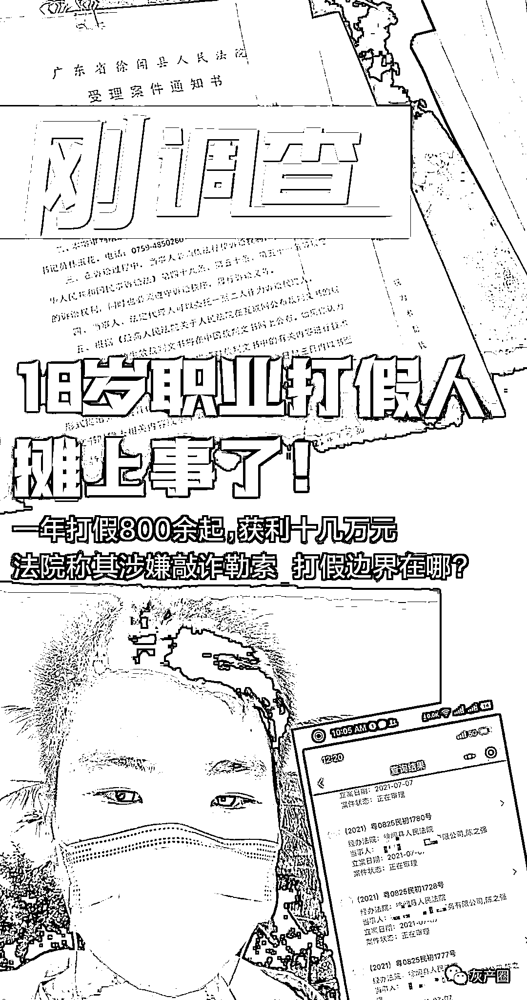
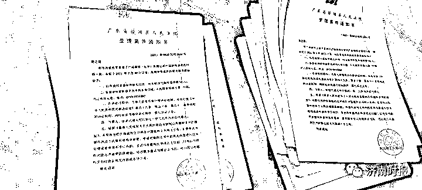
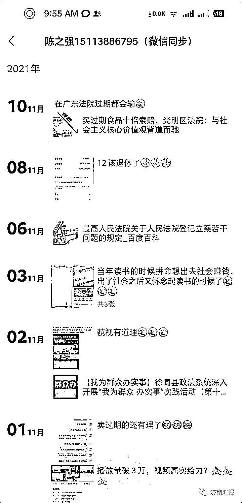
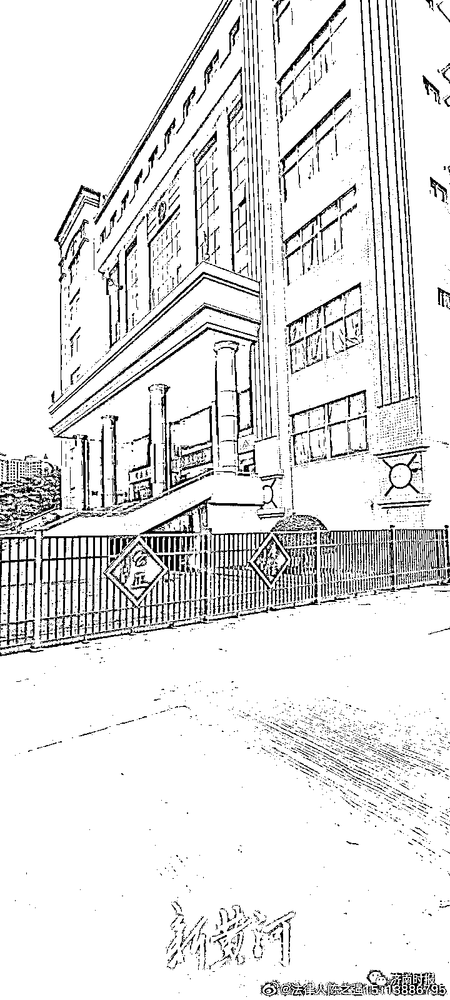
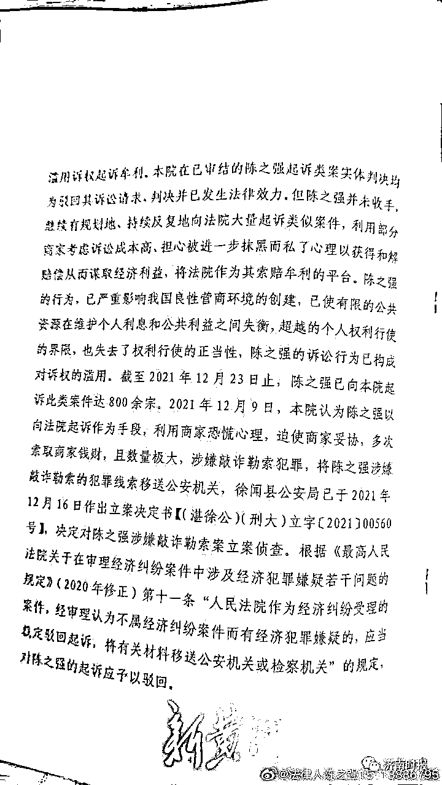
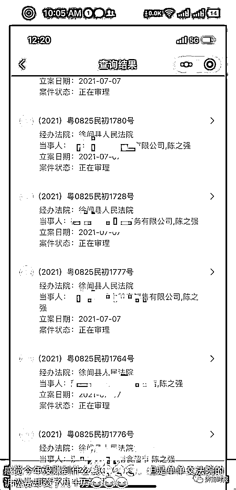

# 一年打假 800 余起，获利十几万，18 岁“打假人”涉嫌敲诈勒索被立案

> 原文：[`mp.weixin.qq.com/s?__biz=MzIyMDYwMTk0Mw==&mid=2247534787&idx=5&sn=b4f0eccc1d0a33efaa4db6233ec4a5db&chksm=97cb83fba0bc0aedad527d9d13cc1e1e255676d41374b7d5e8b78b42469215f3e7dc1e438fe7&scene=27#wechat_redirect`](http://mp.weixin.qq.com/s?__biz=MzIyMDYwMTk0Mw==&mid=2247534787&idx=5&sn=b4f0eccc1d0a33efaa4db6233ec4a5db&chksm=97cb83fba0bc0aedad527d9d13cc1e1e255676d41374b7d5e8b78b42469215f3e7dc1e438fe7&scene=27#wechat_redirect)

18 岁的“打假人”陈之强摊上事儿了。

陈之强算是国内年龄最小的“职业打假人”。2021 年 2 月，刚过完 18 岁生日的陈之强便开启了打假的职业生涯。不到一年时间，他已跟商家打了 800 多场官司，获利十几万元。然而，“打假”职业带给他的不只是高额收益，恐怕还有牢狱之灾。2021 年 12 月 27 日，受理过陈之强 800 多场诉讼案件的广东省徐闻县人民法院，认为陈之强行为已涉嫌敲诈勒索犯罪，将其犯罪线索移送公安机关，徐闻县公安局已决定对其立案侦查。

打假把自己打成“犯罪嫌疑人”，刚刚成年不久的陈之强，这下子彻底慌了。

[`mp.weixin.qq.com/mp/readtemplate?t=pages/video_player_tmpl&action=mpvideo&auto=0&vid=wxv_2207727695331917827`](https://mp.weixin.qq.com/mp/readtemplate?t=pages/video_player_tmpl&action=mpvideo&auto=0&vid=wxv_2207727695331917827)

01:19

**“打假不是谈恋爱，就是为了挣钱”**

人在 18 岁的年纪，往往会选择做自己喜欢的事情，陈之强是个特例。他在 18 岁的时候，给自己挑选了一件“成人礼”——成为打假人。陈之强毫不避讳地说，打假不是谈恋爱，他不是喜欢才干这个，他纯粹就是为了挣钱。

2003 年 1 月 28 日出生的陈之强，目前长住广东省湛江市徐闻县。他的家庭条件一般，父亲是一名司机，母亲待业在家，家中还有弟弟妹妹尚未成年。陈之强高中还没毕业，就开始为生计发愁，他最终发现了一条挣钱的门路——打假维权。“前几年就对这行业有所关注，因为很多商家谋求暴利，或多或少都会存在问题。我搜集了一些相关案例和资料，学习跟法律诉讼有关的知识，然后就等着成年以后，成为一名职业打假人。”陈之强告诉新黄河记者，去年 2 月，在过完 18 岁生日之后，他便以一个“成年人”身份走上了打假之路。

对于自己的第一起打假官司，陈之强仍记忆犹新。“当时是在徐闻县的一家小超市，我买到了一件过期食品，然后向法院提起诉讼，经法院调解后，对方赔偿了我 500 块钱。”初战告捷的陈之强，开始更加频繁地进行打假维权行动。为了提高打假效率，他将目标从线下转为线上，瞄准了几大电商平台。陈之强发现，很多电商平台的店铺存在大量的灰色地带：假货、虚假宣传、缺少产品合格证、进口产品没有质检报告等等。按照《消费者权益保护法》，如果商家提供的商品或者服务有欺诈行为，则需要“退一赔三”；按照《食品安全法》，如果卖家生产、销售不符合食品安全标准的食品，给消费者造成损害，则应该“退一赔十”。

在陈之强看来，成为一名职业打假人并不难，只要研究好相关政策法规、掌握了举报、诉讼的流程，打假的成功率就能变得很高。他的打假对象并不固定，只要发现商家有问题便会打，目的就是获得惩罚性赔偿。在陈之强的印象中，最高的一笔打假获利有 5000 元。对方是一家经营熟食的电商，因为食品流通许可证涉嫌造假，陈之强在发现该问题后，以消费者的名义购买产品，然后联系商家要求退赔，在遭到对方拒绝后，陈之强向法院提起诉讼并向工商执法部门投诉，最终在法院的调解下，成功获赔 5000 元。

**一年里打假 800 余起，每月收入过万元**

在过去的一年里，陈之强过得相当忙碌。翻看他的朋友圈和个人微博，他每天都忙着写诉讼材料、开庭，桌子上摆放着厚厚一摞的诉状，像极了一个法律人士。

除了个人打假，他也尝试做起“收徒”的业务，开设打假维权交流群，收取 388 元学费教授别人如何职业打假，有家公司甚至有意聘请他当法律顾问。闲暇之余，他还跟一位网友打了一场侵犯自己名誉权的官司，因为对方在群里进行言语辱骂。靠着职业打假，**陈之强自称，目前每个月有过万元的收入，11 个月以来差不多挣了十几万元。**

陈之强说，自己所有的“打假”诉讼官司均由当地的徐闻县人民法院受理，2021 年总共打了八百多场官司，但大部分被法院驳回了起诉请求。法院驳回的理由几乎一模一样：综合本案及原告陈之强起诉的其他案件事实，原告的购买行为显然并非为生活消费需要，而是出于“买假索赔”的牟利行为，属于“职业打假人”，可以认定陈之强系以牟利为目的而购买涉案产品，其购买行为不符合法律规定的消费者的购买行为，其起诉要求惩罚性赔偿不符合法律规定，本院不予支持。

不过，除了被驳回起诉的案件，还有两三百场官司，陈之强成功与对方达成了和解协议，在拿到“和解费”后选择撤诉。“对于一些商家来说，因为知道自己产品有问题，为了避免 10 倍赔偿、耗时间走司法程序，往往会选择双方‘和解’这种处理方式，这也是打假这个行业的主要收入来源。”陈之强解释说。

**法院认为涉嫌敲诈勒索，将犯罪线索移送公安**

2021 年 12 月 27 日，陈之强突然收到来自徐闻县人民法院的一份《民事裁定书》，直接吓出了一身冷汗。

这原本是一起普通的“打假”官司。作为原告的陈之强，起诉珠海一家食品公司旗下电商销售的罐装食品未能提供产品质量检验合格证明，向商家要求索赔。法院像往常一样，驳回了陈之强的诉讼。不过，这一次的《民事裁定书》上还另外增加了几大段内容：陈之强自 2021 年 2 月以来在网购平台以较少金额(几元至几十元不等)的价款购买各类初级农产品、深加工食品及其他产品等。尔后以该产品不符合国家食品安全标识的规定、无产品质量检验合格证书、产品过期等事由，恶意向网购平台中的商家索赔，并滥用法律惩罚性赔偿规则请求商家赔偿，滥用诉权起诉牟利。本院在已审结的陈之强起诉类案实体判决均为驳回其诉讼请求。但陈之强并未收手，继续有规划地、持续反复地向法院大量起诉类似案件，利用部分商家考虑到诉讼成本高、担心被进一步抹黑而私了的心理以获得和解赔偿从而谋取经济利益，将法院作为其索赔牟利的平台。陈之强的行为已严重影响我国良性营商环境的创建，已使有限的公共资源在维护个人利益和公共利益之间失衡，超越了个人权利行使的界限，也失去了权利的正当性，陈之强的行为已构成了对诉讼权利的滥用。

之后，《民事裁定书》中继续写道：“截至 2021 年 12 月 23 日止，陈之强已向本院起诉此类案件达 800 余宗。2021 年 12 月 9 日，本院认为陈之强以向法院起诉作为手段，利用商家恐慌心理，迫使商家妥协，多次索取商家钱财，且数量极大，涉嫌敲诈勒索犯罪，将陈之强涉嫌敲诈勒索的犯罪线索移送公安机关，徐闻县公安局已于 2021 年 12 月 16 日作出立案决定书。决定对陈之强涉嫌敲诈勒索立案侦查。”

陈之强表示，以前诉讼时从未遇到这种情况，法院都正常受理案件，这次的诉讼一开始就颇为蹊跷。“这次我提起诉讼时，审判长张某找过我，让我直接撤诉，还说自己以前是办理刑事案件的，如果我不撤诉就把我移送到公安机关。这一次的诉讼也没走正常流程，甚至都没给被告方发传票过去。”陈之强认为，诉讼是自己正常行使的权利，法院可以驳回起诉，商家也可以起诉自己，但徐闻县法院认为自己涉嫌敲诈勒索，此举实在不能理解，“如果法院认为我涉嫌敲诈勒索，为何不在第 10 场、100 场时就认定，一直等到 800 多场才认定?”

2022 年 1 月 1 日，新黄河记者致电审判长张某了解情况。张某告诉记者，陈之强的行为跟一般打假行为不同，他买到的东西不管真假都去起诉，利用法院这个平台，把传票寄给商家，跟对方索要赔偿，具体理由已经都在判决书上写清楚了。“他还跟我们法院说，一年要打一万起官司，十年要打十万起。”

**职业打假的“罪与罚“，法律界限在哪儿?**

近几年，由于加大了《消费者权益保护法》《食品安全法》惩罚性赔偿的宣传，全国各地涌现出一大批“职业打假人”，导致法院审理的类似案件大量增加。在审理”职业打假人“提起的诉讼案件时，有的法院表示支持，也有些法院不支持这种赔偿，以减少类似案件的受理。不过，类似徐闻县人民法院将原告”职业打假人“移送至公安机关进行刑事立案的，在全国实属罕见。陈之强的行为是否涉嫌敲诈勒索?职业打假的刑事边界、法律红线又在哪儿?

“打假不等于‘瞎打’，要遵循正当性、必要性、合理性、合法性原则行事。什么是瞎打?就是起诉理由不成立，比如一个非食品类产品按照食品安全法索赔，国产产品要求提供进口产品的文件，这就属于瞎打。不过，即使是瞎打，是否构成敲诈勒索也是有争议的。”“中国职业打假第一人”王海认为，从底层逻辑来讲，这涉及打假人是否存在故意行为。如果明知道诉讼理由不成立，利用商家怕麻烦心理，还敲诈对方一笔钱，这就涉嫌敲诈勒索了;如果打假人不太懂业务，并非故意“瞎打”，只有少量这种行为，则不应该被认定敲诈勒索。

陈之强的打假行为是否属于“瞎打”，在网络上颇有争议。有网友翻出他曾提起的两起“打假”案件：一起是他去年 8 月购买某品牌“避孕套尝鲜专享系列”一件，在起诉书中提及该产品“违反食品安全法”，另一起是购买的某国产品牌零食，认为产品没有提供”入境货物检验检疫证明”。这两起案子发到网上后，也引发网友和“职业打假人“的群嘲。“我第一年从事打假，那两起案子起诉理由出了点错，因为太忙也没来得及修改，但并非恶意诉讼。”陈之强对此解释说。

近些年，全国各地发生打假人因购假索赔、以涉嫌敲诈勒索被刑事拘留的同类案件时有发生，但绝大多数已经被官方定性为错案。中凯(上海)律师事务所律师杜鹏是国内著名的打假辩护人，其团队曾为 400 多名打假人辩护，其中 389 人无罪释放，在打假圈内小有名气。在杜鹏看来，多次购物打假通过法院诉讼方式维权索赔不应构成犯罪。只要“举报或起诉”索赔方式合法，没有证据证明其实施敲诈勒索。如果产品属于瑕疵问题或者符合相关标准，那么相关法院驳回原告诉讼请求即可，不能因为起诉次数多了，就构成犯罪，这个观点显然没有法律依据。此外，打假的目的可能为了获利，但不能因为当事人的目的是为了获利，法院就驳回起诉者的诉讼请求。利益分为合法利益和非法利益，法院保护的是合法利益，否定的是非法利益。制假、售假获取的是非法利益，打假获取的是合法利益，为了获取合法利益，无可厚非。“徐闻县法院对陈之强的类似起诉案件的判决，均是驳回了他的诉讼请求，这种判决本身就值得商榷。通过初步分析，他多次购物打假通过法院诉讼方式维权索赔既没有犯罪事实，也不应该追究刑事责任。”

尽管徐闻县公安局已于 2021 年 12 月 16 日作出立案决定书，但陈之强表示自己并未收到任何通知，至今也没有警方跟他联系过，他希望警方能尽快给案件做个定性。通过这次自己“涉案”，陈之强也对打假这一行的风险有了全新认识，“如果这次我能安全落地，可能以后都不会干职业打假人了，我可能会考个律师资格证，想从事律师这一行。”

来源：济南时报，利箭在行动，新黄河客户端记者郭吉刚

<mpvideosnap class="js_uneditable custom_select_card channels_iframe videosnap_video_iframe" data-pluginname="videosnap" data-id="export/UzFfAgtgekIEAQAAAAAAldIHZ3vBMgAAAAstQy6ubaLX4KHWvLEZgBPE_aNcZCcUPP6DzNPgMIuiQIJX7J2J0NpGxWlhw-Q_" data-url="https://findermp.video.qq.com/251/20304/stodownload?encfilekey=rjD5jyTuFrIpZ2ibE8T7YmwgiahniaXswqzDzoicNAhsEzLbBRbVGX0LibgtfgbQyzaWv4GqO8D3Hez7OyQW5HCuCyciaXdXHZh5uMTuPL3iaEoy2SnzXO1BKzjEw&amp;adaptivelytrans=0&amp;bizid=1023&amp;dotrans=0&amp;hy=SH&amp;idx=1&amp;m=&amp;scene=0&amp;token=x5Y29zUxcibCShyvoxSC6N779OsD6BA8cT85JgpUIjgXI3gVthtOdVZqqHDXSxd0lEw2gwedyzLg" data-headimgurl="http://wx.qlogo.cn/finderhead/ibq4aVwOt6HNqrr8OD3sCviaytF3B8TqCwHicxsuIanAJo/0" data-username="v2_060000231003b20faec8c6e48a1acbd3ce04ef33b077a1e41d0d3794ed88ea537878dbe65910@finder" data-nickname="灰产圈+" data-desc="徐女士美团账号被封，向主持人求助。主持人：你放过人家平台吧…#美团#薅羊毛@灰产圈+ " data-nonceid="8781428824056720515" data-type="video" data-width="2160" data-height="3840"></mpvideosnap>

← 向右滑动与灰产圈互动交流 →

