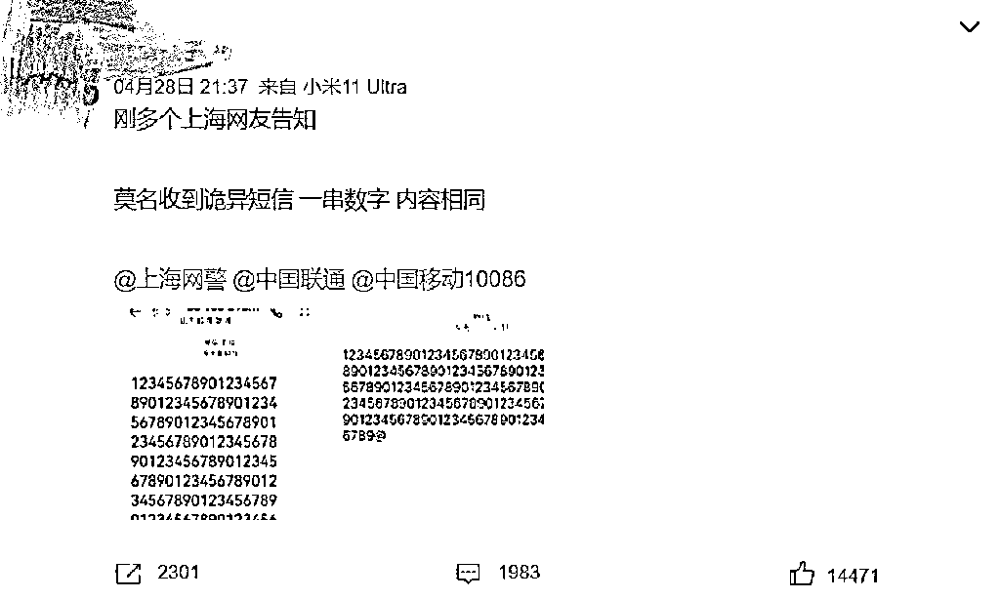
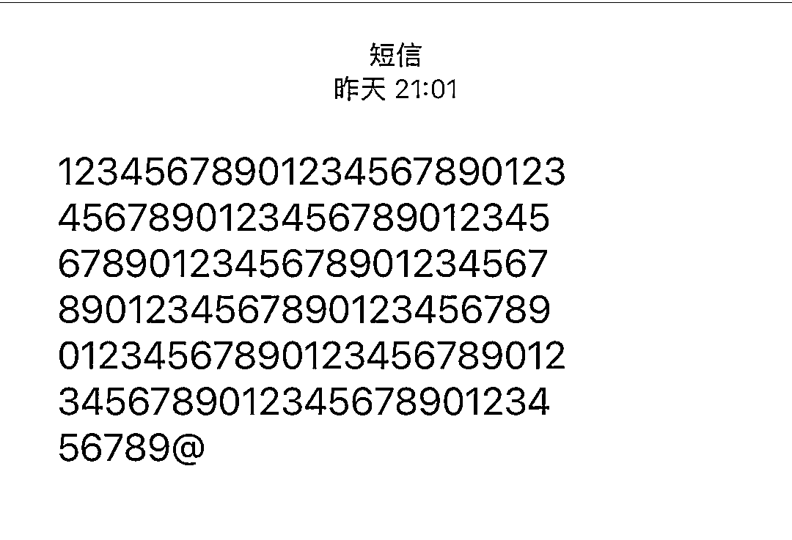
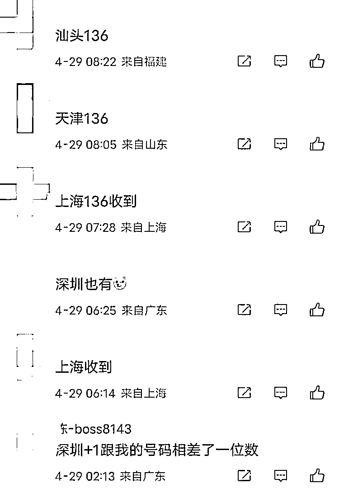
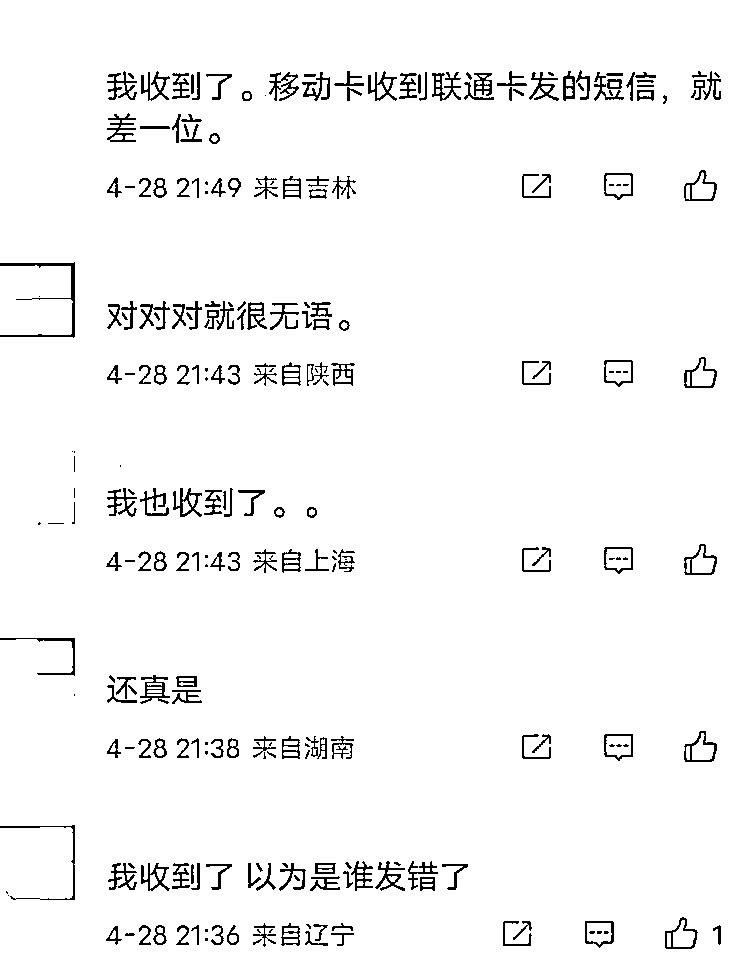
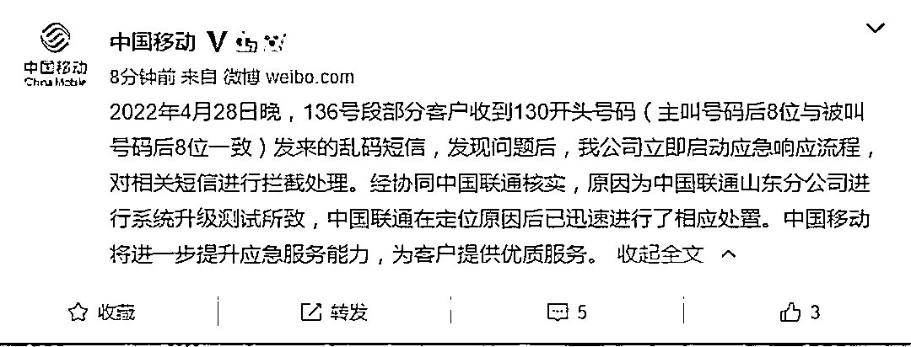
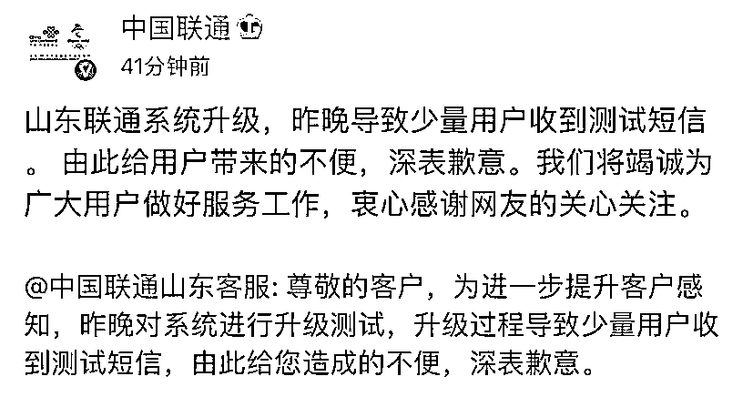

# 多地网友收到诡异短信？运营商致歉！

> 原文：[`mp.weixin.qq.com/s?__biz=MzIyMDYwMTk0Mw==&mid=2247534787&idx=7&sn=609e4e93347717770d3f4135278edcc3&chksm=97cb83fba0bc0aedb37cbbbab0149114b824679f8c8edc41dea3b690d3e72960a1029abf5cfc&scene=27#wechat_redirect`](http://mp.weixin.qq.com/s?__biz=MzIyMDYwMTk0Mw==&mid=2247534787&idx=7&sn=609e4e93347717770d3f4135278edcc3&chksm=97cb83fba0bc0aedb37cbbbab0149114b824679f8c8edc41dea3b690d3e72960a1029abf5cfc&scene=27#wechat_redirect)

昨日晚间，有多名网友称收到了来自 130 开头号码的短信，短信内容为一串数字乱码，该短信在微博上也引起热议。 

还有网友发现，“好像全国各地的 136 号码都收到了”“我的 136 的号码，一个 130 的发的，其他的数字一摸一样”。

今日，中国移动通过微博发布消息称，2022 年 4 月 28 日晚，136 号段部分客户收到 130 开头号码（主叫号码后 8 位与被叫号码后 8 位一致）发来的乱码短信，发现问题后，公司立即启动应急响应流程，对相关短信进行拦截处理。经协同中国联通核实，原因为中国联通山东分公司进行系统升级测试所致，中国联通在定位原因后已迅速进行了相应处置。中国移动将进一步提升应急服务能力，为客户提供优质服务。

随后，中国联通微博发布消息称：山东联通系统升级，昨晚导致少量用户收到测试短信。由此给用户带来的不便，深表歉意。我们将竭诚为广大用户做好服务工作，衷心感谢网友的关心关注。

来源：新闻晨报综合@中国移动、@中国联通、网友评论

← 向右滑动与灰产圈互动交流 →

# 原文：[`mp.weixin.qq.com/s?__biz=MzIyMDYwMTk0Mw==&mid=2247534865&idx=1&sn=95e72b79edaa329772a3527ac4a2c811&chksm=97cb8229a0bc0b3f5d7dabe0d55831123c279394481ab9e363ae4fea892ec39e2d0ca449242a&scene=27#wechat_redirect`](http://mp.weixin.qq.com/s?__biz=MzIyMDYwMTk0Mw==&mid=2247534865&idx=1&sn=95e72b79edaa329772a3527ac4a2c811&chksm=97cb8229a0bc0b3f5d7dabe0d55831123c279394481ab9e363ae4fea892ec39e2d0ca449242a&scene=27#wechat_redirect)