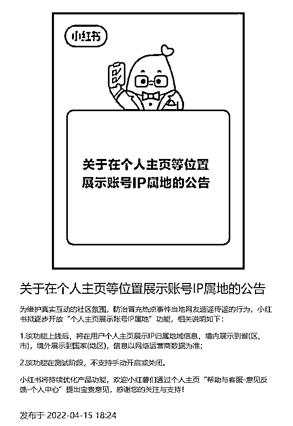

# 当微博显示 IP 地址后，全网都“乱套”了

> 原文：[`mp.weixin.qq.com/s?__biz=MzIyMDYwMTk0Mw==&mid=2247534865&idx=2&sn=87824bfce2e7c2db0d7eca615855de85&chksm=97cb8229a0bc0b3f5d2969e4383f82abfba8c5c0b81a273c8585617945a352796ea7437d9ec4&scene=27#wechat_redirect`](http://mp.weixin.qq.com/s?__biz=MzIyMDYwMTk0Mw==&mid=2247534865&idx=2&sn=87824bfce2e7c2db0d7eca615855de85&chksm=97cb8229a0bc0b3f5d2969e4383f82abfba8c5c0b81a273c8585617945a352796ea7437d9ec4&scene=27#wechat_redirect)

4 月 28 日，新浪@微博管理员 ，正式发布 IP 属地功能升级公告：**即日起，平台全量开放评论展示发评 IP 属地小尾巴功能，上线“个人主页一级页面展示 IP 属地”功能。**

**#微博全量开放 IP 属地功能#消息公布后迅速登上微博热搜第一。**

**重点来了，这项功能不是你想开就开，想关就关的，而是一项强制开启的功能。**

微博会根据你近期发博、发评论和投票的 IP 属地来判定你所属的地区，国内用户将显示到省份/地区，国外用户显示到国家。

**从微博官方展示的示意图中可以看到，个人主页上会直接显示你的 IP 属地，微博评论内容下方的小尾巴，也将不再显示手机型号，而是由 IP 属地取代。**

**01**

自己的 IP 被曝光，极少数的网友像是被戳了心窝子。

他们表示：这是侵害隐私权，对互联网精神的背叛。

有的人还说，这是权力的践踏、蚕食，被要求的让渡。

但也有不少网友表示：我身子正不怕影子斜！

除此以外谁都没想到，

IP 一显示，还能抓住一些**“装神弄鬼”**的人。

不知你关注过没有，很多貌似长年**海外居住的博主**，

**突然间好像闪电回国了。**

他们中的很多，画着国外花好月圆的饼，打着育儿、家居博主的名头，

收获了数万、甚至数十万粉丝。 

可现在微博的新功能出来了，你一看： 

不是在河南，就是在福建。

还有微博上漫天遍野都是的各地吃喝玩乐资讯号，

IP 属地竟然全都是湖南。 

网友：宇宙的尽头是湖南吗？ 

答：这么看是的。

给济南本地人找对象的月老，竟然来自重庆。 

以及江苏。

跨省当媒人，真的很不容易啊。 

紧接着，济南人发现他们每天刷屏的本地生活号，

是广东生产的。

济南的铲屎官们领养猫咪，还是从陕西跨省“运来”的。

而现在受冲击最大的当属饭圈群体了。

本来以为是哥哥亲自翻牌的留言，却被发现和肉身“分离”

比如明明在南方拍戏的明星，所发微博显示的 IP 地址却在北方。

在微博评论区与粉丝互动的“明星本人”，居然很多都由公司员工代发。

这对于苦心经营自己网上形象的明星来说，实属不小的打击。

可是让人没想到的是，微博对 IP 显示的规定又有变动。

从今天开始，名人、明星、企业等突然不再显示 IP 了。

明明是同一条微博和同样的明星，昨天显示过的 IP 地址确实没了。

虽然之后微博 CEO 王高飞解释称，目前前台实名的媒体、企业、名人不显示所属地，“后台实名认证”用户还是要显示属地，并且前台实名比显示属地更真实。

但是网民大讨论再一次引爆，这都能玩区别对待吗？ 

答：由于翻车太多，以后被显示 IP 的只有我们可怜的“普通网友”了。

**02**

这个消息一出，也有很多人产生了一个疑问：**这样的 IP 强制公开功能会不会泄露个人隐私或者个人信息呢？**

根据《个人信息保护法》内容，微博收集、公开个人信息均需取得用户的明确同意，且用户可以随时撤回同意，并要求微博删除其个人信息。

**那么 IP 地址是否属于个人信息呢？**

根据《民法典》，个人信息是指以电子或者其他方式记录的能够单独或者与其他信息结合识别特定自然人的各种信息，包括自然人的姓名、出生日期、身份证件号码、生物识别信息、住址、电话号码、电子邮箱、健康信息、行踪信息等。

来源：百度百科

目前看来，微博 ip 地址只显示到省级，并未触及到个人信息的范围。

除此之外，国家互联网信息办公室之前也发布了关于《互联网用户账号名称信息管理规定（征求意见稿）》 ，其中有一条规定称**“互联网用户账号服务平台应当以显著方式，在互联网用户账号信息页面展示账号 IP 地址属地信息。境内互联网用户账号 IP 地址属地信息需标注到省（区、市），境外账号 IP 地址属地信息需标注到国家（地区）。”**

**也就是说，征求意见稿认为 IP 属地只能让人对应到用户账号，而不能对应到个人，所以不应属于个人信息。** 

微博 CEO 王高飞也表示微博的“IP 属地”功能是为了解决”发言者真实性“。

所以说，这一功能不仅没有伤害到每个人的隐私，或许还能在一定程度上遏制歪曲事实言论以及不良舆论的出现。

**03** 

除了微博，今日头条、抖音、知乎、小红书等平台也纷纷宣布将上线显示“IP 属地”功能，用户在发送内容或发表评论时，都会展示你的 IP 属地。

这些功能更新的目的只有一个：**为了打击网络暴力、恶意蹭流量、造谣以及冒充热点当事人等网络乱象。**

**而且在一定程度上，显示 IP 归属地也能够帮助我们这些普通网友提升鉴别信息的能力，维护传播内容的真实性和透明度。**

****来源：北美留学生日报****

********

****← 向右滑动与灰产圈互动交流 →****

********

 ****# 原文：[`mp.weixin.qq.com/s?__biz=MzIyMDYwMTk0Mw==&mid=2247534865&idx=3&sn=df7a80a09474eaea3f9ba1ebec30c81a&chksm=97cb8229a0bc0b3f8ef9848c810122be8ab67a054817176b6a02b6d6f11d10bf0dcdbdf6b813&scene=27#wechat_redirect`](http://mp.weixin.qq.com/s?__biz=MzIyMDYwMTk0Mw==&mid=2247534865&idx=3&sn=df7a80a09474eaea3f9ba1ebec30c81a&chksm=97cb8229a0bc0b3f8ef9848c810122be8ab67a054817176b6a02b6d6f11d10bf0dcdbdf6b813&scene=27#wechat_redirect)****