# 河北迁安“封门防疫”：钢筋扎破了屎尿桶

> 原文：[`mp.weixin.qq.com/s?__biz=MzIyMDYwMTk0Mw==&mid=2247534865&idx=5&sn=363c6a3a32ee54f2c12fbbacfe835c96&chksm=97cb8229a0bc0b3f05a6ac82cbafde42d3a71e7ea82402a1bcadc85150c08d09dc560ace82ab&scene=27#wechat_redirect`](http://mp.weixin.qq.com/s?__biz=MzIyMDYwMTk0Mw==&mid=2247534865&idx=5&sn=363c6a3a32ee54f2c12fbbacfe835c96&chksm=97cb8229a0bc0b3f05a6ac82cbafde42d3a71e7ea82402a1bcadc85150c08d09dc560ace82ab&scene=27#wechat_redirect)

图源丨电视剧《庆余年》 

笑话多了，对疫情的敬畏就没了。

这两天，河北迁安的疫情防控让人大开眼界！

4 月 27 日，河北迁安网友发帖吐槽，自家社区因为疫情需要，防止居民不服从管理，每家每户必须将钥匙“上交”。

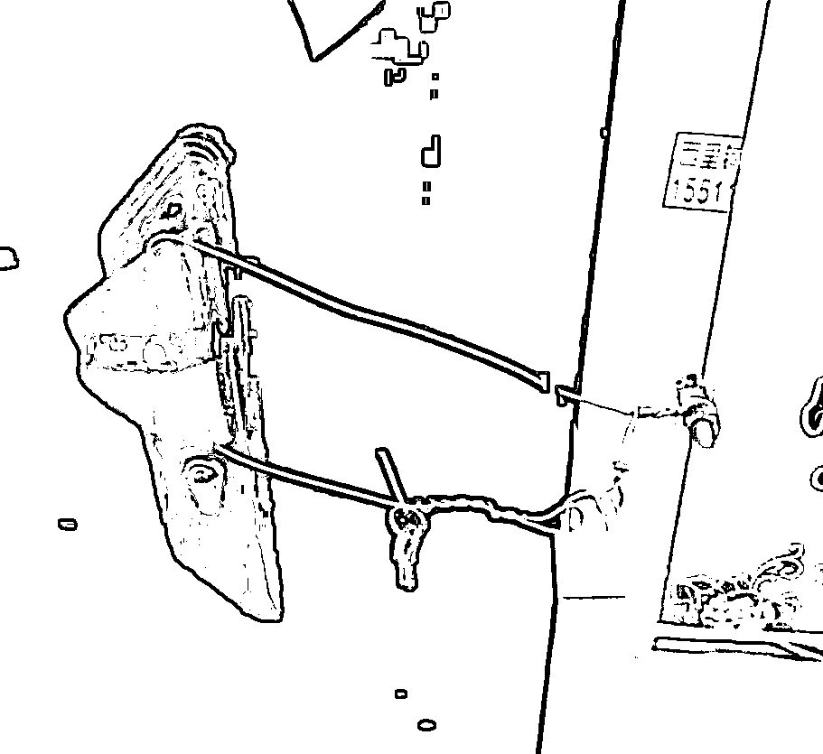

有人死活不同意交匙，咋办？

社区的做法是**“可免费上门打孔加锁”。**

打孔也是极其霸气的，密码锁的家庭直接钢筋打孔插棍。 

只要打开大门就会被顶住，比铁丝锁门更让人无解。

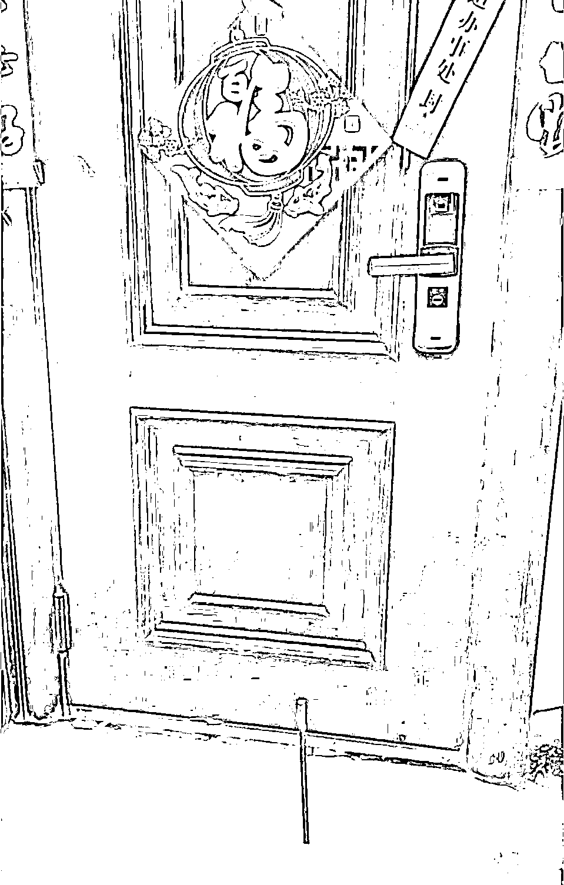

**不同意的可以免费帮忙打孔上锁，好一个免费帮忙！**

有这样帮忙的吗？还免费呢？是欺负老百姓不懂法，还是欺负老百姓好糊弄？

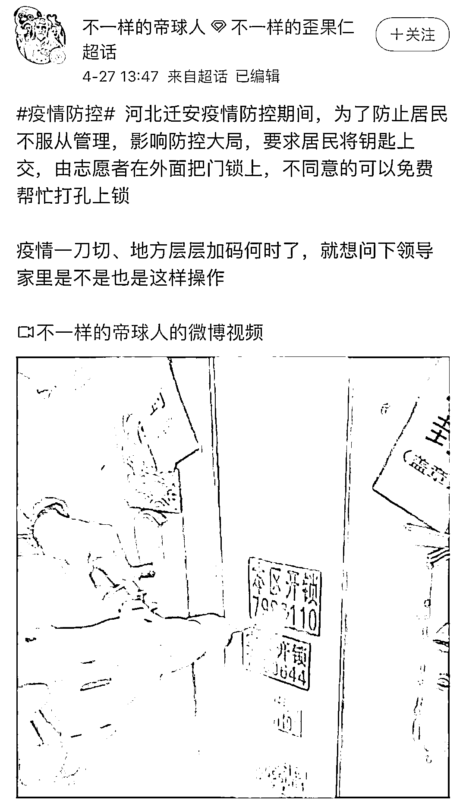

**万一发生地震或者火灾，万一有家人突发疾病，请问大家该怎么逃命、救命？**

请注意网上照片视频都是从门外拍摄的，居民都已经被关在家里隔离。

照片和视频只能是工作人员拍的，要么是给不配合的居民看，要么就是给领导汇报成果。

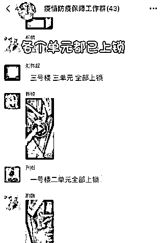

当地居民不满，问他们为什么这样做，谁的权力？

答案：领导。

我当时就在考虑一个问题：是不是非法拘禁？ 

**有些领导干部为了保住官帽子，真的是无所不用其极地防疫。**

**一些高大上的部门，以防疫的名义，将《消防法》中的安全通道统统堵塞、封闭、锁死，且堵、封、锁得那么合法、光荣。**

离谱的事还有。

华北理工大学迁安学院多名学生反映，因为学校实行全员静止，学生们不能出宿舍，所以学校发了塑料桶...... 

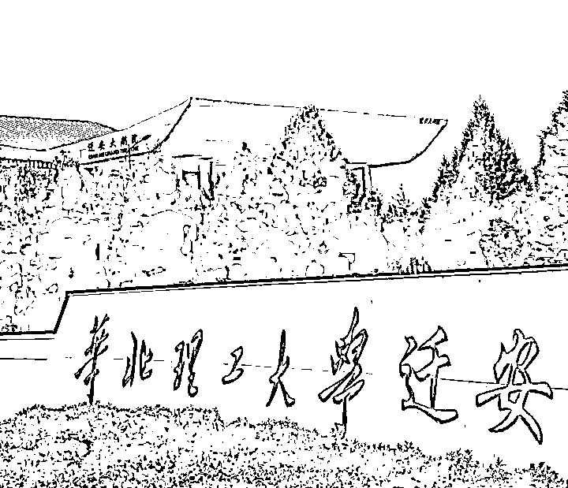

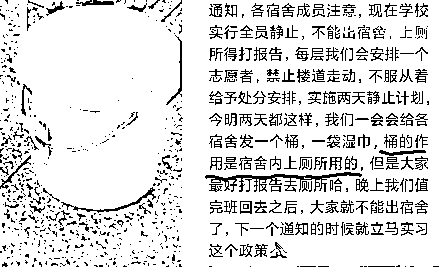

因为厕所设计是楼栋共用，为了防止学生出门方便，学校居然给派发了“水桶痰盂”。

**几个人每天就在这个小桶解决大小便。**

这个上厕所的塑料桶，排成一条线，场景是这样：

一个宿舍封闭管理，4 个人都拉一桶里，真科学卫生吗？

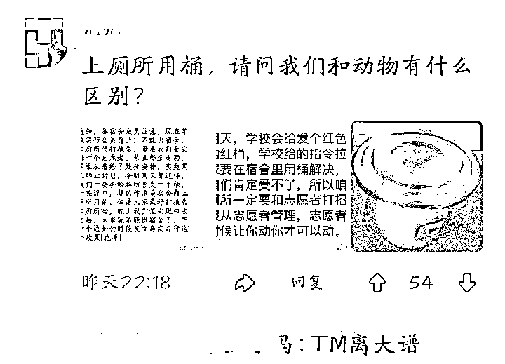

后来舆论发酵，4 月 27 日晚学校通知称：**“发桶是以备不时之需，学校官方从未说过让学生用桶解决大小便问题，目前可以正常使用厕所。”**

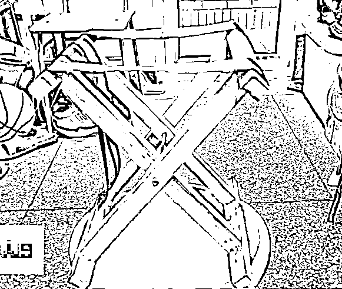

我特别想问下，这个马扎是认真的吗？

我愣了三秒硬是没想出来怎么用。 

**过度防疫，堵门的钢筋硬是扎破了宿舍的屎尿桶。** 

河北省邯郸市鸡泽县风正乡七一村村委会，最近更搞了一个“干农活出入证”，规定每户只能有 1 名村民持证下田。

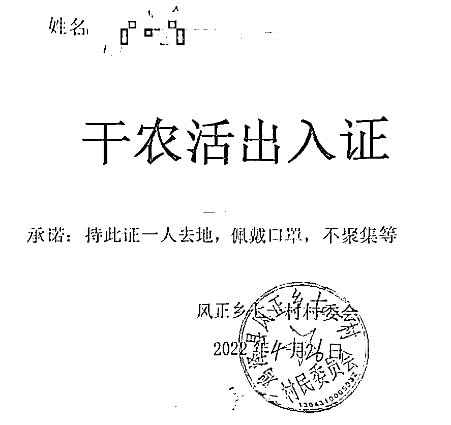

还要求佩戴口罩、不聚集。 

估计农民兄弟们就没受过这么大的委屈。

疫情三年，其他地方这样硬生生的措施也不少。

**甚至在以防控为名的某些地方，层层加码，没有最奇葩，只有更神经。**

这两天看到一个视频，苏州高速昆山段每隔 100 米就有一个人在站岗。

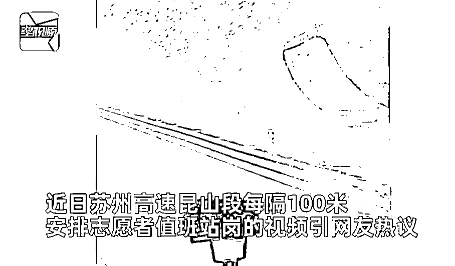

有知情人称，这是全天 24 小时两班倒，是为了防止由上海来的半路下车。

此前，苏州高速就加装刀片铁丝网，防止外来人员下高速。

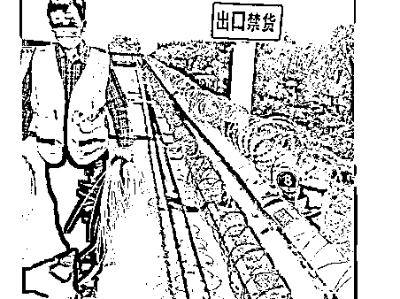

也不能怪苏州，他们在防哪些，我们都清楚。 

在辽宁鞍山，甚至有农民穿防护服下地干活，虽然是政府免费发放防护服让农民做好防护种地。

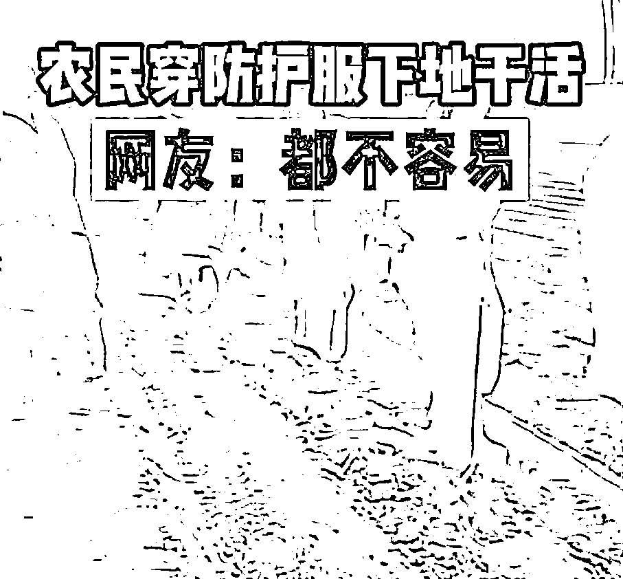

但要不要给种子、给蚯蚓也做核酸？

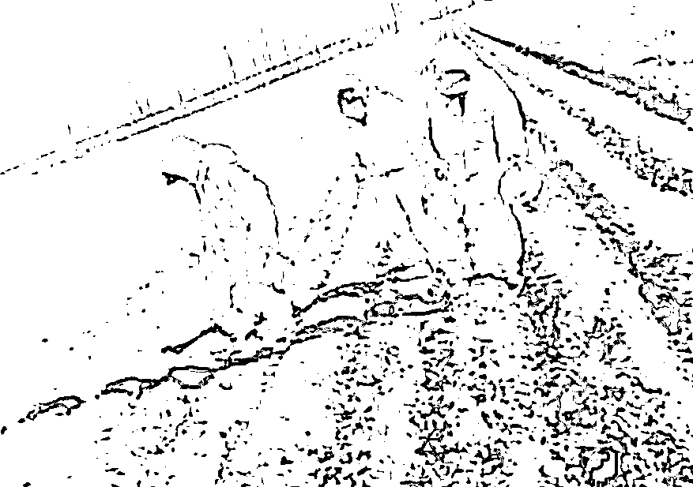

200 一套，这雨衣是真贵了点。

早在 2020 年 2 月，人民网就发出警告：**注意！粗暴防疫、过度检查，涉嫌违纪违法。**

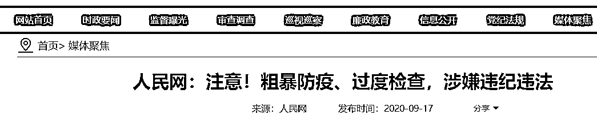

快三年时间了，层层加码的防疫措施，在各地不断上演，一次次刷新我们的认知。 

4 月 29 日下午，新华社发表国家卫健委疫情应对处置工作领导小组专家组组长梁万年在国新办新闻发布会上的观点：**抗击奥密克戎不等于全员核酸全域封控，努力精准平衡抗疫和经济发展生活生产的关系。**

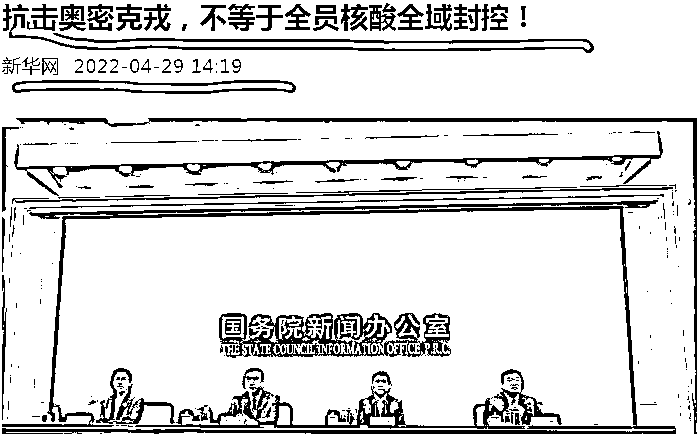

**也就是说，不能一刀切防疫、不能过度防疫！**

全域封闭是最后的王牌，绝不能轻易打出来，同时政府要保障民生就业，减少百姓因为封控而造成的损失。

科学合理的防疫是正当的，反对过度防疫也是一种深刻的无奈。

**但当防疫可以压倒一切的时候，很多常识就不存在了。**

不少基层干部为了遵从当地高层领导的要求，在实践中“层层加码”， 导致缺乏人性化的防疫手法频出。

**毫无底线的过度防疫，不仅是任性，更是愚蠢。**

**如果病毒会导致死亡，那么，过度防疫同样会害死人。**

别让过度防疫成为不可弥补的错误。

随着疫情的时间战线拉长，看不到头，才是最绝望的。

来源：昌南大队长

← 向右滑动与灰产圈互动交流 →

