# 我们呼唤张文宏！

> 原文：[`mp.weixin.qq.com/s?__biz=MzIyMDYwMTk0Mw==&mid=2247534936&idx=1&sn=753a20888cf4d7abf28a4b6b10c54c11&chksm=97cb8260a0bc0b7634e34d47472a1976f0c7aad4d790f7803f4469ce0721c2a5b851b88c557c&scene=27#wechat_redirect`](http://mp.weixin.qq.com/s?__biz=MzIyMDYwMTk0Mw==&mid=2247534936&idx=1&sn=753a20888cf4d7abf28a4b6b10c54c11&chksm=97cb8260a0bc0b7634e34d47472a1976f0c7aad4d790f7803f4469ce0721c2a5b851b88c557c&scene=27#wechat_redirect)

疫潮之下的上海，越来越魔幻。

累计感染者规模远超当年的武汉。

被爆“指阴为阳”、“猎杀宠物”、“哄抬物价”，传言“倒卖捐助物资”、“限制个人自救式囤货”等等。

在上海被疫情、舆论架火炙烤之时，曾经活跃于网络的上海“防疫代言人”张文宏，却在网络上消失了，上一次他发动态还是 3 月份。

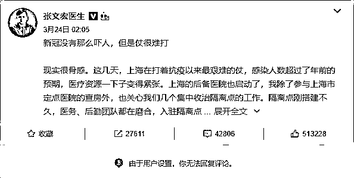

截图中的“叹号”图标很扎眼，在前一阵经历了一波猛烈的网暴之后，张文宏无奈关闭了微博评论。

**张文宏被骂得有多惨？**

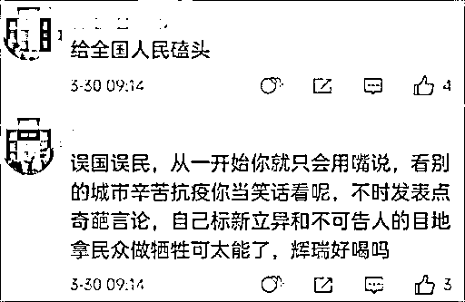

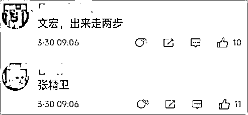

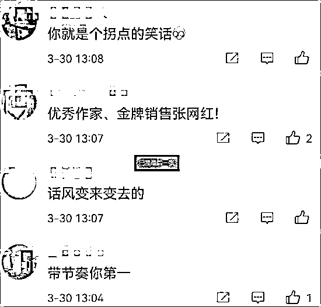

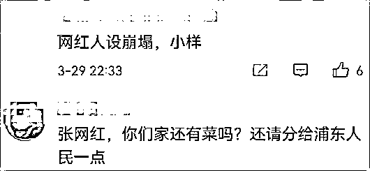

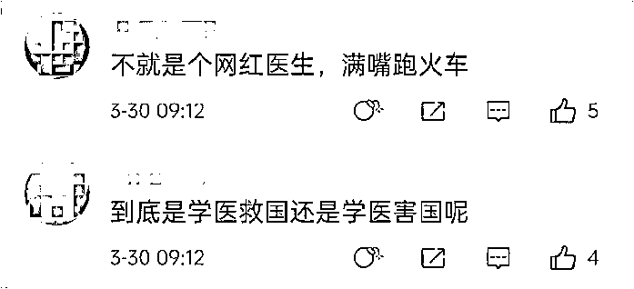

当然，张文宏自因“新冠”蹿红以来，已经历过无数次的网暴了。

曾经在网络讨伐声中，甚至连“大批判时代”的漫画和大字报都出来了。

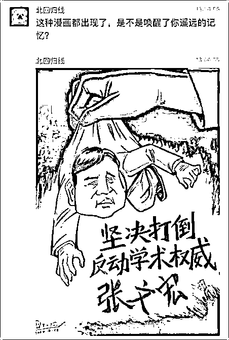

图片源自网络

其实，在明眼人看来，一向敢的张文宏，“出问题”是迟早的事。

因为他太红了，也太敢说了。

**张文宏红到什么程度？**

据说，微博曾做了一个榜单《2020 年上热搜最多的 20 个人》。

“网红医生”张文宏就位列其中。

他上热搜的次数，甚至超过了娱乐圈“顶流”李宇春、李现等人。

红到连（前）中国驻美大使崔天凯，都给其致亲笔信：“等疫情过去后，争取有机会回家看看，到时候希望能来拜访您，不是为了看病，是为了讨教”

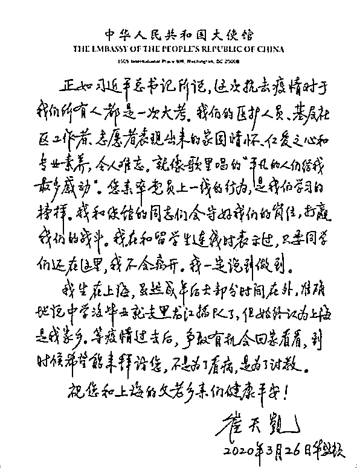

网络上，同样不缺少张文宏的拥趸。

在人人自危的疫情中，在扑朔迷离的多方信息里，在模棱两可的“太极说辞”间，敢言的张文宏犹如一股清流，给人们吃下定心丸。

不讲套话，不打太极，通俗而直观，敢于直抒己见，正是这种语言风格，让人们在各路信息充斥之时，有一种拨云见日之感，一时间也让张文宏吸粉无数。

**张文宏有多敢说？**

比如，不合时宜地讥讽现实：

“人不能总是欺负听话的人，我今天做了个决定……你在宣誓的时候不是说了吗？把人民的利益放在第一位……对不起，现在你马上给我上去！”

对于领导，同样不客气：

“领导对医务人员的关心，第一是防护；第二是疲劳；第三是工作环境。如果跟不上，说明没有把医务人员当人，只是当机器。”

这种“拿豆包不当干粮”的话，试想哪位领导能爱听？

比如，在谈到早餐营养问题时，他敢于打破传统，直言：不建议孩子早上喝粥，要多吃鸡蛋、喝牛奶、吃牛排和三明治……虽说这不是什么膳食科学，只是为了能摄入大量的蛋白质，促进身体产生抗体，增加抵抗力，让身体尽快恢复，但是他却因此被扣上了“崇洋媚外”的大帽子。

再比如，喜欢“泼冷水唱反调”。

此前，当第一波疫情结束，多地持续多日零新增，本是喜大普奔之时，张文宏却泼冷水式地提醒：“新增为零，我反而很担心。”

疫情在美爆发之后，确诊人数很多，一些人很释然，他却强调说：“美国的确诊人数越多，说明美国的医疗水平越先进！”

再比如，人们窝在家里久了，寄希望于高温天气可以遏制病毒传播时，张文宏却说：“很难讲天气热了，病毒就会消失。”

而在人们寄希望于疫苗消灭疫情之时，持续劝导人们谨慎乐观的张文宏，再一次“泼冷水”道：这次上海感染的病例也接种过疫苗，“百分百预防感染的疫苗是不存在的”，一定会有接种过疫苗的高危人群被感染。

习惯“唱反调”的张文宏，在屡次三番遭受网络攻击后，有段时间已在刻意保持低调，很少在公开场合发表言论。

但是去年 7 月底，他发文强调“世界要学会与这个病毒共存”时，再次招致骂声。

也正因为这一观点，他被扣上了“向病毒缴械投降”、“误导防疫政策”等大帽子。

抗疫路线及政策一直是以“清零”为目的，他却不合时宜地直言要与病毒共存。

张文宏在“南京疫情”爆发后撰文指出：

“如今大多数病毒学家都认可新冠是一个常驻病毒，世界要学会与这个病毒共存。南京疫情促使全中国经受压力测试，也为未来疫情防控提供更多思考。”

张文宏说：“未来中国选择的方式一定是既保证与世界的命运共同体，实现与世界的互通，回归正常的生活，同时又能保障国民免于对病毒的恐惧。中国应该有这样的智慧。”

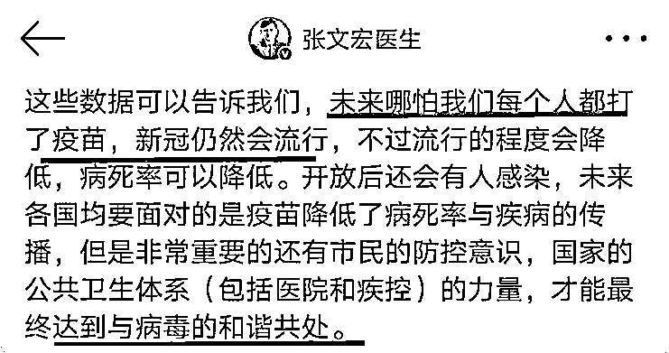

张文宏这番言论一出，同样招来一片骂声。

尤其在一位退休官员发出讨张“檄文”后，键盘侠们仿佛有了指路“明灯”，对张文宏发动了排山倒海式的攻击。

有事喊张医生，无事骂张网红。

张文宏似乎总是在某种舆论的操纵下，被动完成自身的角色转换。

昨天，朋友圈都在刷一条张文宏的视频。

[`mp.weixin.qq.com/mp/readtemplate?t=pages/video_player_tmpl&action=mpvideo&auto=0&vid=wxv_2352511671086252034`](https://mp.weixin.qq.com/mp/readtemplate?t=pages/video_player_tmpl&action=mpvideo&auto=0&vid=wxv_2352511671086252034)

长期处在封控区的人们，都在指望着一向敢言的张文宏能站出来，很多人都以为这是张文宏发出的“最强音”。

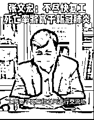

当然，这也许在某种程度上代表了人们的心声和愿望。

但是却不能当真，因为这只是 2020 年的一则旧闻。

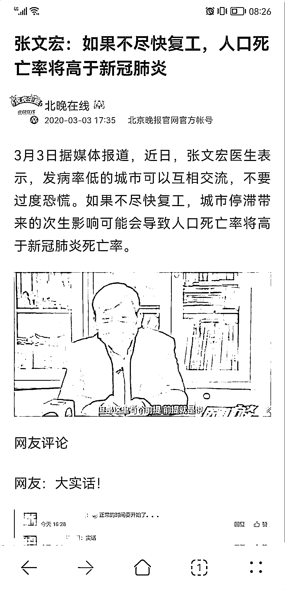

源自“北晚在线”2020 年的新闻报道

如今，距张文宏最近一次网络发声，差不多过去 20 天了，经过多番的网暴，张文宏能否回归我们无从得知。

事情发展至此，无论是否会回归网络继续发声，估计一向敢言的张文宏，今后一定会有所顾忌。

如果张文宏真的被逼“退网”，相信这不仅是张文宏个人的悲哀，更是时代的悲哀。

也许，我们就此将失去一位在公共安全领域敢于直言呐喊的医生。

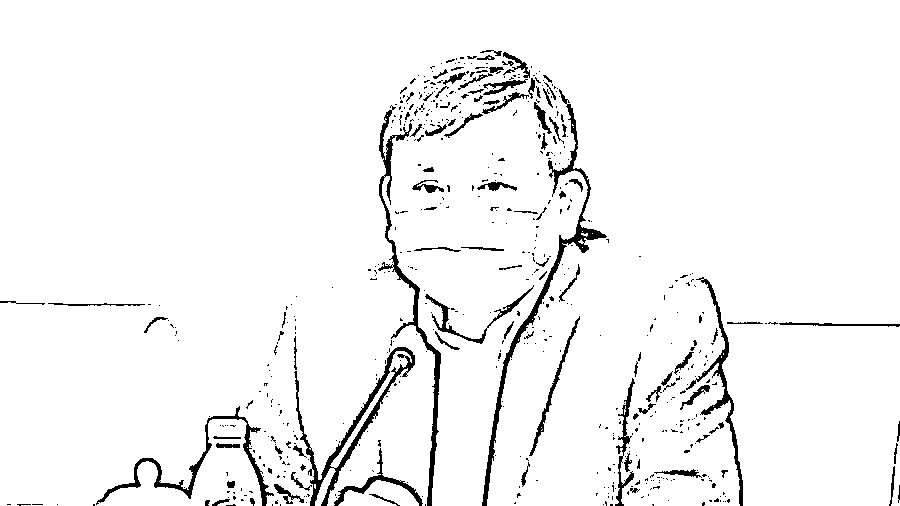

图片源自网络

当愚见成为某种潮流时，清醒就是“犯罪”，一如张文宏。

网事幽幽，有人间清醒，同样也会有乌合之众，这是无法改变的客观现实。

其实，从来都不提倡搞什么个人崇拜。

我们不能将张文宏神化，但是也不能蓄意诋毁。

你不能指望一名医生，去止住大上海汹涌的疫情。

你不能指望一名医生，去扭转已历三年的疫潮？

你更不能对防疫的不利视作一人之责，将所有情绪都发泄到一位医生身上。

正如有评论所讲：如果我们真的对张文宏不宽容，那么我们的公共空间只会越来越逼仄了。

上海防疫离不开你，我们呼唤张文宏医生！

来源：喻言亭阁

← 向右滑动与灰产圈互动交流 →

