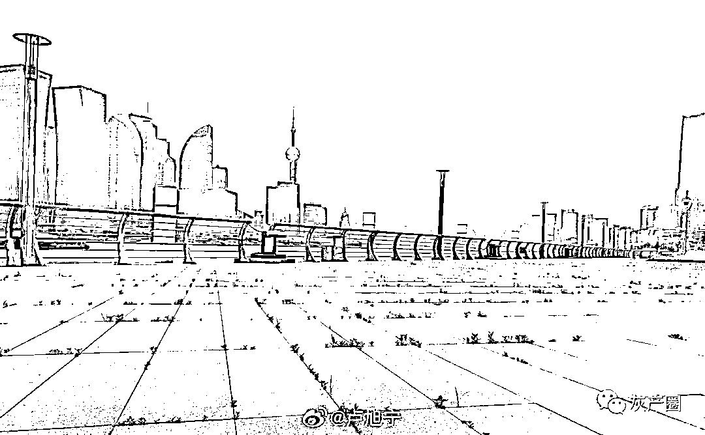
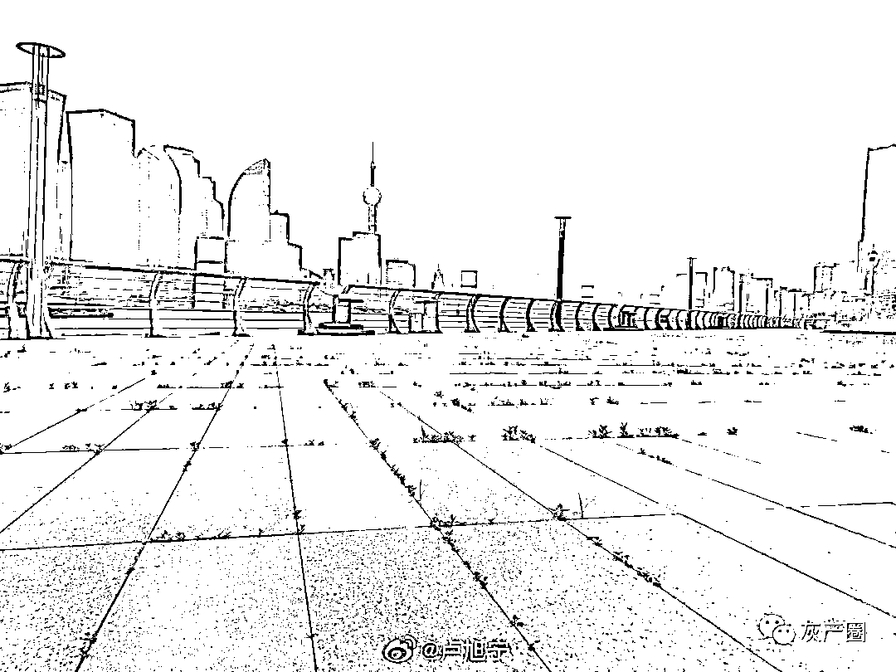
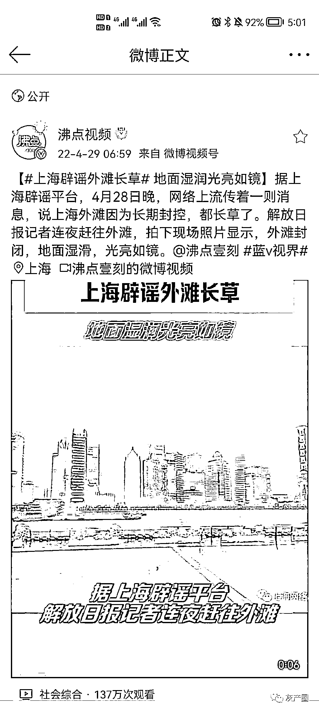
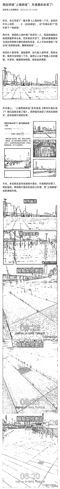
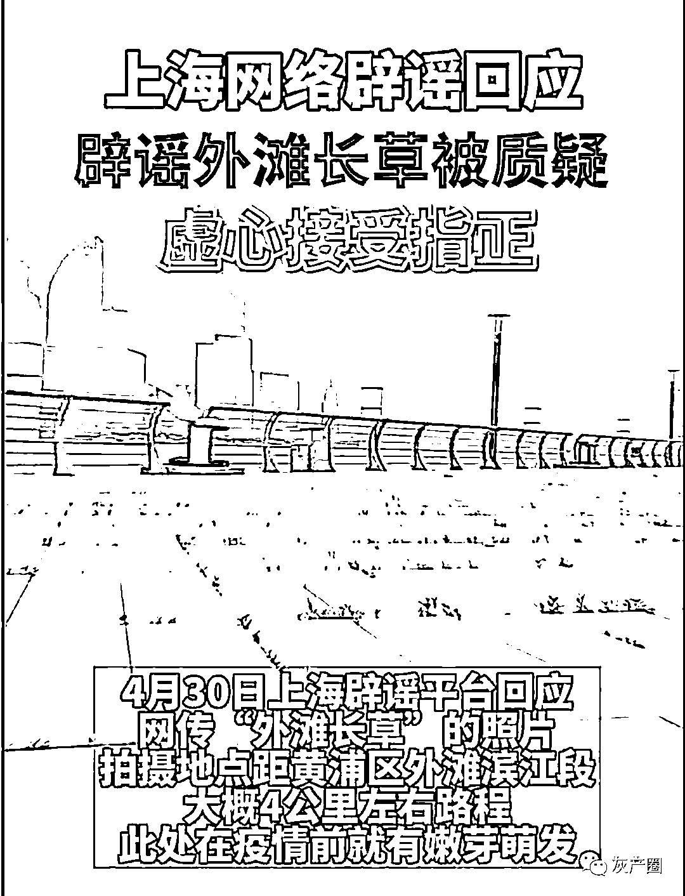

# 网友拍到上海外滩长草了，上海辟谣：没长！网友再辟谣：长了！

> 原文：[`mp.weixin.qq.com/s?__biz=MzIyMDYwMTk0Mw==&mid=2247534936&idx=4&sn=da0b00ee717fa5f0c7a1487806d85020&chksm=97cb8260a0bc0b76a174a8a264b2dc26a8f8bd74afff46136f66497bd37b33988e5b304a4d7a&scene=27#wechat_redirect`](http://mp.weixin.qq.com/s?__biz=MzIyMDYwMTk0Mw==&mid=2247534936&idx=4&sn=da0b00ee717fa5f0c7a1487806d85020&chksm=97cb8260a0bc0b76a174a8a264b2dc26a8f8bd74afff46136f66497bd37b33988e5b304a4d7a&scene=27#wechat_redirect)

近日，网传一张“上海外滩长草”的图片。

4 月 28 日，上海辟谣前往外滩拍摄，所配图片显示并未长草。

  文章发布后被部分网友质疑，并晒出多张长草现场图。

魔幻的是，30 日上海网络辟谣中心再次发布文章《关于“外滩长草”的照片，有几句话，想和大家聊聊》，辟谣了自己的辟谣，称“虚心接受网友指正”，“经过核查，网传“外滩长草”的照片，摄于滨江秦皇岛路码头附近，距大家熟悉的黄浦区外滩滨江段大概 4 公里左右路程”。

来源：微博那些事儿

← 向右滑动与灰产圈互动交流 →

