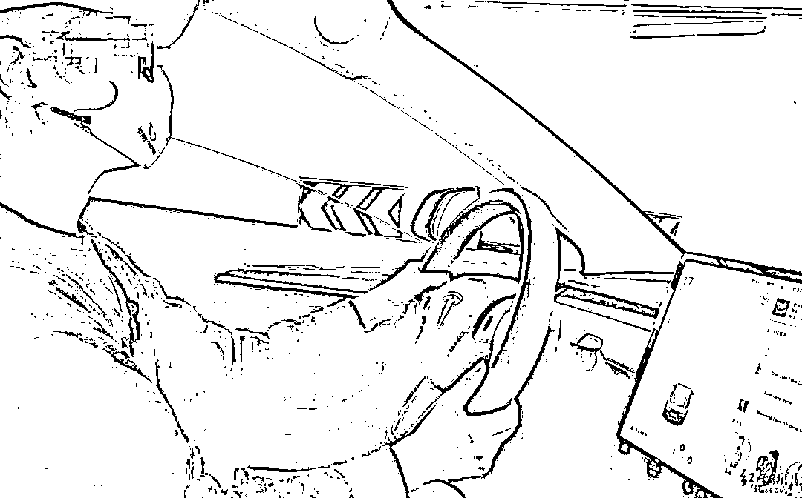
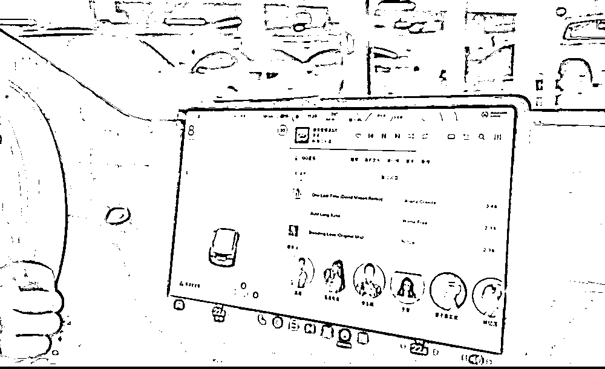
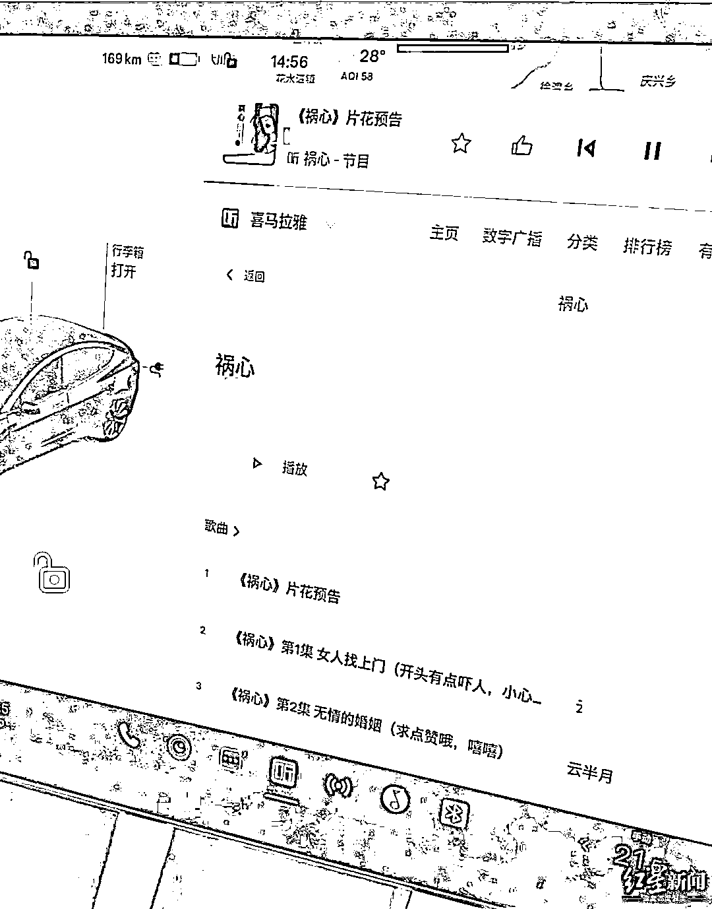
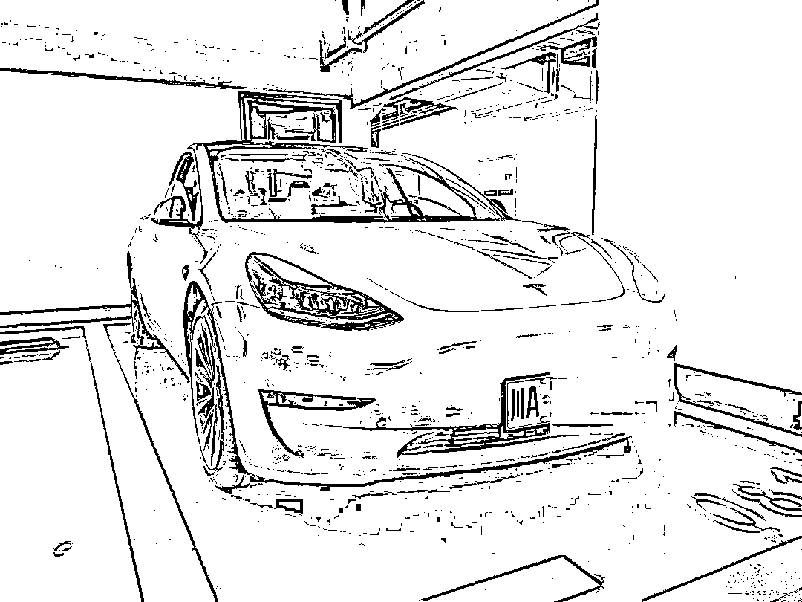

# 各方回应！特斯拉自动播放“我死得好冤啊”吓坏车主

> 原文：[`mp.weixin.qq.com/s?__biz=MzIyMDYwMTk0Mw==&mid=2247534936&idx=5&sn=6ad40d05851541a2bc4de273392a93f6&chksm=97cb8260a0bc0b76fbcd60270f04487550a23cc4a120ff9a5da7fa3713f7926095fa40c0a364&scene=27#wechat_redirect`](http://mp.weixin.qq.com/s?__biz=MzIyMDYwMTk0Mw==&mid=2247534936&idx=5&sn=6ad40d05851541a2bc4de273392a93f6&chksm=97cb8260a0bc0b76fbcd60270f04487550a23cc4a120ff9a5da7fa3713f7926095fa40c0a364&scene=27#wechat_redirect)

4 月 27 日夜晚，地下停车场，郑女士的双手长按在她的特斯拉 MODEL3 方向盘的两个按钮上，屏幕熄灭，系统进入重启程序。 

突然，黑色中控屏的屏幕上显示出一个绿色的麦克风，郑女士伸出手点了一下，环绕立体车载音响传出一句凄凉女声：**“我死得好冤啊。”**

一时间，郑女士背脊发凉，**“我全身的汗毛都立起来了”**。坐在副驾座位上的女儿也被吓得不轻，郑女士赶紧带着她离开汽车……

这到底是怎么回事？

[`mp.weixin.qq.com/mp/readtemplate?t=pages/video_player_tmpl&action=mpvideo&auto=0&vid=wxv_2378916583504216067`](https://mp.weixin.qq.com/mp/readtemplate?t=pages/video_player_tmpl&action=mpvideo&auto=0&vid=wxv_2378916583504216067)

**车载屏幕曾数次出现故障**

**4 月 28 日，记者在成都天府新区某小区外，见到了郑女士和她的特斯拉。陪同她一起的还有她的两个闺蜜，她说：“我现在不敢单独开这个车。”闺蜜安慰着她，认为特斯拉方面应该给个说法。** 

**郑女士介绍，这辆特斯拉 MODEL3 购买于 2021 年 1 月，此前没有出过大问题。**

**她回忆，4 月 27 日上午她驾车上班时，就发现车子出现了一些问题，“音量突然开到最大声，调小了后又突然变大，10 分钟内大概出现了 3 次。”**

**随后，奇怪的问题接二连三出现。**

****车辆中控屏上，有时候空调面板自动开启，又快速自动关闭，循环往复；有时候是自动开启某个 App，并且自动操作；有时候导航地图自动开启，不间断地自动放大或缩小……****

**郑女士为此询问了另一位特斯拉车主，听说其车辆没有出现过类似情况，她便暂时没有管。**

****

**郑女士和她的特斯拉**

**来源：红星新闻**

**当晚 9 点，郑女士接在外上完英语课的女儿回家。郑女士说，在路上开了大概 5 分钟，特斯拉便自动启动“喜马拉雅”App，播放起一则历史故事。**

**此时，空调面板开始自动反复开启又关闭，“喜马拉雅”App 也自动切换起其他故事来播放。**“屏幕上的空调面板、‘喜马拉雅’、地图都在‘一直跳、一直跳’，我觉得是系统出问题了。”****

**于是，郑女士给特斯拉客服打电话。她说：“客服告诉我重启一下就好，我怕女儿在车上不太安全，就说把车停了以后再重启。”**

****

**郑女士的特斯拉中控屏出现异常**

**晚上 9 点 30 分左右，郑女士载着女儿回到居住小区，将车泊入地下停车库的车位上。**

**特斯拉 MODEL3 的重启按钮，位于方向盘的两边，双手同时长按两个按钮，就能启动重启程序。随后，便出现了那句凄凉的女声“我死得好冤啊”。**

**“像恐怖片一样，当时我女儿告诉我，‘妈妈，我好害怕’。”郑女士说，虽然当时她也被吓得不轻，但还是将恐惧压制在了心里，故作镇定，只为给女儿带来安全感，“我怕这件事给女儿带来心理阴影。”**

**郑女士赶快锁上车辆，带着女儿离开了。**

****惊悚音频来自有声读物****

****郑女士说，自己不信鬼神，但难免心有余悸，将此描述为灵异事件。****

****两个闺蜜在次日一早便来陪她，她们一度怀疑，这辆车是被黑客入侵了，搞了恶作剧。****

****“我在网上看到新闻说，国外有 20 多辆特斯拉被黑过，我的特斯拉可能是中国第一辆被黑的。”****

****郑女士说，当年买特斯拉，看中的就是智能和节能，但此刻，她甚至想到退货,因为担心**“如果那种情况出现在高速驾驶的时候，很可能会导致安全事故”。******

****4 月 28 日中午，郑女士继续与特斯拉客服进行沟通。客服询问她，是否有用过屏幕贴膜、是否用清洗剂擦拭过屏幕，郑女士表示都没有。****

****客服表示，可能是其**车载屏幕出现故障**，因为后台检测到该屏幕短时间内出现大量点击。****

****客服还提供了一条很关键的信息：**4 月 27 日晚，其车载****“喜马拉雅”App 播放****过一个名为《祸心》的音频，播放时间也刚好对应上“闹鬼”的时间。******

****记者再次打开郑女士的车载“喜马拉雅”App 进行搜索，搜到了这部名为《祸心》的有声读物，该有声读物的标签为“都市痴情虐恋”，其中第一集用括弧标注出：“开头有点吓人，小心脏准备好哦。”****

****点开该有声读物，记者听到，一开始出现哭哭啼啼的女声，在第 8 秒时，出现了那句凄凉的女声。此时，待在车外的郑女士听到后，被吓得蹲在地上，说：“我听到的就是这句。”****

********

****郑女士特斯拉中控屏“喜马拉雅”App 里的《祸心》界面****

****闺蜜们安慰郑女士，终于“破案了”，让她不要担心。根据客服的提示，郑女士重新鼓起勇气，开车到附近特斯拉 4S 店进一步检查和报修。****

****在开往 4S 店的过程中，记者也发现，郑女士的车载屏幕反复出现自动开启空调面板又关闭、自动开启喜马拉雅或 QQ 音乐 App 播放音频、自动打开地图等现象，且屏幕经常出现失灵无法操作的状况。****

******特斯拉致歉，“喜马拉雅”表示一起优化******

******4 月 28 日下午约 3 时，郑女士抵达成都南三环外的一家特斯拉 4S 店，工作人员随即对其车辆进行检修。******

******“无论（故障）原因是什么，这边都非常抱歉。”特斯拉客服对郑女士表达了歉意。******

******经过检修后，特斯拉工作人员告诉记者，车内行车记录仪在没有手动保存的情况下，每一个小时会自动覆盖之前的内容，所以当晚郑女士的情况现在已经无法查看。******

********最后经过工作人员的现场检测，郑女士的特斯拉车是显示触摸屏出现了故障。********

******因为郑女士的车还在保修期内，在检测判定出具体问题后，店里当场免费为她更换了新的中控触摸屏。******

************

******郑女士的特斯拉******

******另外，记者查询郑女士使用的特斯拉车载“喜马拉雅”App 时，发现其订阅的内容主要是儿童读物或者财经信息。******

******郑女士称，她主要也是收听的儿童读物和财经信息。******

******记者发现，虽然其车载显示触摸屏出现了故障，但在有故障的情况下自动输入“祸心”进行搜索并播放的程序较为复杂，几率很小。******

******那么，**当时是否是“喜马拉雅”的推送机制也出现了问题？或者有故障的屏幕误点误触发了被推送的内容？**毕竟，向一个经常收听儿童读物的用户推送惊悚有声读物并不合适。******

******对此，“喜马拉雅”相关工作人员告诉记者，特斯拉汽车上的“喜马拉雅”客户端由特斯拉开发，**“喜马拉雅”****不会在特斯拉汽车上进行推送，“我们和特斯拉一直是友好合作关系，我们也把情况反馈给特斯拉，一起优化。”********

******来源：央视网综合九派新闻、微观安徽、红星新闻******

************

******← 向右滑动与灰产圈互动交流 →******

************