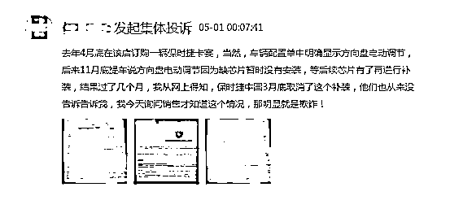
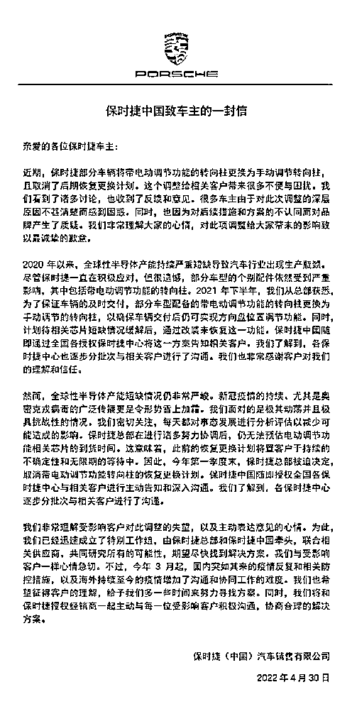

# 数百名车主维权，保时捷紧急致歉！网友：幸亏买不起，要不然得多烦！

> 原文：[`mp.weixin.qq.com/s?__biz=MzIyMDYwMTk0Mw==&mid=2247534936&idx=6&sn=8013bc08d42bdc74e91ae367c26d7a66&chksm=97cb8260a0bc0b765fd3534710f2c3aca5caa85e33bfc84d200c32dbc410bd88f6199a585571&scene=27#wechat_redirect`](http://mp.weixin.qq.com/s?__biz=MzIyMDYwMTk0Mw==&mid=2247534936&idx=6&sn=8013bc08d42bdc74e91ae367c26d7a66&chksm=97cb8260a0bc0b765fd3534710f2c3aca5caa85e33bfc84d200c32dbc410bd88f6199a585571&scene=27#wechat_redirect)

针对近日因减配而引发的车主维权事件，30 日，保时捷中国发布《保时捷中国致车主的一封信》，向车主致歉，并表示已成立特别工作组，期望尽快找到解决方案。

不过,面对官方千字回应，网友们并不买账，纷纷表示“说了等于没说”，还有的调侃“幸亏买不起保时捷，要不然得多烦”……到底怎么回事？

****大批车主冲进直播间维权！****

******保时捷为何犯了众怒？****** 

****4 月 27 日，全新保时捷首款纯电动跨界多用途车（CUV）Taycan Cross Turismo 在国内直播上市。但在直播间，比新车更受瞩目的，是涌进了大批维权车主。****

********

******由于直播中未开启评论功能，这些车主纷纷改名为“保时捷涉嫌销售欺诈”、“保时捷还我电动转向柱”等名称，通过刷礼物的方式接力霸屏。******

******据了解，此事起源于多位车主控诉自己订购的保时捷遭到官方无故减配。******

******购车时，保时捷方面曾承诺，因芯片供应不足，暂时将车辆减装为手动转向柱，后续将免费升级为电动转向柱。但是，消费者提车后，保时捷方面并没有兑现当初的免费升级方案，改为只提供 2300 元的代金券作为补偿。而在 4S 店自行加装电子转向的费用，高达 3 万元。******

******对此，消费者无法接受。“我不敢相信这么大的豪华汽车品牌，竟敢公然耍无赖！”一位 Panamera 车主如此说道。******

******此外，据中国新闻周刊报道，在黑猫投诉平台上，保时捷累计共有 135 条投诉，其中有 97 条出现在最近 30 天内。对保时捷发起了集体投诉的车主，已达 86 位。******

************

******据多位保时捷车主透露，目前其所在的维权群中已有数百人，有保时捷销售人员在与 12315 工作人员沟通时，提出涉及上述问题的新车超过 2 万辆，包括卡宴、Taycan、帕拉梅拉，以及少量的 Macan。除了 Macan 的售价为五六十万元，其他车型的售价都在百万元以上。******

******值得一提的是，保时捷当初事后免费升级电动转向柱的承诺，是与部分客户签署了正式文件。告知函中称，保时捷保证与供应商一起加紧采购所需部件。一旦采购完成可以加装电动转向柱，保时捷将立即通知车主进行免费加装。******

************

******然而，取消免费补装服务的告知函还是来的猝不及防。该份告知函中，保******

******时捷方面称因零部件短缺问题解决时间未知，所以车辆只能配备手动调节转向柱。针对此事，保时捷将提供 2300 元代金券的亲善补偿。******

******这让不少车主十分恼火。且有车主爆料，在与 4S 店内人员确认后，补偿的 2300 元代金券使用范围仅为售后。**该车主表示，首先恢复电动方向盘的配置需要 3 万元左右，其次 2300 元代金券仅能用于售后维修保养等消费抵扣。“这是打发乞丐的方案吧，还'亲善'，恶心谁呢？”********

****************

****************

****************

****************

********在黑猫投诉上，一位车主提到，自己是在 2021 年 9 月，于慈溪保时捷 4S 店订购了一辆卡宴。2022 年 3 月，他在网上得知该车辆因全球芯片短缺影响，电动转向柱(即电动调节方向盘)改为了手动方向盘。跟 400 热线确认后问 4S 店，再三催促下才被告知厂家取消了该配件，改为补偿 2300 元的该店代金券，被他拒绝了，并要求 4S 店继续向保时捷反馈。********

************保时捷紧急致歉！网友却更怒了************ 

**********对此，4 月 30 日，保时捷新闻中心发布《保时捷中国致车主的一封信》，就电动转向柱减配一事向车主致歉。**********

************保时捷中国表示，全球性半导体产能短缺情况仍非常严峻。新冠疫情的持续、尤其是奥密克戎病毒的广泛传播更是令形势雪上加霜。保时捷总部在进行诸多努力协调后，仍无法预估电动调节功能相关芯片的到货时间。这意味着，此前的恢复更换计划将置客户于持续的不确定性和无限期的等待中。************

************因此，今年第一季度末，保时捷总部被迫决定，取消带电动调节功能转向柱的恢复更换计划。保时捷中国随即授权全国各保时捷中心与相关客户进行主动告知和深入沟通。************

**************保时捷表示非常理解受影响客户对此调整的失望，以及主动表达意见的心情。为此已经迅速成立了特别工作组，由保时捷总部和保时捷中国牵头，联合相关供应商，共同研究所有的可能性，期望尽快找到解决方案。**************

**************此外，保时捷表示，今年 3 月起，国内突如其来的疫情反复和相关防控措施，以及海外持续至今的疫情增加了沟通和协同工作的难度。希望征得客户的理解给予多一些时间来努力寻找方案。**************

****************************

**************不过对此回应，网友们似乎并不买账，纷纷表示“说了等于没说”，有的调侃“幸亏买不起保时捷，要不然得多烦”……**************

****************************

****************保时捷全球最大单一市场在中国**************** 

**************保时捷官方数据显示，2021 年保时捷全球累计交付 301915 辆，其中保时捷 2021 年中国市场累计交付 95671 辆，同比增长 8%，连续 7 年成为保时捷品牌全球最大单一市场。**************

**************在具体车型上，SUV 车型持续蝉联中国市场最畅销车型，豪华轿车 Panamera 新车交付量同比增长 26%，同时中国市场的销量占到全球 Panamera 总销量的一半以上。而双门跑车在年轻消费群体中的影响力也日益提升，传奇跑车 911 同比增长 67%，连续两年实现双位数增长。中置发动机跑车 718 以 74%的市场份额延续了其在细分市场的领导地位。此外，保时捷首款纯电动跑车 Taycan 目前已在中国推出四款衍生车型，并在 2021 年创下了 7315 台的交付纪录。**************

**************截至 2021 年底，保时捷在华销售网点达 140 家。金融业务和易手车业务方面，保时捷金融服务合同签署量 2021 年超过 47000 笔，同比增长 16%，金融服务市场渗透率超 50%，较 2020 年增长 3 个百分点；保时捷认可易手车交易量达 7,501 台，同比增长 54%，相当于 2016 年的 6 倍。其中 2314 台易手车交易为线上订单，占零售总量的 30%以上。**************

**************最新数据显示，**2022 年一季度，保时捷全球交付 68426 辆，其中在中国市场交付 17685 辆，虽然同比下降了 20%，但仍稳居全球第一单一市场。****************

****************************

****************今年年初，胡润百富发布《2022 胡润至尚优品—中国高净值人群品牌倾向报告》，指出中国高端市场消费规模增长 2%至 1.73 万亿元，而在高净值人群最青睐汽车品牌上，保时捷同时获得最青睐的轿车和跑车品牌第一名。****************

****************************

**************来源 ：潇湘晨报、 21 世纪经济报道、中国新闻周刊、胡润百富、公开资料**************

****************************

**************← 向右滑动与灰产圈互动交流 →**************

****************************