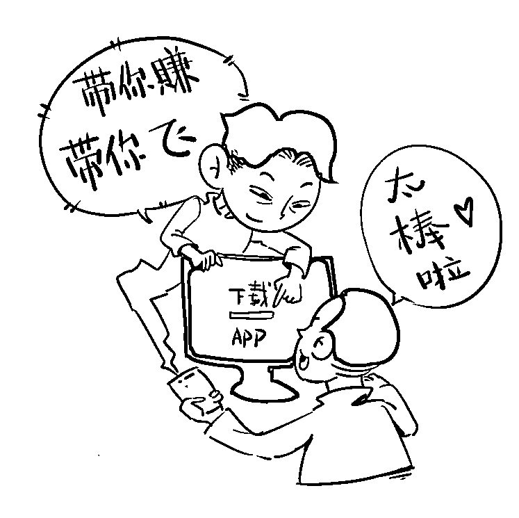

# “丢失”的 300 万！

> 原文：[`mp.weixin.qq.com/s?__biz=MzIyMDYwMTk0Mw==&mid=2247534936&idx=8&sn=5ee17ae6673d2bb4d85187a69d8f3a26&chksm=97cb8260a0bc0b764e5ec202992869912781e7695c7cae690c464082395a0a687c130b434008&scene=27#wechat_redirect`](http://mp.weixin.qq.com/s?__biz=MzIyMDYwMTk0Mw==&mid=2247534936&idx=8&sn=5ee17ae6673d2bb4d85187a69d8f3a26&chksm=97cb8260a0bc0b764e5ec202992869912781e7695c7cae690c464082395a0a687c130b434008&scene=27#wechat_redirect)

 随着股市开始火热，微信、QQ、抖音等网络社交平台上的一些“荐股黑群”也开始活跃。群内有所谓的“庄家”“大 V”进行“忽悠式荐股”，利用虚假投资平台飞速吸金，被骗事主损失惨重。我市一市民就因为加入“荐股群”损失 300 多万。  

案例

     近日，我市一市民在微信公众号看了一篇介绍投资炒股的文章，并扫描加入了文章内的 QQ 群。群内会有老师每天讲解股票、推荐新股，并发送了一个链接名为“长江 APP”的炒股软件。该市民注册了账户，此后就跟着老师的指示在平台购买各类股票。在平台投入少量资金试水显示盈利并且盈利资金可以提现后市民加大了投资，共计三百多万。后来该市民前往武汉长江证券公司查证这个投资平台是否属实，但并未在公司查到自己的账户，此时该市民发觉情况不对，立刻进行提现，结果并没有到账，第二天将股票全部卖掉再次申请提现，结果还是没有到账，这才确定是诈骗，共计损失三百多万。

骗术解析

步骤一：引流、布局

犯罪分子通过 QQ、微信、抖音等社交软件加受害人为好友，或者在公众号、微博、短视频平台、知乎等网络平台发帖、投广告，称有投资门路，吸引受害人关注。

随后拉人进群，组织“水军”在群里扮演投资者，晒出收益情况误导受害人。

步骤二：洗脑、诱导

犯罪分子在群聊中通过视频教程、导师指导等方法对受害人进行洗脑，通过高收益投资项目、稳赚不赔等幌子让受害人产生兴趣，向受害人发送链接或二维码下载虚假投资平台 APP，等受害人成功上钩后，再通过“导师诱导”进行投资。

步骤三：甜头、收割

犯罪分子通常会以小额收益让受害人初尝甜头，以为真能获利，再不断诱导受害人加大投资额度，在受害人进行大额投资后，通过后台直接操控投资标的涨幅，在极短时间内使受害人买进的股票一直跌停，直至全部赔完，或者通过后台操控直接关闭网站和 APP，使受害人无法提现，然后看着投资账户上有不少钱却无法提现，骗子就以“登录异常”、“服务器维护”、“银行账户冻结”等各种理由解释为何提现失败，紧接着再收取所谓的“保证金”、“解冻金”、“刷征信信誉”等再次诱导受害人转钱，直至将受害人榨干。

如何识别投资理财诈骗？

1、不要被所谓的高回报诱惑，犯罪分子塑造的投资项目无一例外都是超高年化收益，动辄 12%以上，甚至高达 30%-50%，而且稳赚不赔。

2、非官方应用市场下载的，都是黑平台犯罪分子制作的非法 app 是没法在官方应用市场上架的。如果对方推荐给你的投资项目，只能通过对方提供的网址链接或扫描二维码的方式下载，千万不要相信。

3、向个人账户转账一定要警惕购买理财产品，需要签订协议，资金将自动扣划。银监会严令禁止账户转账，更别提转账到个人账户。要求转账到个人账户或对公账户与平台名称不符的，都是诈骗平台。

1、请不要轻信陌生人发布的荐股、释放内幕消息等信息，不要加入所谓的“投资群”；

2、不要轻易下载陌生人推荐的、无法验证是否合法合规的理财 APP，更不能向平台注资；

3、如不慎被骗或遇可疑情形，请注意保护证据，立即拨打 110 报警或拨打乌鲁木齐市反诈专线 7654321 咨询。

来源：乌鲁木齐市反电信网络诈骗中心

← 向右滑动与灰产圈互动交流 →

