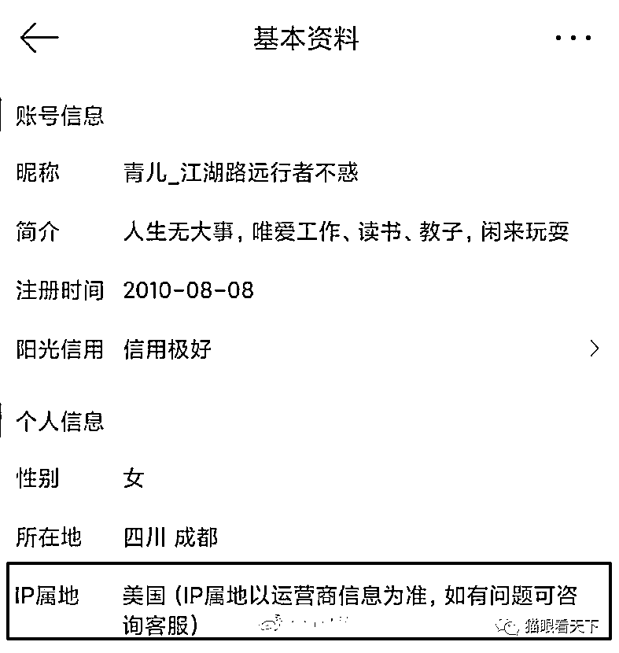

# IP 属地开放，牛鬼蛇蛇纷纷现形！

> 原文：[`mp.weixin.qq.com/s?__biz=MzIyMDYwMTk0Mw==&mid=2247535007&idx=3&sn=fb5212c4212ccdbd08f9df9cf1b75d23&chksm=97cb82a7a0bc0bb1b95bb12e337aacdb00842287db5cd392c9603f4328690c5d17599c7d033e&scene=27#wechat_redirect`](http://mp.weixin.qq.com/s?__biz=MzIyMDYwMTk0Mw==&mid=2247535007&idx=3&sn=fb5212c4212ccdbd08f9df9cf1b75d23&chksm=97cb82a7a0bc0bb1b95bb12e337aacdb00842287db5cd392c9603f4328690c5d17599c7d033e&scene=27#wechat_redirect)

微博平台显示发帖 IP，源自于俄乌战争爆发后，大量来源不明的网民冒充身在乌克兰地理位置在网上发布大量谣言信息，随后在相关主管部门的要求下，终于**开通了这个“揭开社交平台新纪元”的 IP 显示功能**。

有网友在此项功能开通后，将去年成都 49 中事件中那些极为活跃的微博帐号进行了查看，结果不出意料，果然有妖孽在作怪！

这种水军居然能显示出其阳光信用为极好，简直就是一个天大的讽刺！

熟悉网络的朋友都知道，近年来，美国、日本甚至台湾省每年都要专门拨款用来收买大量水军对中国的网络进行渗透，同时还有很多内地的名人为了这些“狗粮”，不惜抛弃自己的人格与立场，沦为为人不齿的美狗（行走的 50 万）、日杂和卖身台蛙的 1450。

再来看这个装十三货，冒充上海本地网民，结果 IP 显示出来后，直接就暴露出其真实的身份。

在**微博平台对部分参与敏感议题、热点舆论跟评账号采取显示 IP 地址措施**后，**微博舆论生态得到了有效净化**，那些曾在成都 49 中舆情中发表恶劣涉政谣言、挑唆煽动言论的账号 IP 已被证实为海外 IP 发出，至少让我们再次明白互联网舆论领域极为复杂严峻的斗争形势。

[`v.qq.com/iframe/preview.html?width=500&height=375&auto=0&vid=e3334ib160f`](https://v.qq.com/iframe/preview.html?width=500&height=375&auto=0&vid=e3334ib160f)

由于之前社交平台并不显示 IP 地址，大量来自于台湾省和美国等地的网络帐号，将自己装扮成国内的网民，大肆发表不实言论，散布有害信息，并常冒充就是事发地当事人或知情人的身份来**诱导网民，带歪舆论节奏**。

比如前不久某些国内媒体全力打压连花清瘟，就有不少来历不明的帐号兴风作浪，结果被查出来其 IP 来自于美国或中国台湾省。

同样的逻辑，如果辉瑞有用，要方舱做什么？**套路！**这个时候只说连花清瘟，而绝口不提辉瑞了！让民众不用几十块钱的中医药，去买防疫最烂国家 2300 元的辉瑞，说没有鬼有人信吗？

显示境外 IP 的方式起到了关键性作用。当这些账号开始转移阵地，前往抖音、快手、西瓜视频这些娱乐属性平台时，建议将显示重大舆论热点的账号 IP 做法进行同步推广，以方便不明真相的网民及时保持心理警惕。

网络渗透早就是美国政客在几十年前就制定的颠覆计划，他们通过直接拨款或通过民间非政府组织（NGO）的形式对中国全方位进行渗透，收买大量所谓教授、名人、记者、律师等作为他们在中国网络的代言人，长期发布不法信息，企图混淆视听，煽动对立。

这是一个来自于台湾的水军。但在网上去拼命掩饰自己的真实身份，伪装成国内普通的一个网民。然而，他却忘了微博的编辑都是有记录的，而且还是公开的，一下子就傻眼了。

再来看看网友对其身份的挖坟结果。

该号是一个女拳的活跃分子，却习惯在小尾巴上装饰成种花家的兔子，确实有一定的迷惑性。

结果，在微博平台开通显示 IP 后，现出了原形。

后来该号被禁言后，又利用了另外一个帐号继续作妖，结果依然没有逃过网友们的火眼金睛。

顺带介绍一下，微博上那些粉丝动辄上千万的当红明星们，他们无论发什么内容，都会有几百万的转发，让人们以为他们真是舆论场呼风唤雨的意见领袖，但当 IP 归属地功能开放后，众多明星“翻牌”粉丝的福利直接翻车了，原来有很多都是**工作人员或营销号水军在帮忙转发跟帖的**。这或许也是某些社交平台一直不肯开通显示发帖 IP 的原因之一吧。

来源：猫眼看天下，一帆 SPACE

← 向右滑动与灰产圈互动交流 →

