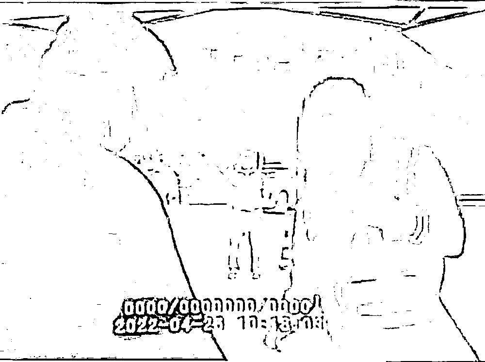
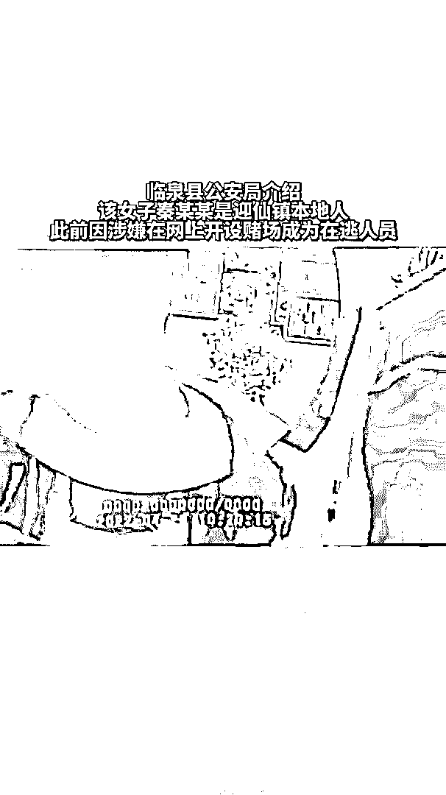

# 女友在防疫点被发现是逃犯，男子说了 9 个字

> 原文：[`mp.weixin.qq.com/s?__biz=MzIyMDYwMTk0Mw==&mid=2247535007&idx=4&sn=a6b093564fc91e33bbd4d569e8478bfa&chksm=97cb82a7a0bc0bb1f3bef813c2d5f32882c3bfc11d2f34de7f96782cbd5771fb3f0af15b85ba&scene=27#wechat_redirect`](http://mp.weixin.qq.com/s?__biz=MzIyMDYwMTk0Mw==&mid=2247535007&idx=4&sn=a6b093564fc91e33bbd4d569e8478bfa&chksm=97cb82a7a0bc0bb1f3bef813c2d5f32882c3bfc11d2f34de7f96782cbd5771fb3f0af15b85ba&scene=27#wechat_redirect)

4 月 26 日

安徽临泉一对情侣

在防疫点接受民警排查时

**女子被发现是逃犯**

**其男友震惊地说了 9 个字……**

[`mp.weixin.qq.com/mp/readtemplate?t=pages/video_player_tmpl&action=mpvideo&auto=0&vid=wxv_2379201899977162754`](https://mp.weixin.qq.com/mp/readtemplate?t=pages/video_player_tmpl&action=mpvideo&auto=0&vid=wxv_2379201899977162754)

安徽省阜阳市临泉县公安局向记者介绍，当时，民警在临泉县迎仙镇的疫情防控点排查往来车辆和人员，核查行程、健康码及相关身份信息。一对男女驱车从河南方向过来，接受排查时，**民警发现那名女子十分可疑，说记不得自己的身份证号**。民警现场核实，发现她是涉嫌开设赌场的在逃人员秦某某，当即将其控制。

视频显示，当时民警问男子车上人员是谁，男子说**“俺对象”**。民警又问女子：**“身份证号也记不住吗？”**并让她拉下口罩、拨开头发，很快用警用设备核实了她的身份：**“逃犯！”**

随后，民警将这对男女带上了警车，男子似乎还不敢相信眼前这一幕，喃喃自语道：**“乖娘咧，逃犯？”**随后他又质问女子：**“你骗我吗？”**

这段警方拍下的视频公开后引发网友热议，有人评价道：“求男子心理阴影面积。”还有网友说：“比初恋还难忘。”

临泉县公安局介绍，该女子秦某某是迎仙镇本地人，此前因涉嫌在网上开设赌场成为在逃人员，目前案件还在办理中。秦某某的男友也是迎仙镇人，两人交往了多久，警方并未透露。

来源：极目新闻、网友评论、红网

← 向右滑动与灰产圈互动交流 →

