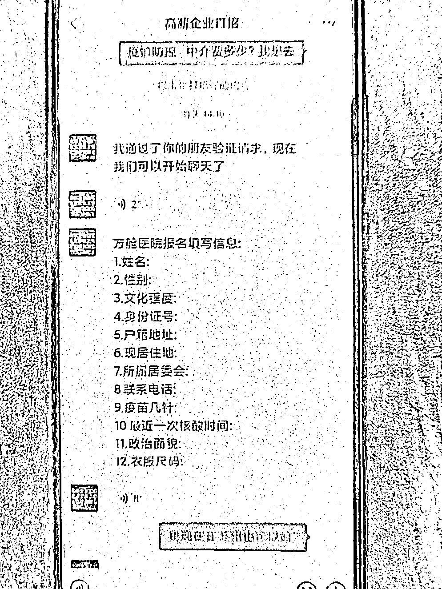

# 日薪 2000 元招聘方舱志愿者？报警吧！

> 原文：[`mp.weixin.qq.com/s?__biz=MzIyMDYwMTk0Mw==&mid=2247535007&idx=6&sn=fe50d9ac4a2f11d44865fff36d46e135&chksm=97cb82a7a0bc0bb14fcc98171dc3b02a173a36aeecc88055fe06937bd3f45d455940e5b8b7ca&scene=27#wechat_redirect`](http://mp.weixin.qq.com/s?__biz=MzIyMDYwMTk0Mw==&mid=2247535007&idx=6&sn=fe50d9ac4a2f11d44865fff36d46e135&chksm=97cb82a7a0bc0bb14fcc98171dc3b02a173a36aeecc88055fe06937bd3f45d455940e5b8b7ca&scene=27#wechat_redirect)

> **因疫情防控需要，现紧急招募方舱工作人员若干，日薪 2000 元/天，工作简单包吃包住，有意向的快来联系我……**

当前正值疫情防控关键时期

一些不法分子

却趁机以“疫情期间高薪招聘”为由

设下了新的骗局

近日，江苏苏州高新区公安分局狮山派出所接到了**市民小薛报警，称其在网上报名志愿者被骗了。**

**据小薛讲述，**他在网上看到有人发布“招募方舱志愿者”的信息，觉得既能帮忙也能赚钱，便添加信息发布者的微信，进一步详聊。****

****

**添加微信后，对方先让小薛填写了个人信息，告知其方舱志愿者的招聘条件：**“日薪 2000 元/天，工作要求简单，只要接种过三针疫苗，45 岁以下的成年人即可，而且包吃包住，还有专车接送，但需要交 500 元中介费预定名额。”****

********

******“转完钱马上给你报名，名额不多了。”**对方催促着小薛赶快转账。小薛随即通过微信转账的方式，将 500 元转入对方账户。****

********

****第二天中午，他没有等到通知上岗的电话，却等来了对方要求继续转款的消息。****

****对方以该岗比较抢手，需要再加价 500 元才能帮其报名上岗。此时，小薛这才意识到自己可能被骗了，赶忙报警求助。目前，该案件正在进一步侦办中。****

******套路揭秘******

****在此类新型骗局中，不法分子蹭着时事热点，打着招聘工作人员、志愿者的名义，发布虚假招聘信息，等待受骗人主动联系后，向其收取“报名费”“体检费”“培训费”“核酸检测”等费用，待受骗人支付一系列费用后则消失得无影无踪，以达到诈骗的目的。****

**************警方提示******

****1.寻找招聘信息应选择正规可靠途径，不轻信来源不明的招聘信息，在未签订正式用工合同、未安排上岗的情况下，就提前收取各类费用的，大多是诈骗。****

****2.招聘过程中，要注意保护好自己的银行卡号、银行卡密码和验证码等隐私信息，不要轻易向陌生人转账汇款，避免造成财产损失。****

****3.如果发现被骗，应立即保存相关聊天截图、支付记录，并第一时间拨打 110 报警。****

****来源：公安部网安局，潇湘晨报************

****← 向右滑动与灰产圈互动交流 →****

********