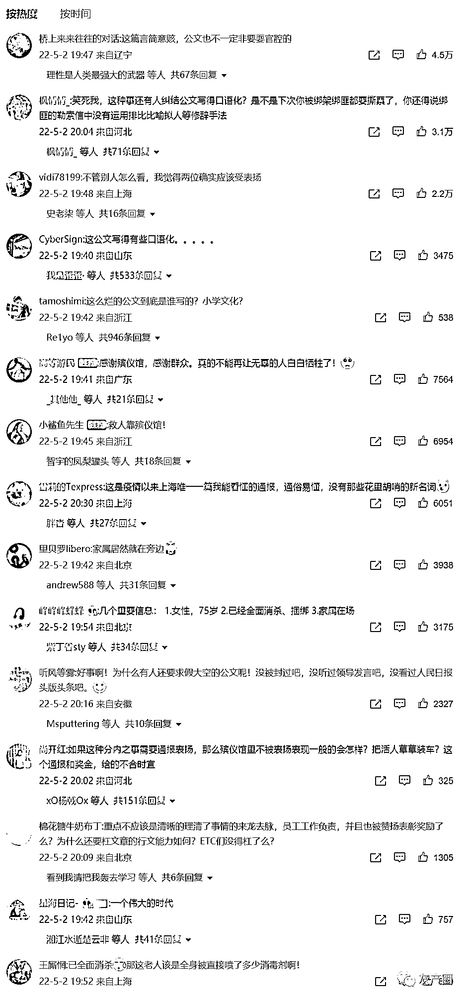

# 上海殡仪馆通报表扬奖励“福利院老人未死亡被转运”事件两当事人！

> 原文：[`mp.weixin.qq.com/s?__biz=MzIyMDYwMTk0Mw==&mid=2247535087&idx=3&sn=72b6da31cd5640674822fc3f8114f270&chksm=97cb82d7a0bc0bc1915c2146a7f573875a43699d847c2eaec3a2a391f0eebce592a0cfe1c3ea&scene=27#wechat_redirect`](http://mp.weixin.qq.com/s?__biz=MzIyMDYwMTk0Mw==&mid=2247535087&idx=3&sn=72b6da31cd5640674822fc3f8114f270&chksm=97cb82d7a0bc0bc1915c2146a7f573875a43699d847c2eaec3a2a391f0eebce592a0cfe1c3ea&scene=27#wechat_redirect)

5 月 1 日，网传上海新长征福利院转运“死亡”老人时，发现老人仍有生命体征。再慢一点，一个活生生的人就要被超度了（**此前报道：**[**惊天丑闻！上海一福利院转运“死亡”老人时发现是活的还在动，差点直接火化！**](http://mp.weixin.qq.com/s?__biz=MzIyMDYwMTk0Mw==&mid=2247535007&idx=1&sn=2bdff9a4ad3a85a3274e8d9ca5aa4d8d&chksm=97cb82a7a0bc0bb1b7379379e8954d3d30fb7823d907046b2450282f202532ae6c8c75a90cbd&scene=21#wechat_redirect)）。2 号，上海通报福利院老人未死亡被转运：上海 5 人因错转福利院老人被问责；吊销涉事医生田某某医师执业证，并由公安机关立案调查。目前老人生命体征平稳。 

宝山殡仪馆这两个工作人员吴建冲和韩斐值得嘉奖，从文中可以看出，“已进行全面消杀、密封和包扎好”这位老人真是福大命大

* * *

来源：微博那些事儿

← 向右滑动与灰产圈互动交流 →

