# “油卡 9 折，机不可失，内部渠道，欲购从速！”

> 原文：[`mp.weixin.qq.com/s?__biz=MzIyMDYwMTk0Mw==&mid=2247535087&idx=5&sn=fd559565411170ab843519f7640f2677&chksm=97cb82d7a0bc0bc13bebb55d66b25053da4317819d4b45054fb3a0dd09cc19066ad5468857c4&scene=27#wechat_redirect`](http://mp.weixin.qq.com/s?__biz=MzIyMDYwMTk0Mw==&mid=2247535087&idx=5&sn=fd559565411170ab843519f7640f2677&chksm=97cb82d7a0bc0bc13bebb55d66b25053da4317819d4b45054fb3a0dd09cc19066ad5468857c4&scene=27#wechat_redirect)

*“油卡 9 折，机不可失*

*内部渠道，欲购**从速**！上当”*

看到这样的消息，你已经心动了？ 

或许等待你的是陷阱…… 

4 月初，网约车司机孙先生

在网站发布需要购买加油卡的信息

不久就有人联系孙先生

称有 7 张面值 1000 元的加油卡

**能以 9 折优惠转卖**

不过，需要先付一半定金

再把 7 张加油卡发给孙先生

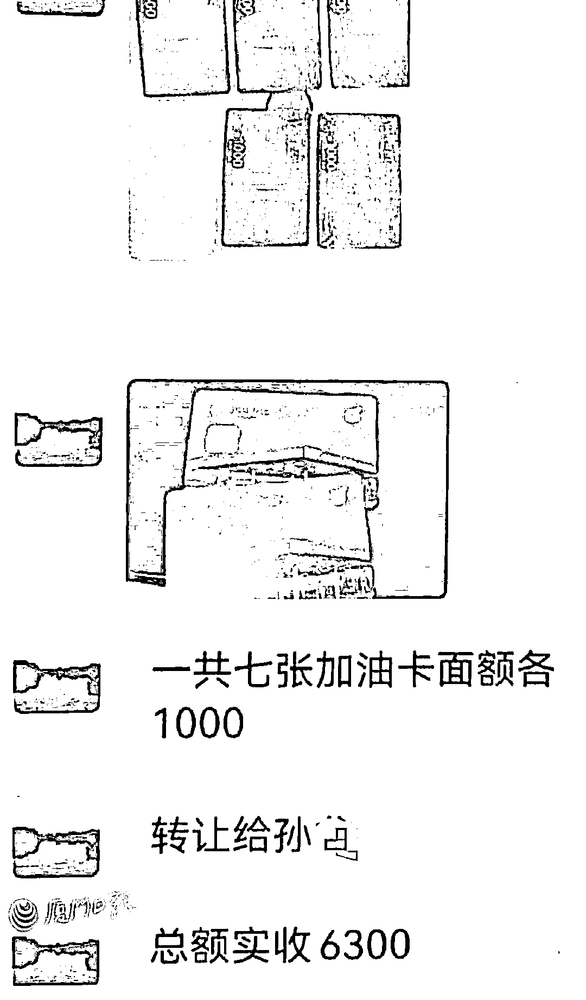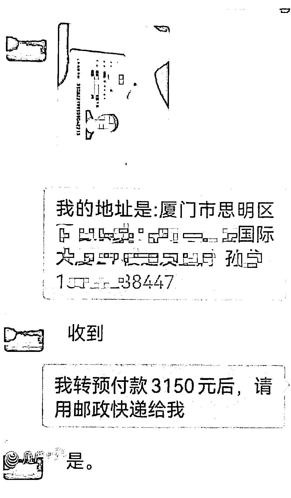

为了获取孙先生的信任 

对方还发来加油卡和身份证照片

于是，孙先生将 3150 元

转到对方指定银行账户中

对方称当天会发货

并告知同事也有 8 张面值 1000 元的加油卡

**能以 8.5 折出售**

于是，孙先生再将 3400 元“定金”转给对方

之后几天，孙先生反复询问

15 张加油卡是否寄出

对方以各种理由推脱

直到孙先生发现自己**微信被拉黑**

**才意识到被骗，并拨打 110 报警**

**目前，该案件正在进一步侦办中**

**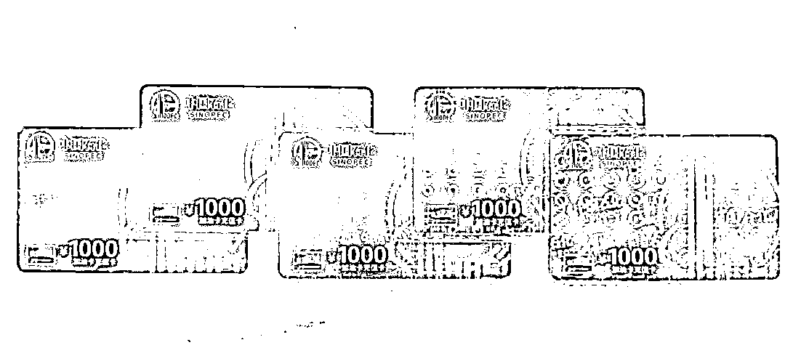**

****揭秘：骗子利用“捡漏”或“便宜”心理实施诈骗！****

****孙先生遭遇了典型的网络购物骗局，骗子打着“优惠加油卡”的幌子，利用受害者想购买“低价”“折扣”加油卡的“捡漏”心理，以“先交定金，后发油卡”的理由，诱骗受害者向指定账户转账汇款。为了增强可信度，骗子还发送身份证和加油卡的照片。****

****以上遭遇并非个案****

****骗子都是利用受害者逐利、求惠的想法****

****并抓住部分人想收购加油卡****

****进行倒卖获利的心理****

****一步步实施诈骗****

****加油卡、充值卡骗局层出不穷****

****但经常有人上当****

****被不法分子利用，导致资金损失****

******近日，中国石化发布澄清公告：******

****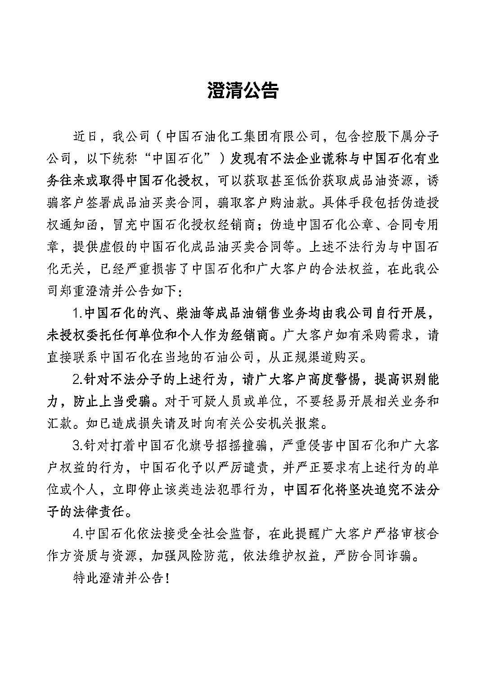****

****我公司（中国石油化工集团有限公司，包含控股下属分子 公司，以下统称“中国石化”）**发现有不法企业谎称与中国石化有业务往来或取得中国石化授权**，可以获取甚至低价获取成品油资源，诱骗客户签署成品油买卖合同，骗取客户购油款。具体手段包括伪造授权通知函，冒充中国石化授权经销商；伪造中国石化公章、合同专用 章，提供虚假的中国石化成品油买卖合同等。上述不法行为与中国石 化无关，已经严重损害了中国石化和广大客户的合法权益，在此我公司郑重澄清并公告如下：****

****1.**中国石化的汽、柴油等成品油销售业务均由我公司自行开展， 未授权委托任何单位和个人作为经销商。**广大客户如有采购需求，请 直接联系中国石化在当地的石油公司，从正规渠道购买。****

 ****2.**针对不法分子的上述行为，请广大客户高度警惕，提高识别能 力，防止上当受骗**。对于可疑人员或单位，不要轻易开展相关业务和 汇款。如已造成损失请及时向有关公安机关报案。

3.针对打着中国石化旗号招摇撞骗，严重侵害中国石化和广大客 户权益的行为，中国石化予以严厉谴责，并严正要求有上述行为的单 位或个人，立即停止该类违法犯罪行为，**中国石化将坚决追究不法分 子的法律责任**。

4.**中国石化依法接受全社会监督**，在此提醒广大客户严格审核合 作方资质与资源，加强风险防范，依法维护权益，严防合同诈骗。 

特此澄清并公告！**** 

******案例 1：真卡假卖，到手成空******

******近日，李女士在某二手交易平台看到有卖家发布广告，称出售“中石化折扣油卡”。卖家说，94 折就能买到价值 1000 元油卡。禁不住低价诱惑，李女士花费 940 元购买了一张油卡，下单几日后，便收到了油卡，李女士当天到加油站查询，**确认卡内余额为 1000 元**，她便在网上点击收货。******

******次日，李女士开车到加油站并出示这张卡，当她准备加油之际，却被工作人员告知**油卡已停用**。******

******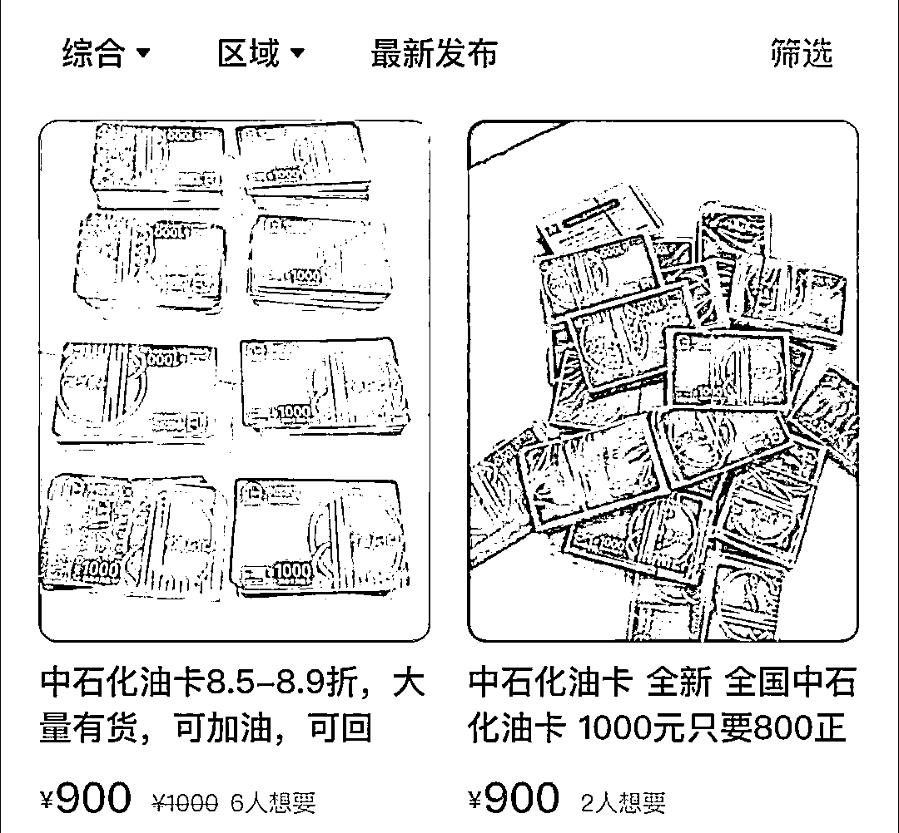******

******仅间隔一天，加油卡就无法使用，让李女士措手不及。她咨询油站工作人员得知，自己拿到的是一张副卡，卖家手中的主卡可以随时停用副卡并冻结油费。李女士再去联系卖家时，发现自己被拉黑，随即报案。****** 

********案例 2：代销加油卡，音讯全无********

******几天前，许先生加入某微信群，有人发消息称有“中石化的 9 折卡”。考虑到油价上涨带来成本增加，许先生遂添加对方为好友，询问起油卡事宜。******

******这位网友说，“我们公司与加油站有合作，代理销售加油卡且有优惠，这样的价格优势在市场上享受不到。”在对方多买多打折的优惠攻势下，许先生最终转账 1.5 万元给对方，随后便坐等油卡到手。但许先生怎么发消息催对方都不回，钱款也没了着落。****** 

******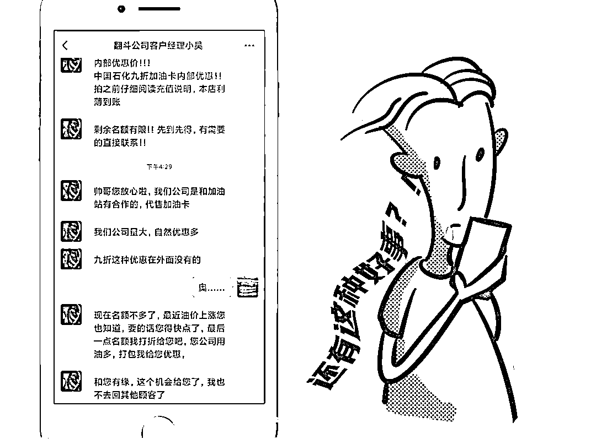******

********案例 3：充值返现，按月返还********

******2 月 6 日，无锡的小林在微信群看到有人发消息，称可以加油便宜。小林就私加了对方微信，对方称充 4500 元，返现 5000 元到油卡，但是 5000 元是按月返还。******

******小林毫不犹豫地转账，**前两次还可以正常使用，但第三次要用时，显示油卡余额不足**。小林想找对方却发现已被拉黑，并将其踢出群聊。******

******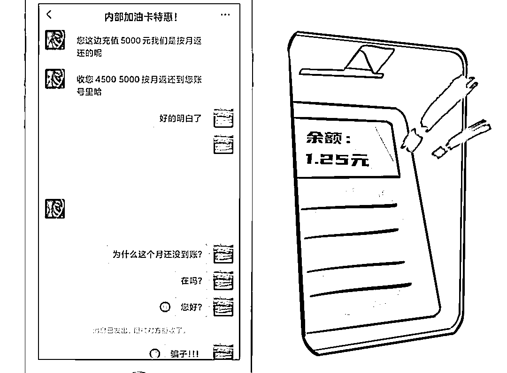******

******类似的诈骗套路还有许多******

******骗子会谎称**“与加油站合作”********

********“内部促销卡”“二手平台打折油卡”********

****甚至会“设计”出看似逼真的****

****“收购油卡”“内部合作”平台****

****降低受害者的警惕性****

****导致上当受骗****

****下面，我们为你揭秘****

****“加油卡”的几种常见骗术~****

******骗术 1：谎称与加油站合作******

****这类“打折加油卡”骗局，通常会说自己的加油卡与中石化等企业合作，通过“内部渠道获得”，然后以 8 折或者 9 折的价格出售。多数车主会先选择买个小面额的试一下，发现真的可以用之后，就会放松警惕。当车主使用完后，骗子就会主动联系，并借口最近折扣油卡紧张，劝车主大额购买油卡。于是，车主们一步步陷入骗子的圈套。****

******骗术 2：内部促销渠道******

******这种骗局一般都是通过电话方式进行推广，骗子会声称自己是某某加油站的，因为公司内部资金出现问题，开始 8 至 9 折促销加油卡等。同时，打折购买的加油卡既可以自己卖出，也可以“全额回收”。但是，这种投资要一个月之后才能拿到货。一旦有人大额购买，或达到一定额度，“公司”就会卷钱跑路。******

********骗术 3：二手平台“打折油卡”********

******这种骗子一般在二手交易平台上，宣称打折出售加油卡。买家能收到油卡，并且卡里真的有钱可用。这时剧情才真正开始，你拿到的是副卡，主卡可以随时停用副卡，并冻结里面的油费，油卡在你加了一两次油后，很快就被停用了！******

******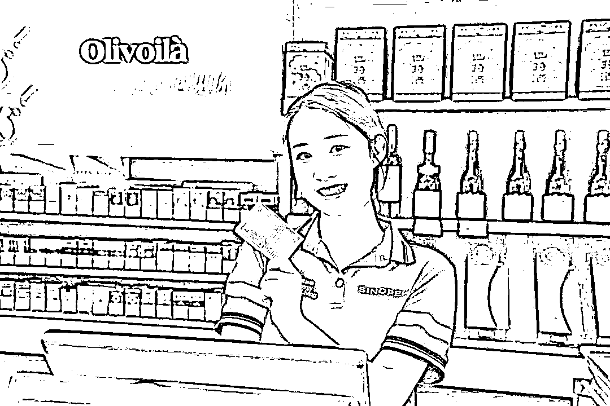******

****** 关于加油卡******

******我们

再来给大家科普下~****** 

********购买卡片要认准正规渠道********

****不要轻信各类卡券的诱人广告，不要贪图便宜购买价格远低于面值的充值卡，尤其是在网络平台出售的打折加油卡。因为你即使发现油卡无法使用，也很难维权。****

****购买加油卡和充值卡，要通过**正规的渠道**，到中国石化办卡网点或者中国石化加油站去购买。****

****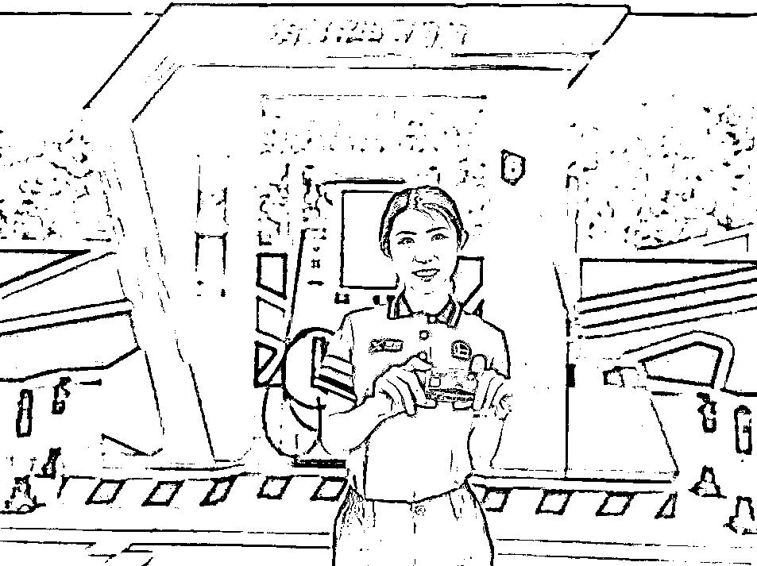****

******优惠折扣过大需谨慎******

****大幅度的优惠，并不符合成品油市场的运行规律。“加油卡团购”“充值分期返”等信息多是虚假的，特别是要警惕折扣较大的加油卡优惠信息。****

****中国石化未授权第三方销售加油卡和充值卡，打折幅度在九折以上的加油卡风险就非常高了，需要格外小心谨防上当受骗。****

****尤其注意：充值金额不能秒到，返现分期到账的，这些很可能是骗子在玩**庞氏骗局**。贪便宜的后果，很可能是“竹篮子打水一场空”哦！****

******要及时关注官方发布信息******

****在中国石化加油卡网上营业厅的公告信息中，长期发布客户公告，会向用户声明近来一些声称与中国石化有优惠合作的信息，同时提醒消费者切勿上当。****

****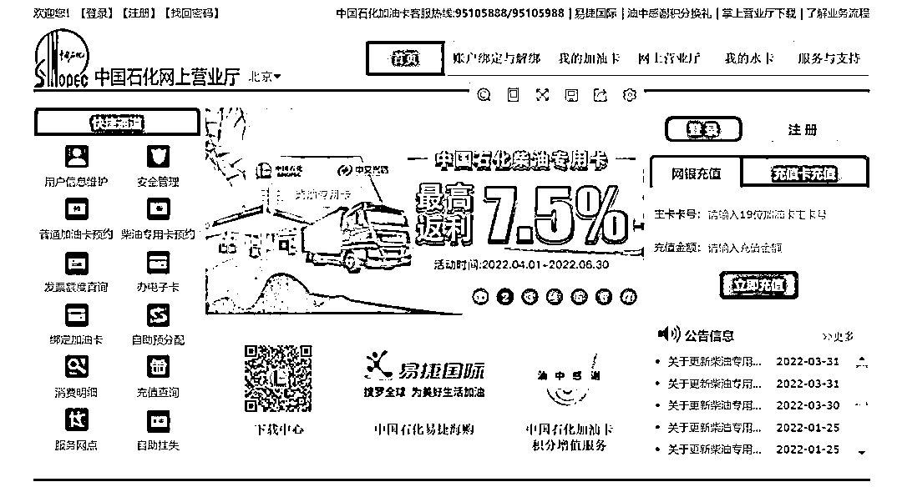****

****中国石化加油卡网上营业厅▲****

****有疑惑的车友****

****可以通过官方渠道来确认信息****

****官方地址：****

****https://www.sinopecsales.com/****

****中国石化加油卡客服热线：****

****95105888/95105988****

****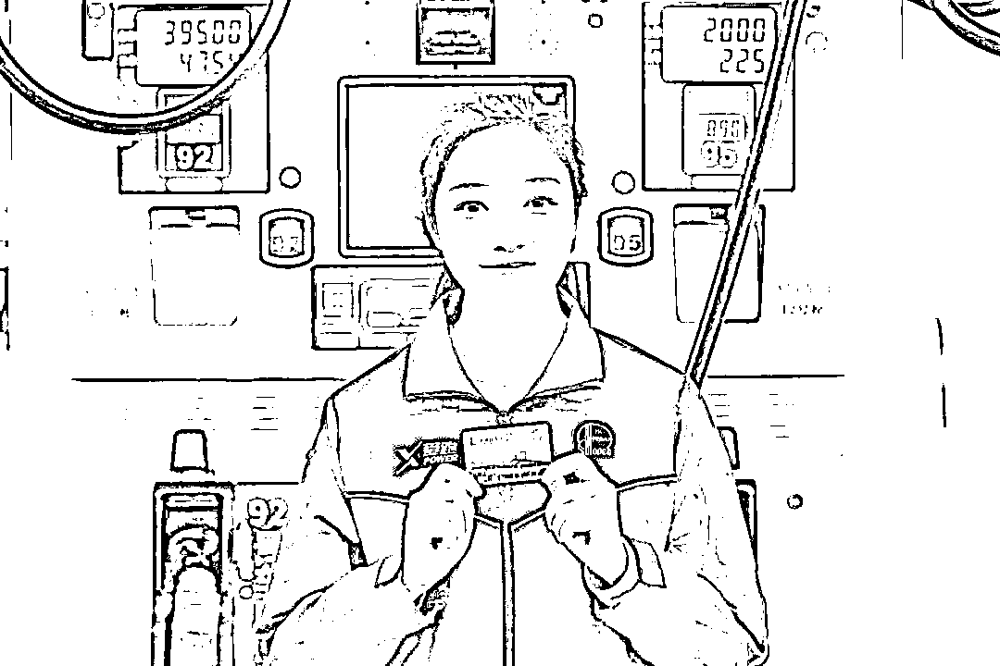****

****各位车主朋友****

****切记擦亮眼睛****

****避免被不法分子利用****

****图小利造成大损失****

****来源：中国石化****

********

****← 向右滑动与灰产圈互动交流 →****

********