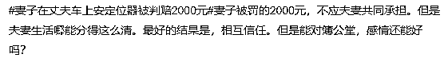

# 妻子在丈夫车上装定位器，被判赔 2000 块

> 原文：[`mp.weixin.qq.com/s?__biz=MzIyMDYwMTk0Mw==&mid=2247535087&idx=6&sn=3173214b8fdcfcf141e807fd0cd17759&chksm=97cb82d7a0bc0bc1e73bcf3af623f3807df653ada19ea604a29e8987c6f6eed978920ca83124&scene=27#wechat_redirect`](http://mp.weixin.qq.com/s?__biz=MzIyMDYwMTk0Mw==&mid=2247535087&idx=6&sn=3173214b8fdcfcf141e807fd0cd17759&chksm=97cb82d7a0bc0bc1e73bcf3af623f3807df653ada19ea604a29e8987c6f6eed978920ca83124&scene=27#wechat_redirect)

2020 年 9 月 17 日， 

妻子路女士在丈夫刘先生不知情的情况下，

给其名下雪佛兰轿车安装了定位器。

刘先生称，

**“我驾驶汽车上班途中****，**

**她（路女士）打电话告知我，**

**她在车上安装了定位器，**

**可能会爆炸。”**

当天中午，

刘先生前往 4S 店拆除定位器，

发现定位器已经没电。

[`mp.weixin.qq.com/mp/readtemplate?t=pages/video_player_tmpl&action=mpvideo&auto=0&vid=wxv_2381608603960082433`](https://mp.weixin.qq.com/mp/readtemplate?t=pages/video_player_tmpl&action=mpvideo&auto=0&vid=wxv_2381608603960082433)

从审判文书中可知，

**二人曾进行过婚姻诉讼，**

因此刘先生认为，

**路女士的真正目的在于**

**探知他的行踪信息，**

**进而窥探该行踪信息**

**背后所隐含的私生活秘密。**

不仅如此，

刘先生还认为，

安装的定位器，

若出现高温情况会导致爆炸，

对他和车的安全都有威胁。

因此，**刘先生以其****健康权、**

**财产权、隐私权和****个人信息权**

**遭到路女士侵犯为由，**

**向北京市海淀区人民法院起诉，**

**要求妻子赔偿精神损失费 10000 元。**

庭审中，

路女士表示，

她安装定位器的目的是

**“随时知晓车辆位置”**。

另外，

她与刘先生感情较好，

并没有矛盾和冲突，

而安装定位器会爆炸一说，

也并非真实。

路女士认为，

**作为夫妻，**

**她有权知道这辆轿车及刘先生的行程信息。**

**且她在安装定位器次日便通知了刘先生，**

**客观上并未得知**

**刘先生使用车辆的位置及行程，**

**主观上亦无侵犯刘先生隐私的故意。**

**法院判决：妻子侵犯丈夫隐私权，赔偿 2000 元**

法院认为 

自然人享有隐私权，

任何组织或个人不得以

刺探、侵扰、泄露、公开等方式

侵害他人隐私权。

在本案中， 

尽管二人是夫妻，

但在法律意义上，

双方均为相对独立的民事主体，

这就意味着

**二人不可以在未获对方许可的情况下，**

**任意实施侵犯对方私密空间的行为，**

**刺探、获取对方的私密信息。**

**法律科普：可以调查伴侣，但要用合法手段**

据法院判决，

由于夫妻之间具有相互忠诚的道德义务， 

**路女士有权过问甚至调查刘先生**

**是否具有违背夫妻忠诚义务的不当行为，**

此即为目的上具有正当性。

但路女士为了实现正当目的，

**通过私自安装定位器的做法实现，**

**明显具有违法性。**

路女士虽然主张其在

安装定位器的次日就通知了刘先生，

但针对该主张，

**路女士未提供相应的证据证明，**

**因此法院不予采信。**

鉴于路女士的行为

已经侵犯刘先生的隐私权，

给其精神上造成损害，

**法院对刘先生要求路女士**

**赔偿精神损害抚慰金的诉讼请求，**

**予以支持，**

**酌情判定赔偿金额为 2000 元。**

据悉，

在一审法院判决后，

路女士不服上诉，

二审仍维持原判。

****“枕边人”闹上法庭**，网友看了都摇头**

**夫妻一场，本是缘分，** 

**却最终失去信任、对簿公堂，**

**网友：**

**** 

**** 

****

****

****

*****妻子给丈夫装定位器，*****

*****丈夫将妻子诉上公堂，*****

*****如此“恩怨夫妻”，***** 

*****你怎么看？*****

**来源：央视网综合红星新闻、时间视频**

****

**← 向右滑动与灰产圈互动交流 →**

****