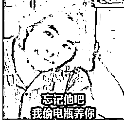
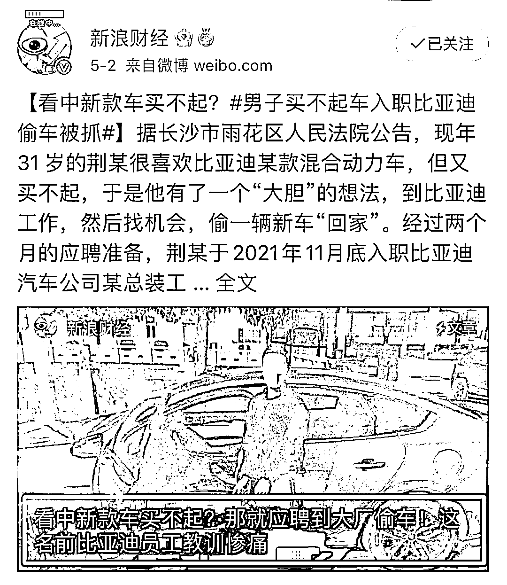
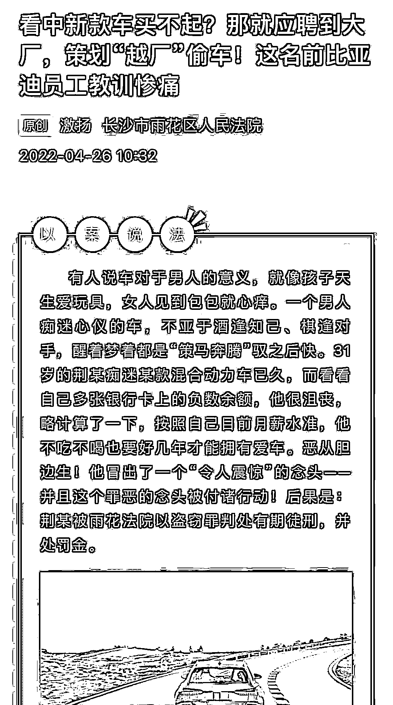
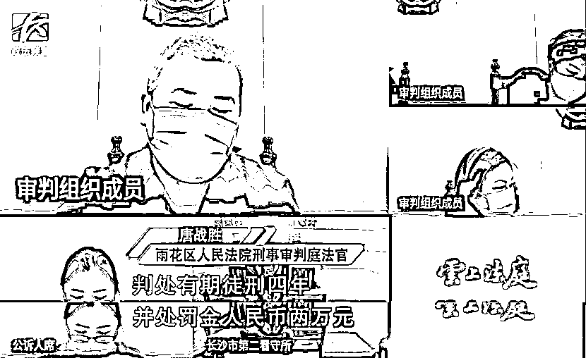
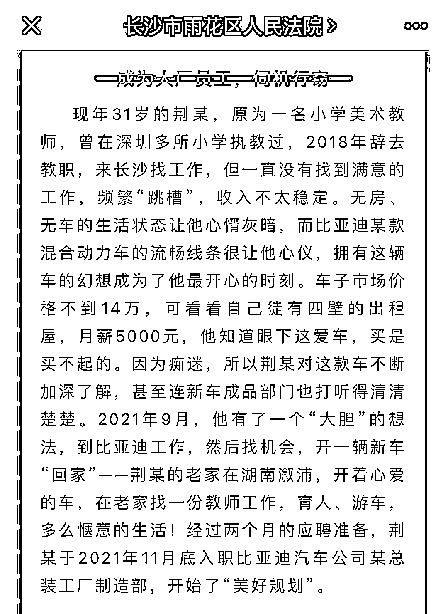
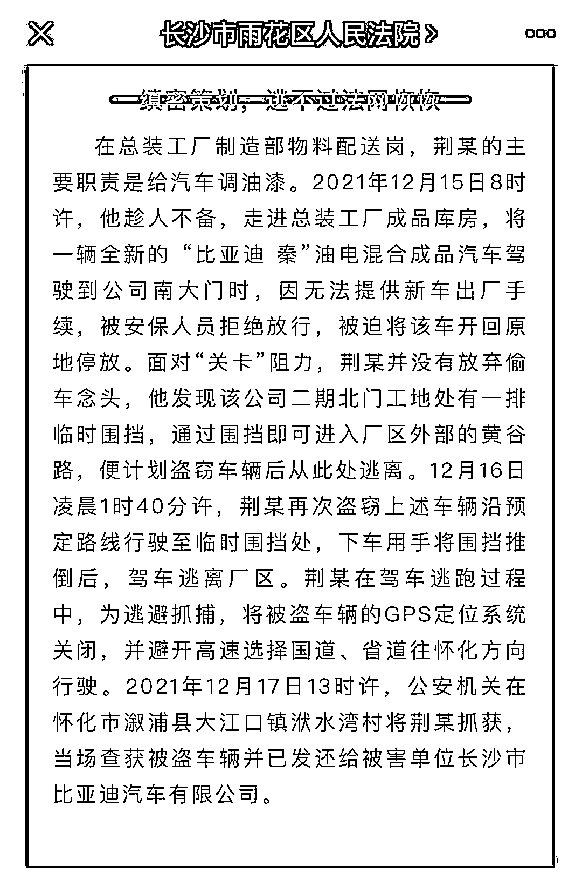
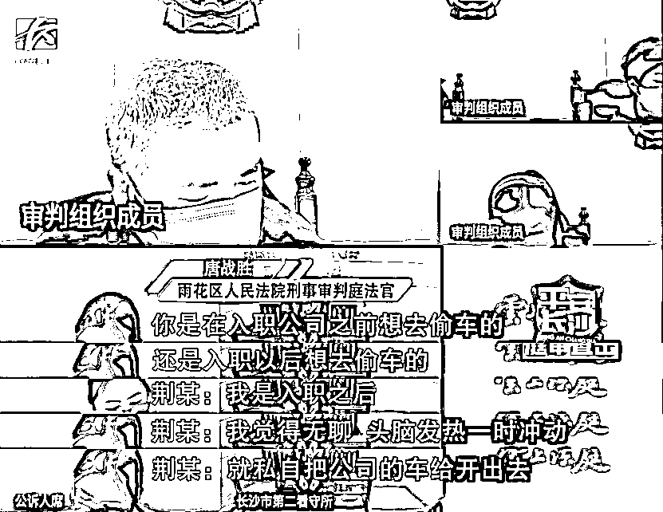
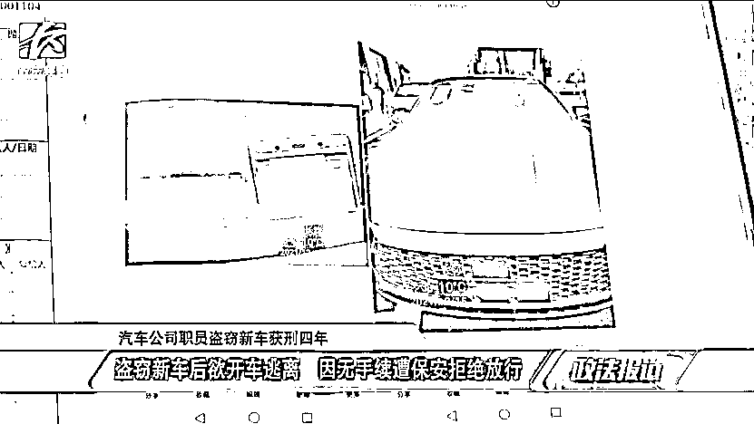
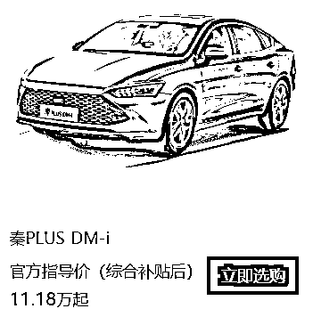

# 看中新款买不起，男子竟入职比亚迪偷车？！

> 原文：[`mp.weixin.qq.com/s?__biz=MzIyMDYwMTk0Mw==&mid=2247535162&idx=3&sn=32f0b3888be6da787032edfd7c914da1&chksm=97cb8102a0bc0814290b8deee52b049f54ae0cb16f0256ea5acecf35b3b36b1ded614d4ac5be&scene=27#wechat_redirect`](http://mp.weixin.qq.com/s?__biz=MzIyMDYwMTk0Mw==&mid=2247535162&idx=3&sn=32f0b3888be6da787032edfd7c914da1&chksm=97cb8102a0bc0814290b8deee52b049f54ae0cb16f0256ea5acecf35b3b36b1ded614d4ac5be&scene=27#wechat_redirect)

都 2022 年了，监控遍地都是，还有人偷汽车？别说，还真有！

最近我在网上冲浪的时候刷到这样一条新闻，说一 31 岁男子看中了一辆比亚迪汽车，但是呢自己又没什么钱，随后竟然入职这家车企，然后把车偷偷开跑了。

图片来源：@新浪财经

我的第一反应是，这如果不是比亚迪的软文就是沙雕新闻在冲业绩吧！

仔细看了下，这条新闻源自 @长沙市雨花区人民法院。

图片来源：@长沙市雨花区人民法院

而且偷车的男子被雨花法院以盗窃罪判处有期徒刑 4 年，并处罚金 2 万元。

图片来源：@长沙市雨花区人民法院

据报道，现年 31 岁的荆某，曾在深圳多所小学教美术，2018 年来到长沙，工作也不是很稳定。

在经过两个月的准备之后，2021 年 11 月底荆某入职比亚迪，主要职责是给汽车调油漆。

图片来源：@长沙市雨花区人民法院

2021 年 12 月 15 日，他想把一辆比亚迪·秦油电混合成品汽车油电混合成品汽车开出厂区，被保安拦下，因无法提供新车出厂手续，荆某被迫将车开回原处。

12 月 16 日凌晨，他再次把这辆车开到了厂区临时围挡处，推倒围挡后，驾车逃离厂区。

逃离过程中，荆某还将被盗车辆的 GPS 定位系统关闭，并避开高速选择国道、省道。

图片来源：@长沙市雨花区人民法院

结果第二天，就被公安机关抓获了。

图片来源：@长沙市雨花区人民法院

可真刑！

不过，庭审视频中倒是有一个细节值得注意。 

当法官问及荆某是在入职前想偷车的，还是入职后想偷车的，荆某表示是在入职后。 

图片来源：@长沙市雨花区人民法院

跟其它网友一样，我也对荆某的行为表示不解。

从公开图片看，荆某盗取的应该是一辆秦 PLUS DM-i。

图片来源：@长沙市雨花区人民法院

当前官网售价 11.18 万起。

图片来源：@比亚迪官网

荆某盗取的这辆车子市场价格不到 14 万。

分期付款它不香吗？而且一般车厂对员工都会有内购优惠价吧！

莫不是觉得 4S 店现车等的时间太久了，想来工厂监监工？

这要是在房地产公司上班还不得先偷套房？

参考资料来源：

长沙市雨花区人民法院：看中新款车买不起？那就应聘到大厂，策划“越厂”偷车！这名前比亚迪员工教训惨痛

来源：躺倒鸭

**风沙太大，敬请关注，谨防失联**

← 向右滑动与灰产圈互动交流 →

