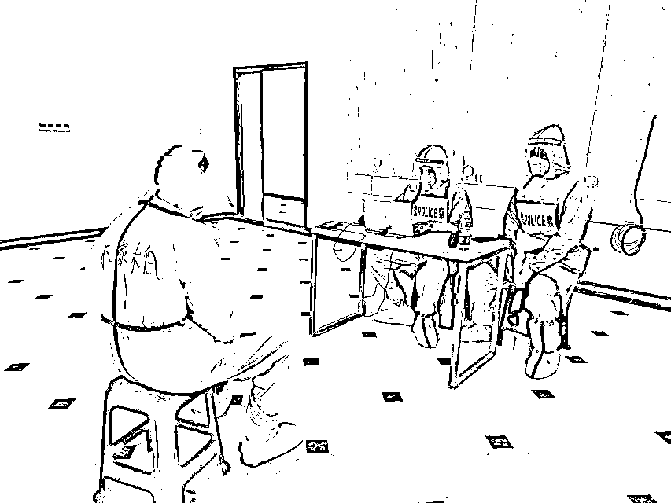
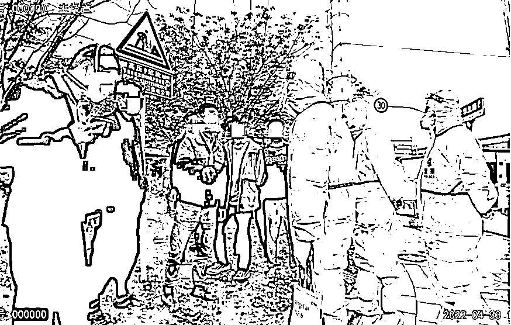

# 入方舱工作竟是为了敲诈勒索！上海警方：8 人被采取刑事强制措施

> 原文：[`mp.weixin.qq.com/s?__biz=MzIyMDYwMTk0Mw==&mid=2247535162&idx=5&sn=4c40c81ad9a43132a0211967c3367c9b&chksm=97cb8102a0bc0814be14b1a33ea2497365578b0357e0541396fb9abf703c90744512c0321bc8&scene=27#wechat_redirect`](http://mp.weixin.qq.com/s?__biz=MzIyMDYwMTk0Mw==&mid=2247535162&idx=5&sn=4c40c81ad9a43132a0211967c3367c9b&chksm=97cb8102a0bc0814be14b1a33ea2497365578b0357e0541396fb9abf703c90744512c0321bc8&scene=27#wechat_redirect)

记者从上海市公安局获悉，近日，松江警方成功查处一起涉疫敲诈勒索案，犯罪嫌疑人林某（男，24 岁）等 8 人被依法采取刑事强制措施。

据警方通报，4 月 30 日，松江警方接报一起警情，**林某等人在方舱工作才三天，就以工作强度高、住宿条件差等理由挑唆工友“罢工”，以扬言跳楼要挟劳务派遣公司解除劳动合同，并索要赔款每人 3 万余元。**民警在调查中发现，4 月中旬，**该团伙在外区方舱****医院以类似手法索赔得手 4 万余元，**警方遂开展循线追踪。

松江公安分局荣乐东路派出所民警对涉案人员开展法律告知。（警方供图）

民警初步调查发现，这些人最初就是带着“搞事情”的目的，入方舱医院之前便互相串通，约定以“住宿条件差、工作强度高”等各种理由煽动工友，逼迫劳务派遣公司赔付钱款。4 月中旬，团伙在外区方舱医院以类似手法索赔得手 4 万余元。警方于是开展立案侦查。

据林某交代，他伙同李某等人专挑方舱医院工作岗位应聘，入舱前商量好在工作几日后，以“住宿条件差、工作强度高”等理由向劳务派遣公司提出解除劳动合同，并索要高额隔离费。如公司不同意，便以极端手段逼迫公司赔偿。

4 月 24 日入舱后，仅仅工作 3 日，便开始每日在方舱内无事生非、起哄闹事，威胁公司支付赔款，直至扬言跳楼，最终被警方传唤。目前，犯罪嫌疑人林某等 8 人已被依法采取刑事强制措施。案件正在进一步审理中。

来源：半岛都市报，巴蜀反诈**风沙太大，敬请关注，谨防失联**

← 向右滑动与灰产圈互动交流 →

