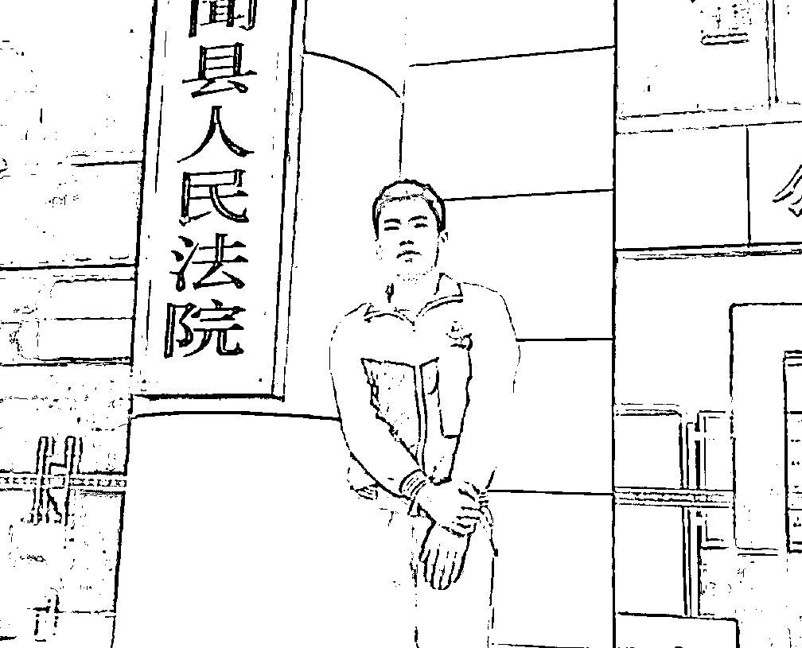
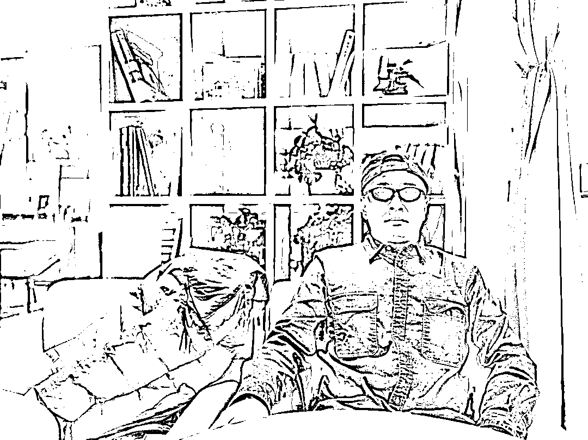
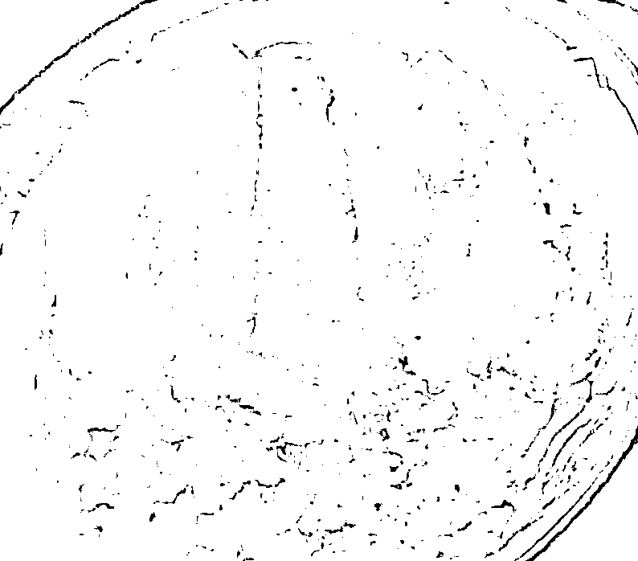
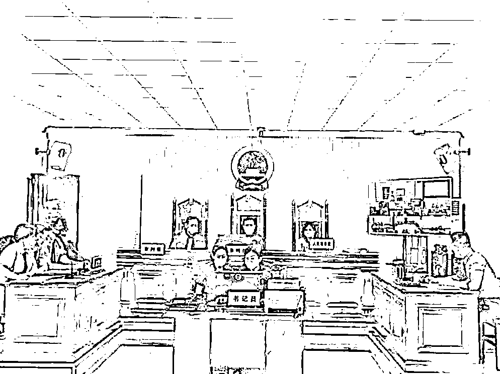
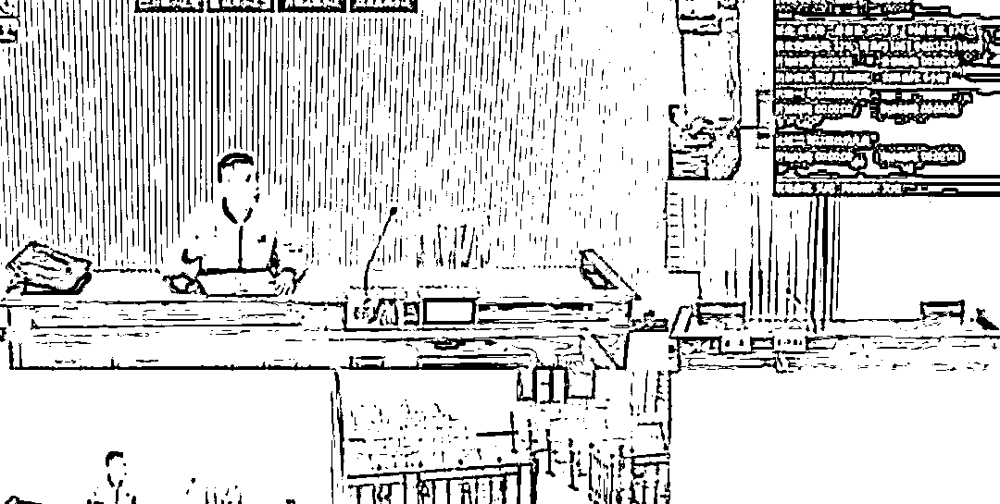
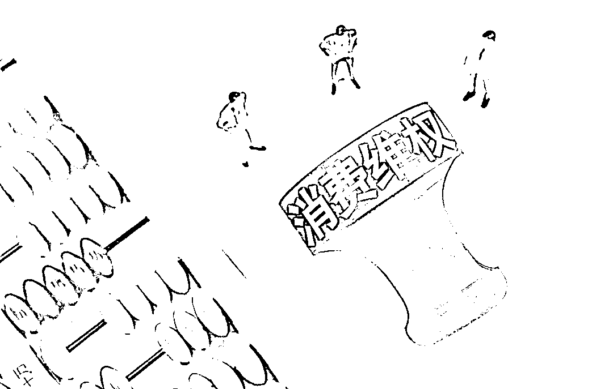
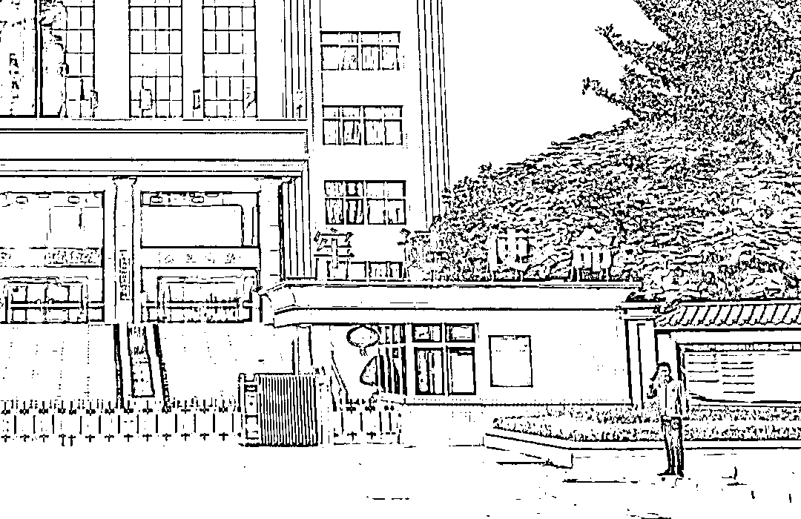
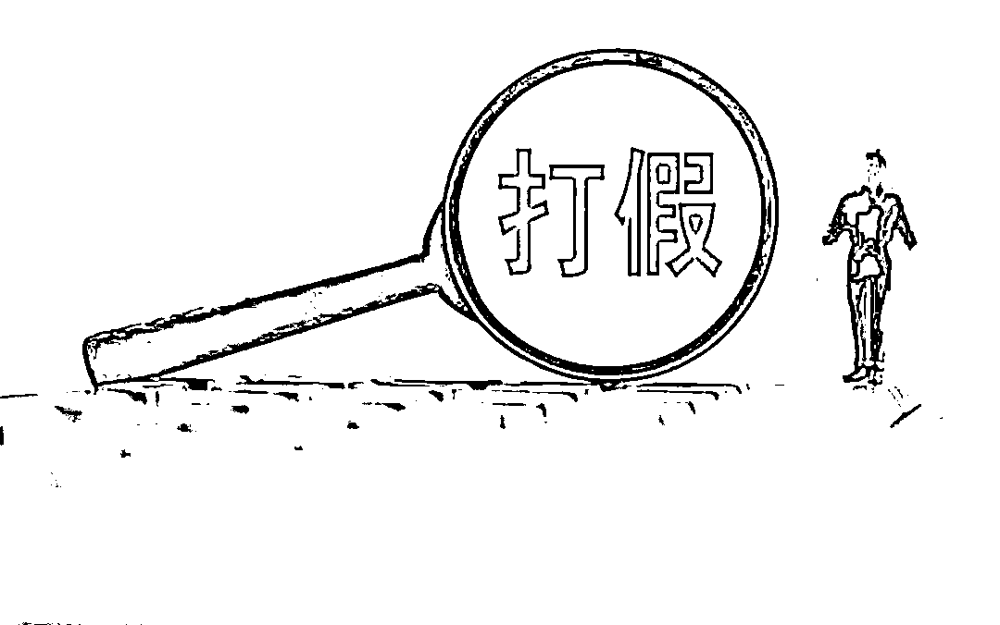
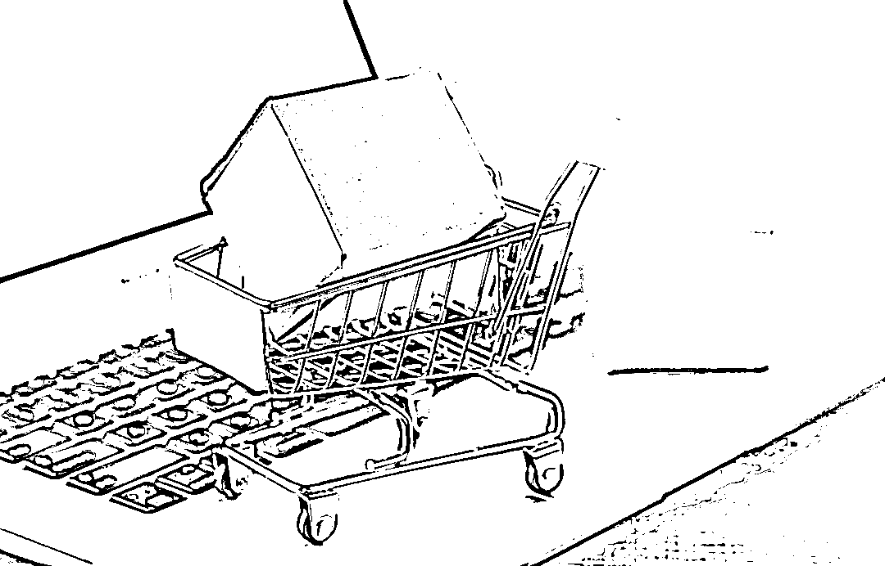

# 揭秘被立案的 18 岁“职业打假人”：这一职业真有那么黑？

> 原文：[`mp.weixin.qq.com/s?__biz=MzIyMDYwMTk0Mw==&mid=2247535162&idx=7&sn=a023491b6ff46b0850b6204e70bc9404&chksm=97cb8102a0bc0814e07ba02e1f343c30879c3de5fc3aebf96a3813e7235c090b1483c1975a0b&scene=27#wechat_redirect`](http://mp.weixin.qq.com/s?__biz=MzIyMDYwMTk0Mw==&mid=2247535162&idx=7&sn=a023491b6ff46b0850b6204e70bc9404&chksm=97cb8102a0bc0814e07ba02e1f343c30879c3de5fc3aebf96a3813e7235c090b1483c1975a0b&scene=27#wechat_redirect)

在提起了 800 余宗诉讼案件后，年仅 18 岁的“职业打假人”陈之强被正式立案。法院认定其打假维权行为存在“敲诈勒索”，不具备合理性，并将他的“犯罪线索”移交属地公安局（**此前报道：**[一年打假 800 余起，获利十几万，18 岁“打假人”涉嫌敲诈勒索被立案](http://mp.weixin.qq.com/s?__biz=MzIyMDYwMTk0Mw==&mid=2247534787&idx=5&sn=b4f0eccc1d0a33efaa4db6233ec4a5db&chksm=97cb83fba0bc0aedad527d9d13cc1e1e255676d41374b7d5e8b78b42469215f3e7dc1e438fe7&scene=21#wechat_redirect)）。 

在职业打假圈内，没有上过大学的陈之强颇有一些名气，他开设的打假维权交流群，入群费 388 元。顶着“犯罪嫌疑人”的头衔，陈之强觉得自己相当无辜：“我首先是消费者，起诉是我的权利，应诉是商家的义务，叫商家去应诉的也是法院，不是我陈之强叫法院去开庭的。”

近年来司法部门对所谓的“职业打假”态度越发限制，越来越多的法院对“消费者”这一定义的要求更加严格，对于职业打假这门“生意”来说，属于他们的好日子，也许正在过去。

# 从正义使者到饱受非议

90 年代的中国，假冒伪劣商品横行街头，老百姓深受其害。1993 年，《消费者权益保护法》正式通过，49 条明确指出：“经营者提供商品或者服务有欺诈行为的，应当按照消费者的要求增加赔偿其受到的损失，增加赔偿的金额为消费者购买商品的价款或者接受服务的费用的一倍。”

立法本意虽好，但实践起来却无比困难，普通消费者时间、经历、辨识能力有限，难以承担举证责任，公权机构人手有限且无法面面俱到，虽然法律颁布了，但这第一个吃螃蟹的人却迟迟未能等到。

1995 年，还在上着法律辅导班的 22 岁北京青年王海，走进东城区工商局，手里拿着 12 只假冒“索尼耳机”，在铺天盖地的舆论支持下一战成名，王海最终拿到双倍赔偿。从此，他也成为各大商超百货最不想见到的顾客。

当年底，王海被中国保护消费者基金会授予“中国打假第一人”称号，并奖励 5000 元。

在当时，王海的行为备受舆论支持。相比普通人，职业打假人在维权专业度、标准掌握程度等方面确有优势，他们成为当时中国打击日益严重的假冒伪劣行为的重要参与者。而在这之后的数次司法实践中，为了鼓励消费者勇于揭发制假售假行为，历经多次司法解释后，法律界统一倾向认定：“知假买假”的行为不影响行为人主张消费者权益。

最高法的表态让“职业打假人”的身份受到认可，打假人和法律界也由此进入蜜月期，而随着 2013 年消法的修订，将惩罚性赔偿数额由一倍提升到三倍，2015 年新《食品安全法》实施，进一步将惩罚性赔偿提升至十倍。“职业打假人”同执法机构的博弈也随之加剧。

重赏之下必有勇夫，在假一赔十的高额收益面前，打假成了一门好生意。自 2016 年开始，食品维权案件数量随之猛增，超过八成案件的原告是职业打假人。

案件激增的背后是疲于奔命的基层执法机关，打假案件的激增既挤压了其余民事案件司法资源与处理时效，也造成了一定的市场混乱，对部分经营者的正常经营行为造成困扰。

2019 年，国务院发布的《关于加强和规范事中事后监管的指导意见》中明确规定，依法规范牟利性“打假”和索赔行为。这标志着打假索赔的“黄金时代”已成过去，但由于缺乏法律的一锤定音，各地的实施标准不一，关于职业打假人是否符合法律有关“消费者”的定义，目前尚存争议。

近期舆论场上，“卖 150 碗熟肉被罚案”依然热度不减，作为职业打假人的原告虽有多次打假经历，但依然被法院认定为可以维权的消费者，适用惩罚性赔偿。

“职业打假者”近三十年的发展史，也是中国法律和市场经济逐渐规范的见证人，某种意义上，有着职业打假人的存在，可以不断提醒生产者和经营者避免从事侵权活动、从而减少违法行为，符合净化市场的立法本意。但也要重视“职业打假”的负面作用和危害，逐步限制牟利性打假行为，对生产经营者给予了更多的理解和宽容。

# “职业打假人”专门打假吗？

当前，职业打假确实在多地存在泛滥的情况，许多职业打假人，依靠“复制粘贴”式的投诉举报，吃准行政机关无暇处理的避祸心理，间接迫使商户答应其无理诉求。

通过中国裁判文书网等检索工具输入“十倍赔偿”“三倍赔偿”“食品安全标准”等关键词，可以检索到大量的“职业打假”案件，部分案件的原告可能在数十件以上的同类型案件中重复出现，他们就是如假包换的“职业打假人”。

打官司是“职业打假人”的日常，本文开头的主角陈之强一年时间发起了超过 800 起民事诉讼，绝对算是起诉狂魔。对于每个城市的大型连锁商超、食品品牌企业来说，认识这批本地打假团体并不难，很多都是打着名牌，出现在企业各个销售网点面前，让他们疲于应付、苦不堪言。

如果你认为职业打假者打的是假货，那实在是太年轻了。事实上，大部分的职业打假人，几乎从不打假，也鲜有真正涉及食品安全的内容。毕竟正儿八经的打假耗时费力，还需要自费进行各种检测检验报告，举证困难，成本高，收益低。

为了牟取最大化的经济利益，打假人一般盯着大型超市的进口食品撸羊毛。一方面大型企业市场占有率高又不差钱，容易取证（购物小票、发票俱全）、赔偿快（商超会把责任转嫁给供应商）。而很多进口食品供应商并不了解国内的相关制度，容易出现食品名称、配料表、营养成分表、执行标准、净含量和规格等标签标注问题，这对于职业打假人来说，可谓一打一个准。

过期食品也是职业打假人比较喜欢的维权品类，实际案例中，甚至有媒体报道过，部分职业打假人将超市内即将过期的商品在店内隐蔽起来，等到商品过期后再找出来买下的奇葩案例，可谓防不胜防。

而目前日益火爆的电商平台、团购接龙、直播短视频，也成为众多职业打假者关注的重点领域。打假者不用出门，靠着浏览浏览网页、看看直播，就能发现大量在包装、广告语、标签提示上不符合食品安全标准的“三无”产品。

在完成购买一定数量相关食品并固定好证据后，打假者往往先主动开始和商家索赔，并索取货值金额数倍的赔偿，希望息事宁人的商家往往会选择直接赔偿。

如果索赔无效，打假者就开始向行政机构举报投诉。通过反复申请信息公开、行政复议等方式，让行政机关烦不胜烦，往往就会向企业施压，达成和解。在整个过程中，职业打假人的投诉和举报行为，极大地占用了执法资源，大量的投诉案件让相关机构无暇顾及那些真正关乎百姓生命健康的食品安全问题。

最后一步才是发起民事诉讼。当然也有职业打假人一开始就走起诉路线。陈之强 1 年 800 起民事诉讼，其中有 200 多起直接由法院调解完成，职业打假人就是利用部分商家考虑诉讼成本高，担心被进一步抹黑而私了的心理，获得和解赔偿，他们将法院作为其索赔牟利的平台。

目前，各地法院在职业打假方面的裁判标准不一致，有的支持，有的反对。仔细梳理中国裁判文书网的相关判例，我们会发现越是职业打假索赔诉讼多的法院，越是反对；越是职业打假索赔诉讼少的法院，越是支持。

这种判罚尺度上的异同，背后存在着两种思路的交锋，有些司法机构和行政机关希望息事宁人，减少工作量，变向逼迫商家接受调解，答应打假人的索赔诉求。但尺度的宽松必然导致更多索赔人的“慕名而来”，当案件激增以致干扰到法院处理其他民事案件，产生案件积压时，法院则会以不利裁判结果劝阻潜在职业打假人，让其知难而退。

当前最新的消费者保护法修订版迟迟没有下文，司法审判的重要作用就是指导人们的未来行为，而非就事论事，墨守成规，否则法治进程就会落后于社会实践。堵住职业打假者的牟利漏洞，需要执法机关给出更有价值的判例标准，最终实现全国一盘棋。

# 整治“职业打假”乱象 各地在行动

已经收到公安局立案决定书的陈之强目前依然信心十足，他目前并未被采取任何措施。陈之强坚信自己手段的合法性，只是在法院作出上述裁定后，他以上诉人身份发起的所有起诉案件，都已被法院驳回。

压力肯定是有的，尽管前期有些收益，但目前的他已处于负债状态，毕竟诉讼也有成本。而作为“职业打假”祖师爷的王海，对这位“同行”的情况也是非常关注，前不久在一场直播中，王海坦言，打假不能只看法律，主要还是看商家是不是真的欺骗了消费者，损害了消费者利益。

事实上，相当多的“职业打假”从业者已经偏离了法治和诚信的原则。以他们为原告的产品纠纷案件大多以上诉人撤诉或者上诉人不到场视为撤诉为终结。法院浪费了宝贵的司法资源，“假货”依然没有退出市场，他们则收获一笔可观的“私了”费用，继续寻找下一个猎物。

这种滥用投诉举报、信息公开、复议诉讼、监察投诉等权利，挤占了有限的行政资源和司法资源的现象并不正常，针对现行法律法规上的漏洞，国家和地方上都出台了相关政策，以限制“职业打假”的泛滥。

2019 年，国家市场监督管理总局发布《市场监督管理投诉举报处理暂行办法》，明确规定“不是为生活消费需要购买、使用商品或者接受服务，或者不能证明与被投诉人之间存在消费者权益争议的”而发起的投诉，市场监督管理部门不予受理。这个相当于给了市场监督管理部门一笔尚方宝剑，封堵恶意投诉类的“职业索赔”行为。

上海则将限制“职业打假”列为本市扫黑除恶专项斗争之中，通过向公安机关移送“职业打假”涉黑涉恶线索，有力遏制了涉嫌违法犯罪“职业打假”行为的高发势头。

重庆高院则在《关于审理消费者权益保护纠纷案件若干问题的解答》中明确规定，明知商品或服务存在质量问题而仍然购买的人请求获得惩罚性赔偿的，因有违诚信原则，人民法院不予支持。

在特区深圳，新出台的《深圳经济特区食品安全监督条例》第 97 条规定：发现投诉人超出合理消费或者以索取赔偿、奖励作为主要收入来源的，可以终止调查并将相关线索纳入食品安全风险监测范围。

最高法则在其 2020 年的一次司法解释中明确，“因食品、药品质量问题发生纠纷，购买者向生产者、销售者主张权利，生产者、销售者以购买者明知食品、药品存在质量问题而仍然购买为由进行抗辩的，人民法院不予支持。”

在中国裁判文书网上，从 2019 年—2021 年涉及职业打假的 100 份裁判文书中，我们可以看到各地法院历年以来的判决结果，其中 32 份支持“职业打假人”的赔偿请求，66 份驳回了“职业打假人”的诉讼请求，还有 2 份裁判文书中，涉案人因敲诈勒索被判刑。由此可见，近年来司法部门逐渐收紧对“职业打假”的判罚力度，对“消费者”这一定义要求得更加严格。

所有人都在期待自 2016 年就启动征求意见的《消费者权益保护法实施条例》的最终出台，这个多次被列入立法计划但迟迟没有消息的重磅法条之所以一直难产，焦点之一就是惩罚性赔偿的适用对象，是否包含职业打假者。这将决定“陈之强”和“邵佰春”们最后的命运。

国家赋予了每个消费者保护自己合法权益的途径和方法，真正的打假人人欢迎，但期望目前依然活跃着的“职业打假人”们，做好监督员，以社会责任为基本职业要求，维护法律的尊严和完整。

来源：每日读物、 食药法苑，利箭在行动

**风沙太大，敬请关注，谨防失联**

← 向右滑动与灰产圈互动交流 →

