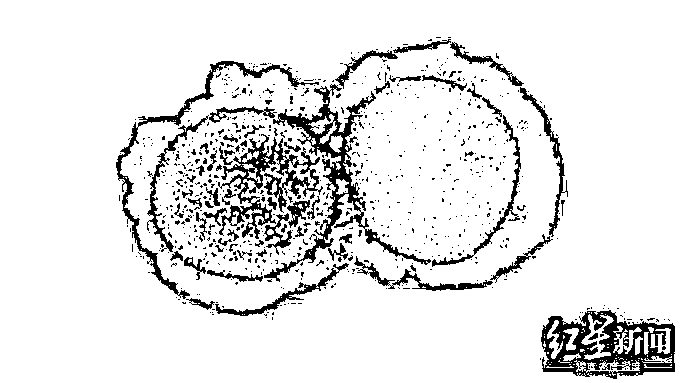
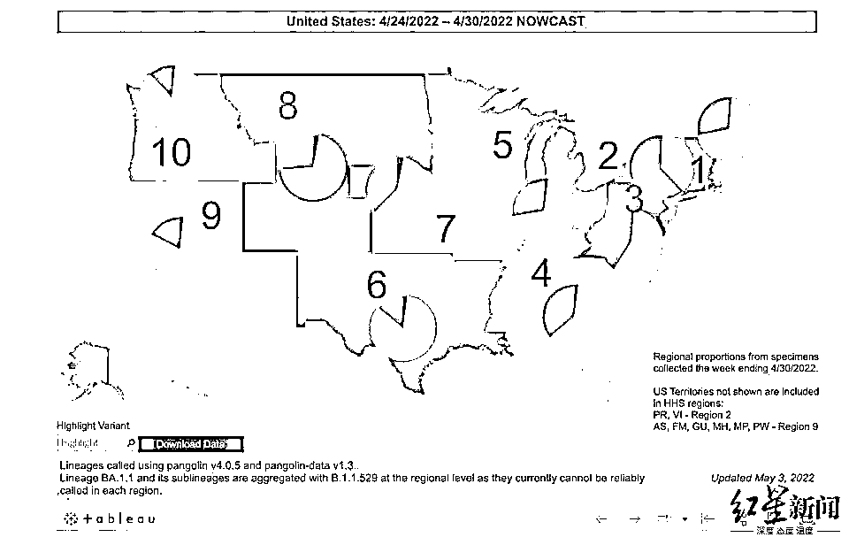
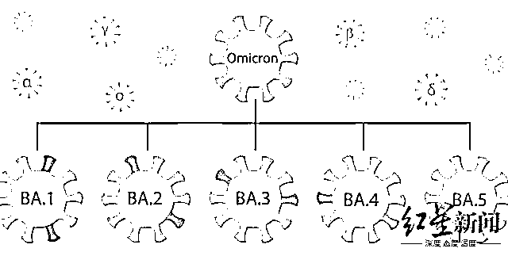

# 专家警告！德尔塔可能卷土重来

> 原文：[`mp.weixin.qq.com/s?__biz=MzIyMDYwMTk0Mw==&mid=2247535162&idx=8&sn=74db0a8f11f532a58a7e01d78bab1d29&chksm=97cb8102a0bc081417a4bd7dd938ce7c996880904f627ef70ac0ef4fd8876dbdec0b5c8bff5f&scene=27#wechat_redirect`](http://mp.weixin.qq.com/s?__biz=MzIyMDYwMTk0Mw==&mid=2247535162&idx=8&sn=74db0a8f11f532a58a7e01d78bab1d29&chksm=97cb8102a0bc081417a4bd7dd938ce7c996880904f627ef70ac0ef4fd8876dbdec0b5c8bff5f&scene=27#wechat_redirect)

5 月 3 日，韩国疾控机构（KDCA） 表示，在海外入境感染者中检测出首例输入型 BA.2.12.1 变异毒株感染病例。与此同时，新加坡近期也报告出现两例奥密克戎 BA.2.12.1 变异株社区病例。 

▲新冠病毒分子

同一天，美国疾控中心（CDC）发布的最新数据显示，BA.2.12.1 毒株已占全美新冠感染新增病例的 36.5%，在过去两周内涨幅近 100%。外媒 5 月 4 日报道称，BA.2.12.1 或将很快取代 BA.2 变异毒株，在美国占据主导地位。不仅如此，**这一“迄今为止传播最快”的变异毒株正在掀起美国新一轮的疫情浪潮。**

与此同时，可以逃避免疫抗体，让人重复感染的奥密克戎新变种 BA.4 和 BA.5 正在南非肆虐，并已传入美国。美国卫生专家称，“这似乎是一本永无结局的长篇小说的最新篇章”，BA.4 和 BA.5 在南非的快速增长预示着美国未来可能出现的场景。而在奥密克戎家族的多种变异株肆虐全球之际，**以色列一项最新研究指出，此前肆虐全球的德尔塔毒株也并未彻底消失，仍在“隐秘传播”。研究人员警告说，德尔塔毒株可能会“卷土重来”。 **

▲美国各地区新增感染病例中 BA.2.12.1（红色）与 BA.2（粉色）占比。图据美国 CDC

**迄今为止最具传染性的新冠变种**

**在美国掀起新一轮疫情浪潮**

BA.2.12.1 是奥密克戎 BA.2 亚型变异的一个分支，也是“迄今为止最具传染性的新冠变异毒株”。根据美国 CDC 的数据，这一新变种的传播速度比上一代 BA.2 快了 27%，而 BA.2 的传播速度又比原始的奥密克戎毒株快了 30%。 

据美媒 5 月 3 日报道，BA.2 亚型 3 月 19 日前仅占全美新增感染病例的 1.5%。然而，不到一个月后，在截至 4 月 16 日的一周，BA.2.12.1 已占美国所有确诊感染病例的 19%。而在这一变种最初出现的美国东北部地区，其所占比例已高达新增病例的 61%，增速几乎是其他地区的两倍。 

随着 BA.2.12.1 快速传播，与前一周相比，美国大多数地区的病例正呈上升趋势，华盛顿、密西西比州、佐治亚州、缅因州、夏威夷、南达科他州、内华达州和蒙大拿州的新增感染病例增长高达 50%以上。美国 7 天平均感染病例数已从 3 月底的每天 2.5 万例上升至超 5.6 万例，增幅超 100%。 

此外，自上周以来，每日平均住院人数也出现了约 10%的增长。美媒称，这些数字是不可否认的，即使报告数据并不准确，但美国的新冠新增病例和住院人数出现了显著的上升趋势。 

报道指出，目前没有证据表明 BA.2.12.1 会导致比原始奥密克戎毒株及其各种亚型变种更为严重的症状，但其传播能力的提高是显而易见的。不仅如此，根据“热点”地区纽约州的最新数据显示，自 3 月 7 日以来，全州范围内的新冠病毒再感染率，无论是突破性感染病例还是未接种疫苗者的再感染率，都在不断上升，但具体原因尚不清楚。

▲美国洛杉矶国际机场航站楼，戴着口罩的乘客们匆匆走过

**BA.4 和 BA.5 也来了：**

**可逃避免疫抗体，让人重复感染**

美媒称，根据 BA.2.12.1 目前的传播速度，其可能很快将取代 4 周前才开始在全美占据主导地位的 BA.2。不过，这远不是终点。BA.2.12.1 并非科学家们正在密切关注的唯一奥密克戎新变种。上周，美国发现了奥密克戎两种新亚型 BA.4 和 BA.5 变种的首批病例，并证实这两种毒株已开始在美国传播。 

据红星新闻此前报道，BA.4 和 BA.5 分别于 1 月和 2 月在南非被发现。而根据约翰霍普金斯大学的最新数据，过去两周，南非的新增感染病例以每周两倍的速度猛增，使得 BA.4 和 BA.5 在南非得到了越来越多的关注。 

“我们刚确定了 BA.2.12.1，然后 BA.4 和 BA.5 又来了？这似乎是一本永无结局的长篇小说的最新篇章。”加州大学旧金山分校传染病专家 Peter Chin-Hong 博士说。报道称，BA.4 和 BA.5 在南非的快速增长预示着加州和美国未来可能出现的场景。 

目前，这两个新变种已开始在全球传播。美国国立卫生研究院资助的 Outbreak.info 网站数据显示，BA.4 序列已在 15 个国家及地区被报告，BA.5 已在全球 13 个国家及地区出现。 

与 BA.2.12.1 一样，BA.4 和 BA.5 同样比上一代奥密克戎毒株更具有传染性。不仅如此，最新的研究显示，这两种新变种似乎可以逃避免疫，让人重复感染。 

据外媒 5 月 3 日报道，一项 5 月 2 日发表的预印本研究指出，BA.4 和 BA.5 可以逃避人体内由奥密克戎毒株 BA.1 感染所产生的抗体。此外，它们还能逃避接种疫苗及突破性 BA.1 感染产生的抗体。 

报道称，南非近两周的疫情，似乎也印证了这一结论。在此前 BA.1 掀起的疫情之中，南非有近 90%的人口已具有了免疫力。Peter Chin-Hong 指出，但在这样的情况下，南非近日感染病例的激增，意味着新变种会导致更多的再次感染，即便是此前已感染过奥密克戎病毒的人也无法幸免。 

南非研究人员在实验室中测试了人体血液中抗体使 BA.4 和 BA.5 病毒失效的能力。在未接种疫苗但最近刚从 BA.1 感染中康复的人身上，其抗体中和 BA.4 和 BA.5 病毒的能力下降了 7 倍多。而在接种过疫苗但最近出现 BA.1 突破性感染的人群中，抗体中和病毒的能力下降幅度较小，大约下降了 3 倍。 

需要指出的是，世界卫生组织将中和作用下降 8 倍作为失去有效保护的阈值。专家认为，总体而言，这一发现不是什么好消息。即使是此前 12 月或 1 月曾感染过奥密克戎毒株的人，也可能因新的变异毒株再次感染。因此，研究人员表示，“BA.4 和 BA.5 有可能导致新一波感染浪潮出现，接种疫苗和加强针至关重要”。 

领导这项研究的非洲卫生研究所病毒学家亚历克斯·西加尔表示，同德尔塔和 BA.2.12.1 一样，BA.4 和 BA.5 在基因突变点 L452 发生突变。这一突变有助于新冠病毒更紧密地与人体细胞相结合，并躲避试图阻止病毒入侵细胞的抗体，使其更具传染性，这也是德尔塔毒株最关键的突变点位。

他还指出，令人费解的是，BA.4 和 BA.5 还在基因突变点 L486 发生了变异。而此前在这个点位发生变异的病毒都表现不佳，纷纷失败了。“突然之间，它就成功了。所以我们不知道那是什么。”西加尔说道，“我怀疑这是一个严重的逃逸突变，意味着它帮助病毒躲避我们的免疫系统。”

▲奥密克戎家族

**德尔塔毒株可能卷土重来？**

**以色列研究团队：仍在“隐秘传播”**

与此同时，在奥密克戎家族的多种变异株肆虐全球之际，德尔塔毒株也并未彻底消失。 

据央视新闻 5 月 4 日报道，以色列内盖夫本—古里安大学当地时间 5 月 2 日发布公报说，研究团队发现，在变异新冠病毒奥密克戎毒株加速传播之际，德尔塔毒株仍在“隐秘传播”。**研究人员警告说，德尔塔毒株可能会“卷土重来”。 **

[`mp.weixin.qq.com/mp/readtemplate?t=pages/video_player_tmpl&action=mpvideo&auto=0&vid=wxv_2383062683626815489`](https://mp.weixin.qq.com/mp/readtemplate?t=pages/video_player_tmpl&action=mpvideo&auto=0&vid=wxv_2383062683626815489)

来源：央视新闻

研究人员对去年 12 月到今年 1 月期间以色列南部城市贝尔谢巴的废水进行了监测，结果发现，在奥密克戎毒株加速传播之际，德尔塔毒株并没有就此消失，而是仍在“隐秘传播”。 

而研究团队开发的预测模型显示，未来几个月内，奥密克戎毒株的传播将“逐渐减弱甚至消失”，但德尔塔毒株仍将保持传播，这可能会导致新一波德尔塔毒株感染潮或出现新的有威胁性的变异毒株。 

迄今，世界卫生组织已确定 5 种“需要关注”的新冠病毒变异毒株，分别为阿尔法、贝塔、伽马、德尔塔和奥密克戎。由于前三种毒株的传播力已显著减弱，世卫组织今年 3 月将其分类为“以前传播的需要关注毒株”，将德尔塔和奥密克戎毒株分类为“正在传播的需要关注毒株”。 

来源：红星新闻、央视新闻、潇湘晨报

**风沙太大，敬请关注，谨防失联**

← 向右滑动与灰产圈互动交流 →

