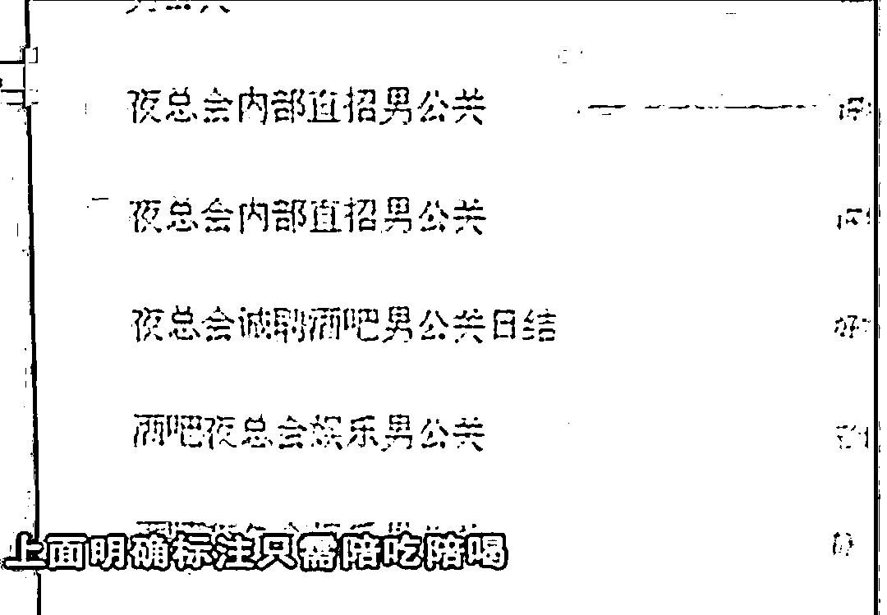
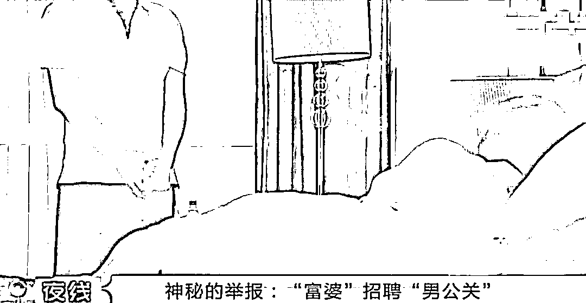
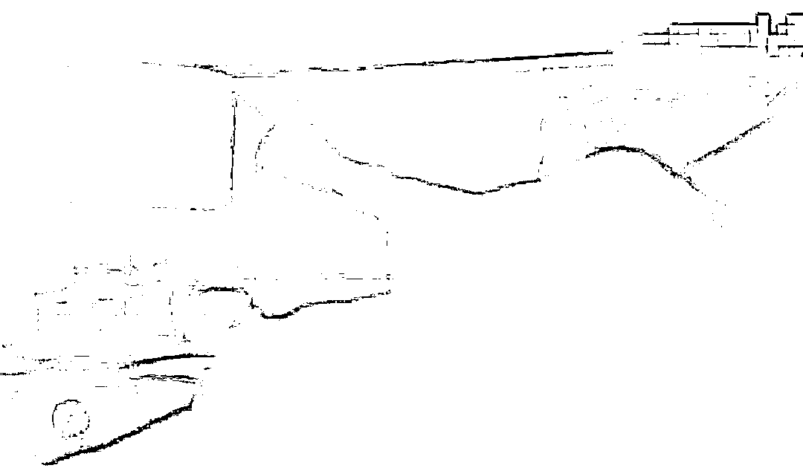
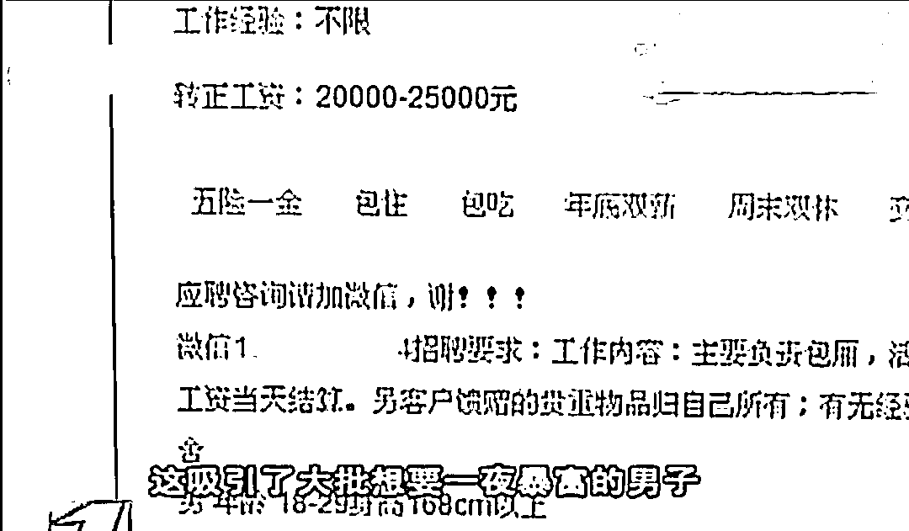
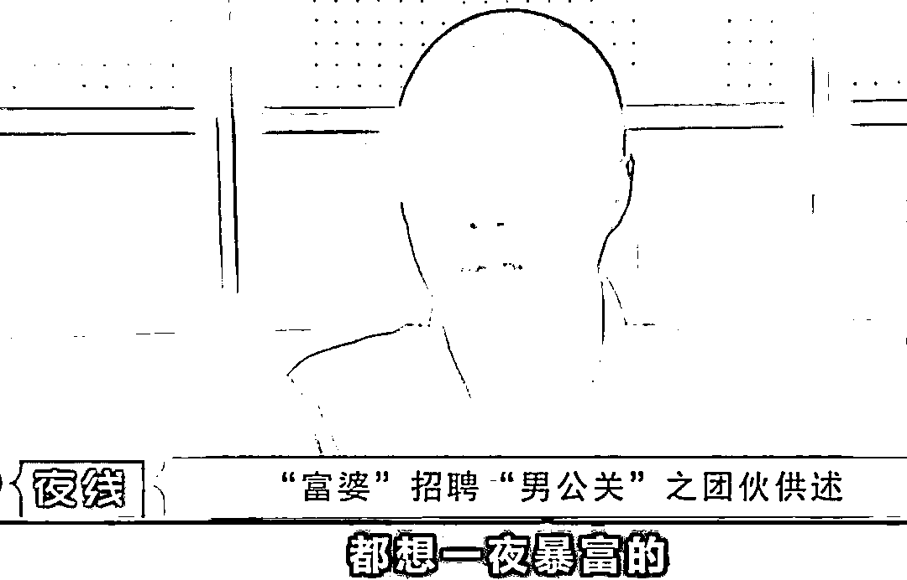
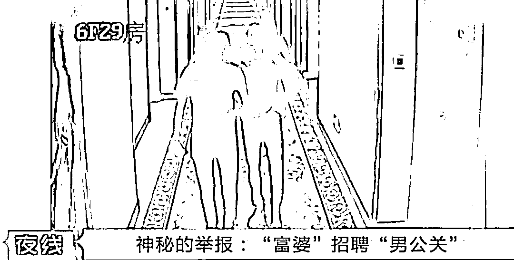
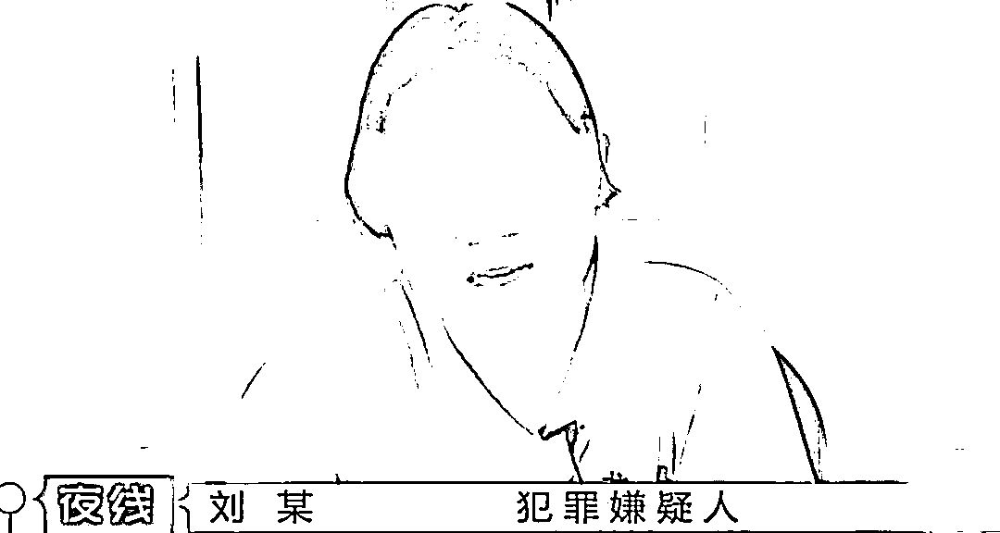
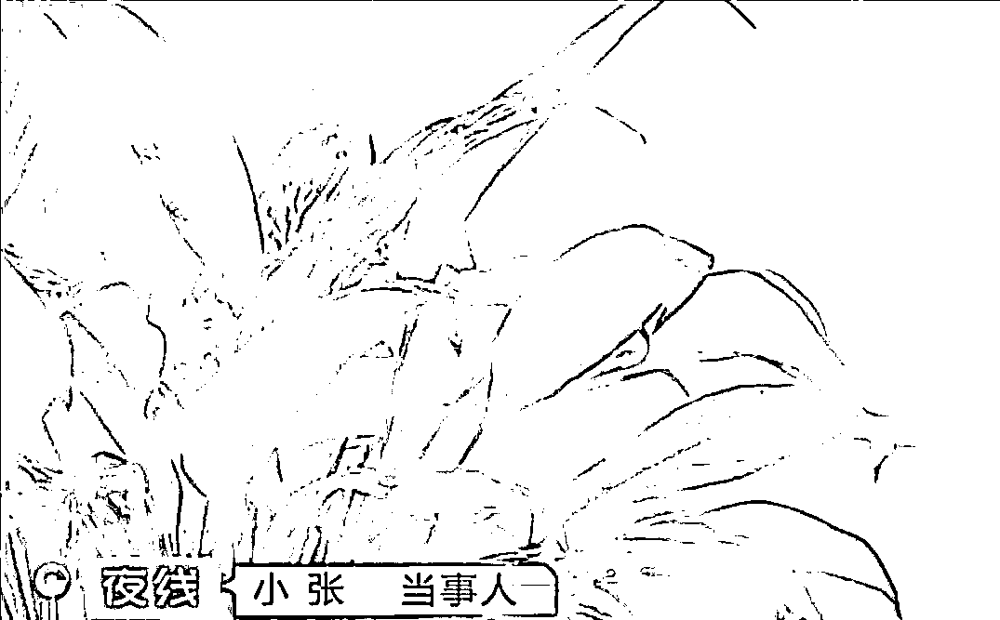
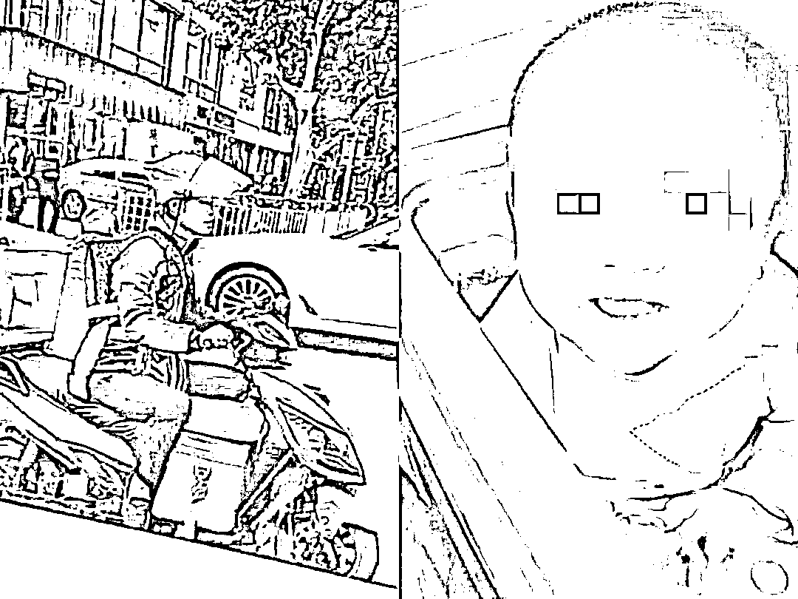
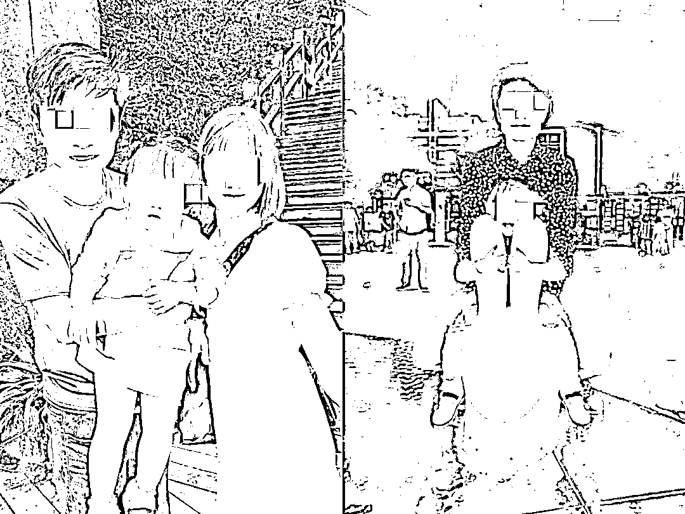

# “今天我就是来玩你的！”深圳富婆一天叫 7 个男公关，细节曝光引众怒

> 原文：[`mp.weixin.qq.com/s?__biz=MzIyMDYwMTk0Mw==&mid=2247535217&idx=5&sn=bd57ab600e90c6a21575d06fd016a450&chksm=97cb8149a0bc085ff3aebd072edfd7ca7cb0b3c3114294d57b1629334f47130babaab266c18a&scene=27#wechat_redirect`](http://mp.weixin.qq.com/s?__biz=MzIyMDYwMTk0Mw==&mid=2247535217&idx=5&sn=bd57ab600e90c6a21575d06fd016a450&chksm=97cb8149a0bc085ff3aebd072edfd7ca7cb0b3c3114294d57b1629334f47130babaab266c18a&scene=27#wechat_redirect)

**“今天我就是来玩你的。”富婆穿着浴袍居高临下地说到。**

**如果你是一个没什么夜场工作经验的年轻人，在接待富婆时，听到这句话会是什么感受？**

 **[`v.qq.com/iframe/preview.html?width=500&height=375&auto=0&vid=e0857e4ym2u`](https://v.qq.com/iframe/preview.html?width=500&height=375&auto=0&vid=e0857e4ym2u)** 

****小张的“夜场男公关”初体验****

**小张已经两个月没有工作了，在网上求职时，他看到一份高薪还简单的招聘——夜总会男公关。**

**最初，他并不清楚男公关的具体工作是什么。**

****

**根据电话里对方的指引，他去到一家高档酒店进行面试。**

**面试主管告诉他，男公关也分不同等级，有的是营销酒水也就是卖酒，有的是陪酒，还有的是出台。**

**并且薪资也随着等级升高而升高，其中，出台服务富婆是最赚钱的。**

**只要做成一单，就有 4000 元的收入。公司给他提供富婆的资源，介绍富婆给他认识，所以要从中抽取 10%的中介费。**

**小张一算，只要出台一次，自己就能拿到 3600 元，即使一个月只接三四个客人，月薪也过万了。**

**更何况主管向他承诺，每周可以给他介绍三到四个。**

****“既然出来赚钱，当然就选择钱多的工作嘛。”小张当即决定，选择出台那个等级。****

**小张没有任何“工作经验”，第一次“工作”就要被介绍富婆这么好的人脉。主管说，需要 1000 元的入职费，做满三个月就全额退给他。**

**小张交了钱，几天后果然被“带仔的”带到酒店见富婆。**

**一进房间小张就懵了。**

**富婆穿着浴袍，气场逼人，旁边还放着爱马仕的包包，一看就是见过大世面的有钱人。**

**自己这身装扮，在她面前显得根本上不了台面。**

****

**果不其然，富婆对他的穿着很是不满，她指着主管的鼻子一顿臭骂，说自己要带小张去见客户，他穿这样子还怎么见人。**

****

**小张的“职场初体验”，算是失败了。**

**但他觉得富婆说得有道理，人靠衣裳马靠鞍，穿得好了才能得到富婆的青睐。**

**出来后，主管对小张说，自己在附近很熟，可以帮他买名牌的衣服。**

**于是小张给了主管 2000 元，主管帮他置办了两身名牌的行头。**

**几天后，他又被主管安排见第二个富婆。**

**这次的富婆年龄偏大，看着有 50 多岁，但化着精致的妆，长相很不错，气场也非常强大。**

**因为有了名牌衣服的加成，这次的富婆对小张还挺满意。**

**但双方要进行进一步操作时，富婆问他，你带东西了吗？**

**小张这才知道，安全套啊之类的东西，在来之前应该提前备好。**

**他赶紧解释自己是第一次做这个，不清楚规则，忘记带了。**

**于是第二次见富婆的经历，也以失败告终。**

**虽然挺沮丧，小张觉得自己确实尽力了，失败也是没办法的事。**

**直到接到警方的电话，小张这才意识到，自己被骗了。**

****这套路，防不胜防呐！****

**小张应聘的这家“公司”，是有组织、有严密流程的诈骗公司。**

**他们先在网上以高薪待遇吸引应聘者前来面试，又在面试过程中，告诉他们这份工作做的是男公关。**

****

**由于报酬过于诱人，加上很多人觉得，自己还可以在富婆身上占到便宜，所以这个套路的成功率非常高。**

****

**等到应聘者交了报名费，他们就交给“带仔的”专业人员，进行下一步操作——**

**去见富婆，然后被富婆挑剔穿着太过老土。**

**这时“带仔的”就会以帮应聘者买衣服的名义，再让他们交 2000-3000 块钱。**

**而衣服，是诈骗人员去批发市场里，专门卖假货的地方买的。**

**假货店老板会在吊牌上打上名牌衣服的价钱，实际交易价格却只有一两百。**

****如果行头都置办好了，“富婆”就会以其他理由居然“男公关”为其服务。****

**比如有带安全套来吗？比如让他们脱光衣服转几圈，做俯卧撑，看看体力怎么样？**

**通常进行到这里时，很多应聘者自己就会被吓退。**

**据深圳市公安局罗岗派出所的办案民警介绍，受骗者中有一个年轻的小伙子。**

**他一进房间，就看到富婆穿着浴袍，翘着二郎腿，气质让人震撼。**

**富婆对他说的第一句话是:“今天我就是来玩你的。”**

**本来已经紧张害怕的小伙子直接被唬懵了，点点头说，“好。”**

**富婆的第二句话更加露骨:“你把衣服脱了。”**

**小伙子推开门落荒而逃。**

**主管这时还追出来，假意生气地说，**“你怎么跑了呢，我好不容易给你联系这呢有钱的富婆。”****

**还劝慰他，第一次被吓到也是正常，回家调整几天心态，再给他介绍其他的人。**

****

**如果遇到特别坚定想要做成“单子”的年轻人，富婆就回提出一些过分的要求：** 

**“过来给我舔舔脚。”或者“过来给我舔舔背。”**

**大部分人受不了这样带有人格侮辱性质的要求，那么富婆就能名正言顺地拒绝他的“服务”。** 

**至于“富婆”们，都是这个组织花钱雇的。**

****

**之所以从未被拆穿，是因为她们经常扮演这种角色——**

**妆容精致，穿着时尚，举手投足之间，有钱人的范儿拿捏得非常到位。**

**应聘者本来就紧张，看到这种场面更加没有了分辨能力。**

**办案民警说，根据酒店的监控显示：**

**一个富婆一天召见七八个男公关是太正常不过的事了。**

**高峰期时，最高记录一个富婆一小时召见了二十个男公关，平均一个人花两三分钟就能打发走。**

**这些受害者，对金钱的欲望超越了做人的底线，以为豁出去出卖肉体，就能赚得盆满钵满。**

****最后却成了待宰的羔羊。****

****脚踏实地，才是通往幸福的唯一途径****

**报道中，小张的面部虽然被打着马赛克，但能看得出，他只是一个相貌平平的普通人。** 

**有网友评论道，长相这样，就算是真富婆，也看不上他吧。**

****

**我们不针对相貌进行攻击。提及这一点，只是想说明：**

****会有像小张这样的年轻人，在做着不切实际的梦，幻想通过捷径发大财。****

****“懒”和“贪婪””是人的本性，没有人天生喜欢挑战，喜欢压力大节奏快的生活。****

**近年来，网络上流行一种“丧文化”，引发大家的讨论。**

**年轻人总爱说:“我不想努力了。”**

**“我不想奋斗了，我想瘫在床上当一辈子咸鱼。”**

**“有没有富婆包养我啊，我少奋斗十年。”**

**但事实上呢？** 

**去年在脱口秀里爆红的李雪琴表达过一个观点，她说：**

**现在的年轻人，有目标，有自己想要的东西，也在为之奋斗着。**

**大家嘴上蔫了吧登的，只是想寻找一个缓解压力的出口。**

**口嗨说着不想努力，却依然认真地上班工作，用力地过好每一天。**

**都说君子爱财取之有道。**

**多的是生活不如意，可依然挺直脊梁骨，站着赚钱的人。**

**几年前，有媒体拍到一个外卖小哥在送餐时，带在他 6 个月大的女儿。** 

**要说不辛苦、不心酸，是不可能的。**

**远远的镜头里，小小的孩子被裹在被子里，拴在爸爸背上。**

**可她的笑容让人感到治愈。**

****

**图源：人民日报**

**几年过去了，当记者回访当年这家人，三岁的小女孩已经能自己穿衣服，甚至帮父母做一些简单的家务了。**

**他们的生活依旧没有大富大贵，可一家人幸福的笑容，才是认真生活的人，该有的模样。** 

****

**图源：人民日报**

**人生在世，会有暂时的低谷，会有一时的不如意，可身上的骨气，我们不能丢。** 

**像小张这样，被金钱的诱惑迷了眼，两个月没有找到工作，就去做夜场男公关。**

**甚至在见过一次富婆后不放弃，依然想通过出卖肉体捞快钱的人，**

**被诈骗团伙拿捏住这种心态，反复骗财，只能说，**

**坏人恒有坏人治。**

**君子爱财，取之有道，任何人都不应该为了钱，失去自己，甚至出卖自己。**

**人活一世，靠自己，才能稳稳站立。**

**而在这个世界上，唯一能换取资源的，是你本身拥有的筹码。**

**它不是年轻和美貌，而是实实在在的技能，是你安身立命的本领。 **

**正如阿基米德曾说∶世界上能登上金字塔的生物有两种∶**

**一种是鹰，一种是蜗牛。**

**不管是天资奇佳的鹰，还是资质平庸的蜗牛，能登上塔尖极目四望俯视万里，都离不开两个字：奋斗。**

**因此，愿你我，都选择做生活的强者，身披铠甲，无惧眼前的诱惑，成为更好的自己。**

**最后，真的希望类似的新闻越来越少，也希望那些总想着一夜暴富，追崇“金钱至上”的年轻人明白：成功路上没有捷径可走。**

**来源：六月青柠 **

****

**← 向右滑动与灰产圈互动交流 →**

****