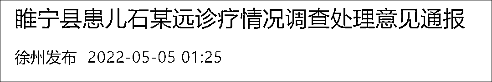

# 江苏一婴儿卡喉咙无核酸证明被拒诊身亡?调查结果来了

> 原文：[`mp.weixin.qq.com/s?__biz=MzIyMDYwMTk0Mw==&mid=2247535217&idx=7&sn=4e5fdd64ac3287998fca69b4532720cd&chksm=97cb8149a0bc085f9c7e1c3579a9c74066a5771b42252b0b92c4a0abb8b8e88830a3461517d4&scene=27#wechat_redirect`](http://mp.weixin.qq.com/s?__biz=MzIyMDYwMTk0Mw==&mid=2247535217&idx=7&sn=4e5fdd64ac3287998fca69b4532720cd&chksm=97cb8149a0bc085f9c7e1c3579a9c74066a5771b42252b0b92c4a0abb8b8e88830a3461517d4&scene=27#wechat_redirect)

据微信公号“徐州发布”5 月 5 日消息，4 月 29 日夜，江苏徐州睢宁县患儿石某远因气管内异物，由家人送至睢宁县人民医院就诊，后经睢宁县急救医疗站转诊至徐州新健康医院救治，4 月 30 日晨经抢救无效死亡。徐州市委、市政府及睢宁县委、县政府对此事深表痛心，成立了由市县纪委监委、卫健、公安等相关部门及医疗专家组成的联合调查组，对患儿诊疗情况开展深入调查（**此前报道：**[江苏一婴儿卡喉咙无核酸证明被拒诊身亡?](http://mp.weixin.qq.com/s?__biz=MzIyMDYwMTk0Mw==&mid=2247535162&idx=1&sn=0155862631ba76af99d29ffeb237cb4f&chksm=97cb8102a0bc0814f2f0daac0410e139431f21ca295fb925281023e32b4deb2932ad8f9bbe94&scene=21#wechat_redirect)）。

经调查，睢宁县人民医院于 4 月 29 日 20 时 10 分接诊患儿石某远（男，1 岁 5 月，其姑奶奶石某叶送诊），其姑奶奶自述患儿误咽异物，家人从其口中抠出半粒带壳南瓜子。接诊医生经询问病史、肺部听诊等检查，初步判断为气管内异物，给予患儿吸氧、持续监测脉氧等急救措施。睢宁县人民医院考虑到自身救治能力不够，于当晚 21 时开具了转院转诊单，告知患儿亲属尽快转诊。因患儿父母不在现场，其姑奶奶未能做主同意转诊。21 时 45 分，患儿父母到院。22 时许，接诊医生在与患儿父亲交代病情后处置其他病例，期间，先后于 23 时 55 分、30 日 0 时整、1 时 4 分、1 时 7 分、1 时 19 分、1 时 23 分多次向患儿父亲电话询问病情并催促转院。睢宁县人民医院医务科于 29 日 22 时 2 分与徐州新健康医院总值班室联系患儿转院事宜。30 日 1 时 8 分，患儿母亲拨打 120。1 时 22 分，睢宁县急救医疗站 120 救护车赶到县人民医院，2 时 30 分到达徐州新健康医院抢救室。当班医生完善检查，开放静脉通道、给予吸氧、心电监护处置以及 CT、血常规等辅助检查。3 时 47 分，患儿突然出现呼吸暂停，医院立即实施心肺复苏等抢救措施，并组织专家会诊，4 时 56 分，患儿因抢救无效死亡。

调查表明，睢宁县人民医院接诊后，在患儿未有核酸检测结果报告情况下，进行了急诊处置，并及时开具了转院转诊单；期间，4 月 29 日 20 时 22 分对患儿及其姑奶奶做了核酸采样，在就诊、接诊、转诊过程中，睢宁县人民医院和徐州新健康医院均未要求其提供核酸检测结果。

调查发现，睢宁县人民医院在对患儿石某远的诊疗过程中首诊负责制落实不严格、未及时采取相关检查进一步明确诊断，与亲属沟通交流不充分、对患儿病情及可能产生的严重后果告知不到位；在转诊过程中，存在衔接不到位、未及时向接诊医院充分告知患儿的详细病情。

根据调查结果，依据党纪政纪及相关法律法规，对涉事单位和相关责任人予以严肃处理：

一、徐州市卫健委对睢宁县人民医院给予警告，对接诊医生郑某祥暂停执业活动，并作进一步调查。责成睢宁县人民医院全面开展内部整顿。

二、睢宁县委给予县卫健委党委书记王艳龙党内警告处分，免去睢宁县人民医院党委书记、院长张涛党内外职务。

三、依据医疗机构管理相关规定，报请上级部门对睢宁县人民医院予以降级处理。

针对此次事件，徐州市和睢宁县将深刻汲取教训，认真总结反思，坚决避免类似情况发生。

徐州市及睢宁县联合调查组

2022 年 5 月 5 日

来源：徐州发布

← 向右滑动与灰产圈互动交流 →

