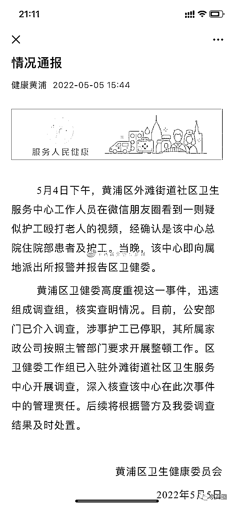

# 上海一社区医院护工多次脚踹殴打老人，老人去世后视频曝光，网友看怒了！

> 原文：[`mp.weixin.qq.com/s?__biz=MzIyMDYwMTk0Mw==&mid=2247535300&idx=1&sn=2a608142eefe9c57d1ae18256a93d94a&chksm=97cb81fca0bc08eabe63da5f6fd961c52e18b668ae74a487bba2a0858081cd4dc541d02f63bf&scene=27#wechat_redirect`](http://mp.weixin.qq.com/s?__biz=MzIyMDYwMTk0Mw==&mid=2247535300&idx=1&sn=2a608142eefe9c57d1ae18256a93d94a&chksm=97cb81fca0bc08eabe63da5f6fd961c52e18b668ae74a487bba2a0858081cd4dc541d02f63bf&scene=27#wechat_redirect)

 5 月 4 日，上海。有网友爆料称，上海一社区医院护工多次脚踹殴打老人。视频画面显示，身着蓝色服饰的疑似护工人员，多次用脚踢踹地上的老人，随后又用工具抽打老人。

<mpvideosnap class="js_uneditable custom_select_card channels_iframe videosnap_video_iframe" data-pluginname="videosnap" data-id="export/UzFfAgtgekIEAQAAAAAAC6gmV86sVQAAAAstQy6ubaLX4KHWvLEZgBPEuaNYIHQMd8ODzNPgMIu8bKBEjS85BbejdIT7aKQN" data-url="https://findermp.video.qq.com/251/20304/stodownload?encfilekey=S7s6ianIic0ia4PicKJSfB8EjyjpQibPUAXolKkgHlsTAJHSPBJ8Dy4JNh82Eq6wwxse3gcgtiazuvW9x5pvYEVXK7WVhE6iarXYQ8QhjiaIGqia9rdc8eelLw1dSjQ&amp;adaptivelytrans=0&amp;bizid=1023&amp;dotrans=0&amp;hy=SH&amp;idx=1&amp;m=&amp;scene=0&amp;token=AxricY7RBHdWtAcMVCKE2xlDo2Ynf9t4o8XCh3mqmibSUvOzEHAe0HkxoqE7ibRmGGarzAG5vVB7WU" data-headimgurl="http://wx.qlogo.cn/finderhead/ibq4aVwOt6HNqrr8OD3sCviaytF3B8TqCwHicxsuIanAJo/0" data-username="v2_060000231003b20faec8c6e48a1acbd3ce04ef33b077a1e41d0d3794ed88ea537878dbe65910@finder" data-nickname="灰产圈+" data-desc="@逃离北蔡垃圾镇 网友告知

87 岁的爷爷因身体不好多次 120 急救入院
后续转院住在黄浦区外滩街道社区医院
之前因疫情缘故，我们除了送爷爷医院那天进去
之后都不让我们再去医院看望
3 月 18 日我们被隔离后，爷爷的状况，全部都是靠护工提供的视频给我们看
爷爷已于 5 月 2 日 去世，我们全家万万没想到，老人在去世前遭受护工脚踹殴打。
我们最后一面也没见到爷爷，  当时爷爷被推出来是全身包裹的。
殡仪工作人员也不让我们靠近，  只能远远间隔望着。 

目前此事件具体调查 等官方调查 " data-nonceid="293047648760755717" data-type="video" data-width="540" data-height="960"></mpvideosnap>

家属现在怀疑老人真正的死因，并已就此事向警方提出质疑

有网友指出该视频发生地点在黄浦区外滩街道社区医院，该中心即向属地派出所报警并报告区卫健委。黄浦区卫健委高度重视并迅速组成调查组，核实查明情况。目前，公安部门已介入调查，涉事护工已停职，其所属家政公司开展整顿工作。

* * *

一个普文 :其实潜规则就是，对于无法自理的人去社区医院就是等于等死，不说这种做法对不对，我就是说一种现象。19 年，我爸因为脑梗住医院，后来住院时间到了就转院去某社区医院，到达之后看了里面的环境和人员的状态，当即办理出院手续。期间找过院长，院长很隐晦得说法就是里面得人就是放弃了等死。 

今年你还考不考驾照了:前几天那个活人被拉走的事情，我就猜养老院和医院里可能藏了连环杀手，新冠简直绝佳掩护

我不是谦哥儿 :@上海发布 上海是法治社会吗？

来源：微博那些事儿

← 向右滑动与灰产圈互动交流 →

