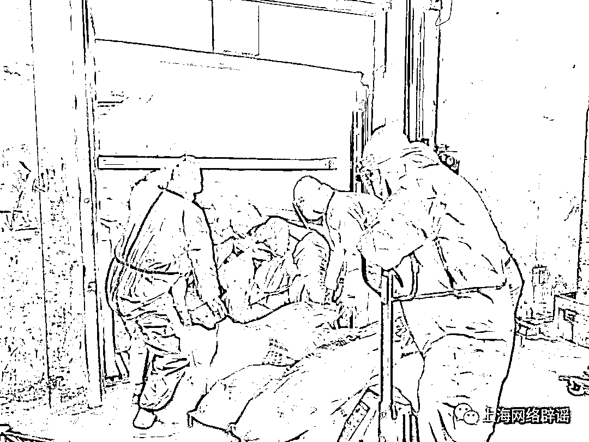

# 羊肉去哪儿了？

> 原文：[`mp.weixin.qq.com/s?__biz=MzIyMDYwMTk0Mw==&mid=2247535300&idx=3&sn=4db491afb25c2875c42794674ad7b6a3&chksm=97cb81fca0bc08ea9da8bba210e1b1eef4d43dd103d63769f7f6ae7ef21577e127e06e5be716&scene=27#wechat_redirect`](http://mp.weixin.qq.com/s?__biz=MzIyMDYwMTk0Mw==&mid=2247535300&idx=3&sn=4db491afb25c2875c42794674ad7b6a3&chksm=97cb81fca0bc08ea9da8bba210e1b1eef4d43dd103d63769f7f6ae7ef21577e127e06e5be716&scene=27#wechat_redirect)

近日，上海辟谣平台收到很多留言，提到上海宝山有一批新疆捐赠的羊肉物资，想知道最终发放到了哪里。据了解，4 月初有媒体曾报道，新疆克拉玛依市捐赠给对口支援该市的上海市宝山区一批羊肉，“司机全程未下高速”，经 5 天 4 夜赶路抵达。随后，这批物资的分配去向一直成为网友的牵挂。

为回应关切，上海辟谣平台开展多方核实。据宝山区有关部门介绍，收到该批捐赠物资后，按照相关程序全部分配给了社区卫生中心、环卫公司等有食堂的一线抗疫单位。

5 月 6 日，记者又向克拉玛依市政府驻上海联络处求证。该机构负责人王先生向记者介绍，这批羊肉 4 月 5 日送到上海，主要是捐赠给上海宝山等对口援助克拉玛依的相关区，由上海相关区负责具体分配，“由于时间紧，捐赠的羊，**一个是数量不多，二是屠宰检疫后，直接整只冷冻。通过冷链汽运到上海。在分配上，相关区也和我们进行了充分的沟通，全部给了有食堂的基层一线的抗疫单位。**比如，社区卫生中心、环卫公司等。这个也符合我们捐赠的预期和初衷。”

这位负责人最后表示，希望通过此次捐赠，为上海抗疫贡献一份力量。等疫情结束，非常欢迎广大网友和市民来“大美新疆”旅游。

[`mp.weixin.qq.com/mp/readtemplate?t=pages/video_player_tmpl&action=mpvideo&auto=0&vid=wxv_2386303027826868226`](https://mp.weixin.qq.com/mp/readtemplate?t=pages/video_player_tmpl&action=mpvideo&auto=0&vid=wxv_2386303027826868226)

克拉玛依市政府驻上海联络处负责人回应

此外，宝山区合作交流办负责人李艳阳告诉记者，区里的捐赠物资都是物资保供组统一调配。根据捐赠物资的种类、数量、捐助人的意向等进行统筹分配，严格执行“接收、查验、分发、登记”的闭环管理措施。一般来说，捐赠物资发放对象主要是封控时间比较长的居民小区、困难群体、公益性养老院、医疗卫生机构、环卫公司等一线工作人员。

 捐赠的羊为屠宰检疫后直接整只冷冻运至上海

李艳阳表示，宝山区纪律检查委员会、监察委员会正在对物资保供工作开展监督，如果在援助物资的发放过程中发生违规违纪问题，相关部门会严肃查处、绝不姑息。

来源：上海网络辟谣（ID：piyao021）

← 向右滑动与灰产圈互动交流 →

