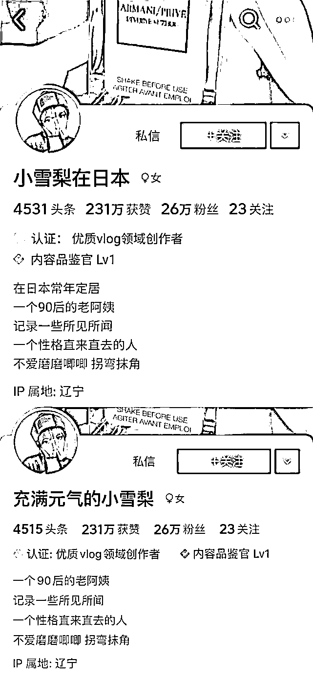
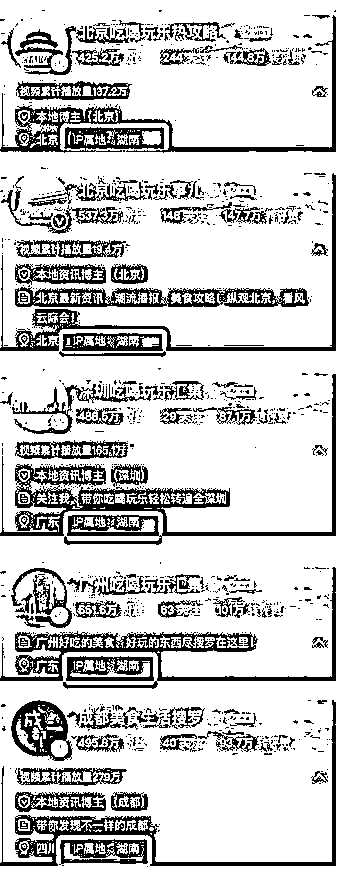
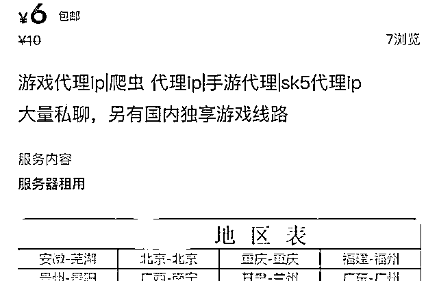

# “bug”神手速，花 6 块钱就能改 IP 了……

> 原文：[`mp.weixin.qq.com/s?__biz=MzIyMDYwMTk0Mw==&mid=2247535300&idx=4&sn=e0b81924b5689675265899a6383d70e3&chksm=97cb81fca0bc08eae03f987e0f356a80ea66f154edd1a55c93e56d4d1dbe221df08abf91f6f0&scene=27#wechat_redirect`](http://mp.weixin.qq.com/s?__biz=MzIyMDYwMTk0Mw==&mid=2247535300&idx=4&sn=e0b81924b5689675265899a6383d70e3&chksm=97cb81fca0bc08eae03f987e0f356a80ea66f154edd1a55c93e56d4d1dbe221df08abf91f6f0&scene=27#wechat_redirect)

自从微博、抖音、小红书等平台上线 IP 属地功能，

各大网红账号成为大型翻车现场：

**某些海外代购账号，**

**IP 归属地显示在国内；**

**本地的探店账号，**

**与运营地相隔十万八千里。**

IP 归属地功能，

让不少“大 V”心慌。

不过，

需求创造供给，

危机中见商机，

这不，

**付费 IP 代理的生意又如雨后春笋般涌现出来。**

**     先聊聊，**

**IP 属地****是什么？**

所有的上网设备都会被分配一个 IP 地址， 

每个 IP 地址都有一个归属地，

这就是 IP 属地。

今年 3 月，

新浪微博上线了展示用户“IP 属地”功能，

并表示：

**该功能无法由用户主动****开启或关闭。**

4 月 15 日，

今日头条、抖音、百家号、快手、知乎、小红书

六大互联网内容平台

同时宣布“公开账号 IP 属地”。

一时间，

**各路网络红人“兵荒马乱”。**

**       IP 属地开放**

****互联网演了出“现形记”****

展示 IP 属地的小功能，

在网络上引发了“蝴蝶效应”：

**“来酱在东京”IP 属地显示为上海；**

**“娜娜在英国”IP 属地为广东；**

**“王药师在英国”IP 属地为天津。**

一些网络“大 V”们开始改名改简介了： 

Vlog 博主“小雪梨在日本”， 

IP 归属地显示在辽宁。 

功能一上线， 

她迅速抹去网名和简介里的“日本”痕迹。

国内的网红博主们也露出了真面目：

**足不出湖南，吃遍全中国******

****

**畸形产业爆火**

**修改 IP 只需 6 元？**

实时显示用户 IP 地址，

让网络世界更加公开透明， 

也让虚假信息失去了生存的土壤。

**然而，**

**用技术手段“伪装”IP 属地的黑灰产业**

**——“IP 代理”立刻衍生出来。**

在一些电商平台上，

已经出现了付费 IP 代理的业务，

直言可以更改微博、抖音的 IP 属地。

有卖家称，

自己出售的服务，

可更改手机或电脑的 IP 地址，

并且支持所有的平台，

所有品牌的手机。

**卖家表示，**

**自己是计算机专业，**

**所出售的 IP 代理服务由自己破解。**

**IP 代理，****水很深，有风险**

此前，

IP 代理多为游戏玩家改善游戏体验所用，

但这一行业“水很深”，

已衍生出不少黑灰产业。

2021 年，

公安部关停非法宽带线路 1.3 万余条，

宽带上网账号 5 千余个。

普通网民使用代理 IP， 

也具有一定的风险性。

**网友们发送的请求会经过代理服务器传递，**

**免费代理 IP 一旦被网络黑客利用，**

**网友通过免费代理 IP 产生的浏览记录、**

**账号密码等用户信息都有可能因此泄露。**

 **小央说** 

**决定一个系统和生态运行质量的，**

**除了基础代码，**

**还有“bug”。**

**现在，**

**这些钻空子的代理改 IP，**

**就是大 bug，**

**需要尽快用技术手段封堵，**

**用法律制度规范，**

**才可真正起到清朗网络的作用。**

来源：央视网综合新华社、现代快报

← 向右滑动与灰产圈互动交流 →

