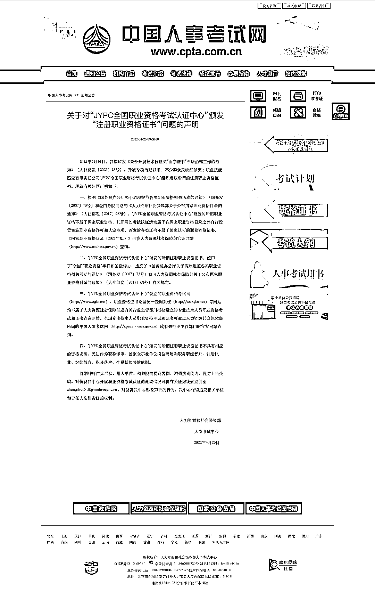
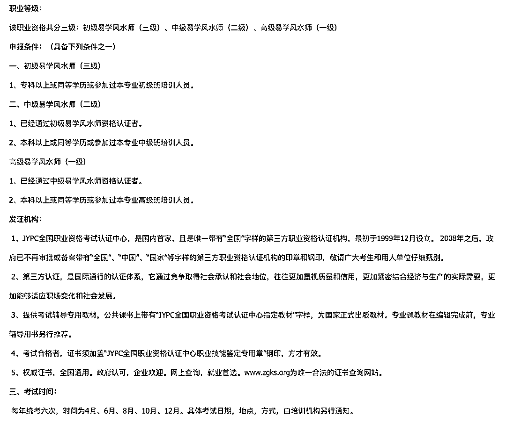

# 当算命大师开始考证

> 原文：[`mp.weixin.qq.com/s?__biz=MzIyMDYwMTk0Mw==&mid=2247535300&idx=5&sn=b72f7428554768e7dbd9e61fee63bc3e&chksm=97cb81fca0bc08ea2e23c282e0de05a080df7bdcb4f029b7262039350251755452e4362632f6&scene=27#wechat_redirect`](http://mp.weixin.qq.com/s?__biz=MzIyMDYwMTk0Mw==&mid=2247535300&idx=5&sn=b72f7428554768e7dbd9e61fee63bc3e&chksm=97cb81fca0bc08ea2e23c282e0de05a080df7bdcb4f029b7262039350251755452e4362632f6&scene=27#wechat_redirect)

考一个“易学风水师”要花三万多，江苏一教育培训机构近日被人力资源和社会保障部人事考试中心点名违规。 

这一事件近期在教育培训领域引起高度关注。 

**“JYPC 全国职业资格考试认证中心”**

**颁发的证书非国家认可**

澎湃新闻记者查询发现，人力资源和社会保障部人事考试中心今年 4 月 23 日上午在旗下网站中国人事考试网发布《关于对“JYPC 全国职业资格考试认证中心”颁发“注册职业资格证书”问题的声明》。 

声明开篇介绍了背景信息：2022 年 3 月 16 日，人社部印发《关于开展技术技能类“山寨证书”专项治理工作的通知》（人社部发〔2022〕25 号）。开展专项治理以来，不少群众反映江苏英才职业技能鉴定有限责任公司“JYPC 全国职业资格考试认证中心”组织发放所谓的注册职业资格证书。

中国人事考试网发布的声明。

在声明中，人社部人事考试中心指出：“JYPC 全国职业资格考试认证中心”设置的所谓职业资格不属于国家职业资格，其开展的考试认证活动属于在国家职业资格目录之外自行设置实施职业资格许可和认定事项，颁发的各类证书不属于国家认可的职业资格证书。 

人社部人事考试中心还在声明中明确，“JYPC 全国职业资格考试认证中心”颁发的所谓注册职业资格证书，使用了“全国”“职业资格”字样和国徽标志，违反了国家有关规定。该中心设立的职业资格考试网（http://www.zgks.net）、职业资格证书全国统一查询系统（http://cx.zgks.net）等网站均不属于人力资源社会保障部或有关行业主管部门授权设立的专业技术人员职业资格考试和证书查询网站。 

另外，人社部人事考试中心还在声明中指出，“JYPC 全国职业资格考试认证中心”颁发的所谓注册职业资格证书不具有相应的资格资质，无法作为职称评审、国家企事业单位岗位聘用和职务职级晋升、注册执业、继续教育、积分落户、个税抵扣等的依据。 

在声明的末尾，人社部人事考试中心表示保留追究相关单位和责任人法律责任的权利。 

4 月 26 日，南京市职业技能鉴定指导中心、南京市人事考试中心向江苏英才职业技能鉴定有限责任公司发出告知函：对于江苏英才职业技能鉴定有限责任公司发放的相关证书，市人力资源社会保障部门不予认可，也不能作为本市人社部门人才评比、表彰、评价、奖励、职称评定、注册执业、继续教育、人才落户等的依据，不享受人力资源社会保障领域培训鉴定、就业创业、技能提升、人才激励等财政补贴政策。 

澎湃新闻记者注意到，上述江苏英才集团全称为“江苏英才职业技能鉴定有限责任公司”，在该公司旗下除了公司官网外，还包括职业资格考试网（http://www.zgks.net）、职业资格证书全国统一查询系统（http://cx.zgks.net）等自建网站。 

**“易学风水师”最热门**

**达到高级要收费三万多**

根据天眼查提供的企业信息显示，江苏英才职业技能鉴定有限责任公司，成立于 1999 年 12 月 28 日，注册资本为 5000 万人民币，法定代表人为王庆运，工商注册号为 320000000041154，注册地址为南京市玄武区中山东路 9 号 15A--E 座，经营范围包括职业技能鉴定、人才培训、会务服务。 

同一法定代表人名下的江苏英才教育信息咨询股份有限公司成立于 2017 年 7 月 26 日，注册资本为 3000 万人民币，工商注册号为 320100002169660。该公司经营范围包括教育信息咨询；职业技能培训；图书批发、零售；会议展览；教材编写；教学软件开发；教学仪器设备销售。 

澎湃新闻记者查询发现，在上述江苏英才集团官网上，提供的考级项目就有上百个之多，在网站热门浏览第一位的是一则 2019 年 8 月发布的“易学风水师招生简章”，该简章称该职业资格共分三级：初级易学风水师（三级）、中级易学风水师（二级）、高级易学风水师（一级）。 

对易学风水师的考级发证机构就是“JYPC 全国职业资格考试认证中心”。这一简章还自称：“JYPC 全国职业资格考试认证中心，是国内首家、且是唯一带有‘全国’字样的第三方职业资格认证机构，最初于 1999 年 12 月设立。2008 年之后，政府已不再审批或备案带有‘全国’、‘中国’、‘国家’等字样的第三方职业资格认证机构的印章和钢印，敬请广大考生和用人单位仔细甄别。” 

不过，这些行为已被官方认定违规。上述人社部人事考试中心声明已明确，“JYPC 全国职业资格考试认证中心”颁发的所谓注册职业资格证书，使用了“全国”“职业资格”字样和国徽标志，违反了国家有关规定。 

对于“易学风水师”等级考试，上述简章还提到开设有初级、中级、高级培训班，并提供考试辅导专用教材：“公共课书上带有‘JYPC 全国职业资格考试认证中心指定教材’字样，为国家正式出版教材。专业课教材在编辑完成前，专业辅导用书另行推荐。”

江苏英才集团网站“易学风水师招生简章”所列的考试要求。

至于三个等级“易学风水师”培训收费，上述简章明列：高级易学风水师（一级）16800 元；中级易学风水师（二级）9800 元；初级易学风水师（三级）6800 元。 

以上费用包含：报名费、教材费、认证费、命题费、监考费、场地费、考试费、阅卷费、高级职业资格评审费等，包括专业课和公共课及其对应证书的费用。 

按照上述简章，要取得“高级易学风水师”资格，必须先取得初级、中级等级，并参加所有培训，总费用将达到 33400 元。 

除了种类繁多的考试、培训种类，“JYPC 全国职业资格考试认证中心”在今年 4 月还借人社部清理“山寨证书”专项治理提高了收费标准。 

上述机构网站今年 4 月 14 日发布了一则《JYPC 证书上调价格通知》。通知在开篇表示，“由于证书工本费、办公经费、人员工资、物流仓储费、广告宣传费、专家团队费、房屋租金、网络运营费等各项开支急剧上涨，经研究，定于 2022 年 4 月 6 日起执行新的价格体系，在原有证书价格基础上，每本证书工本费调升一百元，各项目培训费用由相关院校和培训机构酌情调增。” 

但是，在通知内文部分，“JYPC 全国职业资格考试认证中心”却表示：“2022 年 3 月 17 日，人社部印发通知，决定开展技术技能类‘山寨证书’问题专项治理工作。此次治理工作有利于肃清假劣证书的不良风向，打击假证书乱收费现象，维护证书市场的和谐秩序，更有利于凸显 JYPC 证书的合法性和权威性，扩大 JYPC 证书市场规模，推动良性发展。此次价格上调也是市场大势所趋。” 

“JYPC 全国职业资格考试认证中心”在通知中还声称，“今后，将根据社会物价指数的变动，每年调整一次证书工本费用。”

来源：澎湃新闻

← 向右滑动与灰产圈互动交流 →

