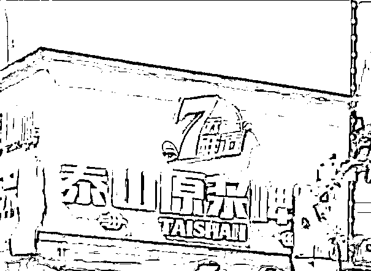
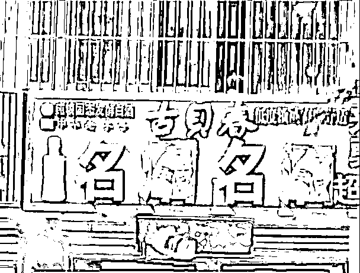
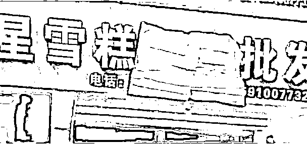
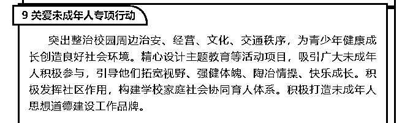
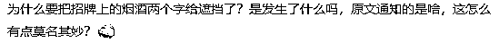

# 遮“烟”挡“酒”！创文创卫莫让形式主义牵着走

> 原文：[`mp.weixin.qq.com/s?__biz=MzIyMDYwMTk0Mw==&mid=2247535300&idx=6&sn=169d7d9b5ce8d5379aefc2a7e1567a88&chksm=97cb81fca0bc08ea89e4e3efd68c804743c1fbd10f119ed9e8378f5fe938c80610f58b461ba9&scene=27#wechat_redirect`](http://mp.weixin.qq.com/s?__biz=MzIyMDYwMTk0Mw==&mid=2247535300&idx=6&sn=169d7d9b5ce8d5379aefc2a7e1567a88&chksm=97cb81fca0bc08ea89e4e3efd68c804743c1fbd10f119ed9e8378f5fe938c80610f58b461ba9&scene=27#wechat_redirect)

近日，

山东德州多家临街商铺的招牌上

出现了一个怪现象：

凡是有“烟”“酒”二字的招牌，

都被人遮挡了起来。

比如，

“**原浆啤酒**”变成了“**原浆啤**”。

“**名烟名酒**”变成了“**名⚪名⚪**” 

“**雪糕烟酒批发**”成了“**雪糕⚪⚪批发**” 

据一家烟酒店工作人员称，

前几天，

他们店招牌上的“烟”“酒”二字也被遮挡了，

目前已经接到通知，

将遮挡物取下。

是什么原因，

让“烟”“酒”都不能露面？ 

5 月 5 日下午，

德州经济技术开发区公安分局工作人员回应称，

**目前德州市正在进行文明城市创建工作，**

**其中整治校园周边环境的工作，**

**由公安部门具体牵头办理。**

《2022 年德州市创建全国文明城市行动计划》内容

此前，

他们通知了一些商户，

**要求商户们更换不适宜的招牌，**

**但一些商户误解了意思，**

**用遮挡物将“烟”“酒”字样进行了遮挡，**

目前相关商户已将遮挡物取下。

下一步，

**将进行更换招牌的工作。**

 [`mp.weixin.qq.com/mp/readtemplate?t=pages/video_player_tmpl&action=mpvideo&auto=0&vid=wxv_2385985512672198657`](https://mp.weixin.qq.com/mp/readtemplate?t=pages/video_player_tmpl&action=mpvideo&auto=0&vid=wxv_2385985512672198657) 

截至目前， 

德州官方并没有公布相关通知，

这也让网友们感到迷惑：

 **小央说** 

****什么样的通知能让众多商家纷纷“误解”？****

****德州市经开区公安分局不妨发出来看看。****

**创建文明城市，** 

**本意是让市民的生活更美好，**

**但带“烟”、“酒”的招牌，** 

**一会儿被遮挡，**

**一会儿要更换，**

**通知一张嘴，** 

**商户累断腿。**

****以“文明”为由头折腾人，****

****恐怕不是一件文明事儿。****

**创城本是好事情，**

**但要学会动员群众、感召群众，**

**扎扎实实为群众办点实在事儿。**

****而不是简单粗暴靠着一纸“通知”，****

****今天整改明天规范，****

****这不但起不到让城市文明的作用，****

****反而惹人反感。****

**来源：央视网综合极目新闻、德州政府网******

**← 向右滑动与灰产圈互动交流 →**

****