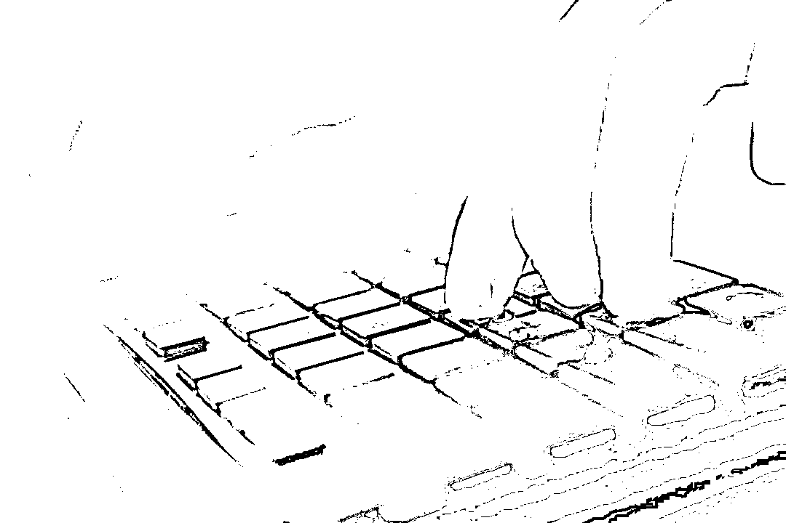
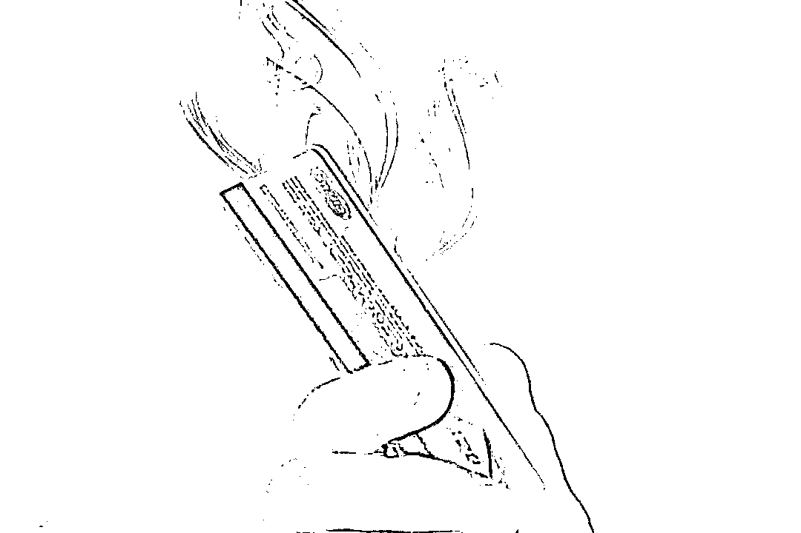

# 在缅诈骗团伙成员或染新冠死亡或纷纷跑路，他隐瞒事实“洗白”回国，等待他的是......

> 原文：[`mp.weixin.qq.com/s?__biz=MzIyMDYwMTk0Mw==&mid=2247535300&idx=7&sn=7489ead50601a798347ded8adc1ec52b&chksm=97cb81fca0bc08eafd797656f0ad75a213f4e705324b238dbf01c891866012e703d1c38dc08a&scene=27#wechat_redirect`](http://mp.weixin.qq.com/s?__biz=MzIyMDYwMTk0Mw==&mid=2247535300&idx=7&sn=7489ead50601a798347ded8adc1ec52b&chksm=97cb81fca0bc08eafd797656f0ad75a213f4e705324b238dbf01c891866012e703d1c38dc08a&scene=27#wechat_redirect)

被高薪招聘广告吸引

偷渡出境做厨师

见利忘义主动加入诈骗团伙

自以为神不知鬼不觉

没想到声纹鉴定让他“现原形”

经海安市检察院提起公诉

法院以判处陈某有期徒刑三年

并处罚金 5 万元。

**受高薪招聘广告吸引偷渡出境当厨师**

（图片来源于网络，与正文无关）

2020 年 9 月，家住陕西安康的无业青年陈某在浏览某同城网站招聘信息时，被一则“高薪招聘厨师，无需工作经验，每月 1 万元至 2 万元底薪，有提成，需外地工作”广告吸引了。陈某交代，自己以前干过厨师，月薪才五六千块钱，这份工作虽然要到外地，但是待遇不菲，就想着去赚上一笔，回来后自己就可以开餐馆了。

担心被人捷足先登的陈某立即添加了广告中联系人“阿亮”的 QQ 号码，向其打听是否还招厨师，“阿亮”让他先到云南瑞丽后再与自己联系。几天后，怀着对美好未来的憧憬，陈某先乘飞机到达芒市，后坐出租车来到瑞丽。与“阿亮”见面后，陈某才知道工作地点在缅甸，想到自己已经花了几千元路费，加上离缅甸也不远，便一口答应了。

当天，“阿亮”驾车将陈某送到中缅边境的一处高速路口。下车后，陈某跟随一个缅甸人偷渡进入缅甸。随后，有人来接应陈某，把他带进了一个门前有人扛着枪站岗的院子。进院后，陈某被带进了餐馆食堂，此后，便在这里干起了厨师。

**眼红别人赚到大钱转做“枪手**”

（图片来源于网络，与正文无关）

工作一段时间后，陈某意识到院子里的公司是一个境外电信诈骗团伙，大院门前站岗的是缅甸雇佣兵，为这个诈骗团伙看门把风，从中收取保护费。

一天，陈某看到一些员工到餐馆就餐时，直接把 100 万元左右人民币堆放在餐桌上，互相吹嘘一个月赚了几万元。想到自己这第一个月只拿了 7000 元工资，陈某动了心思。之后，他便跟一个叫“阿贵”的员工套近乎，让“阿贵”带他加入了诈骗团伙。

起初，陈某在“阿贵”手下做“话务员”，主要是根据公司提供的个人信息，打电话给国内的“客户”（被害人），问其是否有贷款需求，让有意贷款的“客户”添加公司提供的 QQ 号，“客户”添加后便将信息推给“客户经理”（团伙内称“枪手”），负责后续跟踪实施诈骗。

由于陈某口才较好，一天能打几百个电话，成功率也较高，每天会推送七八个“客户”。一个月后，陈某就被升级为“客户经理”，主要任务是引诱“客户”下载 App 注册办理贷款。“客户”注册并申请完毕后，“客户经理”通过更改银行账号，以“输错账号被银监会冻结需要缴纳解冻金”等理由对“客户”实施诈骗。诈骗成功后，陈某便可获得 12%的提成。

转眼到了 2021 年 4 月底，因缅甸新冠肺炎疫情严重，陈某所在诈骗团伙内大部分人感染了新冠肺炎，加上国内开展“断卡”行动，严厉打击电信网络诈骗犯罪，该团伙老大及骨干成员或感染新冠肺炎死亡，或纷纷跑路，人心惶惶，团伙运转不下去后自行解散了。

收不到保护费的缅甸雇佣兵便把陈某及未跑路的同伙包围起来，让他们每人交了三四千元保护费后，才放他们离开院子。

看到抖音上的反诈及回国自首的宣传短视频，陈某以非法出境为由向云南瑞丽某派出所投案自首，但隐瞒了从事诈骗行为的犯罪事实。

**提前介入引导侦查声纹鉴定意见成关键证据**

（图片来源于网络，与正文无关）

‍

‍

2021 年 3 月，海安市公安局接到市民小晨被网络诈骗 1.4 万元的报警电话。立案后，警方通过大数据锁定了犯罪嫌疑人陈某。

同年 10 月 28 日，陈某被海安市公安局抓获归案。到案后，陈某矢口否认在境外团伙从事诈骗的事实。海安市检察院提前介入该案，提出提取其声纹通过全国信息库进行鉴定比对的意见，引导公安机关侦查。

今年 2 月 16 日，公安机关将陈某涉嫌诈骗罪一案移送海安市检察院审查起诉。在此期间，外省市公安机关比对出另外 7 起诈骗案中的录音声纹与陈某一致。3 月 9 日，公安机关将上述 7 起案件一并移送审查起诉。

审查起诉期间，承办检察官依法对陈某进行了讯问，告知其认罪认罚从宽制度的法律规定，向其展示了声纹鉴定意见，但陈某前后供述反复，仅承认诈骗小晨的 1.4 万元，拒不承认另外 7 起犯罪事实。

承办检察官认为声纹具有唯一性且具有同一性，实验证明，无论是故意模仿他人的声音或语气，还是故作耳语、低声说，即使模仿得再惟妙惟肖，声纹始终相同。另外 7 起案件中提取的“请你下载众力金融 App”“对不起，因为你的账号填写错误被银监会风控部冻结账号，需要你缴纳解冻金”等语音，经过鉴定均系陈某一人所说，可以认定犯罪事实。经查，陈某于 2020 年 10 月至 2021 年 4 月间，先后诈骗作案 8 起，涉案金额合计 13 万余元。

4 月 6 日，法院一审开庭审理该案。为有力指控犯罪，庭审前，检察机关申请鉴定人作证，因疫情防控要求，鉴定人无法到庭，向法庭提交了作证笔录。庭审中，公诉人当庭播放了提取的语音，提交鉴定人就声纹鉴定科学性和唯一性的笔录和同步录音录像，对在案证据的客观性、合法性、关联性进行充分说明，并提出认罪认罚和不认罪认罚的两种量刑建议。

经过庭审质证答辩，陈某当庭表示认罪认罚。最终，法庭采纳了检察机关所指控的事实和量刑建议，作出上述判决。‍

‍

来源：南通政法，南通反诈

← 向右滑动与灰产圈互动交流 →

