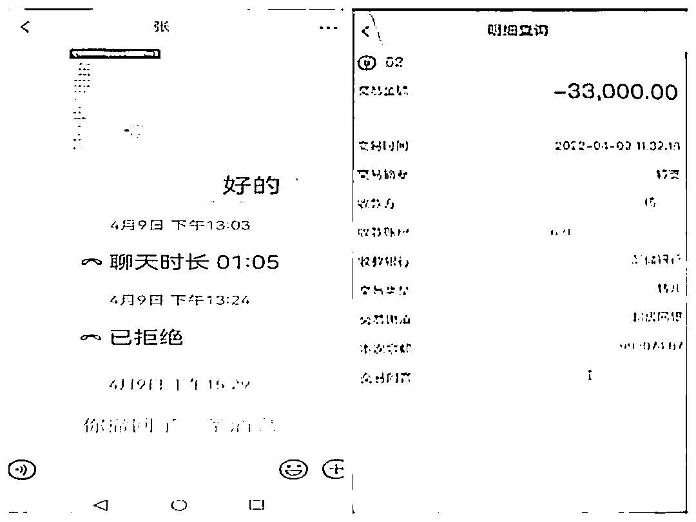

# 堂食开放！这家老板接到订餐大单......

> 原文：[`mp.weixin.qq.com/s?__biz=MzIyMDYwMTk0Mw==&mid=2247535300&idx=8&sn=c065354fc16103e5f596b69a14a2e1a6&chksm=97cb81fca0bc08ea732bcee1f0c623d4163c2e15a008902a65bc4db25f3ff7b982fd695ef8f1&scene=27#wechat_redirect`](http://mp.weixin.qq.com/s?__biz=MzIyMDYwMTk0Mw==&mid=2247535300&idx=8&sn=c065354fc16103e5f596b69a14a2e1a6&chksm=97cb81fca0bc08ea732bcee1f0c623d4163c2e15a008902a65bc4db25f3ff7b982fd695ef8f1&scene=27#wechat_redirect)

**南通市疫情防控 2022 年第 59 号通告** 

期待已久的堂食开放 50%

许多“吃货”网友欢欣鼓舞

“”想念已久的小龙虾、烧烤、火锅

我来啦！”

当商场、街面的餐饮慢慢热闹起来

染上烟火气的城市才是原来的城市

老板们“整装待发”

做足了迎接“食客”们的准备

**“老板，我想要预订几张桌子！”**

这笔大单老板心里乐呵

但别高兴得太早

说不定已经踩进了骗子的圈套

近日

浙江两家餐饮店就

遭受到此类冒充顾客的订餐诈骗

共计损失 5 万余元

**案例一**

浙江某酒楼的王老板接到自称是某校“李主任”的电话，对方称要预订次日晚上的酒席。

双方添加微信后，很快拟定了酒席菜单。此时，“李主任”称他邀请了领导参加酒席，提出需要指定的供应商提供酒水。

后王老板收到了“李主任”发来的手机转账截图，显示金额为 3.96 万元。由于迟迟未收到银行入账的消息，王老板向“李主任”询问原因，对方称是因为**跨行转账造成入账延迟**，让他不要着急。

随后，“李主任”向王老板推送了“酒水商”的微信，并**指定要 5 瓶单价为 1 万元的红酒和 6 瓶单价为 750 元的红酒**。

王老板和“酒水商”谈妥后，向对方转账 2 万元定金。此时，距离“李主任”转账已超过 2 小时，可王老板还未收到 3.96 万元的入账提示。

于是，他不停地向“李主任”和“酒水商”发送微信，可这两人杳无音信。发现事情不妙，王老板便报了警。

**案例二**

浙江另一餐饮酒店工作的向女士也遭遇了类似的订餐诈骗。向女士接到一位自称是某高中校领导“张老师”的电话，对方称需要在酒店订餐。

在沟通过程中，“张老师”对酒店现有的“佛跳墙”不甚满意，想要一种**更名贵食材制作而成的佛跳墙**。随后，他提出会提前将**货款转给向女士**，让其帮忙去**指定佛跳墙供应商处进货**，并推送了供应商的微信。

没多久，向女士收到了“张老师”发来的**2 张转账截图**，上面显示金额分别为 3 万和 5 万元。信以为真的向女士添加了供应商微信，并以 3.9 万元的价格预定了一批佛跳墙食材。

随后，向女士向对方的银行账户支付了 3.3 万元定金。

当向女士发现“张老师”的转账迟迟未到账时，“张老师”和佛跳墙供应商都不再回复她的微信。她才意识到被骗，便报了警。

**套路分析**

**1\. 批量订单骗取信任**

骗子以订购餐饮大单为诱惑，借助网络、短信、微信等联系餐饮业老板，从而引导受害人落入骗子“陷阱”。 

**2\. 声称需某品牌产品**

在获取受害人信任后，骗子便会声称需要某些特定产品，让老板帮其准备。为了这笔大订单，很多受害人都会选择铤而走险，陷入了骗子精心编织的圈套。

**3\. 二号角色“厂家”出现**

骗子会为受害人提供 “供应商”联系方式，诱导通过“供应商”进货，其实这些所谓的“供应商”就是骗子同伙。受害者在与“供应商”联系过程中，对方便会要求收取“定金”或“货款”，还不支持“货到付款”。 

**4\. 一旦转账就会拉黑闪人**

如果受害人反诈意识较弱，答应支付，骗子收款后会立即将其拉黑，玩失踪。

**反诈君想说**

老板遇上“难搞”客户订餐

客户指定第三方货品

还要求老板付定金或货款后办事

都**不能轻易汇款**

一定要设法先核实对方的身份

**切勿随意给陌生人转账**

来源：瑞安公安，南通反诈

← 向右滑动与灰产圈互动交流 →

# 原文：[`mp.weixin.qq.com/s?__biz=MzIyMDYwMTk0Mw==&mid=2247535393&idx=1&sn=891e1bf10adb718e8d812b98ef8024ca&chksm=97cb8019a0bc090f80b18a9f7fb225484e2dee5375de574e209c5f784fcb4ec7680c8ea7fe32&scene=27#wechat_redirect`](http://mp.weixin.qq.com/s?__biz=MzIyMDYwMTk0Mw==&mid=2247535393&idx=1&sn=891e1bf10adb718e8d812b98ef8024ca&chksm=97cb8019a0bc090f80b18a9f7fb225484e2dee5375de574e209c5f784fcb4ec7680c8ea7fe32&scene=27#wechat_redirect)