# 被骗去的中国赌徒，他们有着怎样的遭遇？

> 原文：[`mp.weixin.qq.com/s?__biz=MzIyMDYwMTk0Mw==&mid=2247535393&idx=3&sn=8b3569d8f3cb858bd71f25adf62ae8f4&chksm=97cb8019a0bc090f23e0183529f3205bb5c5e0ceafc53ab544bbe5cd09a60b22ddd537ac2b10&scene=27#wechat_redirect`](http://mp.weixin.qq.com/s?__biz=MzIyMDYwMTk0Mw==&mid=2247535393&idx=3&sn=8b3569d8f3cb858bd71f25adf62ae8f4&chksm=97cb8019a0bc090f23e0183529f3205bb5c5e0ceafc53ab544bbe5cd09a60b22ddd537ac2b10&scene=27#wechat_redirect)

俗话说，十赌九输，只要沾上赌博的陋习，便无法从中脱身，最后难免会落到倾家荡产、妻离子散的下场。 

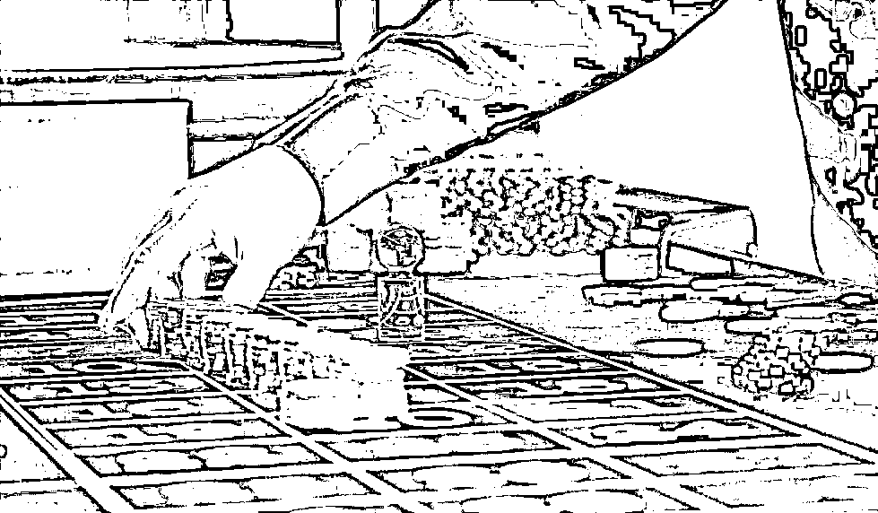

正因如此，我国对此都进行了严格的管控，以防形成恶劣的社会风气。

不过，总有一些人胆大妄为，见国内赌博违法，他们便盯上了境外国家，其中老挝便是我国赌徒的一个常见选择。

2009 年，三名中国赌徒前往老挝赌博，本来打算好好玩一把、捞一笔钱回家的他们，却遭受了惨绝人寰的对待。

后来，每人不仅搭进去一大笔钱，还落下一身伤疤，甚至惊动了我国警方。

那么，他们到底是怎么去老挝的？在老挝，他们又有着怎样的遭遇？最终他们又如何返回国内？

# 免费筹码，悲惨结局

2009 年 11 月下旬，经过数天的舟车劳顿，小王、霞姐和老李一行三人，在导游张绍平的带领下，终于抵达了老挝磨丁黄金城。

磨丁是位于我国云南和老挝交界处的一座新兴城市，也是老挝于 2003 年设立的一个特区，其主要产业便是博彩业和旅游业。

一见到传说中的磨丁黄金城，三人顿时傻了眼。

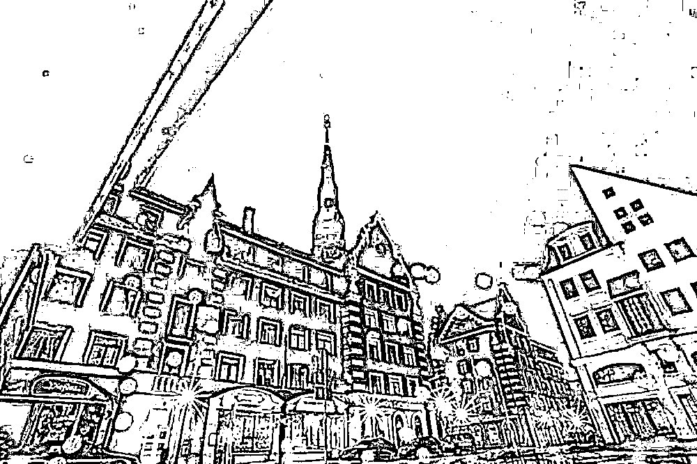

只见此处虽然地处偏僻，但城市建筑却异常金碧辉煌，和许多网页博彩广告的风格别无二致，一下子就勾起了他们的赌博欲望。

不仅如此，抬眼望去，大大小小的赌场鳞次栉比，三人恨不得马上冲进去，以缓解自己早已发作的赌瘾。

然而，张绍平却拦住了他们，反而驱车将他们带到了一家装修精致的五星级酒店。

当时小王就很纳闷，明明自己并没有订酒店，也没有住五星级的预算，所以便疑惑地问了导游一句，

“为什么带我们来这里呀？”

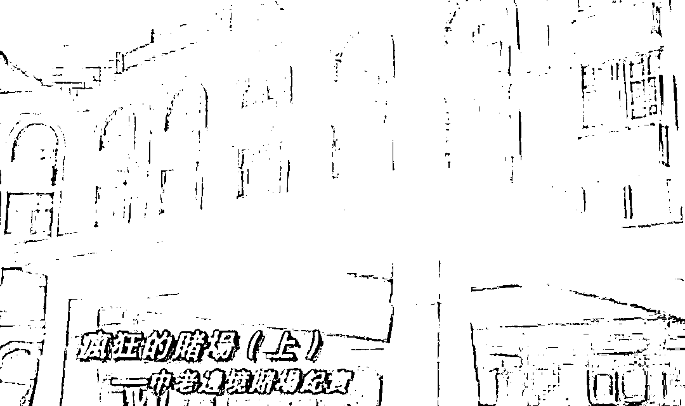

张绍平似乎一下子就看穿了几人的心理，便笑着说，

“酒店是免费的，你们不用担心花销，尽情住就好了。”

就这样，小王三人卸下了防备，开开心心地完成了入住手续。

没想到，还没等他们放好行李，酒店的负责人便找上门来。

原来，酒店二三层便是赌场，负责人此行正是给他们送筹码。

于是，小王、霞姐和老李每人都拿到了价值十万元人民币的筹码。

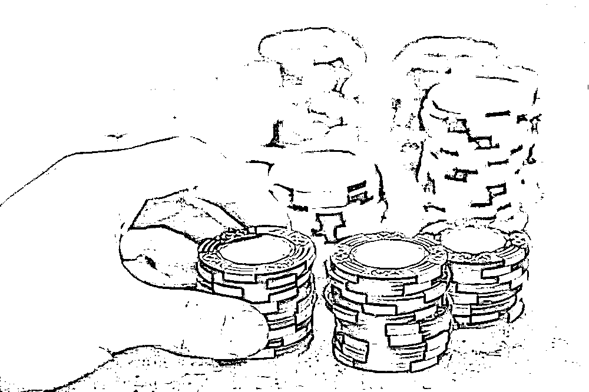

他们虽然心里有些困惑，毕竟天下没有免费的午餐。

但一想到可以尽情赌博，就什么也顾不上了，随即大步走进赌场，尽情享受赌博带来的刺激。

此时，他们完全没有想到，等待他们的，将是噩梦般的生活。

2010 年 1 月，时隔两个月，三人终于得以回到祖国。

但是，霞姐和小王都掏空了家里的积蓄，还留下了一身伤疤，而老李更惨，他在老挝心脏病突然发作，差点没有挺过来。

回国后，三人都幡然醒悟，宣称自己将再也不碰赌博。

说到这，可能有些朋友会好奇，小王一行人到底为什么不约而同地去了老挝？拿到筹码后，到底发生了什么可怕的事情？

# 一通来自旧同学的电话

小王本是一个普通的上班族，工资虽然不高，但工作稳定，在同事们眼中也颇受欢迎。

不过，大学毕业后他便染上了赌博的恶习，起初只是打打麻将、推推牌九，赌的金额不大。

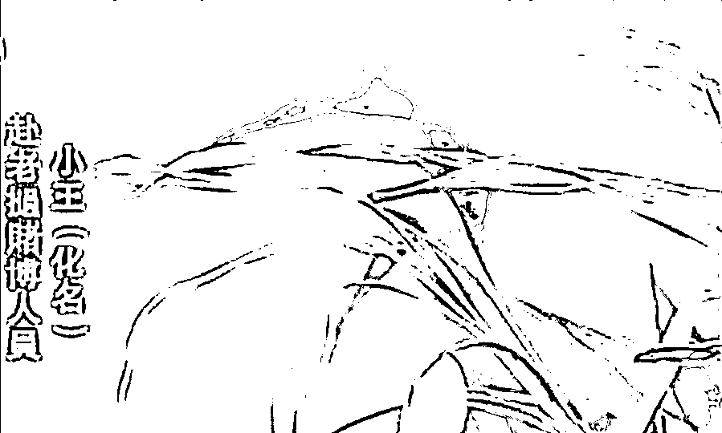

但随着赌得越来越多，小王的欲望也日益膨胀，尤其是道听途说一些赌场上一夜致富的故事后，他更是心痒痒，逐渐萌生了出国赌博的想法。

原先，缅甸是国内赌徒的“圣地”，小王也偶尔去玩两手。

但 2005 年以后我国警方便联合缅方，彻底肃清了缅甸华人聚集的赌场，从那以后，他的赌瘾更是无处发泄。

直到 2009 年的一天，一通来自老同学的电话，为他打开了新世界的大门。

来电话的人正是我们前面提到的导游张绍平，在电话中，他侃侃而谈，称老挝已经取代缅甸，成了中国人赌博的好去处。

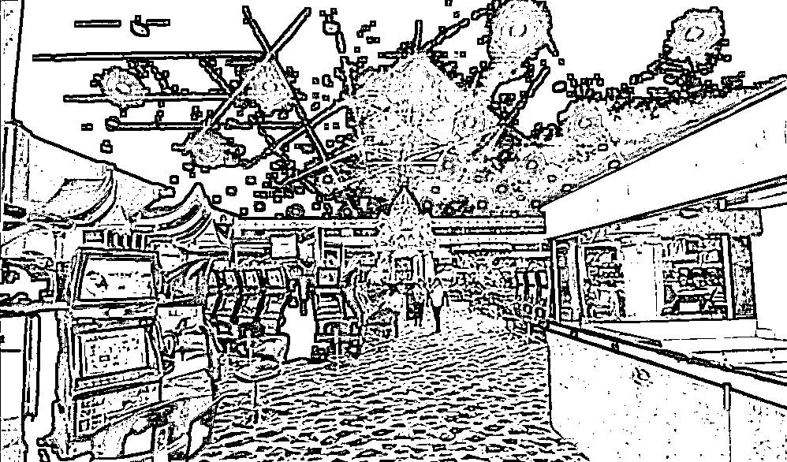

除此之外，他还详细介绍了老挝磨丁黄金城的“盛况”，称那里的赌博设施应有尽有。

一听到这话，小王顿时来了兴致，询问起赌场的细节。

于是张绍平便趁热打铁，称自己正在旅行社担任导游，专门负责前往磨丁赌博的游客。

如果小王感兴趣，可以免费带他去玩一趟，不仅来回机票免费，而且饮食住宿也全部报销。

听老同学这么说，小王自然深信不疑，于是便一口应承下来。

不到一个星期，张绍平果然再次与他联系，并称老挝之行即将开始，小王的赌瘾早就被勾了上来，收拾好行李便欣然前往。

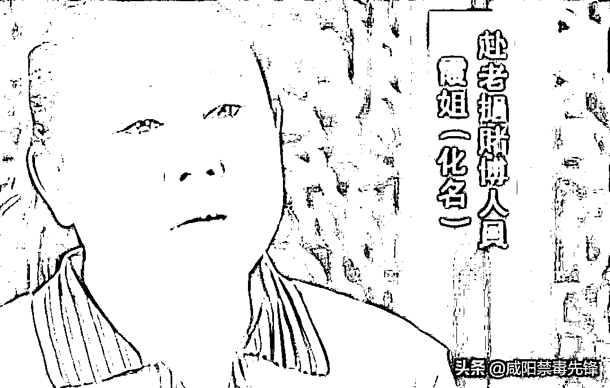

与张绍平会和后，小王发现同行的还有两个人，一个名叫霞姐，也是北京人，而另一个年纪稍大，被称作老李，来自东北吉林。

三人就这样踏上了前往老挝的旅途，但与张绍平承诺的略有不同，他们并没有乘坐飞机，而是坐着一辆私家车，从北京向云南边境开去。

到了云南之后，张绍平又换了一辆三轮摩托，沿小路直接偷渡至老挝境内。

沿途，一块写着“中国公民严禁进入博彩厅”的警方标识牌引起了三人的注意。

然而，面对赌博的诱惑，这些疑点他们都视若无睹，兴高采烈地跟着张绍平一路来到了磨丁黄金城。

# 掉入陷阱，欠下巨款

三人在入住酒店之后相继拿到了十万元的筹码，临行前，张绍平特意叮嘱随身不必带钱。

所以在获得筹码后，两手空空的三人都如获至宝，很快便投入到赌博之中。

起初，三人如有神助一般，手气都特别好，不过，当他们拿着筹码去兑换现金时却遭到了赌场的严词拒绝。

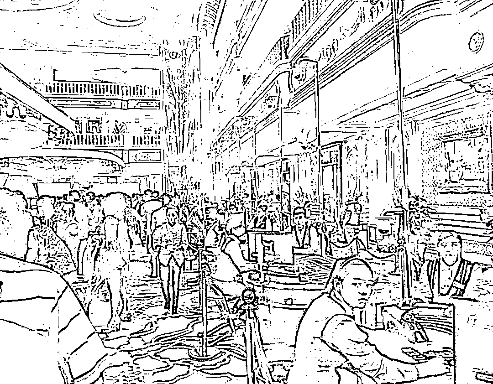

根据赌场方面介绍，新玩家入场，至少十天以后才能取现，也就是说，十天内，赢的钱根本提不出来。

“十天就十天，反正也是来玩的”。

抱着这样的想法，三人完全没有考虑到事有蹊跷，而是继续狂赌起来。

然而，随着时间的推移，他们的手气却逐渐没那么旺了，当天便输光了赢来的钱。

第二天更是将酒店提供的筹码也全部搭了进去。

按理说，既然钱都花光了，不赌不就行了。

可是，赌徒的心理往往就是这样，赢了想要赢得更多，输了则想要回本。

所以，三人非但没有停止赌博，反而继续向赌场里预支筹码。

不过，他们刚开始如日中天的手气再也没有回来过，几天下来，每个人都输掉了几十万。

而这时，赌场的安保人员开始盯上了他们。

不管是回酒店、出门逛街还是在赌场里游荡，这些安保人员就像甩不掉的牛皮糖一样，无时无刻、如影随形，生怕跟丢了他们。

随后，赌场正式下发通知，要求他们立即还钱。

可是，他们来的时候根本没带钱，现在更是身无分文，好在“贴心”的赌场一早就做好准备。

他们将小王三人的家庭信息全部罗列出来，并下达最后通牒，要求他们立即通知家人汇款还钱。

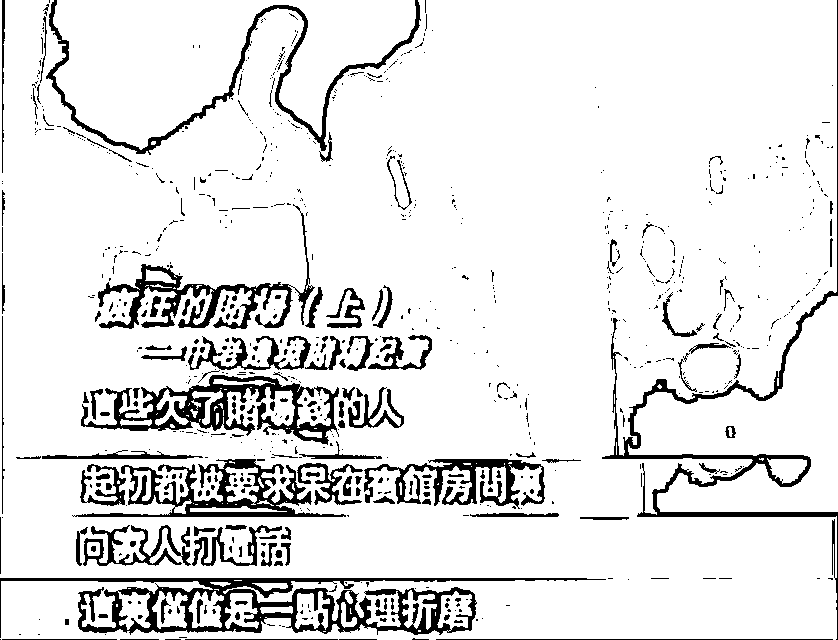

直到这时，社会经验较为老道的霞姐才意识到事情不对劲，她告诉其余两人，这很有可能是个骗局，并坚决拒绝与家人通话。

没想到，赌场一听这话，立即将他们转移到“单房”内，而噩梦也由此开始。

# 残酷的单房，非人的虐待

所谓单房，其实就是磨丁赌场关押欠债赌徒的狭小房间，共分为催单房、逼单房、死单房和养伤房。

而每一种房间都对应着不同程度的折磨。

一开始，小王三人被关押到了不同的催单房，这类房间相对干净整洁，而且有吃有喝。

但每天都有人用言语恐吓他们，勒令其找家人要钱。

然而这样的“好日子”并没有维持太久，由于他们都拒绝给国内打电话，所以马上被转移到了逼单房。

逼单房的环境就要恶劣得多了。

不仅空间狭窄，十几个人被关押在不到 8 平米的屋内，而且三餐也没有保障，经常是吃了上顿没下顿。

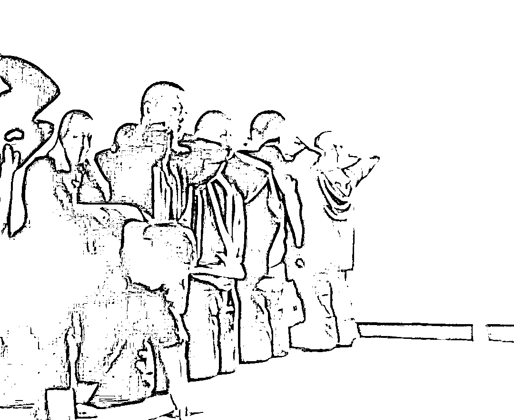

逼单房的安保人员也不再客气，由于在赌场有提成，所以他们穷凶极恶，使出了浑身解数，用暴力逼迫赌徒还钱。

在这里，拳打脚踢都是家常便饭，更加恐怖的是，安保人员采取了特殊手段，在逼单房里营造出一种极为紧张的气氛。

每天早上他们会让赌徒在地上跪成一排，然后根据报数打耳光。

一次，霞姐不幸中招，见她是女性，安保人员“大发慈悲”，给她免去了三个耳光。

但其余十个还是扇得结结实实，而霞姐无法忍受剧痛，在一阵撕心裂肺的痛哭之后，竟然当场晕厥了过去。

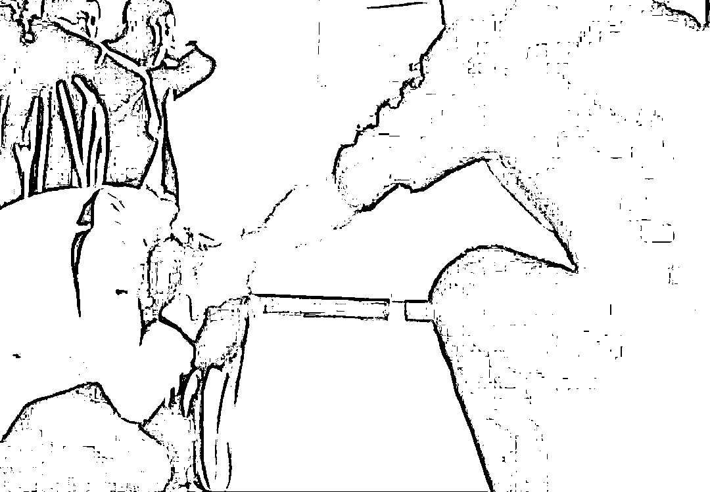

不过，比起死单房不见天日的生活，逼单房这点皮肉伤根本不值一提。

在死单房内，安保人员使用了很多酷刑。

比如逼迫赌徒就着辣椒喝下一整碗开水，或者用绳子将他们绑起来，倒挂一天一夜。

三人中，只有老李曾被送进过死单房，在那里，他亲眼目睹了湖南罗女士的遭遇。

和其他人一样，罗女士也欠了赌场一大笔钱，同时她脾气较为暴躁，经常对着那些安保人员大吼大叫。

于是，有一天安保人员竟用老虎钳，将她大拇指的指甲活生生拔了下来。

不仅如此，他们还丧心病狂地将一根铁钉钉进了罗女士的手指关节。

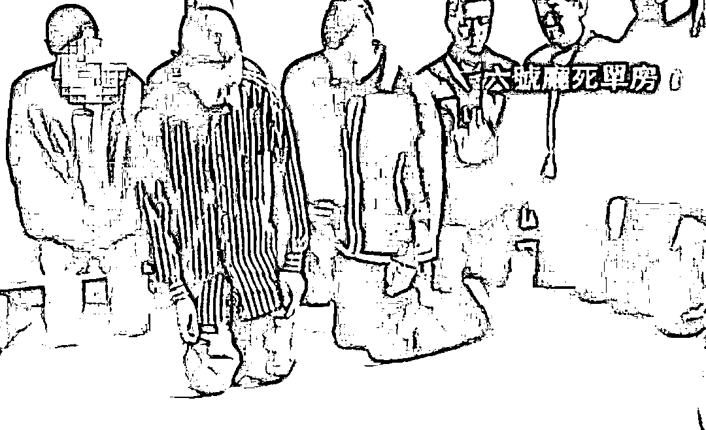

目睹这残忍的一幕之后，老李一时间无法承受，心脏病突然发作，于是他被转入了养伤房。

说是养伤房，其实条件也很恶劣，只是为了确保赌徒不会突然死掉，毕竟开赌场还是为了牟利。

当然，对于始终不肯还钱的人，赌场也没有太多耐心，大多数时候选择将他们活埋。

在见识了磨丁赌场的手段后，小王三人终于没有抗住，纷纷向家里要了一笔钱。

他们家庭都不富裕，几乎掏空家底也没有凑够钱。

好在，霞姐多留了个心眼，让家人及时报警，在我国公安部门的协调下，他们才顺利回到了家乡。

# 接受采访，引发争议

小王一行三人的经历可谓是惊心动魄、跌宕起伏，在回国后，他们接受了电视台的采访，详细介绍了之前的情况。

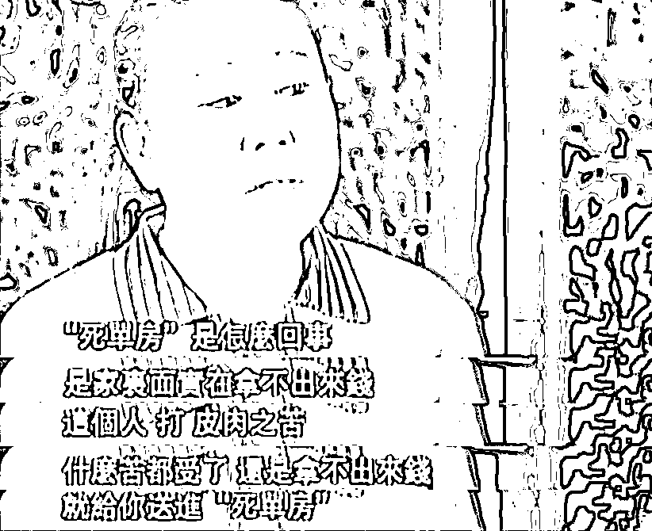

值得一提的是，当时磨丁赌场的人员竟给电视台发送短信，要求他们停止节目制作，这些人的猖狂程度由此可见一斑。

当然，节目最终顺利播出，这些赌徒的经历也公之于众，随即便在网络上掀起了热议。

有人说，他们自己好赌，所以才会掉入陷阱，完全不值得同情。

但也有人说，在合法的国家参与赌博并没有错，小王三人只是被黑赌场给坑了。

事实上，第二种说法其实并不准确。

从法律的角度而言，我国公民即便在海外赌博，仍然受到了我国相关法规的管辖。

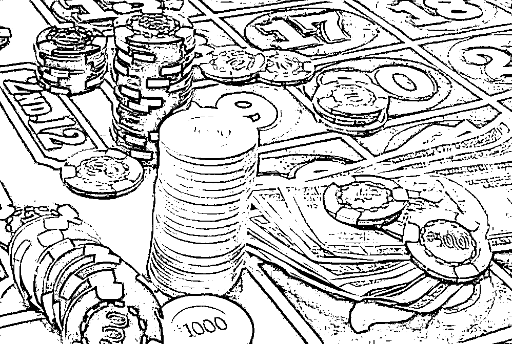

根据《治安管理处罚法》第 70 条规定：“以营利为目的为赌博提供条件的，或者参与赌博赌资较大的，处五日以下拘留；情节严重的，处十日以上拘留，并处五百元以上三千元以下罚款”。

由此可见，赌博绝对是非法行为，按照我国的属人管辖原则，即便在境外赌博，也有可能受到追究。

除此以外，赌博还是一个严重的道德问题和社会问题，在生活中，我们或许都见过因赌博而支离破碎的家庭、因赌博而一片昏暗的前途。

赌博的恶习，影响的不单是个人，还是整个社会，在小王三人的事件中，国家便耗费了大量珍贵的警力用来解救他们。

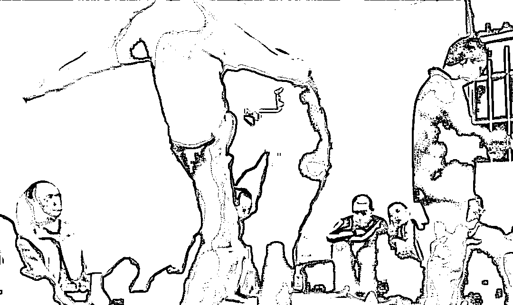

试想，如果他们从一开始就没有动歪脑筋，没有赌博的想法，还会出现后来一系列惨痛教训吗？

由此可见，对于小王、霞姐和老李，必须要让他们认识到自己的错误，进行深刻的反省，以后才可能迷途知返、重新做人。

# 总结

好在，回国后，他们都痛心疾首，表示将彻底戒赌，“不再碰这害人的东西”。

与此同时，我国外交部门对相关情况也十分重视，在多次施压后，老挝警方终于与我国合作，彻底铲除了磨丁黄金城的非法人员，也对当地赌场进行了更加严格的监管。

不过，只要赌徒还在，黑赌场即便一时消失，也必将卷土重来。

对于我们每个人而言，用勤劳的双手创造财富，而非想着不劳而获、一夜暴富，才是杜绝此类悲剧重现的唯一方法。

来源：咸阳禁毒先锋，戒赌吧

更多精华好文，请点击关注

← 向右滑动与灰产圈互动交流 →

