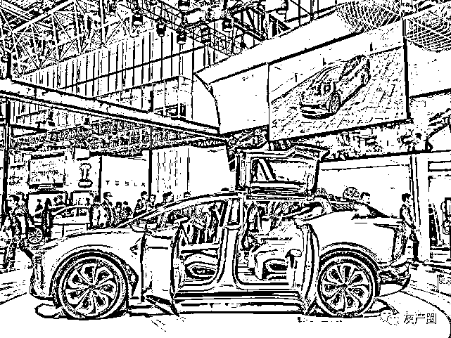
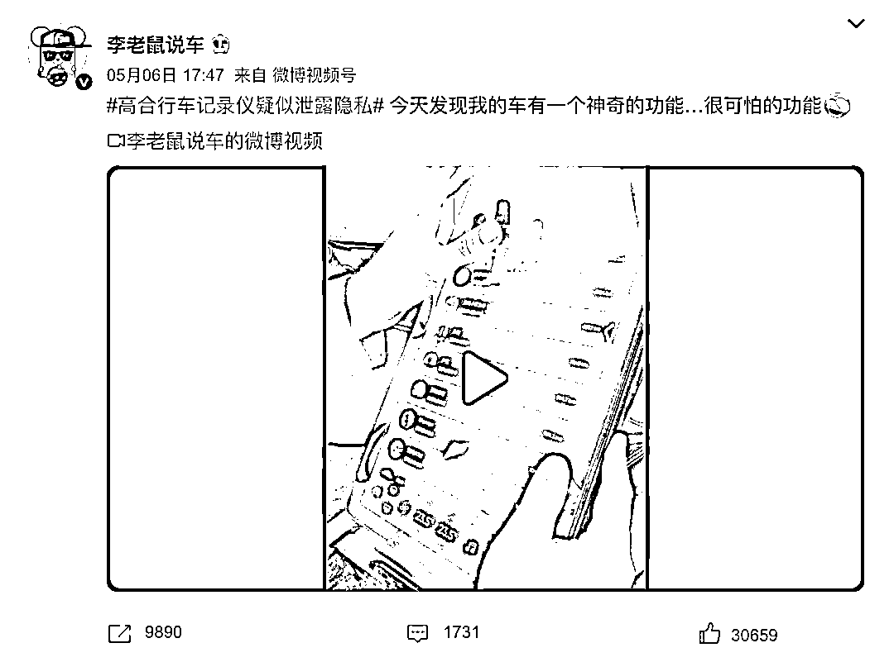
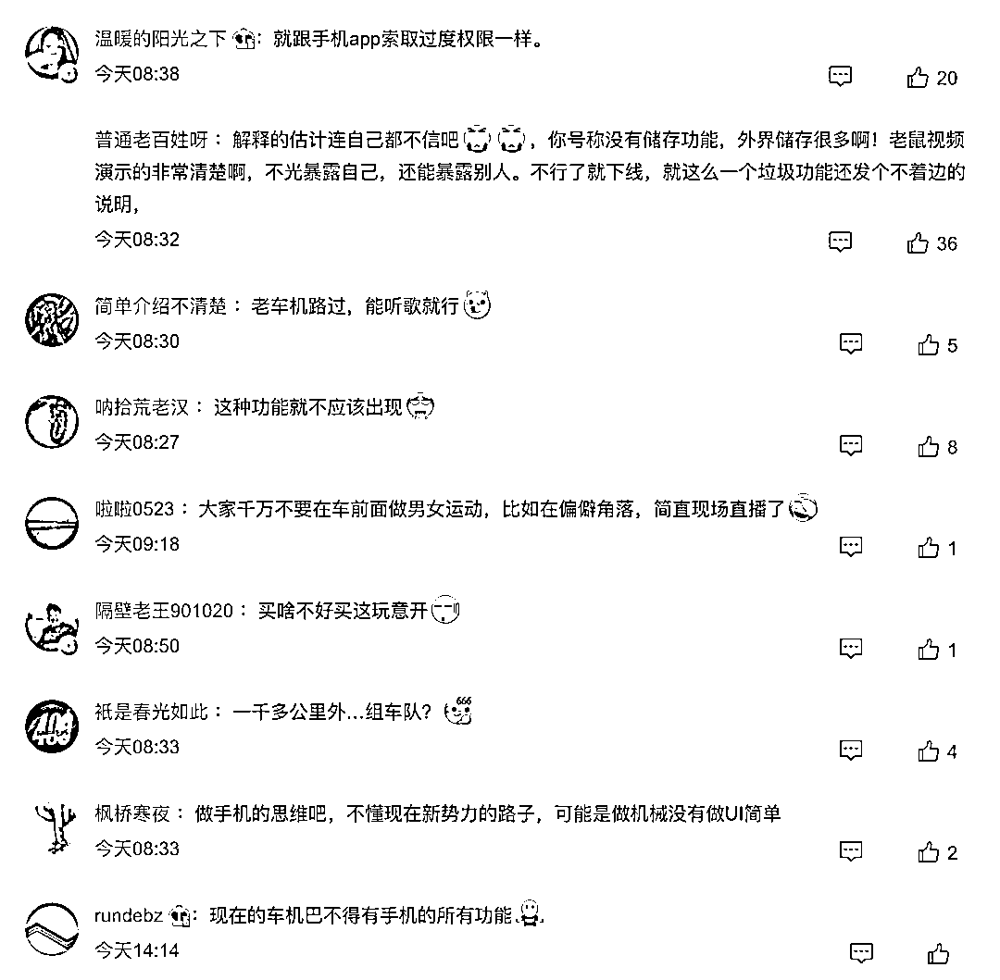
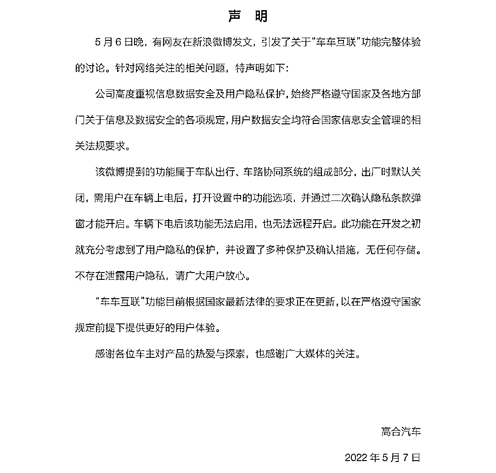
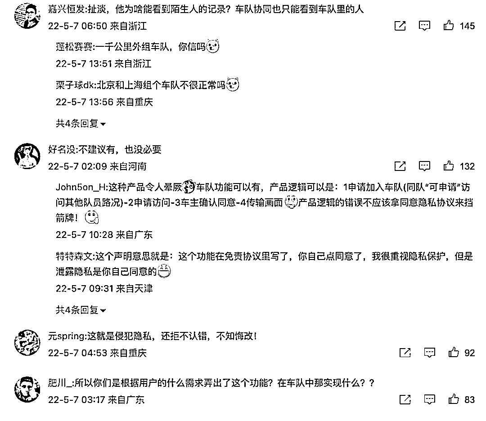

# 行车记录仪泄露隐私? 高合汽车：用户确认才可开启

> 原文：[`mp.weixin.qq.com/s?__biz=MzIyMDYwMTk0Mw==&mid=2247535393&idx=4&sn=7d9b34d90b1d864202f1fa4548041113&chksm=97cb8019a0bc090ff2280b86acc5aefb1a6693be6127cc267f889c75e931e7fe1d4f96a7bef8&scene=27#wechat_redirect`](http://mp.weixin.qq.com/s?__biz=MzIyMDYwMTk0Mw==&mid=2247535393&idx=4&sn=7d9b34d90b1d864202f1fa4548041113&chksm=97cb8019a0bc090ff2280b86acc5aefb1a6693be6127cc267f889c75e931e7fe1d4f96a7bef8&scene=27#wechat_redirect)

汽车行驶记录仪俗称就是汽车的黑匣子，是对车辆行驶速度、时间、里程以及有关车辆行驶的其他状态信息进行记录、存储并可通过接口实现数据输出的数字式电子记录装置，在开车过程中车辆可以边走边录像，同时把时间、速度、所在位置都记录在录像里，相当“黑匣子”，日常也可在家用作 DV 拍摄生活乐趣或者作为家用监控使用。近日据知名汽车博主爆料，某品牌的汽车行车记录仪疑似泄露隐私，导致汽车的行车记录仪会被其他车友任意查看。

5 月 6 日， 知名汽车博主@李老鼠爆料，高合行车记录仪疑似泄露隐私。该博主在其个人微博发布了一则关于“高合汽车行车记录仪功能”的视频，其在视频中描述，当行车记录仪界面被打开，右下角有一个类似“发 WIFI”的按钮，而点击这个按钮之后，就能看到更多开同一款车型的其他车主的列表，这位汽车博主在点击其中一个用户名之后，就直接在汽车屏幕上看到了另外一个车主行车记录仪拍摄的画面。对此，他在视频中也非常疑惑地问道：“为什么这辆车会有这样一个功能呢？”该博主表示：“自己也是在查行车记录仪的时候偶然发现的，目前不太清楚这个功能是不是默认开启的”。

[`v.qq.com/iframe/preview.html?width=500&height=375&auto=0&vid=t3336syyq6k`](https://v.qq.com/iframe/preview.html?width=500&height=375&auto=0&vid=t3336syyq6k)

针对疑似泄露车主隐私的质疑，5 月 7 日，高合汽车在官方微博发布了一份《关于“车车互联”功能的声明》，在声明中，高合汽车表示：公司高度重视信息数据安全及用户隐私保护，始终严格遵守国家及各地方部门关于信息及数据安全各项规定，用户数据安全均符合国家信息安全管理的相关法规要求。该微博用户提到的功能属于车队出行，车路协同系统的组成部分，出厂时默认关闭，需要用户在车辆上电后，打开设置中的功能选项，并通过二次确认隐私条款弹窗才能开启。车辆下点后该功能无法启用，也无法远程开启。此功能在开发之初就充分考虑到了用户隐私的保护，并设置了多种保护及确认措施，无任何存储。不存在泄露用户隐私，请广大用户放心。“车车互联”功能目前根据国家最新法律的要求正在更新，以在严格遵守国家规定的前提下提供更好的用户体验。

来源：汽车行业关注

更多精华好文，请点击关注

← 向右滑动与灰产圈互动交流 →

