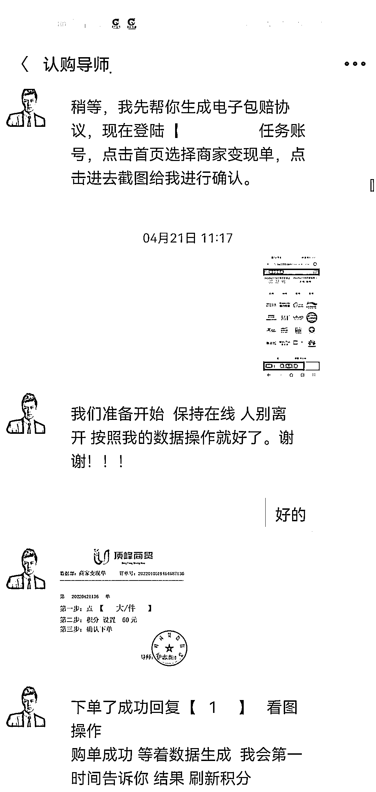

# 做抖音试衣员被骗 58 万，这又是什么新的刷单骗局？

> 原文：[`mp.weixin.qq.com/s?__biz=MzIyMDYwMTk0Mw==&mid=2247535393&idx=5&sn=115016152d4886ace703acec76a39e3a&chksm=97cb8019a0bc090fa3670c6f5c6d8082587443c18f687c412290926546b0b55c1673b45f4a38&scene=27#wechat_redirect`](http://mp.weixin.qq.com/s?__biz=MzIyMDYwMTk0Mw==&mid=2247535393&idx=5&sn=115016152d4886ace703acec76a39e3a&chksm=97cb8019a0bc090fa3670c6f5c6d8082587443c18f687c412290926546b0b55c1673b45f4a38&scene=27#wechat_redirect)

前几天有个新闻上了热搜： 

****

**#5 女子刷抖音做试衣员被骗 58 万# **

新闻的内容大概是说： 

最近有不少网友在刷抖音的时候看到上面招聘试衣员的广告，

就抱着想兼职赚笔外快的态度，留下了自己的联系方式，

最后发现是刷单骗局，被骗了几万到十几万不等。

刷单骗局，那可是咱们的老熟人了， 

今天就让咱来看看这个试衣员诈骗又能整出什么新花样。

**01**

**何谓「试衣员」**

因为咱公众号的粉丝以男生居多，可能有不少人还不知道什么是试衣员，

先给大伙讲讲这个「试衣员」是什么。

某音或者某书上所谓的试衣员，其实就是**寄拍模特。**

这类模特主要的工作内容就是穿上商家寄来的衣服，然后打扮得漂漂亮亮的进行拍照。

拍好的照片通常会被商家回收，用作自己商品的宣传。

而寄过来的衣服呢，大多数时候就直接送给模特了，同时还会附上几十到几百的佣金。

这本来是互联网上自发形成的一种双赢的行为。

对商家而言，只要花很少的钱就能得到真实又漂亮的产品宣传图片。 

对于漂亮的小姐姐而言，既能免费得到新衣服，还能赚笔小钱，运气好说不定还能借此红一把直接出圈。 

「寄拍模特」前两年在大学特别流行，冯仔还记得当时周围有不少女同学不要钱都想成为寄拍模特。

一方面当然是因为可以免费得到漂亮的新衣服，另一方面来说，能够通过成为寄拍模特证明自己的颜值被认可，这种虚荣是多少钱都换不来的。

**因为向往的人太多，寄拍模特这个行业很快就变味了。**

各类牛鬼蛇神汇聚在其中，有的是骗押金的，有的是骗色情照片的，当然还有像这次这样骗人刷单的。

那么这些骗子到底是怎样骗人刷单的呢？

**02**

**如何引人上套**

其实骗子的宣传方式和传统的宣传一样，都是先投广告。

****

前两年可能是通过朋友圈之类的，这两年短视频火了，就在短视频平台投广告。

之后如果有更新的形式，那么可以肯定也会有相对应的新广告。

总之，无论通过什么平台，**投广告的最终目的都是为了广撒网。**

你不上当他不上当，一百个人里总有人容易上当，骗子对于大数据的运用可谓炉火纯青。

如果有人看了广告觉得有兴趣，他们会让对方留下联系方式。

****

这些留下联系方式的人，毫无疑问就是大冤种准客户了。

**加上联系方式之后，会给对方指派一个导师。**

导师先是带着做一些几块钱的小单，这些小单真的会给几元钱的返现，让对方尝到点甜头。

我知道这时候又有大聪明要跳出来说：

那我赚他几块钱就走，岂不是白嫖了骗子？

**还是那句话，不要跟骗子周旋，骗子不怕你会玩，就怕没人跟他玩。**

不要重蹈这位大哥的覆辙👇 

****

说回骗局。

做了几个小单，给到甜头之后，导师会问你要不要做几个大单多赚点。

如果你选择放弃，那你就不是骗子的准客户，之后小单也没有了。

但是一百个人里面总有几个想做大单多赚的，**导师会将这些人拉入一个所谓「物流群」。**

之后的派单就在这个群内进行。

进入所谓「物流群」之后，真正的骗局就开始了。

物流群内的单子佣金比小单高很多，佣金高了自然就想要多赚点，想多赚就要多投入。

受害者通常也不会直接就拿很大一笔钱去试水，大部分人可能也就**拿个一两千元先尝试一下。**

然后这时候“巧合”就来了，受害者一定会被判定为做错数据，而且更巧的是做错的不止受害者一人，还有人和他一起做错数据。

********

这两个陪受害者一起做错数据的人，就是「托儿」了。

他们的作用就是告诉受害者，他不是一个人，这件事不是针对他的。

其实不仅这两个，**整个「物流群」内几乎所有人都是托儿。**

群里发布的交易成功的信息也都是骗子自己做的，目的都是为了让人放松警惕。

数据做错导师会要求受害者补钱兑换积分，如果不花，两千块钱就打水漂了。

****

不仅导师如此要求，那两个一起做错的人也会同时给受害者施压， 

很多受害者想着：“别人都给了，骗也不会骗我一个人。”就给了。

或者面子薄的不好意思因为自己的原因让别人蒙受损失，也给了。

一旦受害者补了这笔钱，那沉没成本就大了，**从原来一两千试试水，到这时候可能就投入好几万了。**

各位读者看到这里可以停下来想一下，如果是自己面对几万元的沉没成本，还能像几千元一样说算了就算了吗？

补了积分当然没完，他们又会想理由将受害者账号冻结，

想要解冻？ 

继续花钱补吧。

就这样一直补，补到受害者身无分文，或者幡然醒悟。 

以上就是一个完整的刷单骗局了。 

据新闻称，同样的骗局，已经有近百人被骗。 

****

**03**

**为什么总是受害者上当**

讲刷单骗局的时候，会反反复复遇到同一个疑问：

**为什么****有人这么容易被骗？** 

****

其实不止是这个案例，几乎所有涉及刷单的骗局，或者更夸张一些，所有主动将钱交给骗子的骗局，

最后都会有人提出这样的疑问： 

**怎么有人那么容易上当？**

**当事人都是傻子吗？**

**这么简单的骗局怎么可能看不出来？**

实话实说，读者老爷有这样的疑惑一点都不奇怪，因为大部分人本来就不是骗子的天使客户，被骗是个小概率事件。

但是看过上面的套路之后，我想大家也该明白，受害者绝不是傻子，只是骗子的骗局环环相扣。 

他们的每一步都在筛选容易上当的人，锁定受害者之后还有一整个群的演员一起来忽悠受害者，

最后还利用人不肯放弃沉没成本的心理来骗更多的钱。

希望大家能够明白：

骗子和受害者都不是傻瓜，那些看了案例不转发的才是傻瓜。😕

来源：黑白呸

更多精华好文，请点击关注

← 向右滑动与灰产圈互动交流 →

