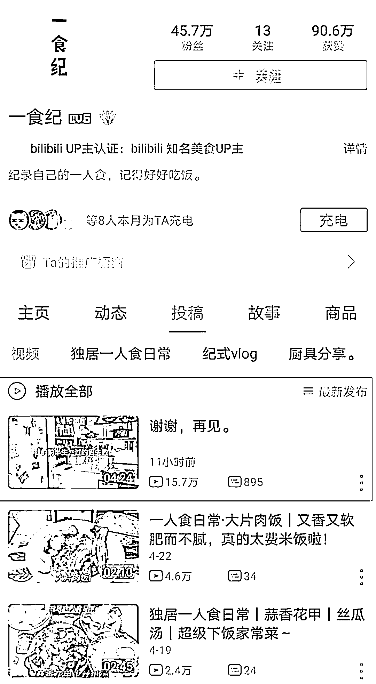
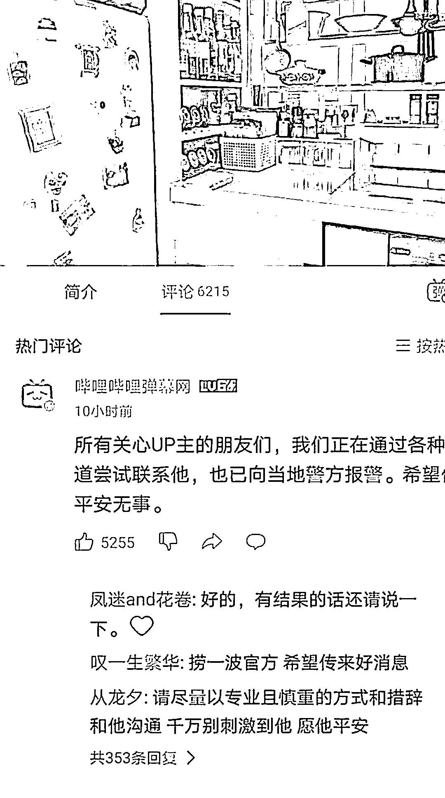
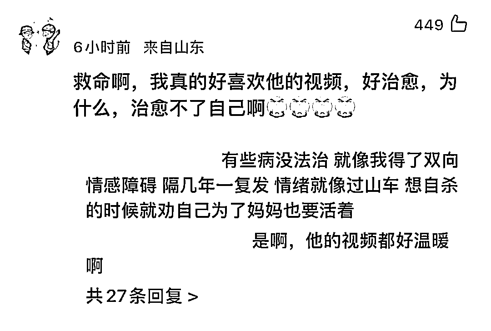
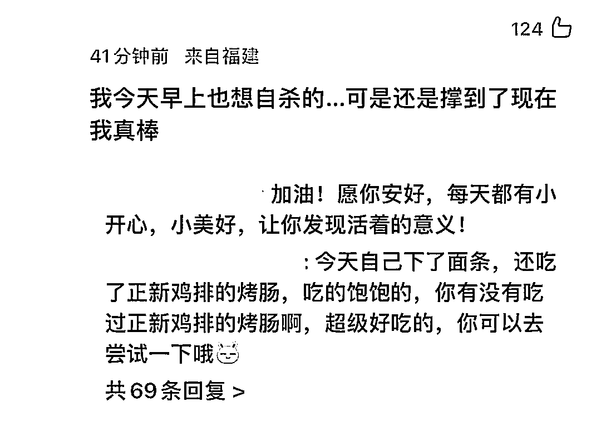

# 警方回应“一美食 UP 主疑似轻生”

> 原文：[`mp.weixin.qq.com/s?__biz=MzIyMDYwMTk0Mw==&mid=2247535393&idx=6&sn=a26812c5ba3f93214002ed931b978668&chksm=97cb8019a0bc090f1edafd8006acd192df49c2b95cdb3c76846e9cd21a75ebaa71dd0704afb2&scene=27#wechat_redirect`](http://mp.weixin.qq.com/s?__biz=MzIyMDYwMTk0Mw==&mid=2247535393&idx=6&sn=a26812c5ba3f93214002ed931b978668&chksm=97cb8019a0bc090f1edafd8006acd192df49c2b95cdb3c76846e9cd21a75ebaa71dd0704afb2&scene=27#wechat_redirect)

[`mp.weixin.qq.com/mp/readtemplate?t=pages/video_player_tmpl&action=mpvideo&auto=0&vid=wxv_2386537890278555650`](https://mp.weixin.qq.com/mp/readtemplate?t=pages/video_player_tmpl&action=mpvideo&auto=0&vid=wxv_2386537890278555650)

澎湃新闻记者·编辑：卫佳明 素材来源：综合网络 责任编辑：李蕊  

5 月 5 日晚上 10 点，哔哩哔哩美食博主“一食纪”发布一条名为《谢谢，再见》的视频，疑似轻生。B 站留言称正在通过多种渠道尝试联系。**6 日，临沂警方回应称****正在调查中。**

B 站美食 UP 主“一食纪”在 5 日晚发布的视频中表示，兜兜转转六年，他孑然一身，当大家看到这条视频的时候，他已经不在了。他表示发视频就是想有始有终，并称自己有遗憾也有感谢，在视频最后，他愿网友余生都幸福，记得好好吃饭。

“一食纪”是 B 站知名美食 UP 主，他以分享一人餐的制作过程而收获了众多网友关注，因食物制作精致，制作过程全程分享，视频剪辑出色，不少网友喜欢跟着他的视频学习做饭，他也收获了 40 多万名粉丝。

[`v.qq.com/iframe/preview.html?width=500&height=375&auto=0&vid=k3336azbb4q`](https://v.qq.com/iframe/preview.html?width=500&height=375&auto=0&vid=k3336azbb4q)

众多网友纷纷留言安慰他，希望他不要做傻事。

6 日凌晨，B 站弹幕网官方账号在“一食纪”发布的该条视频评论区表示，他们也已经通过各种渠道尝试联系本人，并向当地警方报警。

目前当地公安机关已介入处理，将会发布情况通报。

来源：综合卫佳明/澎湃新闻、丁鹏/极目新闻、网友评论

更多精华好文，请点击关注

← 向右滑动与灰产圈互动交流 →

